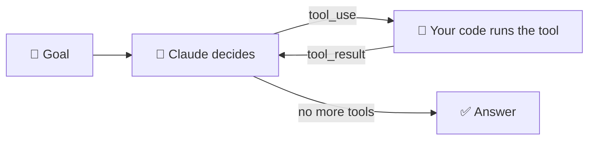

# 🤖 Build Your Own Agent

**The agent loop in ~100 lines of Python.** Every agent you've heard of, including Claude Code,
ChatGPT agent, and n8n's AI Agent node, runs a version of this loop. Read [`agent.py`](agent.py) top to bottom and
the magic becomes mechanics.



## Run it

```bash
cd examples/build-your-own-agent
pip install -r requirements.txt
export ANTHROPIC_API_KEY=sk-ant-...     # from console.anthropic.com (set a spend limit!)
python agent.py
```

Default goal: *"How much will the party shopping list cost in total, and what's still left on my to-do list?"*

You'll see the agent work step by step:
```
🎯 Goal: How much will the party shopping list cost...

  🔧 turn 1: list_files({}) → 'shopping.md\ntodo.md'
  🔧 turn 2: read_file({'name': 'shopping.md'}) → '# Party shopping list...'
  🔧 turn 2: read_file({'name': 'todo.md'}) → '# Weekend to-dos...'
  🔧 turn 3: calculator({'expression': '3*4.50 + 2*5.25 + 24*0.85 + 32 + 4*3.99'}) → '92.36'

✅ Your party supplies will cost $92.36 in total! Still on your list: send invites (due Friday)...
```

(Your exact steps will vary. The model decides its own path. That's what makes it an agent!)

Try your own goals:
```bash
python agent.py "What day is it, and how many days until Friday's invite deadline?"
python agent.py "If I double the chips and cake, what's the new total?"
```

Offline test of the tools (no API key needed): `python test_tools.py`

## The five steps inside `agent.py`

1. **Describe tools**: name, description, JSON Schema for inputs. This is the model's manual.
2. **Implement tools**: normal Python functions. *Your code* runs them, never the model.
3. **Ask the model** with the conversation so far plus the tool list.
4. **Record its reply**, including any `tool_use` requests.
5. **Run the tools and send back results** (all of them in one message), then loop. Stop when it answers without requesting tools,
   or when you hit `MAX_TURNS`.

Safety details worth noticing:
- The calculator parses math with `ast` and **never uses `eval()`**.
- `read_file` refuses paths outside `./workspace` (try asking it to read `../agent.py`!).
- Tool errors are returned to the model with `is_error`, so it can adapt instead of crashing.
- The request opts into the API's **server-side refusal fallback** (`fallbacks="default"`), so if a safety classifier ever declines a turn, the API retries it on a fallback model.

## Remix ideas 🎛️

| Level | Idea |
|---|---|
| 🟢 | Add a `write_file` tool (in the workspace only!) so it can save a summary |
| 🟢 | Add a `weather` tool using the free Open-Meteo API |
| 🟡 | Ask for confirmation (`input("Allow? y/n")`) before any write tool runs: human-in-the-loop! |
| 🟡 | Add memory: save the conversation to a JSON file and reload it next run |
| 🔴 | Give it the [Pocket Toolkit MCP server](../my-first-mcp-server/) via an MCP client instead of local tools |
| 🔴 | Use the SDK's **Tool Runner** (`client.beta.messages.tool_runner`) to delete half the code (see the manual) |

Full explanation: [The manual: Build Your Own Agent](../../manual/part-5-building-with-ai/37-build-your-own-agent.md).
