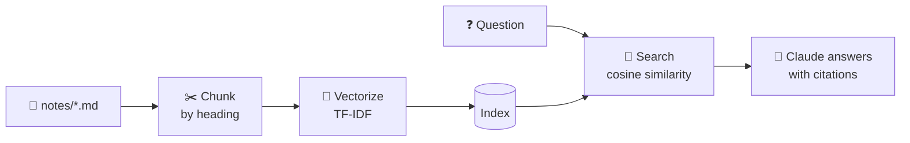

# 📚 RAG from Scratch

**Chat with a folder of notes, and see every step.** About 120 lines of readable Python that show exactly how
"AI that knows your documents" works:



## Run it

```bash
cd examples/rag-from-scratch

# 1) Retrieval only: no API key, no installs, instant
python rag.py --search "how do I descale the coffee machine"
#   🔎 Top 3 of 10 chunks for: 'how do I descale the coffee machine'
#      0.27  coffee-machine.md › Descaling
#      ...

# 2) Full RAG: grounded answer with citations
pip install -r requirements.txt
export ANTHROPIC_API_KEY=sk-ant-...
python rag.py "how do I descale the coffee machine?"
#   💬 Mix 1 part white vinegar with 2 parts water, run the Clean cycle twice... [1]

# 3) Point it at YOUR notes (e.g. an Obsidian vault)
python rag.py --notes ~/Obsidian/MyVault "what have I written about sleep?"
```

Offline tests: `python test_rag.py`

## What's happening

| Step | In `rag.py` | Real-world upgrade |
|---|---|---|
| **1. Chunk** | Split each file at `#` headings | Smarter splitters (by tokens, with overlap), PDF/HTML loaders |
| **2. Vectorize** | TF-IDF: words weighted by how rare they are | **Neural embeddings** (Voyage AI, OpenAI, Cohere, or local `sentence-transformers`/Ollama) that capture *meaning*, not just words |
| **3. Store** | A Python list | A **vector DB**: Chroma, pgvector, LanceDB, Qdrant… |
| **4. Search** | Cosine similarity, top-k | Hybrid (keywords + vectors) + **reranking** |
| **5. Answer** | Claude, told to use ONLY the sources and cite them | Same idea, plus citations features, guardrails, and evals |

**Try breaking it:** ask *"why is my espresso machine throwing a code?"* TF-IDF only matches exact words, so "espresso" won't find
"coffee." That's exactly the problem **embeddings** solve, since they know those words are related. Swapping in embeddings is
a great next step (ask Claude Code to do it with you!).

Also note the answer step asks Claude to say so when the sources don't contain the answer. Ask it about something that isn't in
the notes and watch it decline to make things up. That's the anti-hallucination power of RAG.

Full chapter: [The manual: Build a RAG System](../../manual/part-8-knowledge-and-memory/74-build-a-rag-system.md).
