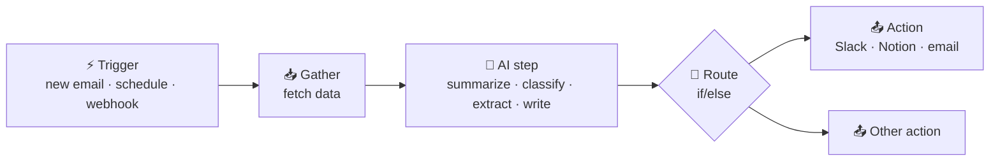

# 05 · Automation Platforms: AI That Works While You Sleep ⚙️🌙

Chat-based AI needs *you* to press enter. Automation platforms run on **triggers**: a new email,
a form submission, 7am every day, a webhook. Add an AI step in the middle and you've got a tireless
little robot employee.

---

## The pattern behind every AI automation

Almost every useful AI automation is a variation of this: **trigger → gather → AI → route → act.**

## The platforms

### 🟣 n8n: the tinkerer's favorite
- **What:** A visual workflow builder with a code escape hatch (JS/Python nodes). It's **fair-code** and
  **self-hostable**, so you can run it free on your own machine or server, or pay for n8n Cloud.
- **AI superpowers:**
  - **AI Agent node**: a full tool-using agent *inside* a workflow, with memory, tools, and any model (Claude,
    OpenAI, Gemini, and local Ollama).
  - **LangChain-style nodes**: chains, vector stores, document loaders, and output parsers for RAG pipelines.
  - **MCP Client Tool**: gives your n8n agent tools from any MCP server.
  - **MCP Server Trigger**: turns a workflow into an MCP server, so Claude or Cursor can call *your* workflow.
  - **Instance-level MCP**: lets AI clients build and edit workflows in your n8n directly (added in 2026).
- **Pricing shape:** Free self-hosted. Cloud is billed by workflow executions, not steps, which is
  great for complex flows.
- **Best for:** People who like to tinker, anyone who wants control or privacy, complex logic, and anything that needs code.
- **Start:** `npx n8n` → http://localhost:5678, then import [our example workflows](../examples/n8n-workflows/).

### 🟠 Zapier: the biggest app catalog
- **What:** The OG no-code automation tool, with **8,000+ apps**.
- **AI superpowers:**
  - **AI steps** in Zaps (built-in AI actions plus ChatGPT/Claude app steps).
  - **Zapier Agents**: AI teammates that browse, use your connected apps, and run on triggers.
  - **Zapier MCP**: exposes Zapier actions to Claude, ChatGPT, Cursor, and others. It's one URL that gives you thousands of apps.
  - **Copilot**: describe a Zap in English and it builds it for you. Also Tables, Interfaces, and human-in-the-loop approvals.
- **Pricing shape:** Free tier, then priced by **tasks** (each action step counts), which adds up with
  big multi-step flows.
- **Best for:** Non-coders, obscure apps, getting something working in 10 minutes.

### 🟦 Make (formerly Integromat): the visual power tool
- **What:** A gorgeous visual canvas with branching, iterators, and fine-grained data mapping.
- **AI:** AI modules, **Make AI Agents**, and an MCP server to expose scenarios as tools.
- **Pricing shape:** Priced by operations/credits. Generally cheaper than Zapier at volume.
- **Best for:** Complex visual logic without code, and heavy data shuffling.

### 🟩 Pipedream: developer-first
- **What:** Code-first workflows (Node/Python) with thousands of pre-built integrations and managed auth.
- **AI:** Its **MCP** gives agents authenticated access to thousands of APIs. Great for building your own agent products.
- **Best for:** Developers who want real code with less plumbing.

### 🔓 Activepieces: open-source Zapier alternative
- **What:** MIT-licensed, self-hostable, with a friendly UI, and many of its "pieces" are also available as MCP servers.
- **Best for:** Open-source fans who find n8n too technical.

### Also on the map
| Tool | Niche |
|---|---|
| **Microsoft Power Automate** | The default if you live in Microsoft 365. Has desktop RPA too. |
| **IFTTT** | Dead-simple consumer and smart-home automations. |
| **Google Apps Script + Gemini** | Free automation inside Google Workspace. |
| **Apple Shortcuts** | Phone automations, which can call webhooks (i.e. your n8n flows!) and AI apps. |
| **Relay.app, Lindy, Gumloop** | AI-native agent and workflow builders with human-in-the-loop steps. |
| **Temporal, Inngest, Trigger.dev** | Code-level durable workflows for when you're building real products. |

## Side-by-side

| | n8n | Zapier | Make | Pipedream | Activepieces |
|---|---|---|---|---|---|
| Learning curve | Medium | Easiest | Medium | Dev-friendly | Easy |
| Self-host | ✅ | ❌ | ❌ | ❌ | ✅ |
| App catalog | Large + any HTTP API | **Largest** | Large | Very large (API) | Growing |
| AI agents built in | ✅ AI Agent node | ✅ Zapier Agents | ✅ Make AI Agents | Via code | ✅ |
| Expose as MCP | ✅ | ✅ | ✅ | ✅ | ✅ |
| Cost at scale | 💚 Lowest (self-host) | 💸 Highest | 💛 Medium | 💛 Medium | 💚 Low |

**The honest recommendation:** Start with **Zapier** if you just want it to work *now*. Learn **n8n**
if you want to go deep; it's the one this guide leans on, because self-hosting means unlimited
experimentation for free. 🎉

---

## 12 AI automations worth stealing
1. **Morning digest**: RSS/news → AI summary → Slack or email. ([Importable!](../examples/n8n-workflows/morning-ai-digest.json))
2. **Idea inbox**: phone shortcut → webhook → AI categorizes → Notion. ([Importable!](../examples/n8n-workflows/idea-inbox-to-notion.json))
3. **Inbox triage**: new email → AI labels urgent/newsletter/receipt → auto-label and draft replies.
4. **Meeting follow-ups**: transcript → AI extracts action items → tasks in Todoist/Linear + recap email.
5. **Receipt tracker**: receipt email or photo → AI extracts vendor/amount/category → Google Sheet.
6. **Content repurposer**: new blog post → AI writes a thread, LinkedIn post, and newsletter blurb → drafts folder.
7. **Lead enricher**: form signup → web research agent → CRM notes + personalized welcome.
8. **Support sorter**: new ticket → AI classifies and drafts a response → human approves in Slack.
9. **Job hunter**: job board RSS → AI scores fit against your résumé → top matches to Notion.
10. **Price watcher**: daily scrape → AI compares to history → ping on drops.
11. **Weekly review**: Friday 4pm → gather calendar, tasks, and commits → AI recap → your journal.
12. **Family logistics**: shared calendar changes → AI summary to the family group chat.

## Pro tips
- **Pin test data.** n8n and Make let you freeze sample inputs so you don't re-trigger things while building.
- **Ask the AI for JSON** when the next step needs structure, and parse it. (Our idea-inbox flow does this.)
- **Add a human approval step** before anything customer-facing goes out.
- **Log everything** to a sheet or DB while you're learning. It makes debugging way easier.

---

### 🚀 Try this next
Import the [Morning AI Digest](../examples/n8n-workflows/) into n8n, swap in RSS feeds you love, and
let it run for a week. You'll have a personal newspaper that you built yourself.

**Next:** [06 · AI Inside Your Apps →](06-ai-in-your-apps.md)
