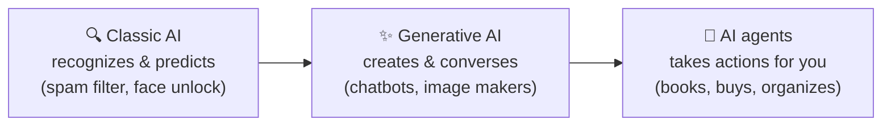
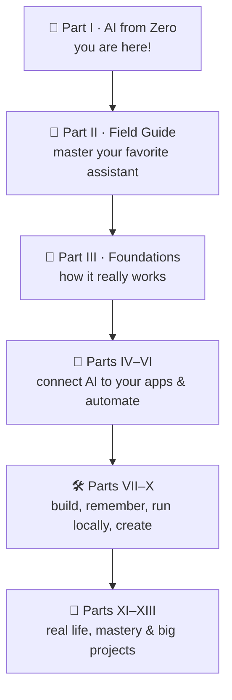

# 01 · What Is AI, Really? 🌱

> ⏱️ 8 min read · 🎯 Complete beginners · 🧰 Needs: nothing but curiosity

**Artificial intelligence sounds like science fiction, but the AI you'll actually use is friendlier and more down to
earth than the movies suggest.** It's software that has learned from enormous amounts of examples, so it can
understand what you type or say and help: answering questions, writing, explaining, planning, translating, and much
more. This chapter clears away the jargon and the hype so you know exactly what you're dealing with.

🧸 ELI5: This chapter in 30 seconds

Normal computer programs follow a recipe someone wrote step by step. AI is different: instead of a recipe, it learned
by looking at millions and millions of examples, the way you learned to recognize a dog by seeing lots of dogs.
Chatbots like ChatGPT, Gemini and Claude learned from so much writing that they can chat with you, explain things and
help with almost anything involving words. They're clever helpers, not magic and not alive.

<!-- in-this-chapter -->

## 🌱 AI in one sentence

🧸 ELI5

AI is a computer that learned from examples instead of being told every single step.

**Artificial intelligence (AI) is software that learns patterns from examples, so it can handle tasks that used to need
a human: understanding language, recognizing pictures, making predictions and creating new things.**

That's it. No robots with glowing red eyes, no secret consciousness. Just very clever pattern-learning software.

The big difference from regular software is *how it's made*:

| | Regular software | AI |
|---|---|---|
| **How it's built** | A programmer writes every rule ("if the button is clicked, do this") | It learns patterns from huge piles of examples |
| **What it's good at** | Exact, repeatable jobs: calculators, spreadsheets, banking | Fuzzy, human-ish jobs: language, images, judgment calls |
| **When it meets something new** | Fails or shows an error | Makes its best guess (usually good, sometimes wrong!) |
| **Example** | Your calculator app | A chatbot that explains your electricity bill |

> [!NOTE]
> **📌 That "best guess" part matters**
> Because AI learned from patterns instead of following exact rules, it's amazingly flexible, but it can also be
> confidently wrong. You'll learn exactly how to handle that in [When AI Gets It Wrong](10-when-ai-gets-it-wrong.md).
> Knowing this one fact already puts you ahead of most people. 🌟

## 🏠 You already use AI every day

🧸 ELI5

You've been using AI for years without noticing: your phone's face unlock, your email's spam filter and your streaming
app's suggestions are all AI.

AI isn't new to your life. It's been quietly working in the background for years:

| Where | The AI part |
|---|---|
| 📱 **Your phone** | Face unlock, the keyboard guessing your next word, photo search ("show me beach pictures") |
| 📧 **Email** | Spam filters, "smart reply" suggestions |
| 🎬 **Streaming & music** | "Because you watched…" recommendations, personalized playlists |
| 🗺️ **Maps** | Traffic predictions and the fastest route |
| 🏦 **Your bank** | Fraud alerts when a weird purchase shows up |
| 🛒 **Shopping** | "Customers also bought…" |
| 🔊 **Smart speakers** | Understanding "Hey Siri," "Alexa," or "Hey Google" |
| 📸 **Your camera** | Portrait mode blur, night mode, auto-enhance |

What's *new* since late 2022 is that you can now **talk to AI directly**, in plain language, and ask it to do almost
anything with words, images and sound. That's the part this manual is about. 🎉

## 🤖 The new kind of AI: generative AI

🧸 ELI5

Old AI could only sort and recognize things ("that's a cat"). New AI can *make* things: write a story about a cat, draw
a cat, or even sing a song about a cat.

For decades, most AI was about **recognizing and predicting**: is this email spam? Is this a photo of a cat? What will
the weather be?

The AI everyone's talking about now is **generative AI**. It can **create** brand-new things:

- ✍️ **Text:** emails, stories, explanations, summaries, translations, poems, code
- 🖼️ **Images:** "a watercolor of my dog as an astronaut"
- 🎵 **Music and voices:** songs, narration, podcasts
- 🎬 **Video:** short clips from a description
- 💬 **Conversation:** back-and-forth chat, by typing or out loud

You'll start with the middle box: chatting and creating. The right-hand box (agents that *do* things for you) is where
the later parts of this manual take you, once you're comfortable.

## 💬 So what exactly is a chatbot?

🧸 ELI5

A chatbot is an AI you talk to by typing or speaking, like texting a very knowledgeable friend. Different companies make
different ones, the way different companies make different phones.

An **AI chatbot** (also called an **AI assistant**) is an app or website where you type or speak to an AI and it answers
in plain language. You've probably heard of at least one of these:

| Assistant | Made by | Known for |
|---|---|---|
| 💬 **ChatGPT** | OpenAI | The most popular one; an all-rounder with voice, images and lots of features |
| ✨ **Gemini** | Google | Built into Android, Gmail, Google Docs and Chrome; great with Google apps |
| 🧡 **Claude** | Anthropic | Thoughtful writing, long documents, careful and friendly answers |
| 🪟 **Microsoft Copilot** | Microsoft | Built into Windows, Edge, Word, Excel and Outlook |
| ⚡ **Grok** | xAI (part of SpaceX) | Built into X (Twitter); real-time posts and a cheeky personality |
| 🔎 **Perplexity** | Perplexity AI | An "answer engine" that searches the web and shows its sources |
| 👓 **Meta AI** | Meta | Inside WhatsApp, Instagram, Messenger and Ray-Ban Meta glasses |
| 🐋 **DeepSeek** | DeepSeek (China) | Strong reasoning, open models, free to use |
| 🌬️ **Le Chat** | Mistral AI (France) | Fast, European, privacy-conscious |

They're like different brands of car: they all get you from A to B, but each has its own personality and strengths. You
don't need to use all of them! Most people pick one favorite and maybe a second for specific jobs.
[Choosing Your First AI Assistant](04-choosing-your-first-assistant.md) helps you pick, and
[Part II](../part-2-ai-assistants-field-guide/index.md) has a complete guide to every single one.

> [!TIP]
> **💡 The good news: skills transfer**
> Everything you learn in Part I works in *any* of these assistants. Asking good questions, checking facts, staying
> safe: it's all the same skill, just different apps. Learn once, use everywhere. 🌍

## 🧩 What AI is great at (and not so great at)

🧸 ELI5

AI is a superstar at words and ideas, but it can get facts and math wrong, and it doesn't truly *know* you or feel
things.

| 🌟 Great at | ⚠️ Be careful with |
|---|---|
| Explaining anything in simple words, at your level | Exact facts, dates, prices and statistics (always double-check) |
| Writing and rewriting: emails, letters, posts, stories | Very recent news (unless it searches the web) |
| Brainstorming ideas: gifts, names, meals, trips | Medical, legal and money decisions (use it to *prepare*, then ask a professional) |
| Summarizing long things: articles, documents, videos | Counting, precise math in its head (it's better when it uses a calculator tool) |
| Translating and rewording in any tone | Knowing things about *you* that you haven't told it |
| Planning: schedules, checklists, step-by-step guides | Anything where "sounds right" isn't good enough |
| Patient tutoring: it never gets tired of "why?" | Replacing real human connection 💛 |

> [!IMPORTANT]
> **❗ The golden rule**
> **Use AI as a brilliant assistant, not an all-knowing oracle.** It drafts, explains and suggests. *You* decide, check
> and approve. People who follow this rule get enormous value from AI and almost never get burned.

## 📛 The words you'll hear, decoded

🧸 ELI5

There are lots of fancy AI words, but most of them mean simple things. Here are the ones you'll hear the most.

| Word | What it actually means |
|---|---|
| **AI** (artificial intelligence) | Software that learned from examples |
| **Chatbot / AI assistant** | An AI you talk to, like ChatGPT or Gemini |
| **Model** | The "brain" inside the app. One app can offer several models (a fast one, a smart one) |
| **LLM** (large language model) | The kind of model behind chatbots: it learned language from a huge amount of text |
| **GPT** | A family of OpenAI models (it stands for "generative pre-trained transformer"). ChatGPT is named after it |
| **Prompt** | Whatever you type or say to the AI. Your question or request |
| **Generative AI** | AI that creates new text, images, music or video |
| **Hallucination** | When AI confidently makes something up. Yes, really, that's the official word |
| **Agent** | An AI that doesn't just talk but *does* things: searches, books, fills in forms |
| **Open-source / open-weight model** | A model anyone can download and run themselves |

Don't try to memorize these! You'll pick them up naturally. There's a full beginner-friendly
[Glossary](../appendices/a-glossary.md) with an 🧸 ELI5 for every word whenever you need it.

## 🗺️ Your journey through this manual

🧸 ELI5

This manual is like a staircase. You're on the first step now, and each part takes you one step higher, at your own
speed.

There's no rush and no test. Some people happily stay in Parts I and II forever and get enormous value from AI. Others
catch the bug and end up building their own apps. Both are wonderful. ✨

## 🎯 Key takeaways

- **AI is software that learned from examples** instead of following hand-written rules. That makes it flexible, and
  occasionally confidently wrong.
- You **already use AI daily**. What's new is that you can *talk* to it and ask it to create things.
- **Generative AI** creates text, images, music and video. **Chatbots** (ChatGPT, Gemini, Claude, Copilot, Grok,
  Perplexity, Meta AI and friends) let you talk to it.
- AI is brilliant at words, ideas, explanations and drafts. Double-check facts, numbers and anything important.
- **Skills transfer:** what you learn here works in every assistant.

## 🧠 Check yourself

❓ 1. What's the main difference between AI and regular software?

Regular software follows rules a programmer wrote step by step. AI **learned patterns from examples**, so it can handle
fuzzy, human-style tasks, but it can also make confident mistakes.

❓ 2. Name two places you already used AI before reading this.

Any two of: face unlock, keyboard predictions, spam filters, streaming recommendations, map traffic predictions, bank
fraud alerts, smart speakers, camera portrait mode. You're more experienced than you thought! 😄

❓ 3. Is it true that you need to pick "the right" chatbot before you can learn?

Nope! The skills you learn in this part work in **every** assistant. Pick any one to start. You can always switch
later.

❓ 4. What's the golden rule of using AI?

Use it as a **brilliant assistant, not an all-knowing oracle**. It drafts and suggests; you decide, check and approve.

> [!TIP]
> **🎮 Try this**
> Look around your home and list **five things that use AI** (your phone, TV, car, speaker, email…). Then, if you
> already have a chatbot open, ask it: *"Explain what artificial intelligence is to me like I'm 10 years old, with one
> everyday example."* Compare its answer to this chapter. Ready for your first real chat? Next chapter shows you how
> chatbots work, then chapter 3 walks you through your first conversation. 👋

---

**Next:** [02 · How AI Chatbots Work (No Math, Promise) →](02-how-ai-chatbots-work.md)
