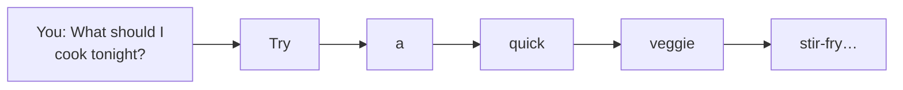
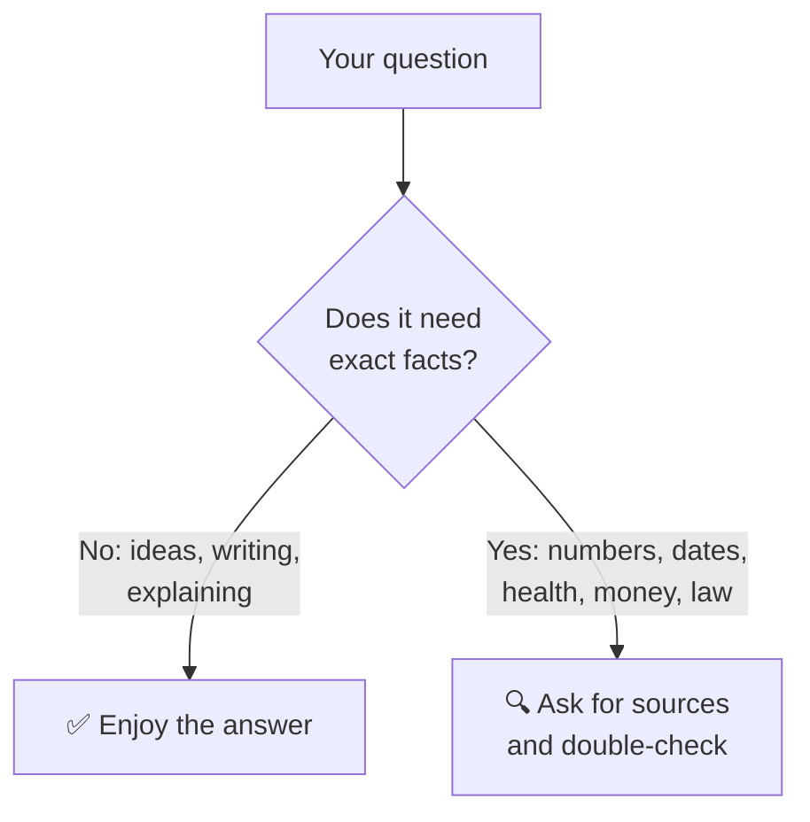

# 02 · How AI Chatbots Work (No Math, Promise) 🧠

> ⏱️ 8 min read · 🎯 Complete beginners · 🧰 Needs: nothing

**You don't need to understand engines to drive a car, but knowing a little about how chatbots work makes you
dramatically better at using them.** In a few friendly pages you'll learn where the AI's knowledge comes from, why it
sometimes invents things, why it forgets, why the same question gets different answers, and what that "thinking…"
message means. Every tip later in this manual makes more sense once you've read this.

🧸 ELI5: This chapter in 30 seconds

Imagine someone who read every library in the world and became *amazing* at guessing what word comes next in a
sentence. Then teachers coached them to be helpful, polite and honest. That's a chatbot. It doesn't look things up in a
big encyclopedia in its head; it writes answers one word at a time based on patterns it learned. That's why it's so
good with words, and also why it can sound sure about things that aren't true.

<!-- in-this-chapter -->

## 📚 Step 1: It read (a lot)

🧸 ELI5

Before you ever met it, the AI spent months reading a mountain of books, websites and articles, way more than any
person could read in a thousand lifetimes.

Before a chatbot talks to anyone, its "brain" (the **model**) goes through **training**. Huge computers feed it a vast
amount of text: books, websites, encyclopedias, forums, code, and more. Modern models also learn from pictures, audio
and video.

It doesn't memorize all that text like a hard drive. Instead it absorbs **patterns**: how sentences flow, how ideas
connect, how a recipe is structured, what a polite email sounds like, how a math proof goes, how Spanish maps to
English.

> [!NOTE]
> **📌 A useful picture**
> Think of it less like a **library** (where you look up the exact book) and more like a **very well-read person**
> talking from memory. Usually right, impressively broad, but capable of misremembering details. Keep that picture in
> your head and most of AI's quirks will make sense.

## 🔮 Step 2: It predicts the next word

🧸 ELI5

The AI's basic trick is guessing the next word, again and again, super fast, until it has written a whole answer. Like
your phone's keyboard suggestions, but a million times smarter.

Here's the secret at the heart of every chatbot: **it writes its answer one small piece at a time, each time predicting
what should come next.**

You've seen a tiny version of this on your phone keyboard: type "Happy" and it suggests "birthday." A chatbot does the
same thing, but it considers your *whole* question and everything said so far, and it's been trained on so much text
that its "suggestions" add up to thoughtful paragraphs.

Those pieces are called **tokens** (usually a word or part of a word). You'll see that word around; now you know it just
means "a chunk of text." Chatbot limits and prices are often measured in tokens.

**Why this matters to you:** because it's *predicting* rather than *looking up*, the AI is brilliant at anything that
follows patterns (writing, explaining, summarizing) and weaker at things where one wrong detail matters (exact figures,
quotes, rare facts). You'll learn to lean into the first and double-check the second.

## 🎓 Step 3: It was coached to be a helpful assistant

🧸 ELI5

After all that reading, people spent a long time teaching the AI good manners: answer the question, be kind, be
honest, and don't help anyone do something harmful.

A model that has only "read the internet" would just continue your text in random directions. So companies do a second
stage of training where people (and other carefully designed AI) show it thousands of examples of **good assistant
behavior**: answering helpfully, admitting uncertainty, refusing dangerous requests, following instructions.

That's why each assistant has its own **personality**. ChatGPT, Gemini, Claude, Grok and Copilot were coached
differently, so they have different styles: chattier, more formal, funnier, more cautious. None is "correct." It's
partly a matter of taste, which is why [Part II](../part-2-ai-assistants-field-guide/index.md) helps you find your
favorite.

> [!TIP]
> **💡 "Why won't it answer?"**
> Sometimes an assistant declines something harmless because it *looked* risky. Just add context: *"I'm a nurse asking
> about safe medication doses for a patient handout"* or *"This is for a mystery novel I'm writing."* Most refusals of
> innocent requests disappear with a sentence of explanation.

## 📅 What it knows, and what it doesn't

🧸 ELI5

The AI's reading stopped on a certain date, so it may not know yesterday's news, unless it's allowed to search the
internet, like looking something up on your phone.

Training happens at a certain point in time, so every model has a **knowledge cutoff**: a date after which it knows
nothing on its own. Ask about last night's game and a model without web access will either say it doesn't know or,
worse, guess.

That's why most assistants now have **web search** built in. When it searches, you'll usually see a "Searching the
web…" message and little **source links** in the answer. Those links are gold: click them to check the facts.

| Situation | What happens |
|---|---|
| Timeless question ("How do volcanoes work?") | Answers from its training. Usually great |
| Recent event ("Who won yesterday?") | Needs **web search**. Look for source links |
| Your personal stuff ("When's my dentist appointment?") | Only works if you've **connected** your calendar or pasted the info |
| Very niche fact ("my town's recycling rules") | Search helps, but always double-check with the official source |

## 💭 Memory: what it remembers (and forgets)

🧸 ELI5

Inside one conversation, the AI remembers what you said, like a friend on a phone call. Start a new conversation and,
unless memory is switched on, it's like calling someone who has never met you.

Chatbots have two kinds of memory, and mixing them up confuses lots of beginners:

1. **Conversation memory:** within one chat, the AI can see everything you and it have said so far. That's why you can
   say "make it shorter" and it knows what "it" is. But each chat has a size limit (called the **context window**).
   In a *very* long chat, the earliest parts can get fuzzy or dropped.
2. **Long-term memory:** many assistants (ChatGPT, Gemini, Claude, Copilot, Le Chat and others) now have an optional
   **memory** feature that remembers facts about you across chats: your name, that you're vegetarian, that you prefer
   short answers. You can view, edit and delete these memories in settings.

> [!TIP]
> **💡 Beginner superpower: start fresh**
> If a chat goes off the rails or gets super long, **start a new chat** and paste in a short summary of what matters.
> Answers often get noticeably better. It's the AI version of "have you tried turning it off and on again?" 🔄

## 🎲 Why the same question gets different answers

🧸 ELI5

The AI adds a little bit of surprise when it picks its words, so it doesn't sound like a robot. Ask twice and you'll
get two different (but usually similar) answers.

Chatbots add a sprinkle of **randomness** when choosing words, which keeps them creative and natural-sounding. Ask
"give me a name for my cat" twice and you'll get different names. That's a feature!

Every assistant has a **regenerate** (🔄 "try again") button. Use it freely:

- Didn't love the answer? **Regenerate.**
- Want options? Ask for **"5 different versions"** in one go.
- Need consistency (like the same format every week)? Give **clear instructions and an example**, which you'll learn in
  [Prompting 101](06-prompting-101.md).

## 🤔 "Thinking…": fast models vs. reasoning models

🧸 ELI5

Some AI answers instantly, like blurting out the first thing that comes to mind. Others stop and "think" first, like
working a puzzle out on scrap paper. Thinking takes longer but helps with tricky problems.

Most assistants now offer two styles of brain:

| | ⚡ Fast mode | 🤔 Thinking / reasoning mode |
|---|---|---|
| **Feels like** | Instant reply | "Thinking…" for a few seconds (or minutes) |
| **Best for** | Everyday chat, quick questions, writing | Math, logic, planning, tricky comparisons, coding |
| **Names you'll see** | "Instant," "Fast," "Flash" | "Thinking," "Reason," "Expert," "Deep Think," "Extended thinking" |

Many apps now pick automatically. If an answer to a hard question seems shallow, look for a **"think"** or **"reason"**
toggle and try again. And if you see a little expandable "thought process," you can peek at how it worked it out. It's
fascinating. 🧩

## 🤷 Why it sometimes makes things up

🧸 ELI5

Because the AI is a word-guesser, sometimes it guesses something that *sounds* true but isn't, like a student who
didn't study but writes a confident essay anyway.

Put everything together and you can see why AI **hallucinates** (confidently invents things):

- It **predicts plausible words** rather than retrieving verified facts.
- It was **trained to be helpful**, so it leans toward giving *an* answer.
- It **doesn't know what it doesn't know** very well, especially about rare or recent things.

Modern assistants hallucinate much less than early ones, especially when they search the web, but it still happens.
The fix is simple habits, which get a whole chapter: [When AI Gets It Wrong](10-when-ai-gets-it-wrong.md).

## 🎯 Key takeaways

- A chatbot's model **learned patterns from a huge amount of text**, then was **coached** to be a helpful, polite
  assistant.
- It **writes answers by predicting one chunk (token) at a time**, which makes it great with words and shaky on exact
  details.
- It has a **knowledge cutoff**; **web search** and **source links** fill the gap.
- It remembers within a chat (the **context window**) and, if you turn it on, across chats (**memory**).
- **Randomness** means different answers each time: use **regenerate** and ask for options.
- **Thinking modes** help with hard problems. **Hallucinations** happen, so check anything important.

## 🧠 Check yourself

❓ 1. Does a chatbot look up answers in a giant encyclopedia inside its head?

No. It **predicts** answers word by word based on patterns it learned. That's why it's fluent and flexible, and also
why it can be confidently wrong.

❓ 2. You ask about last night's big news and get an outdated answer. Why, and what do you do?

The model has a **knowledge cutoff**. Ask it to **search the web** (or turn search on), then check the **source
links** it shows.

❓ 3. Your long chat has started to ignore things you said at the beginning. What's the easy fix?

**Start a new chat** and paste a short summary of what matters. Long chats can overflow the **context window**.

❓ 4. When should you switch on a "thinking" or "reasoning" mode?

For **tricky** tasks: math, logic, planning, detailed comparisons, coding. For quick everyday questions, fast mode is
fine.

> [!TIP]
> **🎮 Try this**
> In any chatbot, ask the same question three times using **regenerate**: *"Suggest a fun name for a golden retriever
> puppy and explain why."* Notice how the answers differ. Then ask: *"What's your knowledge cutoff date, and can you
> search the web?"* Now you know your assistant a little better. 🐶

---

**Next:** [03 · Your First AI Conversation, Step by Step →](03-your-first-ai-conversation.md)
