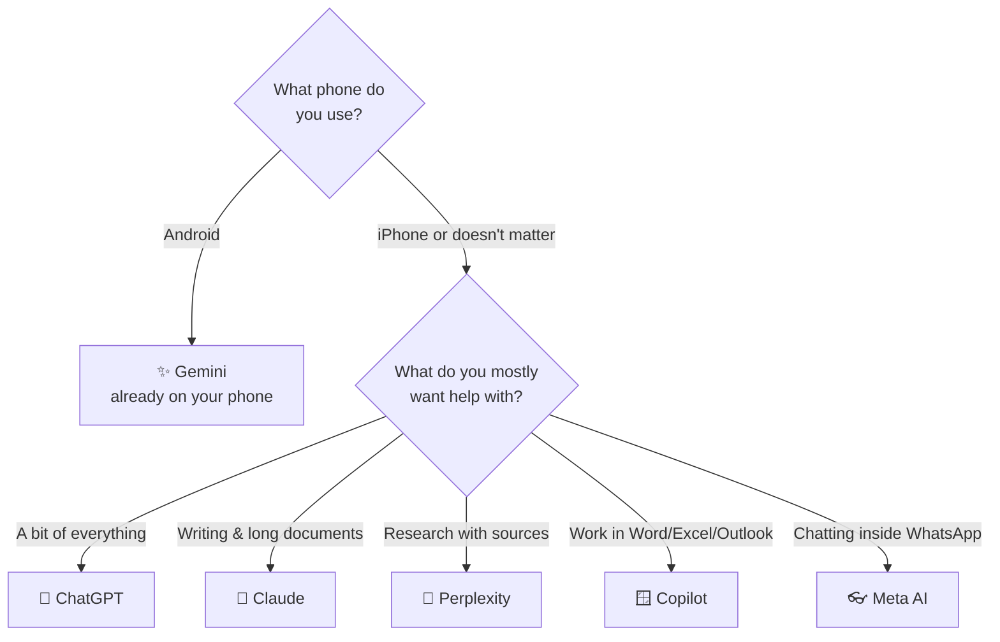

# 04 · Choosing Your First AI Assistant 🧭

> ⏱️ 12 min read · 🎯 Complete beginners · 🧰 Needs: nothing (optional: 15 minutes to "taste test" two assistants)

**ChatGPT? Gemini? Claude? Copilot? Grok? Perplexity? The choice feels huge, but here's a secret: there's no wrong
answer.** All the big assistants are genuinely good, the free versions are plenty to start, and switching later is
easy. This chapter gives you a quick way to pick a favorite based on the phone you carry, the apps you already use and
what you want help with, plus a 15-minute taste test so you can decide for yourself.

🧸 ELI5: This chapter in 30 seconds

Choosing an AI is like choosing an ice cream shop: they all sell ice cream, but each has its own special flavors. If
you live next to the Google shop (Gmail, Android), Gemini is easy. If you want the most popular all-rounder, ChatGPT.
For thoughtful writing, Claude. For answers with sources, Perplexity. Try two, keep your favorite.

<!-- in-this-chapter -->

## ⚡ The 30-second answer

🧸 ELI5

Pick the one that fits the phone and apps you already use. That's the easiest way to start.

| If you… | Start with | Why |
|---|---|---|
| Just want the most popular, do-everything assistant | 💬 **ChatGPT** | Huge feature set, great voice mode, most tutorials online use it |
| Live in Google land (Android, Gmail, Google Docs, Chrome) | ✨ **Gemini** | Built into your phone and Google apps; connects to your Gmail, Calendar and Drive |
| Love reading and writing, or work with long documents | 🧡 **Claude** | Warm, clear, thoughtful writing; excellent with long PDFs |
| Use Windows, Outlook, Word or Excel all day | 🪟 **Copilot** | Built into Windows and Microsoft 365 |
| Mostly want answers *with sources* (like a smarter Google) | 🔎 **Perplexity** | Every answer cites where it came from |
| Live in WhatsApp or Instagram | 👓 **Meta AI** | Already inside your chats, no new app needed |
| Are on X (Twitter) a lot, or want a cheekier personality | ⚡ **Grok** | Real-time posts from X; playful "fun mode" |
| Have an iPhone | 🍎 **Siri + ChatGPT or Gemini app** | The new Siri handles quick stuff; add an assistant app for deeper chats (see [chapter 12](12-ai-everywhere.md)) |

**Still unsure?** Pick ChatGPT or Gemini, the two most common, and move on. You can change your mind any time. 😊

## 🗺️ Meet the lineup

🧸 ELI5

Here are the main AI helpers side by side, with what each one is best at and what to watch out for.

| Assistant | Free version? | Special powers | Keep in mind |
|---|---|---|---|
| 💬 **ChatGPT** (OpenAI) | ✅ Generous | Voice conversations, image creation, projects, memory, agent mode, tons of built-in tools | Free tier has usage limits on the smartest model |
| ✨ **Gemini** (Google) | ✅ Generous | Gemini Live voice + camera, Gmail/Drive/Maps integration, image and video creation, Deep Research | Works best with a Google account |
| 🧡 **Claude** (Anthropic) | ✅ Yes | Natural writing, long documents, artifacts (mini apps and documents in chat), careful reasoning | Free usage limits are tighter than some rivals |
| 🪟 **Copilot** (Microsoft) | ✅ Yes | Windows integration, Word/Excel/Outlook help (with Microsoft 365), image creation | Best features need Microsoft 365 |
| ⚡ **Grok** (xAI / SpaceX) | ✅ Yes | Real-time X posts, image and video creation, voice, casual humor | Looser style; double-check claims about current events |
| 🔎 **Perplexity** | ✅ Yes | Sources on every answer, Deep Research, the Comet AI browser | Less of a "chatty friend," more a research tool |
| 👓 **Meta AI** | ✅ Free | Lives in WhatsApp/Instagram/Messenger, works with Ray-Ban Meta glasses | Your chats may be used to personalize content and ads; check settings |
| 🐋 **DeepSeek** | ✅ Free | Strong reasoning, very capable free model | Data is stored in China; avoid sharing anything sensitive |
| 🌬️ **Le Chat** (Mistral) | ✅ Yes | Fast answers, European company, memories, connectors | Smaller ecosystem |

Each one has a complete, friendly guide in [Part II · The AI Assistants Field
Guide](../part-2-ai-assistants-field-guide/index.md), with sign-up steps, every major feature and pro tips.

## 🧩 Find your match in four questions

🧸 ELI5

Answer a few quick questions and follow the arrows to find an AI that suits you.

This is a starting point, not a life sentence. Plenty of people end up using two or three assistants for different
jobs (see [Using Several Assistants Together](../part-2-ai-assistants-field-guide/31-using-several-assistants.md)).

## 🆓 Free is plenty to start

🧸 ELI5

You don't need to pay anything to learn. The free versions are really good. Paying mostly gets you *more* uses and the
fanciest features.

Every major assistant has a **free tier** that's more than enough for learning and everyday use. Paying typically gets
you:

- 📈 **Higher limits:** more messages before you hit "come back later"
- 🧠 **The smartest models and longer "thinking"**
- 🎨 **More image, video and voice features**
- 🔬 **Deep research, agents, bigger file uploads and extras**

Most paid plans cost about the same as a streaming subscription (roughly $20 a month in the US), with cheaper
"lite" tiers in some countries and premium tiers for heavy users. **Our advice:** use the free version for at least
two weeks. If you keep hitting limits or wishing for a specific feature, *then* upgrade the one you love. Details in
[Getting Set Up](05-getting-set-up.md).

> [!TIP]
> **💡 Students, check for deals**
> Several companies offer free or discounted plans for students and teachers, and some phone plans or new phones come
> with an AI subscription bundled in. It's worth a quick search before you pay.

## 🧪 The 15-minute taste test

🧸 ELI5

Ask two or three AIs the exact same questions and see which answers you like best. Your taste is what matters.

The best way to choose is to **try the same three prompts** in two or three assistants, side by side:

1. **A personal task:**
   > *"I'm hosting 6 friends for dinner Saturday. One is vegetarian and one can't eat gluten. Suggest a menu I can mostly
   > prepare ahead, with a shopping list."*
2. **A writing task:**
   > *"Write a friendly email to my landlord asking them to fix a leaking kitchen tap, without sounding pushy."*
3. **An explaining task:**
   > *"Explain how a mortgage works, like I'm a smart 15-year-old, in under 200 words."*

Then score each assistant from 1 to 5 on:

| | Assistant A | Assistant B | Assistant C |
|---|---|---|---|
| Understood what I wanted | | | |
| Tone I like | | | |
| Useful, not waffly | | | |
| Easy to use app | | | |
| **Total** | | | |

The winner is your first "main" assistant. 🏆 (There's a bigger version of this with ten tasks in [Head-to-Head
Showdowns](../part-2-ai-assistants-field-guide/30-head-to-head-showdowns.md).)

## 🔐 Trust and privacy differences

🧸 ELI5

Different AI companies treat your information differently. Some use chats to improve their AI unless you say no, and
some store data in other countries. It's worth a quick peek at the settings.

All the big assistants are reasonably safe for everyday use, but they differ in the details:

- **Training on your chats:** many companies may use your conversations to improve their AI unless you opt out. Each
  one has a setting for this (you'll find where in each [Field Guide](../part-2-ai-assistants-field-guide/index.md)
  chapter).
- **Where data lives:** DeepSeek and some other Chinese services store data in China, under Chinese law. Fine for
  "what's a good pasta recipe?", not for your medical records or work secrets.
- **Ads and personalization:** assistants run by ad-supported companies may use your chats to personalize content
  and ads. Check the settings.
- **Kids and teens:** age rules differ (usually 13+ with a parent's permission, or 18+). See [chapter
  14](14-myths-fears-and-big-questions.md) and [Parents, Teachers & Students](../part-11-ai-for-life-and-work/98-parents-teachers-and-students.md).

The universal rule, whichever you choose: **don't type anything you wouldn't be comfortable with a stranger reading**
(passwords, full card numbers, other people's private info). [Staying Safe](11-staying-safe-with-ai.md) covers the rest.

## 🤝 One favorite plus a sidekick

🧸 ELI5

Most people end up with one main AI friend for almost everything, plus a second one they call for special jobs.

After a few weeks, most happy AI users settle into a simple setup:

| Setup | Example |
|---|---|
| 🥇 **One main assistant** for 90% of things | ChatGPT, Gemini or Claude |
| 🥈 **A sidekick** for a specific superpower | Perplexity for sourced research, Copilot in Excel, Meta AI in family WhatsApp |
| 🆓 **Everything else on free tiers**, just to compare now and then | Try the newest thing when friends rave about it |

Don't let the choice paralyze you. **The best assistant is the one you actually use.** 💜

## 🎯 Key takeaways

- There's **no wrong choice**: the major assistants are all good and the skills transfer.
- Pick based on **your phone, your apps and your main use**: Gemini for Google/Android, ChatGPT for an all-rounder,
  Claude for writing and documents, Copilot for Microsoft, Perplexity for sourced answers, Meta AI for WhatsApp.
- **Free tiers are plenty** to learn. Upgrade only when you keep hitting limits.
- Do the **15-minute taste test** and trust your own judgment.
- Check **privacy settings** whichever you choose, and be extra careful with sensitive data.

## 🧠 Check yourself

❓ 1. You use an Android phone, Gmail and Google Calendar. Which assistant is the easiest start?

**Gemini.** It's built into Android and connects naturally to Gmail, Calendar and Drive.

❓ 2. Do you need to pay to learn AI properly?

No. **Free tiers are plenty** for learning and everyday use. Paid plans mostly add higher limits and extra features.

❓ 3. Your friend wants to use a free AI to summarize confidential work documents. What should they consider?

Where the data goes: the company's **training settings**, their employer's **AI policy**, and where the data is
**stored** (for example, services based in China). Often the right move is their company's approved tool.

❓ 4. What's the simplest way to pick between two assistants?

The **taste test**: give both the same three real prompts and score the answers. Your taste wins.

> [!TIP]
> **🎮 Try this**
> Run the **15-minute taste test** with two assistants you haven't tried. Write your scores down. Then open the
> [Field Guide](../part-2-ai-assistants-field-guide/index.md) chapter for your winner and bookmark it. That's your
> manual for your new favorite tool. 🧭

---

**Next:** [05 · Getting Set Up: Accounts, Apps & Plans →](05-getting-set-up.md)
