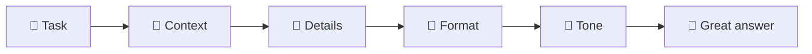

# 06 · Prompting 101: How to Ask So AI Gets It ✍️

> ⏱️ 8 min read · 🎯 Complete beginners · 🧰 Needs: any AI assistant

**A "prompt" is simply what you type (or say) to the AI, and the quality of your prompt shapes the quality of the
answer more than anything else.** The good news: there's no secret code. Good prompts are just clear requests with a
bit of context, the kind you'd give a smart new assistant on their first day. This chapter gives you a five-ingredient
recipe, lots of before-and-after examples, and a printable card to keep by your screen.

<details class="eli5" open>
<summary>🧸 ELI5: This chapter in 30 seconds</summary>

If you ask a friend "make me something to eat," you might get anything. If you say "make me a quick cheese sandwich,
I'm starving and I don't like tomatoes," you get exactly what you want. AI is the same: tell it **what** you want,
**who it's for**, **what it should know**, **what it should look like**, and **what tone** to use.

</details>

<!-- in-this-chapter -->

## ✍️ Why prompts matter so much

<details class="eli5">
<summary>🧸 ELI5</summary>

The AI can't read your mind. The more it knows about what you want, the better it can help, just like a new helper on
their first day.

</details>

Picture the AI as a **brilliant new assistant on their first day**. They're smart and eager, but they know *nothing*
about you, your situation or your taste. If you say "write an email to my boss," they'll write a perfectly generic
email that fits nobody.

Compare:

| 😐 Vague | 🤩 Clear |
|---|---|
| *"Write an email to my boss."* | *"Write a short email to my manager, Priya, asking to leave at 3pm on Friday for my son's school play. I'll make up the hours on Thursday. Friendly but professional."* |

Same AI, same five seconds of your time, wildly different results. That's all prompting is. ✨

## 🧩 The five-ingredient recipe

<details class="eli5">
<summary>🧸 ELI5</summary>

Great prompts usually have five ingredients: the job, who it's for, the important details, the shape of the answer, and
the mood. You don't always need all five.

</details>

| # | Ingredient | Ask yourself | Example |
|---|---|---|---|
| 1 | 🎯 **Task** | What do I want done? | "Write a birthday message…" |
| 2 | 👥 **Context** | Who is it for, and why? | "…for my grandma, who's turning 90 and loves gardening…" |
| 3 | 📌 **Details** | What must it include or avoid? | "…mention our summer trips to the lake; keep it simple, her eyesight isn't great…" |
| 4 | 📐 **Format** | What shape and length? | "…4 short lines, big and easy to read in a card…" |
| 5 | 🎨 **Tone** | What should it feel like? | "…warm and a little funny." |

Put together:

> *"Write a birthday message for my grandma, who's turning 90 and loves gardening. Mention our summer trips to the lake.
> Keep it to 4 short, simple lines for a card. Warm and a little funny."*

You don't need all five every time. "What's the capital of Peru?" needs just the task! But for anything personal or
important, run through the list. It takes ten seconds and saves ten minutes of back-and-forth.



## 🔄 Before & after: the recipe in action

<details class="eli5">
<summary>🧸 ELI5</summary>

Here are lots of examples of a "meh" question turned into a great one. See how adding a few details changes
everything.

</details>

| Situation | 😐 Before | 🤩 After |
|---|---|---|
| Dinner | "Dinner ideas" | "Give me 5 dinner ideas for 2 adults and a picky 7-year-old. Under 30 minutes, one pan, no mushrooms. Simple ingredients from a normal supermarket." |
| Health info | "Is coffee bad?" | "I'm 55 and drink 4 cups of coffee a day. Summarize what reliable health sources say about that amount, in plain language, and what I should ask my doctor." |
| Travel | "Things to do in Lisbon" | "We're a couple in our 60s visiting Lisbon for 3 days in May. We like food, history and gentle walks (no steep hikes). Suggest a relaxed day-by-day plan." |
| Money | "How do I save money?" | "I earn about £2,400 a month after tax and spend most of it without tracking. Give me a simple 3-step plan to start saving £200 a month, with one tiny thing to do today." |
| Learning | "Explain inflation" | "Explain inflation to me like I'm 14, using an example with the price of pizza. Then give me one question to check I understood." |
| Writing | "Fix my email" | "Here's an email to a customer who got the wrong order. Make it apologetic but confident, under 120 words, and offer a 10% discount. [paste email]" |
| Gifts | "Gift ideas" | "Gift ideas for my brother (35) who loves hiking and coffee and has everything. Budget $40. Give 8 ideas, including 2 experiences." |
| Tech help | "My laptop is slow" | "My 4-year-old Windows laptop takes 5 minutes to start and freezes in Chrome. I'm not techy. Give me 5 safe things to try, easiest first, with exact clicks." |

## 🎭 Give it a role

<details class="eli5">
<summary>🧸 ELI5</summary>

You can ask the AI to pretend to be a certain kind of expert or helper, like a patient teacher or a friendly chef, and
its answers change to match.

</details>

Starting with *"You are…"* or *"Act as…"* nudges the AI's style and focus:

- *"Act as a **patient computer teacher** for someone who's never used a spreadsheet."*
- *"You're a **friendly personal trainer** who works with beginners over 50."*
- *"Be my **Spanish conversation partner**. Correct my mistakes gently."*
- *"Pretend you're a **tough but fair interviewer** for a retail manager job. Ask me one question at a time."*

Roles are especially great for **practice**: job interviews, difficult conversations, language learning. The AI never
gets tired or judges you. 💪

## 📋 Show an example

<details class="eli5">
<summary>🧸 ELI5</summary>

If you show the AI one example of what you like, it copies that style, like showing a hairdresser a photo.

</details>

When you want a specific style, **showing beats describing**. Paste an example and say "like this":

> *"Write 5 more product descriptions for my candle shop in the same style as this one:*
> *'🍂 Autumn Walk: crunchy leaves, warm cinnamon, and a hint of woodsmoke. Like a hug in a jar. 40-hour burn.'"*

The AI will match the length, emoji use, rhythm and tone. This is called giving an **example** (the pros call it
"few-shot prompting," but you don't need to remember that).

## 📐 Ask for the shape you want

<details class="eli5">
<summary>🧸 ELI5</summary>

Tell the AI what kind of answer you want: a list, a table, steps, a short text, so it's easy for you to use.

</details>

AI can format answers in almost any way. Just ask:

| Ask for… | Great for |
|---|---|
| **"A bullet list"** | Ideas, packing lists, pros and cons |
| **"Numbered steps"** | Instructions, recipes, how-tos |
| **"A table comparing…"** | Choosing between options (phones, plans, holiday spots) |
| **"Under 100 words"** / **"one paragraph"** | Quick answers, texts, social posts |
| **"A checklist"** | Moving house, trip prep, event planning |
| **"An email / text / letter"** | Ready-to-send messages |
| **"A simple weekly schedule"** | Meal plans, study plans, workout plans |
| **"Explain like I'm 10"** | Anything confusing |
| **"Give me 3 options"** | Anytime you want to choose |

## 🙋 Let the AI ask *you* questions

<details class="eli5">
<summary>🧸 ELI5</summary>

If you're not sure what details matter, ask the AI to interview you first. It will ask you the right questions, then do
the job.

</details>

This is the **best trick for beginners**: when you don't know what details to include, end your prompt with:

> *"Before you answer, ask me any questions you need to give me a really good answer."*

Example:

> *"I want to start running but I've never done it. Make me a plan. Before you answer, ask me any questions you need."*

The AI will ask about your age, fitness, schedule and goals, then create something that genuinely fits you. It's like
having a coach who does a proper consultation. 🏃

## 🚫 Common beginner mistakes (and easy fixes)

<details class="eli5">
<summary>🧸 ELI5</summary>

Most beginner problems come from a few small mistakes, like asking too little or asking for everything at once. Here's
how to avoid them.

</details>

| Mistake | Fix |
|---|---|
| **Too short:** "Write a speech" | Add who, why, how long, what tone |
| **Everything at once:** a 12-part mega-request | Break it into steps: first the outline, then each section |
| **Giving up after one answer** | Follow up! "Make it shorter," "more like this," "try again" (see [Prompting 102](07-prompting-102.md)) |
| **Being overly polite or robotic** | Just talk normally. "Please" is fine but not required, and there are no magic keywords |
| **Assuming it knows your situation** | Tell it: your country, budget, family, constraints |
| **Trusting facts blindly** | Ask for sources and check anything important ([chapter 10](10-when-ai-gets-it-wrong.md)) |
| **Pasting private info** | Remove names, account numbers and passwords first ([chapter 11](11-staying-safe-with-ai.md)) |

## 🃏 Your prompt card (print me!)

<details class="eli5">
<summary>🧸 ELI5</summary>

A tiny cheat sheet to keep next to your computer so you remember the recipe.

</details>

```text
✍️  THE PROMPT RECIPE
🎯 TASK      What do I want?            "Write / Explain / Plan / Compare…"
👥 CONTEXT   Who's it for? Why?         "for my 80-year-old dad who…"
📌 DETAILS   Must include / avoid?      "no nuts, under $50, mention…"
📐 FORMAT    What shape? How long?      "a table", "5 bullets", "under 100 words"
🎨 TONE      What feel?                 "warm", "professional", "funny"

✨ MAGIC PHRASES
"Ask me questions first."   "Give me 3 options."   "Explain like I'm 12."
"Make it shorter."          "More like the second one."   "What am I missing?"
```

## 🎯 Key takeaways

- A prompt is just **what you ask**. Clear requests with context get far better answers.
- Use the **five ingredients**: task, context, details, format, tone (not every time, but for anything that matters).
- **Roles** ("act as a patient teacher") and **examples** ("like this one") are easy power-ups.
- **Ask for the shape** you want: lists, tables, steps, word limits.
- When unsure, say **"ask me questions first."**

## 🧠 Check yourself

<details class="quiz">
<summary>❓ 1. Improve this prompt: "Write a poem."</summary>

Something like: *"Write a short, funny poem (8 lines) for my coworker Dave's retirement card. He loves fishing and bad
puns and has worked here 30 years."* It adds task, context, details, format and tone.

</details>

<details class="quiz">
<summary>❓ 2. You don't know what details a workout plan needs. What's the trick?</summary>

End your prompt with **"Ask me any questions you need before you answer."** The AI will interview you first.

</details>

<details class="quiz">
<summary>❓ 3. You want five new social posts in the same style as one you love. Best approach?</summary>

**Paste the example** and say "write 5 more in exactly this style." Showing beats describing.

</details>

<details class="quiz">
<summary>❓ 4. Are there secret magic words that make AI work better?</summary>

Not really! Clear, specific, natural language with **context** beats any "magic" phrase. Talk to it like a smart
assistant.

</details>

> [!TIP]
> **🎮 Try this**
> Pick something you actually need this week. Write the **lazy version** of the prompt first and send it. Then write the
> **five-ingredient version** in a new chat. Compare the answers side by side. The difference will convince you forever. 🤯

---

**Next:** [07 · Prompting 102 →](07-prompting-102.md)
