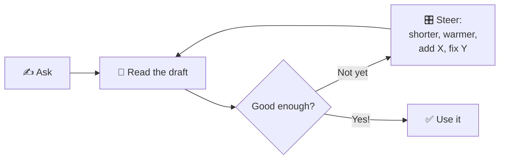

# 07 · Prompting 102: Conversations, Follow-Ups & Fixing Bad Answers 🔁

> ⏱️ 8 min read · 🎯 Beginners who've had a few chats · 🧰 Needs: any AI assistant

**The best AI users don't write perfect prompts. They have great conversations.** The first answer is a draft; the
magic happens when you react, steer and refine. This chapter gives you a steering wheel of follow-up phrases, a
step-by-step method for big tasks, tricks to make the AI check its own work, and what to do when it just isn't
getting it.

🧸 ELI5: This chapter in 30 seconds

Talking to AI is like working with a helpful friend on a drawing: they draw something, you say "make the house bigger,"
"add a dog," "the sky should be orange," and together you end up with exactly the picture you imagined. Don't expect
the first try to be perfect. Steer it.

<!-- in-this-chapter -->

## 🔁 Think in conversations, not single questions

🧸 ELI5

The first answer is a first try. Tell the AI what you like and what to change, and it gets better each time.

Beginners often ask once, get a so-so answer, and conclude "AI isn't that good." Experienced users treat the first
answer as a **rough draft** and go round a simple loop:

Two or three rounds of steering usually gets you something excellent. And because the AI remembers the conversation,
each follow-up can be tiny: *"shorter,"* *"warmer,"* *"remove the second paragraph."*

## 🎛️ Your steering wheel: 30 follow-up phrases

🧸 ELI5

These are handy little sentences to change an answer: make it shorter, simpler, friendlier, or more detailed.

| When you want… | Say… |
|---|---|
| **Shorter** | "Cut it in half." · "Just the top 3." · "One sentence." |
| **Longer / deeper** | "Go deeper on point 2." · "Add examples." · "What else should I know?" |
| **Simpler** | "Explain like I'm 12." · "No jargon." · "Use an everyday analogy." |
| **A different tone** | "Warmer." · "More professional." · "Funnier." · "Less salesy." · "Sound like me: casual, short sentences." |
| **Options** | "Give me 5 alternatives." · "3 very different versions." · "A bolder one." |
| **A mix** | "Combine the first version's opening with the third's ending." |
| **A new format** | "Turn that into a table." · "Make it a checklist." · "Format it as a text message." |
| **Personalization** | "Adjust for a family of 4 on a tight budget." · "I'm in Canada, so use Canadian rules." |
| **Accuracy** | "Are you sure?" · "What's your source?" · "Which parts are you least confident about?" |
| **Critique** | "What's weak about this?" · "Rate it out of 10 and improve it." |
| **Next steps** | "What should I do first?" · "Turn this into a plan for this week." |

> [!TIP]
> **💡 Point at the exact bit**
> Be specific about *what* to change: *"The second paragraph is too formal"* beats *"make it better."* Quote the part
> you mean, or refer to it by number: *"Keep ideas 1 and 4, replace the rest."*

## 🧱 Big tasks: go step by step

🧸 ELI5

For a big job, like a speech or a plan, don't ask for everything at once. First make an outline, then fill in each part,
then polish it, like building with LEGO one piece at a time.

For anything big (a speech, a business plan, a long letter, a study plan), **don't ask for the whole thing at once.**
Build it in stages:

1. **Brainstorm:** *"I'm giving a 3-minute toast at my sister's wedding. Ask me 5 questions about her and her partner
   to find good material."*
2. **Outline:** *"Based on my answers, suggest an outline: opening, 2 stories, a toast."*
3. **Draft:** *"Write the opening and the first story. Keep it warm and funny, with no inside jokes that guests won't
   get."*
4. **Refine:** *"The story drags in the middle. Tighten it. Make the ending land harder."*
5. **Finish:** *"Now the toast itself. Short and emotional."*
6. **Polish:** *"Read the whole thing as a whole. Anything to cut? Is it under 3 minutes when read aloud?"*

Each step, **you** stay in charge of the direction, and the result sounds much more like you.

## 🪞 Make the AI check its own work

🧸 ELI5

You can ask the AI to look at its own answer like a teacher marking homework and fix the mistakes it finds.

AI is surprisingly good at spotting problems in its own drafts, *if you ask*. Try:

- *"Review your answer. What might be wrong, missing or unclear?"*
- *"Pretend you're a skeptical expert. What would you criticize?"*
- *"Rate this email out of 10 for clarity and tone, then rewrite it to be a 10."*
- *"Double-check the math step by step."*
- *"Which facts in your answer should I verify with an official source?"*

This one habit catches a lot of errors and noticeably improves quality. For important facts, you still verify
yourself ([When AI Gets It Wrong](10-when-ai-gets-it-wrong.md)).

## 📎 Give it something to work with

🧸 ELI5

The AI does its best work when you give it the actual stuff: paste the letter, upload the document, share the photo,
instead of just describing it.

The AI does its best work on **real material**. Instead of describing a document, *give it the document*:

| Instead of… | Do this |
|---|---|
| "Summarize the letter from my bank" | Paste the letter text (remove account numbers) or upload a photo of it |
| "Help with my CV" | Paste your CV and the job ad |
| "What's wrong with my recipe?" | Paste the recipe and say what went wrong |
| "Reply to this email" | Paste the email you received |
| "Explain my lease" | Upload the PDF and ask specific questions |

A powerful phrase for accuracy: *"Answer **using only** the document I shared. If it's not in there, say so."* This
dramatically reduces made-up answers. Uploading files and photos is covered in [chapter 9](09-voice-photos-and-files.md).

## 🧭 When it just isn't getting it

🧸 ELI5

Sometimes the AI keeps misunderstanding. Usually it's missing a piece of information. Tell it more, show an example, or
start a fresh chat with a clearer request.

If you've steered three times and it's still wrong, diagnose:

| Symptom | Likely cause | Fix |
|---|---|---|
| Keeps giving generic answers | Missing context | Add your situation, constraints, audience |
| Wrong style every time | Description too vague | **Show an example** of what you want |
| Ignores an instruction | Instruction buried in a long message | Put it first, or on its own line: "**IMPORTANT:** no more than 100 words" |
| Gets confused, contradicts itself | The chat is long and cluttered | **Start a new chat** with a clean summary |
| Refuses something harmless | It misread your intent | Explain why you're asking |
| Stuck on the same wrong idea | It's "anchored" on its first attempt | "Forget the previous approach. Start from scratch with a completely different idea." |

> [!TIP]
> **💡 The fresh-start summary**
> Ask: *"Summarize everything we've decided so far in a short paragraph I can paste into a new chat."* Then open a new
> chat and paste it. Clean slate, all the good stuff kept.

## 👀 A real conversation, start to finish

🧸 ELI5

Here's an example of a whole chat where someone steers the AI step by step until they get just what they need.

Here's how a two-minute chat turns a vague idea into something genuinely useful:

> **You:** *I want to get fitter but I hate gyms. Ideas?*
>
> **AI:** *(gives 10 general ideas: walking, cycling, swimming, yoga, dancing…)*
>
> **You:** *I like the walking and yoga ones. I'm 58, a bit overweight, and have a dodgy left knee. I've got 30
> minutes most mornings.*
>
> **AI:** *(suggests a gentle plan: brisk walks alternating with chair yoga, knee-friendly moves, a note to check with a
> doctor)*
>
> **You:** *Great. Make it a 4-week plan in a table, Monday to Sunday, with rest days, getting gradually harder.*
>
> **AI:** *(4-week table)*
>
> **You:** *Week 1 looks too easy honestly. Bump it up a bit. And add one fun thing each weekend.*
>
> **AI:** *(adjusted table with a Saturday dance video and a Sunday nature walk)*
>
> **You:** *Perfect. Give me a one-line motivational message for each Monday.*

Five short messages, and the result is a personal plan that fits one specific person's body, schedule and taste.
That's the skill. 🏆

## 💾 Save your best prompts

🧸 ELI5

When a question works really well, save it somewhere so you can use it again, like saving a favorite recipe.

When a prompt works brilliantly, **save it**:

- A simple **note** on your phone ("My AI prompts") is enough to start.
- Put preferences you repeat into your **custom instructions** ([chapter 5](05-getting-set-up.md)).
- Later, you'll turn favorite prompts into reusable helpers: **Projects** (ChatGPT, Claude and others), **Gems**
  (Gemini), **Spaces** (Perplexity) and **skills** (ChatGPT, Claude). Your assistant's
  [Field Guide chapter](../part-2-ai-assistants-field-guide/index.md) shows how.
- For inspiration, raid the [Beginner's Prompt Cookbook](08-beginners-prompt-cookbook.md) and the big
  [Prompt Library](../appendices/d-prompt-library.md).

## 🎯 Key takeaways

- The first answer is a **draft**. Great results come from **steering** in a conversation.
- Keep a **steering wheel** of follow-ups handy: shorter, simpler, warmer, options, table, "are you sure?"
- For big tasks, go **step by step**: brainstorm → outline → draft → refine → polish.
- Ask the AI to **critique and check its own work**, and give it **real material** to work from.
- Stuck? Add context, show an example, or **start fresh with a summary**. Save prompts that work.

## 🧠 Check yourself

❓ 1. The AI wrote a decent cover letter, but the middle is boring. What's the best follow-up?

Be specific: *"The middle paragraph is boring. Replace it with a short story about when I [achievement], and make it
more energetic."* Point at the exact bit and say what you want.

❓ 2. You need a 20-page community newsletter. Ask for it all at once?

No. **Go step by step:** plan the sections, draft one at a time, then polish. You'll stay in control and get a better
result.

❓ 3. How can you reduce made-up answers when asking about a document?

Share the actual document and say *"Answer **using only** this document. If it's not in there, say so."*

❓ 4. Your chat is 80 messages long and the AI is getting confused. What now?

Ask for a **summary of what you've decided**, start a **new chat**, and paste the summary in.

> [!TIP]
> **🎮 Try this**
> Ask for something small (a birthday message, a weekend plan, a short bio) and then **steer it five times** using
> phrases from the steering wheel. Save your final favorite and the prompt that started it in a note called "My
> prompts." You've just started your personal prompt collection. 📒

---

**Next:** [08 · The Beginner's Prompt Cookbook →](08-beginners-prompt-cookbook.md)
