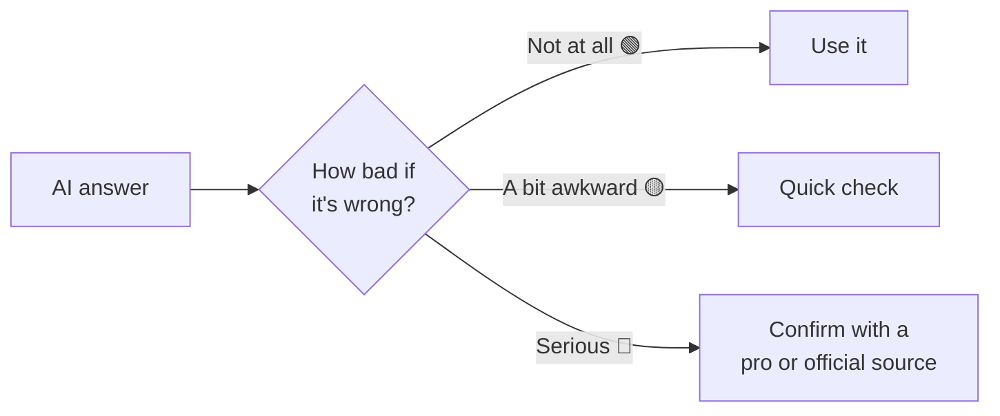

# 10 · When AI Gets It Wrong: Hallucinations & Fact-Checking 🔍

> ⏱️ 7 min read · 🎯 Everyone (seriously, everyone) · 🧰 Needs: any AI assistant

**AI is amazingly helpful, and sometimes it's confidently, fluently wrong.** It can invent a book that doesn't exist,
mix up dates, cite a law that isn't real, or agree with you just to be nice. None of this should scare you off. It just
means using a few simple habits, the same way you'd double-check a bargain that looks too good to be true. This chapter
makes you the person who gets all of AI's benefits and none of the embarrassing mistakes.

🧸 ELI5: This chapter in 30 seconds

Sometimes the AI is like a kid who didn't study but answers the test question confidently anyway. It's not lying on
purpose; it just guessed. So for important things, like medicine, money or facts you'll share with others, check its
answer with a real source. For fun things like poems and ideas, it doesn't matter.

<!-- in-this-chapter -->

## 🤥 What AI mistakes look like

🧸 ELI5

AI mistakes don't look like mistakes. They look like normal, confident answers. That's why you need to know the usual
kinds.

The tricky thing about AI errors is that **they sound exactly as confident as correct answers.** Here are the usual
suspects:

| Type of mistake | Example |
|---|---|
| 📚 **Invented sources** | A real-sounding book, study or article that doesn't exist |
| 📅 **Wrong details** | The right event, wrong year; the right person, wrong job title |
| 🔗 **Broken or fake links** | A web address that goes nowhere |
| 💬 **Made-up quotes** | Words a famous person never said |
| 🧮 **Math slips** | Adding up a bill wrong, especially long calculations done "in its head" |
| ⚖️ **Wrong rules for your place** | UK tax rules when you're in Australia; old rules that changed |
| 🙋 **Too agreeable** | "You're absolutely right!" when you weren't |
| 🕰️ **Outdated info** | Old prices, closed restaurants, discontinued products |

These are called **hallucinations** (inventions) or just **errors**. They happen less than they used to, especially
when the assistant searches the web, but they still happen. Knowing that is your superpower. 🦸

## 🚦 The traffic-light rule

🧸 ELI5

Green things (like poems) you don't need to check. Yellow things (facts you'll use) check quickly. Red things (health,
money, laws, safety) always check with an expert.

Not everything needs fact-checking. Match your effort to the stakes:

| 🚦 | What | Examples | What to do |
|---|---|---|---|
| 🟢 **Green** | Creative, personal, low stakes | Poems, gift ideas, names, brainstorming, rewording your own email | Enjoy! If you like it, it's "right" |
| 🟡 **Yellow** | Facts you'll use or share | History, how-tos, product comparisons, travel info, statistics | Quick check: sources, a second opinion, the official website |
| 🔴 **Red** | Health, money, legal, safety | Medication doses, tax rules, contracts, electrical work, anything irreversible | Use AI to *understand and prepare*, then **confirm with a professional or official source** |

## 🔍 Five fact-checking habits

🧸 ELI5

Five easy tricks: ask where it got the info, click the links, ask a second AI, check the official website, and ask how
sure it is.

1. **Ask for sources, and click them.**
   *"What are your sources?"* or turn on web search. Then **open the links**: does the page actually say what the AI
   claimed? (Sometimes it doesn't!)
2. **Get a second opinion.**
   Ask a different assistant the same question. If ChatGPT and Gemini (or Claude and Perplexity) disagree, dig deeper.
3. **Go to the official source.**
   For rules, prices, opening hours and deadlines, check the **government, company or organization's own website**.
4. **Ask how confident it is.**
   *"Which parts of your answer are you least sure about?"* Good assistants will flag their shaky bits honestly.
5. **Be suspicious of suspiciously specific details.**
   Exact statistics ("73.4% of people…"), precise quotes and obscure references are where inventions hide. Verify
   before repeating.

> [!TIP]
> **💡 Perplexity and "search mode" are your friends**
> For factual questions, an assistant that **searches the web and shows sources** (Perplexity, or search mode in
> ChatGPT, Gemini, Claude, Copilot or Grok) is far more reliable than one answering from memory. See
> [Perplexity: The Complete Guide](../part-2-ai-assistants-field-guide/23-perplexity.md).

## 🧮 Math, counting and numbers

🧸 ELI5

AI can slip up on sums when it does them "in its head." Ask it to show its work, or to use a calculator tool.

Chatbots are word-predictors, so long calculations done "in their head" can go wrong. Modern assistants often use a
built-in calculator or code tool for math, which is much more reliable.

- Ask: *"Calculate this step by step and show your working."*
- For money that matters, ask: *"Use a calculator/code to compute this exactly."*
- For bills and budgets, **check the total yourself** or in a spreadsheet.
- Counting letters or words? AI is famously clumsy at "how many R's in strawberry." Don't rely on it for precise counts
  without a tool.

## 📰 News, current events and "is this true?"

🧸 ELI5

For news, make sure the AI actually searched the internet, and check the date and source of what it found.

- **Make sure it searched.** Look for "searched the web" and source links. No links? It may be guessing from old
  training data.
- **Check dates.** An article from three years ago might be outdated.
- **Check the source's reputation.** A major news outlet or official site beats a random blog.
- **Viral claims:** ask *"Is this claim true? Search reputable sources and fact-checkers, and show me what they say."*
  Then look at those sources yourself.

## 🙋 When AI is *too* nice: agreeing too easily

🧸 ELI5

Sometimes the AI says "great idea!" just to be nice. If you want honest advice, ask it to be tough and point out
problems.

Assistants are trained to be helpful and pleasant, which sometimes tips into **telling you what you want to hear**
(experts call it **sycophancy**). Watch for:

- It instantly agrees when you push back, even when it was right.
- Everything you write is "excellent!" and "brilliant!"
- It supports your plan without mentioning obvious risks.

**Fix:** ask for honesty explicitly:

- *"Be brutally honest. What's wrong with this plan?"*
- *"Argue the opposite side as strongly as you can."*
- *"If I'm wrong, tell me. Don't just agree with me."*
- *"What would a skeptical expert say?"*

## ⚖️ Bias and one-sided answers

🧸 ELI5

The AI learned from people's writing, so it can pick up people's unfair ideas. For big topics, ask it to show different
points of view.

AI learned from human writing, so it can reflect human biases, and different assistants lean different ways on
opinions. For anything debated (politics, parenting styles, diets, history), ask:

- *"Give me the strongest arguments on each side."*
- *"What do experts disagree about here?"*
- *"Who might see this differently, and why?"*

Then make up your own mind. AI is a great way to *understand* views, not to be told what to think.

## ✅ The quick fact-check checklist

🧸 ELI5

A short list to run through whenever an answer really matters.

Before you **act on** or **share** an AI answer that matters:

- [ ] Is this 🟢, 🟡 or 🔴? (Adjust your checking accordingly)
- [ ] Did it show **sources**? Did I **open** at least one?
- [ ] Do the **specific numbers, names and dates** check out?
- [ ] Is the info **current** and right for **my country**?
- [ ] Did I ask **"what are you unsure about?"**
- [ ] For 🔴 topics: did I confirm with a **professional or official source**?

## 🎯 Key takeaways

- AI mistakes **sound just as confident** as correct answers: invented sources, wrong details, fake links, math slips.
- Use the **traffic light**: 🟢 enjoy, 🟡 quick check, 🔴 confirm with a pro or official source.
- **Five habits:** ask for sources and click them, second opinion, official source, ask its confidence, distrust
  suspiciously specific details.
- Watch for **too-agreeable** answers: ask it to be honest and argue the other side.
- AI is a brilliant **starting point**, and you're the final check.

## 🧠 Check yourself

❓ 1. AI gives you a perfect-sounding quote from a famous scientist for your presentation. What do you do?

**Verify it** before using it: search for the quote from a reliable source. Invented quotes are a classic
hallucination.

❓ 2. Which traffic light: "What dose of children's paracetamol for my 4-year-old?"

🔴 **Red.** Check the packaging and confirm with a pharmacist or doctor. AI can explain, but it shouldn't be your final
answer for medication.

❓ 3. You challenge the AI and it immediately says "You're absolutely right!" Should you trust that?

Not automatically. It may just be agreeing to please you. Ask *"Were you actually wrong before? Explain honestly,"* and
check a source.

❓ 4. What's the easiest way to get more reliable answers about current events?

Use an assistant or mode that **searches the web and shows sources** (like Perplexity, or search in ChatGPT/Gemini),
then **click the sources** to confirm.

> [!TIP]
> **🎮 Try this**
> **Catch the AI.** Ask your assistant: *"Recommend 3 books about the history of cheese, with authors and years."* Then
> search for each one online. Are they all real? Now ask the same question with **web search on**, or in Perplexity.
> Compare. You've just learned the most important AI safety skill there is. 🧀🔍

---

**Next:** [11 · Staying Safe →](11-staying-safe-with-ai.md)
