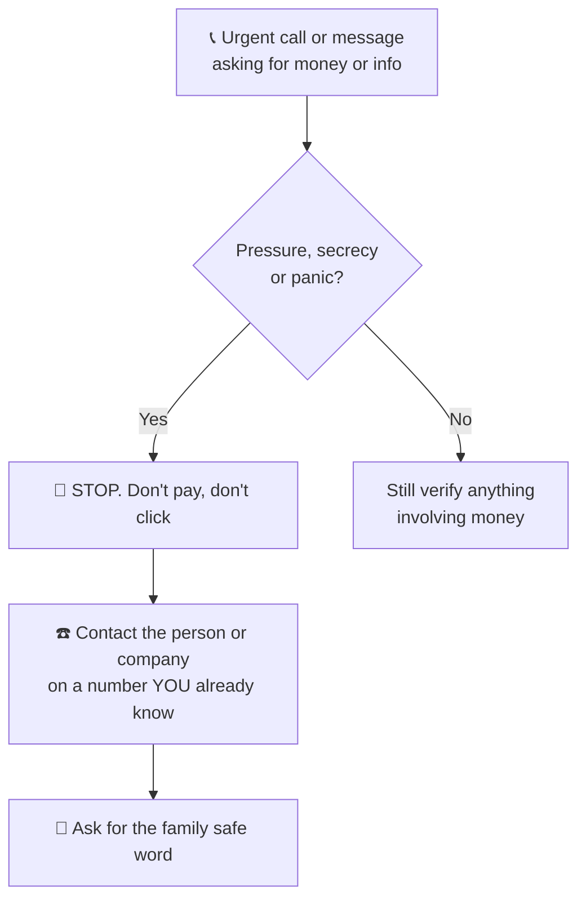

# 11 · Staying Safe: Privacy, Scams & Deepfakes 🛡️

> ⏱️ 8 min read · 🎯 Everyone, and especially anyone helping older relatives · 🧰 Needs: 10 minutes in your settings

**AI is safe to use when you follow a few simple rules, and knowing about AI makes you *much* harder to fool.** This
chapter covers what never to share with a chatbot, the privacy switches worth flipping, the new wave of AI-powered scams
(cloned voices, fake videos, too-good-to-be-true investment ads), how to spot AI-made content, and what to do if
something goes wrong. Share it with your family; it might save someone real heartache. 💛

🧸 ELI5: This chapter in 30 seconds

Don't tell the AI your secrets, like passwords or bank card numbers. And remember that bad people can use AI too: they
can fake a family member's voice on the phone or make fake videos of celebrities. So if a call or message makes you
panic and asks for money, stop, hang up, and check with the real person another way. A family "safe word" helps a lot.

<!-- in-this-chapter -->

## 🤐 What never to share with a chatbot

🧸 ELI5

Some things are too private to type into any AI: passwords, bank card numbers, ID numbers and other people's secrets.

Treat an AI chat like a conversation that **could one day be read by someone else**: a company reviewer, a hacker who
steals your password, or anyone you accidentally share a link with.

| 🚫 Never share | ✅ Instead |
|---|---|
| Passwords, PINs, security answers, one-time codes | Nothing. The AI never needs them |
| Full bank card or account numbers | Describe the issue: "my card was charged twice" |
| Passport, social security / national insurance numbers | Remove or black them out on scans |
| Other people's private info (health, secrets, photos) without permission | Anonymize: "a friend" or "my colleague" |
| Confidential work documents (unless your employer approves the tool) | Use your company's approved AI, or summarize without details |
| Exact home address plus your daily routine | General area is fine: "I live in a small town near Leeds" |
| Photos of your kids to random apps | Only trusted, official apps, and think twice |

> [!IMPORTANT]
> **❗ No real AI company will ask for your password in a chat**
> If a "chatbot," email or message ever asks for your password, verification code or card details, it's a scam. Close
> it.

## ⚙️ Your privacy switches

🧸 ELI5

Every AI app has switches for privacy: whether your chats help train the AI, whether it remembers you, and a secret
mode that doesn't save anything.

Take ten minutes to review these in your main assistant (exact locations are in each [Field Guide
chapter](../part-2-ai-assistants-field-guide/index.md) and in [Getting Set Up](05-getting-set-up.md)):

- 🧪 **Training on your chats:** turn off "improve the model" if you'd rather your chats weren't used for training.
- 🧠 **Memory:** review what it remembers; delete anything wrong or too personal.
- 👻 **Temporary / incognito chats:** for sensitive one-off questions.
- 🗑️ **Delete old chats** you don't need, and **revoke shared links**.
- 🔗 **Connected apps:** if you've connected Gmail, Drive or others, remove any you no longer use.
- 🔐 **Two-step verification** on your account.

For the full deep dive (including work and family situations), see [Privacy & Your
Data](../part-12-mastery/104-privacy-and-your-data.md).

## 🎭 The new AI scams (and how to beat them)

🧸 ELI5

Tricksters now use AI to copy voices and faces, so a scam call can sound exactly like your grandson. If anyone asks for
money in a hurry, always check with them another way first.

Criminals use AI too. These are the scams growing fastest, and the one move that beats each:

| Scam | How it works | 🛡️ Your defense |
|---|---|---|
| 📞 **Cloned voice emergency** ("Mum, I've been in an accident, send money!") | A few seconds of someone's voice from social media is enough to clone it | **Hang up and call them back** on the number you know. Use a **family safe word** |
| 🎥 **Deepfake celebrity ads** ("Famous billionaire's secret investment!") | Realistic fake videos of celebrities or news anchors promoting scams | Real celebrities don't sell get-rich-quick schemes. **Never invest from an ad** |
| 📧 **Perfect phishing emails** | AI writes flawless, personalized scam emails (no more bad spelling to tip you off) | Don't click links in unexpected messages. **Go to the website yourself** |
| 💕 **Romance scams** | AI-written messages and fake photos (even video calls) build a relationship, then ask for money | **Never send money to someone you haven't met in person**, however real they seem |
| 👔 **Fake boss / bank calls** | A cloned voice or deepfake video call "from the CEO" or "your bank" asks for an urgent transfer | **Verify through a separate, known channel**. Banks never ask you to move money to a "safe account" |
| 🛒 **Fake shops and reviews** | AI-generated websites and glowing fake reviews | Check the company elsewhere; pay with a credit card or trusted service |

> [!TIP]
> **💡 Set a family safe word tonight**
> Agree on a secret word or question with family members (especially older relatives and teenagers) that a real caller
> in an emergency would know. If "your grandson" calls from a strange number needing bail money and can't say the safe
> word, hang up. It's the simplest, strongest protection against voice-cloning scams. 🔑

## 📱 Fake AI apps and extensions

🧸 ELI5

Some apps pretend to be famous AIs but are fakes that steal money or information. Only download from the real company.

- **Check the developer name** in the app store: OpenAI, Google, Anthropic, Microsoft, Meta, xAI, Perplexity AI, and so
  on. Lookalikes often have names like "Chat AI Assistant GPT Pro."
- **Be wary of weekly subscriptions** in apps you don't recognize.
- **Browser extensions** can read everything on the pages you visit. Only install extensions from companies you
  trust, and remove ones you don't use.
- **"Free premium access" offers** on social media are almost always scams.

## 🕵️ Spotting AI-made images, video and text

🧸 ELI5

AI pictures and videos can look very real. Look for weird details, check where they came from, and be extra careful
with anything that makes you very angry or excited.

AI images and videos are getting harder to spot, so rely on **habits** more than on "tells":

- **Pause when something triggers a strong emotion** (outrage, fear, amazement). That's exactly what fakes are designed
  to do.
- **Check the source:** who posted it first? Is a reputable news outlet reporting it?
- **Reverse image search:** Google Lens or similar tools show where an image appeared before.
- **Look for labels:** many platforms mark AI content ("AI info," "Made with AI"), and some images carry
  **Content Credentials** showing how they were made.
- **Classic clues** (less reliable every year): garbled text in signs, odd hands or jewelry, too-smooth skin, mismatched
  earrings, strange shadows, voices out of sync with lips.
- **AI-written text** has no reliable detector. Judge messages by *what they ask you to do*, not by how well they're
  written.

## 🧒 Kids, teens and AI

🧸 ELI5

Kids can learn a lot with AI, but grown-ups should help set rules, check the age limits, and talk openly about what's
okay.

- **Check age rules:** most assistants are 13+ with parental permission, or 18+. Use teen accounts and parental controls
  where offered.
- **Talk about it openly:** what's okay (explanations, practice, ideas) and what's not (copying homework, sharing
  private info, making images of classmates).
- **AI companions:** some apps offer AI "friends" or characters. Keep an eye on how much time kids spend and what those
  chats are about.
- **Nudify and fake-image apps** that create sexual images of real people are harmful and illegal in many places. Talk to
  teens about this directly.

Full guide: [Parents, Teachers & Students](../part-11-ai-for-life-and-work/98-parents-teachers-and-students.md).

## 💛 Looking after yourself

🧸 ELI5

AI can be a comforting helper, but it's not a real friend or a doctor. Keep talking to real people too.

AI can be comforting: it's patient, available at 3am, and never judges. That's genuinely valuable. But:

- It's **not a therapist or doctor.** For ongoing sadness, anxiety or crisis, reach out to a professional or a support
  line in your country. If you're in danger, call your local emergency number.
- **Balance it with people.** If you notice you'd rather talk to AI than anyone else, that's a gentle sign to reconnect
  with friends, family or community.
- **Your decisions are yours.** Use AI to think things through, not to be told what to do with your life.

## 🆘 If something goes wrong

🧸 ELI5

If you think you've been tricked, act fast: call your bank, change your passwords, and tell someone. It happens to smart
people too, so don't feel ashamed.

If you've shared something you shouldn't have, or think you've been scammed:

1. **Money sent or card shared?** Call your **bank immediately** using the number on your card.
2. **Password shared or account acting strangely?** **Change the password** (and on any site using the same one), and
   turn on two-step verification.
3. **Shared something private in an AI chat?** Delete the chat, and check the company's help pages for data deletion
   requests.
4. **Report it:** to your country's fraud reporting service, and to the platform where it happened.
5. **Tell someone you trust.** Scammers rely on shame and secrecy. These scams fool smart, careful people every day.

## 🎯 Key takeaways

- **Never share** passwords, codes, full card numbers, ID numbers or other people's private info with a chatbot.
- Flip your **privacy switches**: training, memory, temporary chats, connected apps, two-step verification.
- AI scams use **cloned voices, deepfake videos and perfect emails**. Beat them with **call-back verification** and a
  **family safe word**.
- **Download official apps only** and be careful with browser extensions.
- Don't trust your eyes alone: **check sources, labels and reverse image search**, and pause when something is
  designed to make you panic.

## 🧠 Check yourself

❓ 1. "Your daughter" calls from an unknown number, crying, saying she needs money wired right now. What do you do?

**Hang up and call her** on the number you know (or someone who's with her). Ask for the **family safe word**. Voice
cloning makes this scam frighteningly convincing.

❓ 2. A video of a famous businessman promotes an "AI trading platform guaranteeing 30% monthly returns." Real?

Almost certainly a **deepfake scam**. Guaranteed high returns plus a celebrity endorsement in an ad is a classic
pattern. Never invest from an ad.

❓ 3. Is it okay to paste your bank statement into a chatbot to get budgeting help?

Only after **removing account numbers and personal details**. Better still, paste just the amounts and categories.

❓ 4. Can you reliably tell AI-written emails apart by spelling mistakes?

No. AI writes perfectly. Judge messages by **what they ask you to do** (click, pay, share codes), not by how polished
they look.

> [!TIP]
> **🎮 Try this**
> Two ten-minute safety wins: (1) **Set a family safe word** with the people you love, and tell older relatives about
> voice-cloning scams. (2) Open your assistant's settings and review **memory** and **training**. Then ask the AI: *"What
> are the top 5 scams targeting people like me right now, and how do I avoid them?"* 🛡️

---

**Next:** [12 · AI Everywhere →](12-ai-everywhere.md)
