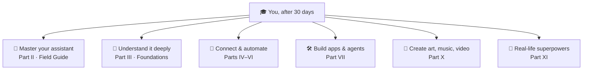

# 16 · Your 30-Day AI Starter Plan (and Where to Go Next) 🗓️

> ⏱️ 10 min read, then 10 minutes a day · 🎯 Complete beginners who want a routine · 🧰 Needs: any AI assistant

**Thirty days, about ten minutes a day, and you'll go from "I've tried it" to "I use it without thinking."** This plan
builds the habits that make AI genuinely useful: a little practice every day, a new skill each week, and a clear map of
where to go next in this manual when you're ready for more. Print it, stick it on the fridge, tick the boxes. ✅

🧸 ELI5: This chapter in 30 seconds

Learning AI is like learning to ride a bike: a little practice every day works better than one giant lesson. This is a
one-month plan with one small thing to do each day. By the end, using AI will feel as normal as sending a text.

<!-- in-this-chapter -->

## 🗓️ How the plan works

🧸 ELI5

Ten minutes a day, one small task at a time. Skip a day? No problem, just carry on.

- ⏱️ **About 10 minutes a day.** Some days take 5, a few take 20.
- 🔁 **Missed a day?** No guilt. Just pick up where you left off.
- 📝 **Keep a tiny log:** one line a day in your notes (*"Day 6: AI fixed my Wi-Fi!"*). It's motivating to look back
  on.
- 🧑‍🤝‍🧑 **Do it with a buddy** if you can: a partner, friend or parent. Compare notes each week.
- 🌍 **Any assistant works.** Where a day mentions a feature, your assistant's [Field Guide
  chapter](../part-2-ai-assistants-field-guide/index.md) shows where to find it.

## 🌱 Week 1: The basics

🧸 ELI5

The first week is about getting comfortable: set up your AI, ask questions, and learn the recipe for good requests.

| Day | Do this | ✅ |
|---|---|---|
| 1 | Set up your assistant, fill in **custom instructions** ([chapter 5](05-getting-set-up.md)) | ☐ |
| 2 | Ask it to explain **one thing you've always wondered about**, like you're 12 | ☐ |
| 3 | Use the **five-ingredient recipe** for a real request ([chapter 6](06-prompting-101.md)) | ☐ |
| 4 | Steer an answer **five times** with follow-ups ([chapter 7](07-prompting-102.md)) | ☐ |
| 5 | Try **three prompts** from the [Cookbook](08-beginners-prompt-cookbook.md) | ☐ |
| 6 | Have your **first voice conversation** (5 minutes) | ☐ |
| 7 | **Catch the AI:** fact-check one answer using sources ([chapter 10](10-when-ai-gets-it-wrong.md)) | ☐ |

## 🌿 Week 2: Everyday habits

🧸 ELI5

Week two is about using AI for real everyday things: meals, messages, paperwork and learning.

| Day | Do this | ✅ |
|---|---|---|
| 8 | Plan the week's **meals and shopping list** | ☐ |
| 9 | Write a **tricky message** you've been avoiding | ☐ |
| 10 | Snap a **photo** of something and ask about it | ☐ |
| 11 | **Upload a document** (bill, letter, manual) and get it explained | ☐ |
| 12 | **Learn something** for 10 minutes with the AI quizzing you | ☐ |
| 13 | Use AI for **one work or household task** you'd normally dread | ☐ |
| 14 | **Safety check:** review memory and privacy settings; set a **family safe word** ([chapter 11](11-staying-safe-with-ai.md)) | ☐ |

## 🌳 Week 3: Level up

🧸 ELI5

Week three you try new tricks: a second AI, making pictures, researching with sources, and AI inside apps you already
use.

| Day | Do this | ✅ |
|---|---|---|
| 15 | **Try a second assistant** with the same three prompts (the [taste test](04-choosing-your-first-assistant.md)) | ☐ |
| 16 | **Create an image**: a card, a pet portrait or a dream holiday scene | ☐ |
| 17 | Ask a question in **search mode** or **Perplexity** and check its sources | ☐ |
| 18 | Try a **deep research** report on something you care about (a purchase, a health topic to discuss with your doctor, a trip) | ☐ |
| 19 | Find the **AI built into a device** you own: phone, browser, speaker ([chapter 12](12-ai-everywhere.md)) | ☐ |
| 20 | Use the **"ask me questions first"** trick for a plan (fitness, budget, project) | ☐ |
| 21 | **Explore your assistant's Field Guide** chapter and try two features you didn't know about | ☐ |

## 🌲 Week 4: Advanced beginner

🧸 ELI5

In the last week you build your own helper, connect AI to your apps, and pick what you want to learn next.

| Day | Do this | ✅ |
|---|---|---|
| 22 | **Build a reusable helper** (GPT, Gem, Project or Space) for something you do often | ☐ |
| 23 | **Connect one app** (Gmail, Calendar, Drive or similar) and ask about your own stuff ([Built-in Connectors](../part-4-mcp-and-connectors/41-built-in-connectors.md)) | ☐ |
| 24 | Have AI **critique your work** honestly (*"be brutally honest"*) | ☐ |
| 25 | **Practice a conversation** in role-play (interview, negotiation, language) | ☐ |
| 26 | Try something **creative and new**: a song, a short video, a story or a podcast from your notes | ☐ |
| 27 | **Teach someone** one AI trick you've learned | ☐ |
| 28 | Read [Myths, Fears & Big Questions](14-myths-fears-and-big-questions.md) and discuss one with someone | ☐ |
| 29 | **Pick your path** from the map below | ☐ |
| 30 | 🎉 **Celebrate!** Look back at your log and write down your top three wins | ☐ |

## 🧭 Where to go next

🧸 ELI5

Now you can pick what to learn next, depending on what excites you most: getting better at your favorite AI, automating
chores, building apps, making art, or using AI for real life.

You've finished the beginner part of the manual. Where you go next depends on what excites you:

| If you want to… | Go to |
|---|---|
| Get the most out of ChatGPT, Gemini, Claude or whichever you chose | [Part II · The AI Assistants Field Guide](../part-2-ai-assistants-field-guide/index.md) |
| Understand how it all works (without math) | [Part III · Foundations](../part-3-foundations/index.md) |
| Let AI see your email, calendar and files | [Built-in Connectors](../part-4-mcp-and-connectors/41-built-in-connectors.md) |
| Automate boring chores | [Part V · Automation](../part-5-automation/index.md) |
| Use AI inside Notion, Google Docs, Word and Excel | [Part VI · AI in Your Apps](../part-6-ai-in-your-apps/index.md) |
| Build your own app without being a programmer | [Vibe Coding Your First Real App](../part-7-building-with-ai/65-vibe-coding-your-first-app.md) |
| Make images, music and videos | [Part X · Creative AI](../part-10-creative-ai/index.md) |
| Use AI for money, health, travel, family, work | [Part XI · AI for Life & Work](../part-11-ai-for-life-and-work/index.md) |
| Take on a big, fun project | [Part XIII · Build-Alongs](../part-13-build-alongs/index.md) |

## 📈 Signs you're ready for more

🧸 ELI5

If you use AI every day without thinking and you're starting to wonder "can it do even more?", you're ready for the next
level.

You're an **advanced beginner** (the audience for the rest of this manual) when:

- ✅ You use AI **most days** without having to think about it.
- ✅ You naturally **add context** and **steer** answers.
- ✅ You **fact-check** anything important out of habit.
- ✅ You've built at least one **reusable helper**.
- ✅ You catch yourself thinking: *"I wonder if AI could connect to my calendar / automate this / build me an app…"*

That last one is the sign. The rest of this manual is all about answering "yes, it can, and here's how." 🚀

## 🎯 Key takeaways

- **Ten minutes a day for 30 days** builds lasting AI habits.
- Each week adds a layer: **basics → everyday habits → new tricks → your own helpers and connections**.
- **Keep a one-line log** and do it with a buddy if you can.
- When you're comfortable, **pick a path**: Field Guide, Foundations, automation, building, creativity or real life.

## 🧠 Check yourself

❓ 1. You missed three days of the plan. What should you do?

**Just carry on** where you left off. No guilt! Consistency over perfection.

❓ 2. Which part of the manual helps you master your specific assistant?

**Part II · The AI Assistants Field Guide**, which has a complete chapter for each major assistant.

❓ 3. What's the clearest sign you're ready for the advanced parts?

When you start wondering whether AI could **connect to your apps, automate chores or build things**. That curiosity is
exactly what the rest of the manual feeds.

> [!TIP]
> **🎮 Try this**
> **Print the four weekly tables** (or copy them into your notes app) and start Day 1 today. Put a reminder on your
> phone for the same time every day. In 30 days, come back here and pick your path. We'll be waiting with the fun
> stuff. 🎉

---

**Next:** [17 · Meet the Assistants: The Big Comparison →](../part-2-ai-assistants-field-guide/17-meet-the-assistants.md)
