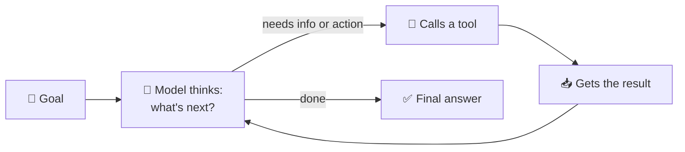
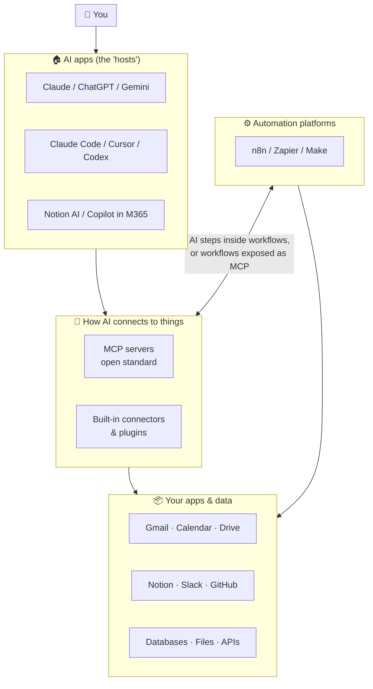

# 01 · The Mental Model: From Chatbot to Teammate 🧠➡️🤖

You already know how to *talk* to an AI. This chapter is about the leap that makes everything else
click: **AI that can act instead of only answering.**

---

## The big shift

A plain chatbot is a brain in a jar. It's brilliant, but it can only work with what you paste in and
can only hand text back to you.

Everything "advanced" in AI right now is about giving that brain **hands, eyes, and a memory**:

| Superpower | What it means | Tech names you'll hear |
|---|---|---|
| 🖐️ **Hands** (tools) | The AI can *do* things: send email, create a Notion page, run code, click buttons | Tool use, function calling, MCP tools, actions |
| 👀 **Eyes** (context) | The AI can *see* your stuff: your files, docs, calendar, codebase, the live web | Connectors, MCP resources, RAG, web search |
| 🧠 **Memory** | The AI remembers across conversations | Projects, memory, `CLAUDE.md`, vector databases |
| 🔁 **Loops** (agency) | The AI works through a multi-step task, checks its own work, and keeps going | Agents, agent loops, agentic workflows |

Put all four together and you have an **agent**: a system that takes a goal, figures out the steps,
uses tools, looks at the results, and repeats until it's done.

## The agent loop, demystified

Every agent you'll meet, whether it's Claude Code, ChatGPT agent, Zapier Agents, an n8n AI Agent node, or
something you build yourself, runs roughly this loop:

That's it. The magic is that **the model decides which tool to call and when.** You describe the
tools ("here's a tool that searches my email; it takes a query"), and the model figures out the rest.

> 💡 **Aha moment:** When an agent "does something," the model itself never touches your
> Gmail. It writes a structured request like `search_email(query="invoice from Acme")`, your software
> runs it, and the result gets fed back in. The model is the planner. The tools do the doing.

## Where all the buzzwords fit

This is the map for the rest of the guide:

There are **two ways AI and automation meet**, and they're worth keeping separate in your head:

1. **AI in the driver's seat** (chat or agent first). You ask Claude something and it reaches out
   through MCP or connectors to act. *Flexible and conversational, but you have to be there to kick it off.*
2. **Automation in the driver's seat** (workflow first). An n8n/Zapier/Make workflow runs on a
   trigger (a new email, 7am every day, a webhook), and AI is **one step** inside it. *Reliable, runs while you
   sleep, and predictable.*

The fun really starts when you **combine them**. Your AI chat can trigger workflows (Zapier MCP,
n8n's MCP Server Trigger), and your workflows can run full agents inside them (n8n's AI Agent node,
Zapier Agents).

## The four levels of "doing more with AI"

Use this to figure out where you are and what's next:

| Level | You're doing… | Try next |
|---|---|---|
| **1. Chatter** | Asking questions, drafting text | Turn on a built-in connector (Google Drive, Notion) → [Ch. 6](../part-2-mcp-and-connectors/06-built-in-connectors.md) |
| **2. Connector** | AI reads and acts on *your* stuff | Add your first MCP servers → [Ch. 4](../part-2-mcp-and-connectors/04-mcp-explained.md), [Ch. 5](../part-2-mcp-and-connectors/05-mcp-server-catalog.md) |
| **3. Automator** | Workflows run without you | Build an n8n/Zapier flow with an AI step → [Ch. 9](../part-3-automation/09-automation-platforms.md) |
| **4. Builder** | You make your own tools and agents | Write an MCP server, use coding agents → [Ch. 17](../part-5-building-with-ai/17-agents-and-coding-tools.md), [example server](../../examples/my-first-mcp-server) |

You don't need to go in order. Plenty of people jump straight to level 4 with Claude Code because
the agent helps them build everything else. 😄

## Three principles that'll save you hours

1. **Context is king.** Most "the AI is dumb" moments are really "the AI couldn't see what I was
   looking at" moments. Connectors, MCP, and memory files all fix this.
2. **Tools are described in plain English.** A tool's name and description *are* its interface for
   the model. Good descriptions make good agents.
3. **Deterministic where you can, AI where you must.** If a step is "move row from A to B," use plain
   automation. Save the AI for fuzzy steps like summarize, classify, extract, decide, and write. This keeps
   things cheap, fast, and reliable.

---

### 🚀 Try this next
Open Claude (or ChatGPT) and turn on **one** connector you actually use, like Google Drive, Gmail, or Notion.
Then ask: *"What are the 3 things I've been working on most this month, based on my recent files?"*
The first time AI answers from **your** data, it clicks.

**Next:** [02 · How Models Really Work (for Power Users) →](02-how-models-really-work.md)
