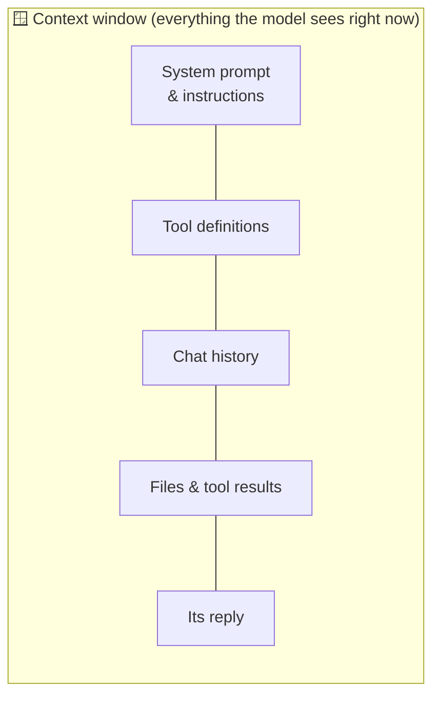

# 02 · How Models Really Work (for Power Users) ⚙️🧠

You don't need a PhD to use AI well, but a handful of under-the-hood concepts explain **almost every
weird thing AI does**. Why it forgets things, why it's confidently wrong, why one model is 20× the price of
another, why "thinking" models are slower. Learn these ten ideas and you'll debug AI like a pro.

---

## 1. Tokens: the atoms of AI 🔤

Models don't read words, they read **tokens**, chunks of text that average about ¾ of an English word.

| Text | Roughly |
|---|---|
| "Hello world" | 2–3 tokens |
| This whole chapter | ~5,000 tokens |
| A 300-page novel | ~120,000 tokens |
| Code, JSON, non-English text | *More* tokens per word |

**Why you care:**
- **Pricing** is per token (input and output priced separately, and output usually costs several times more).
- **Limits** are in tokens (context windows, max output).
- **Weird failures** come from tokens. Counting letters in "strawberry" is hard because the model sees
  `str` + `aw` + `berry`, not individual letters.

## 2. The context window: the model's working memory 🪟

The **context window** is everything the model can "see" at once: system instructions + your conversation
+ attached files + tool results + its own reply. Modern frontier models handle **hundreds of thousands to over a
million tokens**. That's several novels.



**Key insights:**
- **The model has no memory outside the context window.** "Memory" features work by *re-inserting*
  saved notes into the context. Each new chat starts blank unless something puts information back in.
- **Bigger isn't free.** More context costs more, runs slower, and attention can get diluted. A focused 20-page
  excerpt often beats dumping 500 pages.
- **"Lost in the middle"** used to be a big problem. Modern models are much better, but putting the most important
  instructions at the **start** and the **question at the end** still helps.
- **Long agent sessions fill up.** Tools like Claude Code *compact* (summarize) old context automatically. That's
  why a very long session can "forget" early details.

## 3. Next-token prediction (and why hallucinations happen) 🎲

At its core, a model repeatedly predicts **the most plausible next token**. Training on huge amounts of text
makes "plausible" line up with "correct" most of the time, but not always.

**A hallucination is a plausible-sounding guess where no real knowledge exists.** It's most likely when:
- The fact is obscure, recent (after the training cutoff), or very specific (exact citations, URLs, numbers).
- You pressure it with leading questions ("What did Einstein say about TikTok?").
- It has no way to check.

**The fix isn't better wording. It's giving the model ground truth.** Web search, connectors, MCP, and attached
documents let it *look things up* instead of guessing. (That's why Parts II and VI of this manual matter so much.)

## 4. Training cutoff vs. live knowledge 📅

Every model has a **knowledge cutoff**, the date its training data ends. Anything after that, the model
simply doesn't know, unless:
- It has a **web search** tool (most chat apps do now),
- You **paste or attach** the info, or
- A **connector/MCP server** fetches it (e.g., Context7 for current library docs).

> 💡 If a model insists a product doesn't exist or uses an outdated API, it's probably running into its cutoff. Hand it the docs.

## 5. Reasoning ("thinking") models 🤔

Most frontier models can now **think before answering**. They produce hidden or summarized reasoning,
explore approaches, check their work, and *then* respond. This is often called extended thinking, reasoning,
or adaptive thinking.

| | Quick answer mode | Thinking mode |
|---|---|---|
| Speed | Fast | Slower (seconds to minutes) |
| Cost | Lower | Higher (thinking tokens are billed) |
| Great for | Chat, rewriting, simple lookups | Math, code, planning, tricky analysis, agent tasks |

Many apps now pick the thinking depth **automatically**, and many APIs expose an **effort** dial
(low → max). Rule of thumb: crank effort up for hard, high-stakes problems, and turn it down for high-volume simple stuff.

## 6. Temperature & randomness 🌡️

Ask the same question twice and you'll get different answers. That's by design. Models *sample* from
probable next tokens. Some APIs expose a **temperature** control (low = focused and repeatable, high =
creative and varied). Newer reasoning models often manage this internally and don't let you set it.

**Practical upshot:** for anything important, **run it twice** or ask for a self-check. Variation between
answers is a great signal of uncertainty.

## 7. System prompts, roles & the "harness" 🎭

What you type isn't the whole input. Apps wrap your message with:
- A **system prompt** (the app's hidden instructions: personality, rules, formatting),
- **Tool definitions** (what the model can call),
- **Memory/project context**, and
- Sometimes retrieved documents.

That wrapper is called the **harness**, and it's why the *same model* feels different in ChatGPT vs. Cursor vs. Claude Code vs.
n8n. When you build your own agents (Part V), **you** write the harness.

## 8. Tool calling: how AI "does" things 🔧

Tool use is just a special output format. The model is shown a list of tools (name + description +
parameters as JSON Schema), and when it wants to act, it outputs something like:

```json
{ "tool": "create_calendar_event", "input": { "title": "Dentist", "start": "2026-10-02T09:00" } }
```

Your app runs it and sends back the result, and the model continues. **The model never directly touches your
calendar.** Your software does, on its behalf. That makes the app responsible for permissions and safety, which is why
"ask before running" toggles exist.

## 9. Multimodality 👁️🗣️

Modern models natively take **images, PDFs, screenshots, audio, and sometimes video** as input, and
separate models generate images, audio, and video. "Vision" means the model can read charts, handwriting, UI
screenshots, and photos. That's a superpower for debugging ("here's a screenshot of the error"), data entry,
and accessibility.

## 10. Model families & tiers: which brain for which job 🏷️

Every big lab ships a **family** with tiers. Names change often; the *shape* doesn't:

| Tier | Examples (families) | Use for |
|---|---|---|
| 🏆 **Frontier / flagship** | Claude Opus-class and Anthropic's top models, OpenAI's flagship GPT models, Gemini Pro | Hard reasoning, complex code, long agent tasks, high-stakes writing |
| ⚖️ **Workhorse** | Claude Sonnet, GPT "mini"-class, Gemini Flash | The everyday default: fast, smart, affordable |
| ⚡ **Small & fast** | Claude Haiku, "nano"-class models, Gemini Flash-Lite | Classification, extraction, routing, high volume, subagents |
| 🔓 **Open-weight** | Llama, Qwen, DeepSeek, Gemma, Mistral, gpt-oss | Local/private use, fine-tuning, cost control ([Ch. 26](../part-7-local-ai/26-local-and-open-models.md)) |

**How to pick:**
1. Start with the **workhorse** tier. It handles 80% of tasks.
2. If it struggles (wrong answers, sloppy multi-step work), **move up** a tier or raise the effort.
3. If a task runs thousands of times (automations!), **move down** a tier and test that quality holds.
4. Use **leaderboards** (LMArena, Artificial Analysis) as a hint, but your own test on *your* task is the real benchmark ([Ch. 38](../part-10-mastery/38-evaluating-ai.md)).

---

## 🧯 Debugging AI with these ideas

| Symptom | Likely cause | Fix |
|---|---|---|
| "It forgot what I said earlier" | Context got long or compacted, or it's a new chat | Restate the key facts, use memory/project files, start fresh with a summary |
| Confident but wrong facts | Hallucination or training cutoff | Give it search, documents, or connectors, and ask for sources |
| Different answer each time | Sampling randomness | Ask for self-verification, and compare multiple runs |
| Slow and expensive | Thinking or effort too high, huge context | Lower the effort, trim the context, use a smaller model |
| Ignores part of my instructions | Too many competing instructions, buried details | Put priorities first, use clear structure, split into steps |
| Mangles counting or spelling | Tokenization | Ask it to use code (a code-execution tool) for exact counting and math |
| Tool agent flails | Vague tool descriptions, too many tools | Enable fewer tools and describe them clearly |

---

### 🎮 Try this
Ask your AI: *"How many tokens do you estimate this message is, and what's your knowledge cutoff?"*
Then paste a long document and ask a question about a detail **in the middle**. See how it does. Now you
know your tool's limits firsthand.

---

**Next:** [03 · Choosing Your AI Stack →](03-choosing-your-ai-stack.md)
