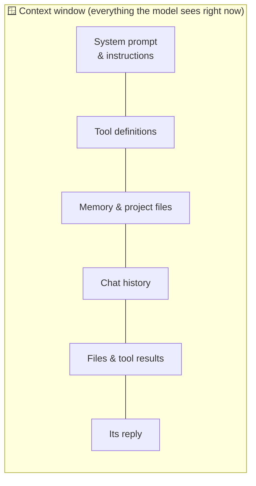

# 02 · How Models Really Work (for Power Users) ⚙️🧠

> ⏱️ 10 min read · 🎯 Beginner-friendly, no math · 🧰 Needs: nothing

**You don't need a PhD to use AI brilliantly, but a dozen under-the-hood ideas explain almost every weird thing AI does:**
why it forgets, why it's confidently wrong, why one model costs 20× another, why "thinking" models are slower, and why the
same model feels different in different apps. Learn these and you'll debug AI like a pro.

<details class="eli5" open>
<summary>🧸 ELI5: This chapter in 30 seconds</summary>

An AI model is a giant guessing machine that read a huge library and learned to guess **the next word** really, really
well. It reads and writes in little word-pieces called **tokens**, it can only "hold" a certain amount in its head at once
(the **context window**), and it only knows what was in the library when it stopped reading (the **cutoff**). When it
doesn't know something, it may *guess confidently*, which is why giving it real sources and tools matters so much.

</details>

<!-- in-this-chapter -->

## 🏫 How a model is made (three schools)

<details class="eli5">
<summary>🧸 ELI5</summary>

First the model reads almost everything (like a kid reading a whole library). Then it goes to "manners school" to learn to
be a helpful assistant. Then it practices with a coach who rewards good answers and good reasoning.

</details>

| Stage | What happens | What it gives the model |
|---|---|---|
| 📚 **Pre-training** | Reads a massive amount of text (and images, code…) and learns to predict what comes next | Knowledge, language, reasoning patterns, world facts (up to a cutoff) |
| 🎓 **Instruction tuning** | Trained on examples of good assistant behavior: questions → great answers | Follows instructions, chats helpfully, uses formats |
| 🏋️ **Reinforcement learning** (from human feedback, AI feedback, and verifiable rewards) | Practices tasks and gets rewarded for good results (correct math, passing tests, helpful and safe answers) | Better reasoning, tool use, coding, honesty, safety |

The last stage is where a lot of 2024–2026 progress came from. Models practiced on tasks with checkable answers (does the
code pass the tests? is the math right?) and learned to reason step by step and use tools reliably.

## 🔤 Tokens: the atoms of AI

<details class="eli5">
<summary>🧸 ELI5</summary>

The AI doesn't read letters or whole words. It reads LEGO-brick-sized pieces of words called tokens. "Unbelievable" might
be three bricks: "un", "believ", "able".

</details>

Models read and write **tokens**, chunks averaging about ¾ of an English word.

| Text | Roughly |
|---|---|
| "Hello world" | 2–3 tokens |
| A one-page email | ~400 tokens |
| This chapter | ~6,000 tokens |
| A 300-page novel | ~120,000 tokens |
| Code, JSON, emoji, non-English text | *More* tokens per word |

**Why you care:**

- **Pricing** is per token (input and output priced separately, and output usually costs several times more).
- **Limits** are in tokens (context window, max output length).
- **Weird failures** come from tokens. Counting the r's in "strawberry" is hard because the model sees chunks like
  `str` + `aw` + `berry`, not letters. (The fix is to let it use a code tool.)

## 🪟 The context window: the model's working memory

<details class="eli5">
<summary>🧸 ELI5</summary>

The context window is the AI's desk. Everything it's working on right now has to fit on the desk: your messages, the
files, the instructions. When the desk overflows, older papers fall off or get squished into summaries.

</details>

The **context window** is everything the model can "see" at once: system instructions + tool descriptions + your
conversation + attached files + tool results + its own reply. Modern frontier models handle **hundreds of thousands to
over a million tokens**. That's several novels.



**Key insights:**

- **The model has no memory outside the context window.** "Memory" features work by *putting saved notes back in*. A new
  chat starts blank unless something re-inserts information.
- **Bigger isn't free.** More context costs more, runs slower, and can dilute attention. A focused 20-page excerpt often
  beats 500 pages dumped in.
- **Put key instructions first and the question last.** Modern models handle long context well, but structure still helps.
- **Long agent sessions fill up.** Tools like Claude Code *compact* (summarize) old context automatically, which is why a
  very long session can "forget" early details. Start fresh sessions for fresh tasks.

## 🎲 Next-token prediction (and why hallucinations happen)

<details class="eli5">
<summary>🧸 ELI5</summary>

The AI is always playing "guess the next word." Most of the time its guesses are right because it read so much. But if
you ask about something it never read, it still guesses, and a confident guess can be totally wrong. That's a hallucination.

</details>

At its core, a model repeatedly predicts **the most plausible next token**. Training on huge amounts of text makes
"plausible" line up with "correct" most of the time, but not always.

**A hallucination is a plausible-sounding guess where no real knowledge exists.** It's most likely when:

- The fact is obscure, recent (after the cutoff), or very specific (exact citations, URLs, quotes, numbers).
- You ask leading questions ("What did Einstein say about TikTok?").
- It has no way to check.

**The fix isn't clever wording. It's ground truth.** Web search, connectors, MCP and attached documents let it *look things
up* instead of guessing, and asking for citations lets *you* check. That's why Parts II and VI of this manual matter so much.

> [!NOTE]
> **🤯 Fun fact: modern models are much better at saying "I don't know"**
> Newer models are explicitly trained to be calibrated: to express uncertainty and decline to invent facts. You can help
> by saying *"If you're not sure, say so."* It genuinely changes behavior.

## 📅 Training cutoff vs. live knowledge

<details class="eli5">
<summary>🧸 ELI5</summary>

The AI read its library up to a certain day and then stopped. Anything that happened after that, it doesn't know, unless
you let it read the news (search) or hand it the new pages yourself.

</details>

Every model has a **knowledge cutoff**. After that date it simply doesn't know things, unless:

- It has a **web search** tool (most chat apps do),
- You **paste or attach** the information, or
- A **connector or MCP server** fetches it (e.g., the Context7 server for current library docs).

> 💡 If a model insists a product doesn't exist or uses an outdated API, it's probably running into its cutoff. Hand it the docs.

## 🤔 Reasoning ("thinking") models

<details class="eli5">
<summary>🧸 ELI5</summary>

Some AIs can "think before they talk," like when you work out a math problem on scrap paper before saying the answer.
It takes a bit longer but gets hard problems right much more often.

</details>

Most frontier models can now **think before answering**. They produce hidden or summarized reasoning, explore approaches,
check their work, and *then* respond.

| | ⚡ Quick answer mode | 🧠 Thinking mode |
|---|---|---|
| Speed | Fast | Slower (seconds to minutes) |
| Cost | Lower | Higher (thinking tokens are billed) |
| Great for | Chat, rewriting, simple lookups | Math, code, planning, tricky analysis, agent tasks |

Many apps pick the thinking depth **automatically** ("adaptive thinking"), and many APIs expose an **effort** dial (low →
max). Crank it up for hard, high-stakes problems, and turn it down for high-volume simple stuff.

## 🌡️ Randomness & variation

<details class="eli5">
<summary>🧸 ELI5</summary>

Ask the AI the same question twice and it might answer a little differently, like a person telling the same story two
ways. That's normal, and it's also a clue: if the answers disagree a lot, it's probably unsure.

</details>

Models *sample* from probable next tokens, so outputs vary. Some APIs expose a **temperature** control (low = focused and
repeatable, high = creative and varied). Many newer reasoning models manage this internally and don't let you set it.

**Practical upshot:** for anything important, **run it twice** or ask for a self-check. Disagreement between runs is a great
uncertainty signal. For automations that need consistency, ask for **structured output** (JSON with fixed fields).

## 🎭 System prompts, roles & the "harness"

<details class="eli5">
<summary>🧸 ELI5</summary>

The app you use whispers secret instructions to the AI before you even say hi: "be friendly, use these tools, format like
this." That's why the same brain feels different in different apps.

</details>

What you type isn't the whole input. Apps wrap your message with:

- A **system prompt** (the app's standing instructions: personality, rules, formatting),
- **Tool definitions** (what the model can call),
- **Memory and project context**,
- **Retrieved documents** (search results, file snippets).

That wrapper is called the **harness**, and it's why the *same model* feels different in ChatGPT, Cursor, Claude Code or
n8n. When you build your own agents ([Part V](../part-5-building-with-ai/index.md)), **you** write the harness. When you
write project instructions or a `CLAUDE.md`, you're adding to it.

## 🔧 Tool calling: how AI "does" things

<details class="eli5">
<summary>🧸 ELI5</summary>

The AI can't press buttons itself. It writes a note saying "please press the calendar button with these details," and the
app presses it and tells the AI what happened.

</details>

Tool use is just a special output format. The model is shown a list of tools (name + description + parameters as JSON
Schema), and when it wants to act, it outputs something like:

```json
{ "tool": "create_calendar_event", "input": { "title": "Dentist", "start": "2026-10-02T09:00" } }
```

Your app runs it and sends back the result, and the model continues. **The model never directly touches your calendar.**
That makes the app responsible for permissions and safety, which is why "ask before running" toggles exist.

## 👁️ Multimodality: seeing and hearing

<details class="eli5">
<summary>🧸 ELI5</summary>

Modern AI doesn't just read words. It can look at pictures, screenshots and charts, and some can listen to audio and watch
videos. You can show it a photo and ask "what's this?"

</details>

Modern models natively take **images, PDFs, screenshots, audio, and sometimes video** as input, and separate models
*generate* images, audio and video. That's a superpower for:

- **Debugging:** "Here's a screenshot of the error."
- **Data entry:** receipts, forms, whiteboards, handwriting.
- **Everyday life:** "What's wrong with this plant?" 🌱
- **Accessibility:** describing images, reading documents aloud ([Accessibility & AI](../part-9-ai-for-life-and-work/70-accessibility-and-ai.md)).

## 🏷️ Model families & tiers: which brain for which job

<details class="eli5">
<summary>🧸 ELI5</summary>

AI companies make big, medium and small brains. Big brains are smartest but slowest and priciest. Small brains are fast
and cheap, which is perfect for simple jobs done thousands of times.

</details>

Every big lab ships a **family** with tiers. Names change often, but the *shape* doesn't:

| Tier | Examples (families) | Use for |
|---|---|---|
| 🏆 **Frontier / flagship** | Claude Opus-class and Anthropic's top models, OpenAI's flagship GPT models, Gemini Pro | Hard reasoning, complex code, long agent tasks, high-stakes writing |
| ⚖️ **Workhorse** | Claude Sonnet, GPT "mini"-class, Gemini Flash | The everyday default: fast, smart, affordable |
| ⚡ **Small & fast** | Claude Haiku, "nano"-class models, Gemini Flash-Lite | Classification, extraction, routing, high volume, subagents |
| 🔓 **Open-weight** | Llama, Qwen, DeepSeek, Gemma, Mistral, gpt-oss | Local and private use, fine-tuning, cost control ([Local & Open Models](../part-7-local-ai/47-local-and-open-models.md)) |

**How to pick:**

1. Start with the **workhorse** tier. It handles most tasks beautifully.
2. If it struggles (wrong answers, sloppy multi-step work), **move up** a tier or raise the effort.
3. If a task runs thousands of times (automations!), **move down** a tier and test that quality holds.
4. Use **leaderboards** as a hint, but your own test on *your* task is the real benchmark ([Evaluating & Comparing AI](../part-10-mastery/74-evaluating-ai.md)).

## 🧯 Debugging AI with these ideas

<details class="eli5">
<summary>🧸 ELI5</summary>

When the AI acts weird, check this list: it's usually forgetting (desk too full), guessing (no source), randomness, or
too many instructions at once.

</details>

| Symptom | Likely cause | Fix |
|---|---|---|
| "It forgot what I said earlier" | Context got long or compacted, or it's a new chat | Restate key facts, use memory or project files, start fresh with a summary |
| Confident but wrong facts | Hallucination or training cutoff | Give it search, documents or connectors, and ask for sources |
| Different answer each time | Sampling randomness | Ask for self-verification, compare runs, use structured output |
| Slow and expensive | Thinking or effort too high, huge context | Lower the effort, trim the context, use a smaller model |
| Ignores part of your instructions | Too many competing instructions, buried details | Put priorities first, use clear structure, split into steps |
| Mangles counting or spelling | Tokenization | Ask it to use a code tool for exact counting and math |
| A tool agent flails | Vague tool descriptions, too many tools | Enable fewer tools and describe them clearly |
| Refuses a harmless request | Over-cautious interpretation | Add context about your legitimate goal, or rephrase more specifically |

## 🎯 Key takeaways

- Models are **next-token predictors** trained in stages: reading, manners, then coached practice.
- **Tokens** drive cost and limits, and the **context window** is the model's entire working memory.
- **Hallucinations** are confident guesses. Fix them with **ground truth** (search, docs, tools) and citations.
- **Thinking** trades speed for accuracy, so use it where it matters.
- The **harness** (system prompt + tools + memory) is why the same model feels different in different apps.
- Pick model **tiers** by task: workhorse by default, up for hard, down for high volume.

## 🧠 Check yourself

<details class="quiz">
<summary>❓ 1. Why can't a model remember last week's chat unless the app has "memory"?</summary>

The model only sees its **context window**. Memory features work by re-inserting saved notes into that window.

</details>

<details class="quiz">
<summary>❓ 2. What's the most reliable way to reduce hallucinations?</summary>

Give it **ground truth**: web search, attached documents, or connectors. Also ask for citations and permit "I don't know."

</details>

<details class="quiz">
<summary>❓ 3. You're classifying 10,000 support emails. Which model tier do you try first?</summary>

A **small, fast** tier (or workhorse), after testing quality on a sample. Frontier models are overkill and expensive
for simple classification at volume.

</details>

<details class="quiz">
<summary>❓ 4. Why does the same model feel different in Cursor and in ChatGPT?</summary>

Different **harnesses**: each app adds its own system prompt, tools, memory and formatting around the model.

</details>

> [!TIP]
> **🎮 Try this**
> Ask your AI: *"Estimate how many tokens this message is, and what's your knowledge cutoff?"* Then paste a long document
> and ask about a detail **in the middle**. Finally, ask the same tricky question twice and compare. You now know your
> tool's limits firsthand, and that's a real power-user skill. 🧠

---

**Next:** [03 · A Short, Fun History of Modern AI →](03-a-short-history-of-ai.md)
