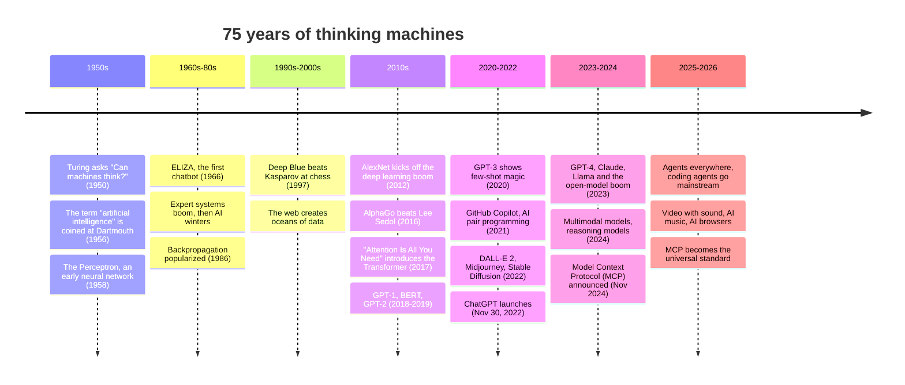

# 03 · A Short, Fun History of Modern AI 📜✨

> ⏱️ 8 min read · 🎯 Everyone · 🧰 Needs: a cozy chair

**AI didn't appear out of nowhere in 2022.** It's a 75-year story of big dreams, "AI winters," surprise breakthroughs, and
one very important research paper. Knowing the story makes today's tools less magical and more understandable, and it
helps you spot hype versus real progress.

🧸 ELI5: This chapter in 30 seconds

People have dreamed of thinking machines since the 1950s. For a long time, computers were too slow and too dumb, so AI
kept going through "winters" when people gave up. Then computers got super fast, the internet gave us tons of data, and
in 2017 someone invented a new kind of brain design called the **Transformer**. Feed a Transformer the whole internet and
you get ChatGPT, Claude and friends. Now AIs don't just chat: they use tools and work like helpers.

<!-- in-this-chapter -->

## 🕰️ The whole story on one timeline

🧸 ELI5

Here's the story as a picture, from the first idea to today. Each dot is a big moment.

## 🌱 The dreamers (1950s–1960s)

🧸 ELI5

A long time ago, clever people wondered if computers could think like us. They were super excited and thought it would
take about a summer to figure out. (It took about 70 years. 😅)

- **1950:** Alan Turing publishes *"Computing Machinery and Intelligence,"* proposing the **imitation game**, later called
  the Turing test: if you can't tell a machine from a human in conversation, does it matter whether it "thinks"?
- **1956:** The **Dartmouth workshop** coins the term *artificial intelligence*. The proposal optimistically suggested that
  significant progress could be made in a single summer.
- **1958:** Frank Rosenblatt's **Perceptron**, a tiny "neural network" inspired by brain cells, learns to recognize simple
  patterns. Newspapers got very excited about machines that would soon walk, talk and be conscious.
- **1966:** Joseph Weizenbaum's **ELIZA** imitates a therapist using simple pattern-matching ("Tell me more about your mother").
  People got emotionally attached to it anyway.

> [!NOTE]
> **🤯 Fun fact: the "ELIZA effect"**
> Weizenbaum was startled that people confided in a program he knew was just shuffling their words back at them. The
> **ELIZA effect**, our tendency to see understanding where there's only pattern-matching, is still worth remembering today.

## ❄️ Winters and expert systems (1970s–1990s)

🧸 ELI5

The early AI couldn't live up to the hype, so money and excitement dried up: an "AI winter." Then people tried writing
down every rule by hand ("if the patient has a fever, then…"). That helped a bit but got messy, and winter came again.

- **AI winters:** overpromising led to funding cuts in the 1970s and again in the late 1980s.
- **Expert systems** tried to capture human expertise as thousands of hand-written *if-then* rules. They worked in narrow
  areas (like configuring computers or diagnosing infections), but were brittle and expensive to maintain.
- Quietly, the ideas that would win later kept developing: **backpropagation** (how neural networks learn, popularized in
  1986), **LSTMs** (1997, for sequences), and statistical machine learning.
- **1997:** IBM's **Deep Blue** beats world chess champion Garry Kasparov, though mostly through brute-force search rather
  than learning.

**The lesson:** hand-writing intelligence doesn't scale. *Learning* it from data does.

## 🔥 The deep learning boom (2010s)

🧸 ELI5

Three things arrived at once: tons of pictures and text on the internet, super-fast graphics chips from video games, and
better recipes for training neural networks. Suddenly computers got really good at seeing and hearing.

The recipe that changed everything: **big data** (the internet) + **big compute** (GPUs built for video games) + **better
neural networks**.

- **2012:** **AlexNet** crushes the ImageNet image-recognition competition using deep neural networks on GPUs. The deep
  learning era begins.
- **2013–2014:** **word2vec** turns words into meaningful vectors (the ancestor of embeddings, see
  [Embeddings & Vector Databases](../part-6-knowledge-and-memory/42-embeddings-and-vector-databases.md)), and **GANs** start generating images.
- **2016:** DeepMind's **AlphaGo** beats Go champion Lee Sedol. Its famous **"move 37"** looked like a mistake to experts
  and turned out to be brilliant: a machine showing something like creativity.
- Speech recognition, translation and photo search quietly get dramatically better in everyday apps.

## ⚡ The Transformer changes everything (2017)

🧸 ELI5

In 2017, researchers invented a new brain design called the Transformer. Its trick, "attention," lets it look at *all*
the words in a sentence at once and figure out which ones matter to each other. It was fast to train on huge amounts of
text, and it became the engine inside basically every modern AI.

In June 2017, a Google research paper with the delightfully confident title **"Attention Is All You Need"** introduced the
**Transformer**.

Why it mattered:

- **Attention:** every word can "look at" every other word to understand context ("bank" near "river" vs. near "money").
- **Parallelism:** unlike older sequence models, Transformers train efficiently on GPUs at enormous scale.
- **Generality:** the same architecture turned out to work for text, code, images, audio, video, even protein structures.

Nearly every model in this manual, including Claude, GPT, Gemini, Llama and Qwen, is a descendant of that paper.

## 📈 Scale is (almost) all you need (2018–2022)

🧸 ELI5

People discovered that if you make Transformers bigger and feed them more text, they keep getting smarter, sometimes
learning surprising new skills nobody taught them directly.

- **2018:** OpenAI's **GPT-1** and Google's **BERT** show that pre-training on lots of text, then adapting, works wonders.
- **2019:** **GPT-2** writes surprisingly coherent paragraphs, and its full release was initially staged over misuse concerns.
- **2020:** **GPT-3** (175 billion parameters) can do new tasks from just a few examples in the prompt ("few-shot
  learning"). **Scaling laws** research shows performance improves predictably with more data, parameters and compute.
- **2021:** **GitHub Copilot** brings AI pair programming to millions of developers, and **DALL-E** generates images from text.
- **2022:** Image generation explodes with **DALL-E 2**, **Midjourney** and the open-source **Stable Diffusion**. Then, on
  **November 30, 2022**, **ChatGPT** launches and becomes one of the fastest-growing consumer apps in history.

> [!NOTE]
> **🤯 Fun fact: the chat interface was the breakthrough**
> The model behind the first ChatGPT wasn't dramatically different from what researchers already had. What changed
> everything was **instruction tuning + human feedback + a friendly chat box**. Sometimes the interface *is* the innovation.

## 🌍 The Cambrian explosion (2023–2024)

🧸 ELI5

After ChatGPT, everyone raced to build AI. Lots of companies made their own smart chatbots, some gave their models away
for free, and AIs learned to see pictures, hear voices, and think step by step.

- **2023:** **GPT-4** (March) raises the bar. Anthropic launches **Claude**. Meta's **Llama** models kick off an
  **open-weight** boom, and soon anyone can run capable models locally ([Local & Open Models](../part-7-local-ai/47-local-and-open-models.md)).
  Tool use and "plugins" appear. Context windows grow from a few thousand tokens to hundreds of thousands.
- **2024:** **Multimodal** becomes normal (models that see, hear and speak in real time). Claude gets **Artifacts** for
  building interactive things in chat. **Reasoning models** that "think before answering" arrive (OpenAI's o1 in September).
  And in **November 2024**, Anthropic open-sources the **Model Context Protocol**: the USB-C port for AI.

## 🤖 The age of agents (2025–2026)

🧸 ELI5

Now AIs don't just talk. They do jobs: write and test code for hours, browse websites, organize files, make videos with
sound, and connect to thousands of apps through MCP. That's the world this manual teaches you to play in.

- **Open reasoning models** (DeepSeek-R1 in January 2025) show frontier-level reasoning can be open-weight and efficient.
- **Coding agents go mainstream:** Claude Code (early 2025), then agents in Cursor, VS Code, Codex and more. Developers
  delegate whole features, and non-developers start **vibe coding** their own apps.
- **New frontier generations** from every major lab: Claude 4 and later, GPT-5, Gemini 3, and rapid-fire updates after.
- **Creative AI levels up:** video models generate **sound and dialogue** together, image models get great at editing and
  text, and AI music becomes genuinely catchy.
- **Agents browse and click:** AI browsers and computer-use agents operate websites for you
  ([Computer Use & Browser Agents](../part-5-building-with-ai/40-computer-use-and-browser-agents.md)).
- **MCP becomes the universal standard:** adopted across ChatGPT, Gemini, Copilot, IDEs and automation tools, with an
  official registry and, in **July 2026**, a stateless spec built for web scale.

## 🧭 What history teaches us

🧸 ELI5

The story teaches three things: people always overhype the next few months, underestimate the next ten years, and the big
wins come from lots of data + fast computers + good recipes, not magic.

1. **Hype cycles are real.** Every era overpromised in the short term. Be excited, and be skeptical of "next month
   everything changes" claims.
2. **Learning beats hand-coding.** From expert systems to deep learning, the systems that *learn from data* won.
3. **Compute + data + algorithms compound.** Progress came from all three improving together.
4. **Interfaces unlock adoption.** Chat boxes, then tools, then agents: each new interface made the same underlying tech
   far more useful.
5. **The long run is bigger than we expect.** The 1956 dream took ~70 years, and it arrived faster at the end than anyone
   predicted. You're living in the payoff era. 🚀

## 🎯 Key takeaways

- AI is a **75-year story**: early dreams, winters, a deep learning boom, the **Transformer** (2017), scale, and now agents.
- **ChatGPT (2022)** made AI mainstream mostly through a better *interface* (chat + instruction tuning).
- **2024–2026** brought multimodal models, reasoning models, open-weight models, coding agents, and **MCP**.
- History says: stay curious, discount short-term hype, and bet on long-term change.

## 🧠 Check yourself

❓ 1. What 2017 invention sits inside almost every modern AI model?

The **Transformer** (from the paper "Attention Is All You Need").

❓ 2. Why did expert systems eventually lose out?

Hand-writing thousands of rules was **brittle and didn't scale**. Systems that *learn* from data generalized far better.

❓ 3. What three ingredients fueled the deep learning boom?

**Big data** (the internet), **big compute** (GPUs), and **better neural network methods**.

❓ 4. When was MCP introduced, and why does it matter?

**November 2024.** It's the open standard that lets any AI app plug into any tool or data source, the foundation for agents
that act.

> [!TIP]
> **🎮 Try this**
> Ask your AI to role-play ELIZA: *"Pretend to be the 1966 ELIZA program. Only use its simple reflection tricks."* Chat
> for two minutes, then switch: *"Now answer as yourself."* Feeling the 60-year leap firsthand is surprisingly moving. 🤖💜

---

**Next:** [04 · The AI Landscape →](04-the-ai-landscape.md)
