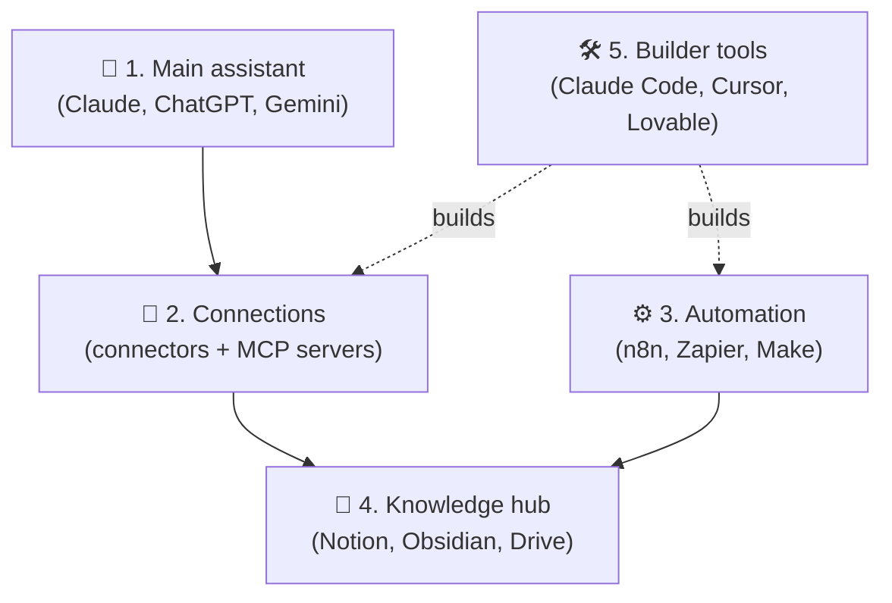

# 03 · Choosing Your AI Stack 🧱

There are *thousands* of AI tools, and you need maybe **five**. This chapter helps you build a small,
powerful personal stack that fits your goals and budget, without subscription sprawl.

---

## The five layers of a personal AI stack

| Layer | Job | Pick |
|---|---|---|
| 🧠 **Main assistant** | Daily thinking partner, research, writing | **One** paid plan, maybe two |
| 🔌 **Connections** | Let the assistant see and act on your stuff | Built-in connectors + a few MCP servers |
| ⚙️ **Automation** | Things that run without you | One platform |
| 🏡 **Knowledge hub** | Where your info lives | One home base |
| 🛠️ **Builder tools** | Make your own tools and apps | Optional, but the most fun 😄 |

---

## Choosing your main assistant

All the big assistants are excellent now. Choose based on **where you live** and **what you do most**:

| If you… | Lean toward | Why |
|---|---|---|
| Write a lot, code, want deep MCP/agent power | **Claude** | Top-tier writing and coding, MCP's home turf, Projects, Artifacts, Claude Code included on paid plans |
| Want the biggest all-rounder ecosystem, voice, and images | **ChatGPT** | Huge feature set, image gen, voice, agent mode, plugins |
| Live in Gmail/Docs/Drive/Android | **Gemini** | Deepest Google Workspace integration, NotebookLM, long video understanding |
| Live in Outlook/Teams/Office | **Microsoft 365 Copilot** | Works across your M365 data |
| Mostly research with citations | **Perplexity** | Search-first answers with sources |

> 💡 **Pro tip:** Many power users keep **one paid main assistant** and use the free tiers of others
> for second opinions. Asking two models the same hard question is a cheap way to catch mistakes.

## Subscriptions vs. API: the big money question 💳

| | 📦 Subscription (Pro, Plus, Max…) | 🔑 API (pay per token) |
|---|---|---|
| Pricing | Flat monthly | Pay for exactly what you use |
| Best for | Chatting, research, coding agents you drive | Automations, your own apps and scripts |
| Surprise bills? | Never (you hit usage limits instead) | Possible, so set spend limits! |
| Needed for | Using the apps | n8n/Zapier AI steps, custom agents, scripts |

**Most people need both eventually:** a subscription for daily use, plus an API key with a **low monthly
spend limit** for automations. Small automations often cost pennies a day.

## Starter stacks by persona 🎭

### 🌱 The Curious Explorer ($0–20/mo)
- **Assistant:** Free tiers → one paid plan when you hit limits
- **Connections:** Built-in connectors (Drive, Gmail, Notion)
- **Knowledge:** Google Drive or Notion free
- **Extras:** NotebookLM (free), Perplexity free

### 🧑‍💼 The Productivity Maximizer (~$20–50/mo)
- **Assistant:** Claude or ChatGPT paid
- **Connections:** Connectors + Zapier MCP
- **Automation:** Zapier (free/starter) *or* self-hosted n8n
- **Knowledge:** Notion with AI
- **Extras:** Wispr Flow for dictation, Granola for meetings

### 🛠️ The Builder (~$20–100+/mo)
- **Assistant + coding:** Claude (Pro/Max) with **Claude Code**, or Cursor
- **Connections:** GitHub, Playwright, Context7, database MCPs
- **Automation:** n8n self-hosted (free) + API keys with spend limits
- **Knowledge:** Obsidian or Notion + a Git repo
- **Hosting:** Vercel, Supabase, or Cloudflare free tiers

### 🔒 The Privacy-First Tinkerer ($0 + hardware)
- **Assistant:** Ollama + Open WebUI locally ([Ch. 27](../part-7-local-ai/27-home-lab.md)), plus a frontier model for hard problems
- **Automation:** n8n self-hosted pointed at local models
- **Knowledge:** Obsidian (local Markdown)
- **Extras:** Whisper for local transcription

### 🎨 The Creator (~$30–80/mo)
- **Assistant:** ChatGPT or Claude
- **Images:** Midjourney or Ideogram, plus Canva
- **Video/audio:** Runway or Veo, ElevenLabs, Suno, CapCut/Descript
- **Automation:** Make or Zapier for content repurposing

### 🏪 The Small Business Owner (~$50–150/mo)
- **Assistant:** a team plan (Claude Team / ChatGPT Business / Gemini for Workspace)
- **Connections:** CRM + email + calendar connectors
- **Automation:** Zapier or Make with human-approval steps
- **Customer-facing:** a support chatbot on your docs ([Ch. 34](../part-9-ai-for-life-and-work/34-small-business.md))

## Evaluating any new AI tool in 5 minutes ⏱️

Before adding a tool, ask:
1. **What job does it do that my stack can't?** (If the answer is "it's a wrapper around a model I already pay for," skip it.)
2. **Does it connect?** MCP, API, Zapier/n8n integration, export. Walled gardens get messy.
3. **Where does my data go?** Retention, training use, and where it's stored.
4. **What's the exit plan?** Can I export everything?
5. **Is it alive?** Recent updates and an active community.

## Avoiding "tool sprawl" 🕸️
- **Audit quarterly.** List all your AI subscriptions and cancel anything you haven't used in 30 days.
- **Prefer platforms over point tools.** One assistant with connectors beats five single-purpose apps.
- **Learn deeply before switching.** The person who masters one tool beats the one who samples twenty.

---

### 🎮 Try this
Draw your current stack on paper using the five layers. Circle the **weakest layer**, and that's the chapter
of this manual to read next. (No automation? [Part III](../part-3-automation/09-automation-platforms.md). No
connections? [Part II](../part-2-mcp-and-connectors/04-mcp-explained.md).)

---

**Next:** [04 · MCP Explained →](../part-2-mcp-and-connectors/04-mcp-explained.md)
