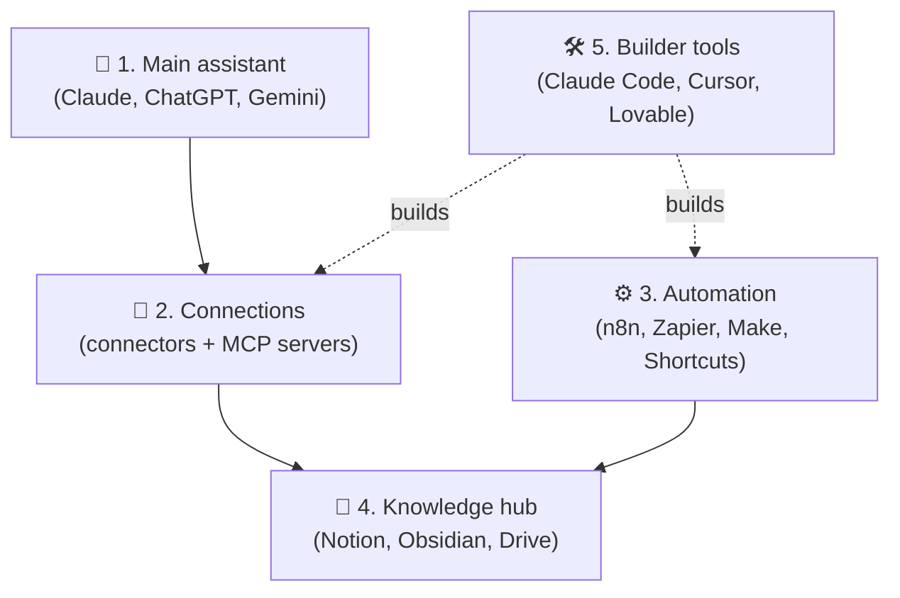
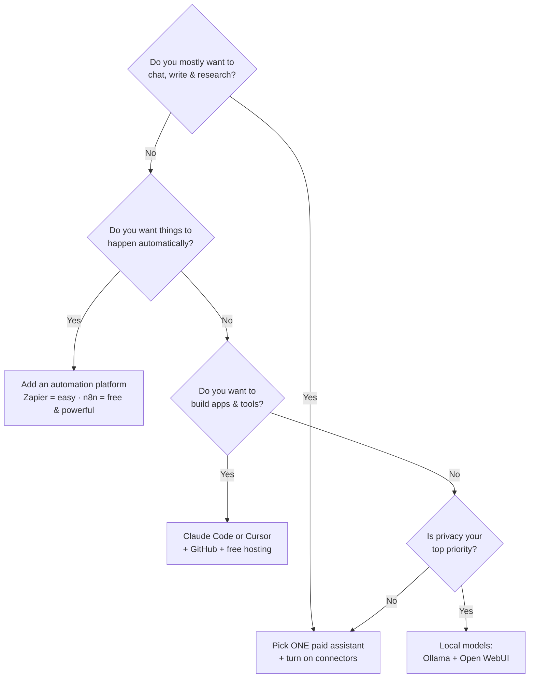

# 06 · Choosing Your AI Stack 🧱💳

> ⏱️ 7 min read · 🎯 Everyone · 🧰 Needs: a rough idea of your budget and goals

**There are thousands of AI tools, and you need maybe five.** This chapter helps you build a small, powerful personal AI
stack that fits your goals, habits and budget, without drowning in subscriptions. You'll leave with a filled-in stack
worksheet and a clear "what to try next."

<details class="eli5" open>
<summary>🧸 ELI5: This chapter in 30 seconds</summary>

You don't need every toy in the toy store. You need **one great main helper** (like Claude or ChatGPT), a way to **plug it
into your stuff**, maybe **one robot for chores** (automation), a **place to keep your notes**, and if you like building,
**a builder tool**. Pick those five well and you're set.

</details>

<!-- in-this-chapter -->

## 🧱 The five layers of a personal AI stack

<details class="eli5">
<summary>🧸 ELI5</summary>

Five slots to fill: the brain you chat with, the plugs to your apps, the chore robot, your notes home, and (optionally) your
builder toolbox.

</details>



| Layer | Job | How many you need |
|---|---|---|
| 🧠 **Main assistant** | Daily thinking partner, research, writing | **One** paid plan (maybe two) |
| 🔌 **Connections** | Let the assistant see and act on your stuff | A handful of connectors and MCP servers |
| ⚙️ **Automation** | Things that run without you | One platform |
| 🏡 **Knowledge hub** | Where your information lives | One home base |
| 🛠️ **Builder tools** | Make your own tools and apps | Optional, and the most fun 😄 |

## 🧠 Choosing your main assistant

<details class="eli5">
<summary>🧸 ELI5</summary>

All the big AI helpers are great now. Pick the one that fits where you already spend your day, and what you do most.

</details>

| If you… | Lean toward | Why |
|---|---|---|
| Write a lot, code, want deep MCP and agent power | **Claude** | Superb writing and coding, MCP's home turf, Projects, Artifacts, Claude Code on paid plans |
| Want the broadest all-rounder with voice and images | **ChatGPT** | Huge feature set, image generation, voice, agent mode, plugins |
| Live in Gmail, Docs, Drive or Android | **Gemini** | Deep Google integration, NotebookLM, strong with long video and documents |
| Live in Outlook, Teams or Office | **Microsoft 365 Copilot** | Works across your work data |
| Mostly research with citations | **Perplexity** | Search-first answers with sources |
| Want privacy above all | **Local models** | Nothing leaves your machine ([Part VII](../part-7-local-ai/index.md)) |

> [!TIP]
> **💡 The two-assistant trick**
> Many power users keep **one paid main assistant** and use a second one's free tier for **second opinions** on important
> questions. When two models agree, confidence goes up. When they disagree, you've found the tricky part.

## 💳 Subscriptions vs. API (the money question)

<details class="eli5">
<summary>🧸 ELI5</summary>

A subscription is like an all-you-can-eat buffet with a fair-use limit: one price per month. The API is like ordering à la
carte: you pay for exactly what you eat, which is perfect for robots and apps but needs a spending limit.

</details>

| | 📦 Subscription (Pro, Plus, Max…) | 🔑 API (pay per token) |
|---|---|---|
| Pricing | Flat monthly | Pay for exactly what you use |
| Best for | Chatting, research, coding agents you drive yourself | Automations, your own apps, scripts, bots |
| Surprise bills? | Never (you hit usage limits instead) | Possible, so **set spend limits**! |
| Needed for | Using the apps | n8n/Zapier AI steps, custom agents, API projects |

**Most people eventually use both:** a subscription for daily life, plus an API key with a **low monthly spend limit** for
automations. Small automations often cost cents per day. See [Cost Optimization](../part-10-mastery/75-cost-optimization.md).

## 🎭 Starter stacks by persona

<details class="eli5">
<summary>🧸 ELI5</summary>

Here are ready-made toolkits for different kinds of people. Find the one that sounds like you and copy it.

</details>

### 🎓 The Student
- **Assistant:** a free tier, or the student discount of one paid plan
- **Learning:** NotebookLM (free), study/learning modes ([Research & Learning](../part-9-ai-for-life-and-work/60-research-and-learning.md))
- **Notes:** Obsidian or Notion (free plans)
- **Extras:** Anki flashcards (AI-generated), a dictation app for lecture notes

### 🏡 The Busy Household
- **Assistant:** one paid plan shared carefully, or free tiers
- **Connections:** Google/Apple calendar, shared family notes
- **Automation:** iOS Shortcuts or Google Home routines ([Phone & Desktop Automation](../part-3-automation/19-phone-and-desktop-automation.md))
- **Extras:** meal planning Project, receipt scanning, homework helper with learning mode

### 🧑‍💼 The Productivity Maximizer (~$20–50/mo)
- **Assistant:** Claude or ChatGPT paid
- **Connections:** email, calendar, Drive or SharePoint, Slack
- **Automation:** Zapier (starter) *or* self-hosted n8n
- **Knowledge:** Notion with AI
- **Extras:** an AI meeting notetaker, dictation (Wispr Flow or similar)

### 🛠️ The Builder (~$20–100+/mo)
- **Assistant + coding:** Claude (Pro/Max) with **Claude Code**, and/or Cursor
- **Connections:** GitHub, Playwright, Context7, database MCP servers
- **Automation:** self-hosted n8n + API keys with spend limits
- **Knowledge:** Obsidian or Notion + Git repos
- **Hosting:** free tiers of Vercel, Supabase, Cloudflare ([Deploying & Hosting](../part-5-building-with-ai/35-deploying-and-hosting.md))

### 🔒 The Privacy-First Tinkerer ($0 + hardware)
- **Assistant:** Ollama + Open WebUI at home ([The AI Home Lab](../part-7-local-ai/49-home-lab.md)), plus a frontier model only for non-sensitive hard problems
- **Automation:** self-hosted n8n pointed at local models
- **Knowledge:** Obsidian (local Markdown)
- **Extras:** local Whisper transcription, Tailscale for private remote access

### 🎨 The Creator (~$30–80/mo)
- **Assistant:** ChatGPT or Claude
- **Visuals:** Midjourney or Ideogram, plus Canva
- **Video & audio:** a video model, ElevenLabs, Suno, CapCut or Descript
- **Automation:** Make or Zapier for repurposing content ([Writing & Content](../part-9-ai-for-life-and-work/61-writing-and-content.md))

### 🏪 The Small Business Owner (~$50–150/mo)
- **Assistant:** a team plan (Claude Team, ChatGPT Business, Gemini for Workspace)
- **Connections:** CRM, email, calendar, accounting
- **Automation:** Zapier or Make with human-approval steps
- **Customer-facing:** a support bot grounded in your docs ([Small Business](../part-9-ai-for-life-and-work/62-small-business.md))

## 💰 Stacks by budget

<details class="eli5">
<summary>🧸 ELI5</summary>

You can do a LOT for free. Paying more mostly buys you higher limits, the smartest models, and more automation.

</details>

| Budget | What you get | Suggested stack |
|---|---|---|
| **$0** | Surprisingly much! | Free tiers of 2 assistants, NotebookLM, local models via Ollama, n8n self-hosted, Obsidian |
| **~$20/mo** | The biggest jump in capability | One paid assistant (with connectors and, for Claude, Claude Code) + free everything else |
| **~$50/mo** | A serious daily setup | Paid assistant + a small automation budget + API credits with a limit |
| **$100+/mo** | Power-user and builder territory | Higher-tier plans for heavy coding agents, a creative tool or two, bigger automation plans |

## 🧭 A quick decision flowchart

<details class="eli5">
<summary>🧸 ELI5</summary>

Answer a few yes-or-no questions and follow the arrows to your best first step.

</details>



## 🔍 Evaluating any new AI tool in 5 minutes

<details class="eli5">
<summary>🧸 ELI5</summary>

Before adding a new toy, ask five questions: does it do something new, does it play nicely with my other toys, where does
my data go, can I take my stuff with me, and is anyone still looking after it?

</details>

1. **What job does it do that my stack can't?** If it's "a wrapper around a model I already pay for," skip it.
2. **Does it connect?** MCP, API, Zapier/n8n integration, exports. Walled gardens get messy fast.
3. **Where does my data go?** Retention, training use, storage region ([Privacy & Your Data](../part-10-mastery/73-privacy-and-your-data.md)).
4. **What's the exit plan?** Can I export everything in a normal format?
5. **Is it alive?** Recent updates, responsive support, an active community.

## 🕸️ Avoiding tool sprawl

<details class="eli5">
<summary>🧸 ELI5</summary>

If you buy too many toys, you forget to play with most of them and they cost money every month. Check your toy box every
few months and give away the ones you don't use.

</details>

- **Audit quarterly:** list every AI subscription and cancel anything unused for 30 days.
- **Prefer platforms over point tools:** one assistant with connectors beats five single-purpose apps.
- **Learn deeply before switching:** the person who masters one tool beats the one who samples twenty.
- **Watch for overlap:** your assistant may already include image generation, research modes or coding agents.

## 📝 Your stack worksheet

<details class="eli5">
<summary>🧸 ELI5</summary>

Fill in this little form to design your own toolkit. It takes five minutes and makes everything clearer.

</details>

Copy this into your notes and fill it in:

```markdown
## My AI stack (v1, date: ____)

- 🧠 Main assistant: ________   (plan: free / paid)
- 🔌 Connections I'll turn on: ________, ________, ________
- ⚙️ Automation platform: ________   (first workflow: ________)
- 🏡 Knowledge hub: ________
- 🛠️ Builder tool (optional): ________
- 💳 Monthly budget: $____   API spend limit: $____
- 🎯 The ONE thing I want AI to take off my plate this month: ________
- 📅 Next stack review: ________
```

## 🎯 Key takeaways

- Five layers: **assistant, connections, automation, knowledge hub, builder tools**.
- Choose your main assistant by **where you already live** and **what you do most**.
- **Subscriptions** for daily use, the **API** (with spend limits) for automations and apps.
- $0 goes far, and **~$20/mo is the biggest single upgrade**.
- Evaluate tools in 5 minutes, and **audit quarterly** to avoid sprawl.

## 🧠 Check yourself

<details class="quiz">
<summary>❓ 1. You want an n8n workflow to summarize emails with Claude. Subscription or API?</summary>

**API**. Automations call the model programmatically. Set a monthly spend limit!

</details>

<details class="quiz">
<summary>❓ 2. A new app offers "AI email replies" and uses the same model you already pay for. Worth it?</summary>

Only if it does a job your stack can't (for example, a deep inbox integration you'd otherwise build yourself). Otherwise
your assistant + an email connector may already cover it.

</details>

<details class="quiz">
<summary>❓ 3. What's the single most valuable first upgrade for most people?</summary>

**One paid main assistant** with connectors turned on (about $20/month).

</details>

> [!TIP]
> **🎮 Try this**
> Fill in the **stack worksheet** above. Circle your weakest layer, then open that part of the manual from the sidebar:
> no automation? [Part III](../part-3-automation/index.md). No connections? [Part II](../part-2-mcp-and-connectors/index.md).
> Future you will thank present you. 💜

---

**Next:** [07 · MCP Explained →](../part-2-mcp-and-connectors/07-mcp-explained.md)
