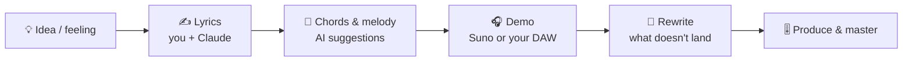

# 86 · Music Making with AI: From Hum to Hit 🎵🎹

> ⏱️ 7 min read · 🎯 Everyone (musicians and "I can't play anything" folks alike) · 🧰 Needs: a song generator (Suno or similar), optionally a DAW like GarageBand, Ableton or BandLab

**AI can now write and sing a full song from a sentence, and that's only the beginning.** It can also help you write lyrics,
learn theory, separate a song into its instruments so you can practice along, master your tracks, and even control a real
music production app through MCP. This chapter covers the song generators, AI tools for *real* musicians, a songwriting
workflow, practice superpowers, and the rights questions you need to understand before you share or sell. 🎤🎸

<details class="eli5" open>
<summary>🧸 ELI5: This chapter in 30 seconds</summary>

Imagine telling a robot band "play a happy summer song about my dog Biscuit, with guitars and a catchy chorus," and a minute
later they've written it, sung it and recorded it. That's AI song-making! If you already play music, AI can also be your
practice buddy: it can take the singer out of any song so you can sing along, slow it down, or explain why a chord sounds
sad. 🐶🎶

</details>

<!-- in-this-chapter -->

## 🎛️ The AI music landscape

<details class="eli5">
<summary>🧸 ELI5</summary>

Some music AIs make whole songs, some make background music, and some help real musicians practice and polish their own
songs.

</details>

| Kind | Tools | What you get |
|---|---|---|
| 🎤 **Full songs with vocals** | **Suno** | Complete songs from a prompt or your lyrics |
| 🎚️ **Remix & fan creation** | **Udio** (now a licensed remix platform) | Play with licensed music inside the platform |
| 🎼 **Instrumentals, jingles, SFX** | ElevenLabs Music and SFX, Stable Audio | Background music and sound design |
| 🎹 **AI inside music apps** | Logic Pro's session players and mastering assistant, BandLab SongStarter, Ableton + MCP | AI helpers in real production tools |
| ✂️ **Stem separation** | Moises, LALAL.AI, open-source Demucs | Split a song into vocals, drums, bass and more |
| 🎧 **Mastering** | LANDR, Ozone-style assistants, built-in DAW mastering | Loud, polished, release-ready tracks |
| 🧠 **Songwriting partner** | Claude, ChatGPT, Gemini | Lyrics, chord progressions, theory lessons |

> [!NOTE]
> **📌 The big 2026 shift: licensed models**
> After lawsuits from record labels, AI music is moving to **licensed training**. Suno's **v6** models (September 2026) were
> trained with licensed music from label partners, and Udio pivoted to a licensed, in-platform remix model. Terms (downloads,
> commercial use) differ by plan, so read them before you publish.

## 🎤 Making your first AI song

<details class="eli5">
<summary>🧸 ELI5</summary>

Describe the style, give it a topic or your own words, click create, and pick your favorite of the versions it makes.

</details>

1. **Pick a style:** genre, mood, instruments, tempo, vocal type. *"Upbeat indie pop, jangly guitars, handclaps, female vocals,
   summery, 120 BPM."*
2. **Write or generate lyrics.** Your own words give the best, most personal results.
3. **Use structure tags** so the song has a shape:

    ```text
    [Intro]
    [Verse 1]
    Biscuit's at the window, tail going like a drum
    Every car's a mailman, every bird's a chum
    [Pre-Chorus]
    Here he comes...
    [Chorus]
    Oh Biscuit, you're the sunshine on my street!
    [Bridge]
    [Outro]
    ```

4. **Generate several versions** and pick the best.
5. **Iterate:** extend, replace a section, change the style, or remix.

> [!TIP]
> **🪄 Claude as lyricist**
> *"Write lyrics for a birthday song for my friend Sam: loves hiking, terrible at karaoke, always late, heart of gold.
> Upbeat country, verse/chorus/bridge structure, clean enough for their grandma, include one inside joke about the 2024 camping trip
> tent disaster."* Then paste the lyrics into your song generator.

## ✍️ A songwriting workflow with AI

<details class="eli5">
<summary>🧸 ELI5</summary>

Use AI as a songwriting buddy: brainstorm ideas together, try lots of words and chords, but keep your own feelings and
choices at the center.

</details>



| Step | AI helps by… | Prompt |
|---|---|---|
| **Brainstorm** | Generating angles on a theme | *"10 fresh angles for a song about moving to a new city."* |
| **Lyrics** | Rhymes, imagery, syllable counts | *"Give me 5 alternatives for line 3 that rhyme with 'rain' and keep 8 syllables."* |
| **Chords** | Suggesting progressions for a mood | *"A bittersweet chord progression in G, with a surprising chord in the chorus."* |
| **Melody ideas** | Describing or generating MIDI | *"Suggest a melody rhythm for this line, as note lengths."* |
| **Demo** | Hearing it fast | Generate a demo with your lyrics, then learn it yourself |
| **Feedback** | A kind critique | *"Critique these lyrics like a supportive songwriting teacher."* |

## 🎹 AI for musicians who play

<details class="eli5">
<summary>🧸 ELI5</summary>

If you play an instrument, AI can be the world's most patient practice partner: remove parts of songs, slow them down,
explain the music, and help you record.

</details>

| Superpower | Tools | Try |
|---|---|---|
| 🎸 **Remove any instrument** | Moises, LALAL.AI, Demucs | Take the guitar out of a song and play along as the guitarist |
| 🐢 **Slow down without pitch change** | Moises, most practice apps | Learn a tricky solo at 60% speed |
| 🎼 **Chord detection** | Moises, Chordify | See the chords of any song as it plays |
| 🧑‍🏫 **Theory tutor** | Claude, ChatGPT | *"Why does the IV-to-iv change sound so sad? Show me in C major."* |
| 🥁 **Session players** | Logic Pro, BandLab | An AI drummer or bassist that follows your song |
| 🎧 **Mastering** | LANDR, DAW assistants | Make your home recording sound release-ready |
| 🎚️ **Mixing feedback** | Claude with a description or a spectrum screenshot | *"My vocals sound buried. What should I try first?"* |

## 🔌 Claude + your DAW via MCP

<details class="eli5">
<summary>🧸 ELI5</summary>

With a special plug-in, Claude can press buttons inside real music-making software: add a drum beat, change the tempo, create
instruments, just by you asking.

</details>

Community MCP servers connect Claude to production software like **Ableton Live** (and others), so you can say:

- *"Create a 4-bar lo-fi drum loop at 85 BPM on a new track."*
- *"Add a warm Rhodes piano playing Am7 – Dmaj7 – Gmaj7 – Cmaj7."*
- *"Put reverb on the vocals and turn the drums down 3 dB."*

It's early and delightfully nerdy, and a great example of MCP turning an assistant into a studio intern
([MCP Server Catalog](../part-4-mcp-and-connectors/40-mcp-server-catalog.md)). Always keep a backup of your project first. 💾

## 🎵 Music for your projects

<details class="eli5">
<summary>🧸 ELI5</summary>

You can make custom background music for your videos, podcasts, games and even hold-music for your business.

</details>

| Need | Approach |
|---|---|
| 🎬 **Video soundtrack** | Instrumental, timed to your edit ([Video & Audio](85-video-and-audio-production.md)) |
| 🎙️ **Podcast intro/outro** | 10–20 second jingle with your show name |
| 🎮 **Game music** | Loopable tracks for each level or mood ([3D, Games & Worlds](88-3d-games-and-worlds.md)) |
| 🧘 **Focus / sleep music** | Long ambient instrumentals |
| 🏪 **Small business** | Hold music, ad jingles (check commercial terms!) |
| 🔊 **Sound effects** | *"A magical sparkle chime,"* *"footsteps on gravel"* |

## ⚖️ Rights, copyright & being fair

<details class="eli5">
<summary>🧸 ELI5</summary>

AI music has rules: check whether you're allowed to download and sell what you make, don't copy real singers' voices, and
remember that songs made only by AI may not be protected like songs made by people.

</details>

| Question | The practical answer |
|---|---|
| **Can I use it commercially?** | It depends on the tool and your **plan**. Read the terms. Free tiers often don't allow it |
| **Do I own it?** | Tools grant you rights under their terms, but **copyright law** may not protect purely AI-generated works. In the US, the Copyright Office has said works need meaningful human authorship. Your own lyrics and edits help |
| **Can I imitate a famous singer?** | Don't clone real artists' voices or pass songs off as theirs. Many tools block it anyway |
| **Can I upload to streaming?** | Distributors have rules about AI music, and some require disclosure. Check before uploading |
| **Can I use copyrighted songs as input?** | Only with rights to them. Remixing others' music follows the platform's license |

> [!WARNING]
> **⚠️ The law is still moving**
> AI music rights are being shaped by lawsuits and licensing deals right now. For anything commercial, check the current terms
> and, for serious releases, get proper advice.

## 🎮 12 music projects

<details class="eli5">
<summary>🧸 ELI5</summary>

Twelve fun music projects, from silly to sweet.

</details>

| # | Project |
|---|---|
| 1 | 🎂 A personalized birthday song packed with inside jokes |
| 2 | 🐶 Your pet's theme song, in three genres |
| 3 | 🧒 A lullaby with your child's name and favorite things |
| 4 | 🎲 An epic theme for your D&D party's adventures |
| 5 | 🛒 Your grocery list as a dramatic opera |
| 6 | 💍 A first-dance song from your love story (then learn to play it!) |
| 7 | 🏃 A running playlist that builds tempo for your pace |
| 8 | 🎙️ A podcast jingle |
| 9 | 🎸 Practice along to your favorite song with the guitar removed |
| 10 | 📚 A study song that memorizes the periodic table |
| 11 | 🎮 A chiptune soundtrack for a game you vibe-coded |
| 12 | 🕰️ A "then vs. now" song: the same lyrics as 1960s soul and 2020s hyperpop |

## 🎯 Key takeaways

- **Suno** makes full songs, and 2026 brought **licensed models** and new terms. Read them before publishing.
- **Your own lyrics** (with Claude as co-writer) make songs personal and strengthen your authorship.
- Musicians get **practice superpowers**: stem separation, slow-down, chord detection and a theory tutor.
- **MCP** lets Claude operate real production software.
- Mind the **rights**: plan terms, no voice cloning of real artists, and disclosure rules.

## 🧠 Check yourself

<details class="quiz">
<summary>❓ 1. What are structure tags like [Verse] and [Chorus] for?</summary>

They tell the song generator the **shape of the song**, so your lyrics land in the right sections.

</details>

<details class="quiz">
<summary>❓ 2. You want to practice bass along to a song. Which AI tool helps most?</summary>

A **stem separation** tool (Moises, LALAL.AI, Demucs) to remove the bass, plus slow-down to learn tricky parts.

</details>

<details class="quiz">
<summary>❓ 3. Can you always sell songs you made on a free plan?</summary>

**Not necessarily.** Commercial use depends on the tool's **terms and your plan**. Check before selling or uploading to
streaming.

</details>

> [!TIP]
> **🎮 Try this**
> Write a birthday song for a friend that's packed with inside jokes: Claude writes the lyrics with structure tags, a song
> generator makes it, and you send it on their birthday. Instant legend status. 🎂🎶

---

**Next:** [87 · Voice Agents →](87-voice-agents.md)
