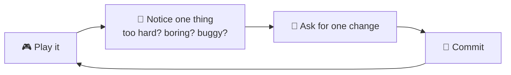

# 88 · 3D, Games & Interactive Worlds 🎮🧊

> ⏱️ 7 min read · 🎯 Everyone who's ever wanted to make a game · 🧰 Needs: Claude Code or a chat-to-app builder, optionally Blender, Godot or a 3D printer

**Making a game used to take a team and a year. Now you can vibe-code a playable browser game in an evening.** AI can write
the game code, generate 3D models from a sentence or a photo, drive Blender through MCP, create sprites, music and sound
effects, give characters living dialogue, and even generate whole interactive worlds. This chapter is your game studio tour:
tools, workflows, a first-game walkthrough and a pile of projects. Press start! 🕹️✨

<details class="eli5" open>
<summary>🧸 ELI5: This chapter in 30 seconds</summary>

Want a game where a cat jumps between clouds collecting fish? Tell an AI coding helper, and it writes the game so you can play
it in your browser. Want a 3D dragon? Describe it or show a drawing, and AI makes a 3D model you can spin around, put in a
game, or even print on a 3D printer. It's like having a whole game company that listens to you. 🐱☁️🐟

</details>

<!-- in-this-chapter -->

> [!NOTE]
> **🌍 Any assistant can make a game**
> Ask **Claude** (Artifacts), **ChatGPT** (Canvas), **Gemini** (Canvas or Google AI Studio) or **Grok** for a small
> browser game and you'll get something playable in minutes. The bigger projects below use coding agents like Claude
> Code, Codex, Gemini CLI or Cursor. Pick whichever you like.

## 🗺️ The AI game-making map

<details class="eli5">
<summary>🧸 ELI5</summary>

AI can help with every part of a game: the code, the pictures, the 3D models, the music, the characters' voices and even
the world itself.

</details>

| Part of the game | AI helps with | Tools |
|---|---|---|
| 💻 **Code** | Writing game logic, physics, menus, bug fixes | Claude Code, Cursor, chat-to-app builders ([Agents & Coding Tools](../part-7-building-with-ai/60-agents-and-coding-tools.md)) |
| 🖼️ **2D art** | Sprites, tiles, backgrounds, UI | Image models ([Image Generation](84-image-generation-deep-dive.md)) |
| 🧊 **3D models** | Characters, props, environments | Text/image-to-3D tools, Blender + MCP |
| 🎵 **Music & SFX** | Soundtracks, jingles, sound effects | Suno, ElevenLabs SFX ([Music Making](86-music-making-with-ai.md)) |
| 🗣️ **Characters** | Living dialogue, voices | LLM-powered NPCs, TTS ([Voice Agents](87-voice-agents.md)) |
| 📖 **Story** | Quests, lore, branching plots | Claude ([Storytelling](89-storytelling-and-interactive-fiction.md)) |
| 🌍 **Worlds** | Whole explorable scenes | World models, 3D scene generation |

## 🕹️ Vibe-code your first game (tonight!)

<details class="eli5">
<summary>🧸 ELI5</summary>

Describe a simple game to an AI coding helper, play what it makes, and keep asking for changes until it's fun.

</details>

**Start tiny.** A great first game has **one mechanic** (jump, dodge, match, shoot) and fits in a single web page.

```text
Build a browser game in a single HTML file:
- A cat jumps between floating clouds (space or tap to jump).
- Collect fish for points, avoid storm clouds.
- Speed increases slowly. Show score and high score (saved in localStorage).
- Cute pastel style, drawn with canvas shapes (no image files).
- Works on phone and desktop. Add a start screen and a game-over screen.
Then open it in my browser.
```

| Tool | Great for |
|---|---|
| **Claude Artifacts** | Tiny games right in chat, shareable by link |
| **Claude Code / Cursor** | Real projects you keep growing ([Claude Code Masterclass](../part-7-building-with-ai/62-claude-code-masterclass.md)) |
| **Lovable, Bolt, Replit** | Browser-based building and instant hosting |

**Game-friendly frameworks** your AI knows well: plain **HTML canvas**, **Phaser** (2D), **Three.js** and **Babylon.js** (3D
in the browser), **Pygame** (Python), and **Godot** (a free, full game engine with its own scripting).

## 🔁 The game-dev loop with AI

<details class="eli5">
<summary>🧸 ELI5</summary>

Play it, notice what's not fun, ask for one change, play again. Games get fun through lots of tiny tweaks.

</details>



| Feel problem | Ask |
|---|---|
| "It's too hard" | *"Make the first 30 seconds much easier, then ramp up difficulty gradually."* |
| "It feels floaty" | *"Make the jump snappier: faster rise, faster fall, a tiny squash on landing."* |
| "It's boring" | *"Add a power-up every 20 seconds and a combo multiplier."* |
| "No juice" | *"Add screen shake on hits, particles on pickups and a satisfying sound."* ✨ |
| "Doesn't work on phones" | *"Add touch controls and make the canvas scale to any screen."* |

> [!TIP]
> **💡 "Juice" is the secret sauce**
> Tiny effects (particles, screen shake, bouncy animations, sounds) make simple games feel amazing. Ask your AI to "add
> juice" and watch your game come alive.

## 🧊 Text-to-3D and image-to-3D

<details class="eli5">
<summary>🧸 ELI5</summary>

Describe an object or show a picture, and AI makes a 3D model you can spin around, use in a game, or print on a 3D printer.

</details>

| Tool | What it does |
|---|---|
| **Meshy, Tripo, Rodin (Hyper3D)** | Text or image → textured 3D models, with game-ready exports |
| **Hunyuan3D, TRELLIS and other open models** | Local or hosted open-source 3D generation |
| **Spline AI** | 3D scenes for websites, in the browser |
| **Luma, Polycam** | Photos or video of a real object → a 3D scan (Gaussian splats and meshes) |
| **Roblox and other game platforms** | Built-in AI assistants for scripting and 3D creation |

**Workflow:** generate a concept image first (you control the look), then **image-to-3D**, then clean it up in Blender, then
export (`.glb` for the web, `.fbx` for engines, `.stl` for printing).

## 🔌 Blender, Godot & Unity via MCP

<details class="eli5">
<summary>🧸 ELI5</summary>

With special plug-ins, Claude can press the buttons in real 3D and game programs for you: "make a low-poly forest," "add a
sunset light," "make the player jump higher."

</details>

Community **MCP servers** connect Claude to creative apps:

| App | What you can ask |
|---|---|
| **Blender** (Blender MCP) | *"Create a low-poly island with palm trees, a dock and sunset lighting. Then render it."* |
| **Godot** | *"Add a double-jump to the player script and a collectible coin scene."* |
| **Unity** | *"Create a spinning coin prefab and a score counter UI."* |

Claude reads the scene, runs Python or engine commands, and iterates on screenshots. It's like having a technical artist on
call. Start with backups, and review scripts before running them ([MCP Security & Trust](../part-4-mcp-and-connectors/43-mcp-security-and-trust.md)).

## 🗣️ AI characters that talk back

<details class="eli5">
<summary>🧸 ELI5</summary>

Game characters can now answer anything you say to them, remember you, and have their own personalities, instead of repeating
the same three lines.

</details>

- **LLM-powered NPCs:** give each character a personality, secrets and goals in a system prompt, and let players chat freely.
- **Guardrails:** keep characters in-world (*"You only know things a medieval baker would know"*), and set content limits.
- **Memory:** characters remember what the player did ([Memory for Agents](../part-8-knowledge-and-memory/75-memory-for-agents.md)).
- **Voices:** TTS gives each character a distinct voice.
- **Platforms:** NPC-focused services (Inworld, Convai and others) handle voices, memory and engine plugins.

```text
You are Marta, the village baker in Brightwater. Warm, gossipy, secretly afraid of the forest.
You know: the mill closed last spring, the blacksmith's son vanished near the old oak.
Never mention anything outside this world. Keep replies under 40 words.
If the player is kind, hint that the old oak hides a door.
```

## 🌍 World models: generated, explorable worlds

<details class="eli5">
<summary>🧸 ELI5</summary>

New AIs can make a whole little world you can walk around in, just from a description or a picture, like stepping into a
painting.

</details>

**World models** (like Google DeepMind's Genie research) generate interactive environments frame by frame as you move through
them. Other tools turn images or text into explorable 3D scenes. It's early, often short-lived and low-res, but it points
toward games and simulations that are *generated* rather than built. Worth trying when you get access. 🤯

## 🖨️ From AI to real objects: 3D printing

<details class="eli5">
<summary>🧸 ELI5</summary>

You can turn an AI-made 3D model into a real toy or tool with a 3D printer. Imagine holding a figurine of your own made-up
creature!

</details>

1. **Generate** a model (text or image to 3D), or ask Claude to write **OpenSCAD** code for precise functional parts
   (*"a hook for my bike helmet, 5 cm deep, with two screw holes"*).
2. **Check it's printable:** a closed, watertight mesh with a flat base. Fix it in Blender or your slicer.
3. **Slice** it (Bambu Studio, PrusaSlicer, Cura) and **print**.
4. **Iterate:** measure, tweak the prompt or code, print again.

**Great first prints:** a figurine of your D&D character, a custom phone stand, a name tag for your plant pots, a replacement
knob. 🧩

## 🎮 20 game & 3D projects

<details class="eli5">
<summary>🧸 ELI5</summary>

Twenty fun things to build, from tiny games to printed toys.

</details>

| 🕹️ Games | 🧊 3D & worlds |
|---|---|
| A one-button jumping game starring your pet | A low-poly version of your house in Blender |
| A trivia game about your family (with inside jokes) | A figurine of your D&D character, 3D-printed |
| A typing game that teaches your kid spelling words | A 3D scan of a favorite object, placed in a web scene |
| A cozy farming game in one HTML file | A custom chess set where each piece is a family member |
| A "choose-your-path" game with an AI narrator | An interactive 3D birthday card on a web page |
| A multiplayer drawing-guessing game for game night | A diorama of your favorite place, rendered at sunset |
| A retro space shooter with chiptune music | Custom LEGO-compatible parts in OpenSCAD |
| A puzzle game with AI-generated levels | A tiny planet you can spin in the browser 🪐 |
| A virtual pet that needs feeding and petting | Printed replacement parts for broken things |
| An escape room where AI characters give clues | A museum of your kid's drawings turned into 3D |

## 🎯 Key takeaways

- **Vibe-code small games** with one mechanic, then iterate: play, notice, change one thing, commit.
- Ask for **"juice"** (particles, shake, sound) to make simple games feel great.
- **Text/image-to-3D** tools make models, and **MCP** lets Claude drive Blender, Godot and Unity.
- **LLM-powered NPCs** bring characters to life, with guardrails and memory.
- AI models can become **real objects** through 3D printing, and OpenSCAD is perfect for functional parts.

## 🧠 Check yourself

<details class="quiz">
<summary>❓ 1. What makes a great first AI-built game?</summary>

**One simple mechanic** in a **single web page**, then lots of small iterations based on playing it.

</details>

<details class="quiz">
<summary>❓ 2. Why generate a concept image before image-to-3D?</summary>

It gives you **control over the look** before the 3D step, which only has to add depth.

</details>

<details class="quiz">
<summary>❓ 3. You need a precise, functional 3D-printed bracket. What's a good AI approach?</summary>

Ask Claude to write **OpenSCAD** code with exact measurements, then slice and print.

</details>

> [!TIP]
> **🎮 Try this**
> Paste the cat-and-clouds prompt above into Claude (as an Artifact) or Claude Code. Play it, then ask for three rounds of
> "juice." Send the link to a friend and challenge them to beat your high score. You're a game developer now. 🐱🏆

---

**Next:** [89 · Storytelling & Interactive Fiction →](89-storytelling-and-interactive-fiction.md)
