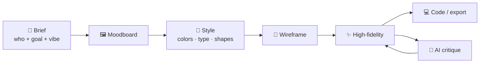

# 90 · Design & UI with AI: Make Things Look Wonderful 🎨📐

> ⏱️ 8 min read · 🎯 Everyone who makes slides, flyers, websites or apps · 🧰 Needs: Canva or Figma (free tiers), and Claude or a UI builder like v0

**Good design used to require years of training. Now AI can give you a head start on everything: moodboards, color
palettes, logos, layouts, full app screens, slide decks, and code that matches the design.** This chapter covers the tools,
a start-to-finish design workflow, how to get design *taste* out of AI (critique!), design-to-code with Figma and MCP,
accessibility, and quick wins for presentations and everyday graphics. ✨📱

🧸 ELI5: This chapter in 30 seconds

Design is making things look nice *and* easy to use: the colors, the fonts, where the buttons go. AI can now suggest colors
that go together, draw app screens from a description, make slides look professional, and even turn a drawing of a website
into a real, working website. And it can look at your design and say "this button is too small" or "this text is hard to
read," like a friendly design teacher. 🎨🧑‍🏫

<!-- in-this-chapter -->

> [!NOTE]
> **🌍 Your favorite assistant is a design partner too**
> ChatGPT and Gemini generate and edit images and mockups, Claude builds interactive prototypes as Artifacts, Canva and
> Figma have AI built in, and Gemini Canvas and AI Studio turn sketches into working pages. Mix and match.

## 🧰 The AI design toolbox

🧸 ELI5

Some tools make pretty posters and slides, some design app screens, some turn designs into code, and some help plan whole
websites.

| Job | Tools | Notes |
|---|---|---|
| 🖼️ **Graphics, social posts, flyers** | **Canva** (Magic Studio), Adobe Express | Templates + AI generation + brand kits |
| 📱 **App & web UI design** | **Figma** (Figma Make and AI features), Google Stitch, Uizard | Screens from prompts, then refine by hand |
| 💻 **UI straight to code** | **v0**, Lovable, Bolt, Claude Artifacts | Working React/HTML from a description or screenshot |
| 🌐 **Websites** | Framer AI, Relume, Webflow AI, Wix/Squarespace AI | Sitemaps, wireframes and full sites |
| 🔤 **Logos & type** | Ideogram, Recraft, Looka-style brand tools | Explore directions fast, finish by hand |
| 🎨 **Palettes & inspiration** | Claude, Coolors, Khroma, image models | Palettes from a mood or a photo |
| 📊 **Presentations** | Gamma, Canva, PowerPoint Copilot, Google Slides + Gemini, Claude | Decks from an outline or a doc |
| 🔌 **Design ↔ code bridge** | **Figma MCP server**, Canva MCP | Coding agents read your real designs ([Cursor & AI IDEs](../part-7-building-with-ai/64-cursor-and-ai-ides.md)) |

## 🔁 A start-to-finish design workflow

🧸 ELI5

Start with a feeling and pictures you like, pick colors and fonts, sketch simple boxes, make it pretty, then turn it into
the real thing.

| Step | Ask AI | Output |
|---|---|---|
| **Brief** | *"Interview me with 8 questions about this project's audience, goals and vibe."* | A one-paragraph design brief |
| **Moodboard** | *"Generate 6 moodboard images for 'cozy, modern, plant shop, morning light'."* | A visual direction |
| **Style** | *"From this moodboard, propose a palette (hex codes), 2 fonts and a shape language."* | A mini style guide |
| **Wireframe** | *"Wireframe the homepage: sections, hierarchy, calls to action. Boxes and labels only."* | Layout without distraction |
| **High-fidelity** | Figma Make, v0 or Claude: *"Design this wireframe with our style guide."* | Real-looking screens |
| **Critique** | *"Critique this like a senior product designer: top 5 fixes."* | A punch list |
| **Code** | v0, Lovable, or Claude Code with the Figma MCP server | A working page |

## 🎨 Color, type & layout with AI

🧸 ELI5

AI can pick colors that look good together, fonts that match the mood, and tell you how to space things so they look tidy.

| Ask | Why it works |
|---|---|
| *"A palette for a calm meditation app: 1 primary, 1 accent, 3 neutrals, with hex codes and contrast ratios."* | Specific roles + accessibility built in |
| *"Pull a 5-color palette from this photo of my garden."* | Palettes from real inspiration |
| *"Pair a friendly heading font with a readable body font, both free on Google Fonts."* | Practical, licensable picks |
| *"Suggest a spacing scale and type scale for this site."* | Consistency makes things look professional |
| *"Make light and dark mode versions of this palette."* | Two themes in one go |

**Design rules AI can teach you in 5 minutes:** hierarchy (make the important thing biggest), contrast, alignment, whitespace,
consistency, and "one primary action per screen." Ask: *"Explain these design principles using my screenshot as the example."*

## 🧐 Getting taste out of AI: critique

🧸 ELI5

Show AI a screenshot of your design and ask it to be a design teacher. It'll point out what's confusing, hard to read, or
messy, so you can fix it.

AI critique is one of the most underrated design tools. Screenshot your work and ask:

| Critique lens | Prompt |
|---|---|
| **First impression** | *"What does this page say in the first 5 seconds? What's the first thing your eye lands on?"* |
| **Hierarchy** | *"Is the most important action obvious? What competes with it?"* |
| **Consistency** | *"List inconsistencies in spacing, font sizes, colors and button styles."* |
| **Accessibility** | *"Check contrast, text size, touch-target size and color-only meaning."* |
| **Copy** | *"Rewrite the headings and buttons to be clearer and friendlier."* |
| **Mobile** | *"How will this break on a phone? Suggest a mobile layout."* |
| **Compare** | *"Here are 3 versions. Which is strongest and why? What would you steal from the others?"* |

> [!TIP]
> **💡 Screenshot loops with Playwright**
> When building UI with Claude Code, connect Playwright MCP and say *"screenshot the page at desktop and phone widths, critique
> it against our style guide, and fix the top 3 issues. Repeat twice."* The AI designs, looks, and improves on its own
> ([Claude Code Power-Ups](../part-7-building-with-ai/63-claude-code-power-ups.md#-mcp-in-claude-code)).

## 🔌 Design-to-code with Figma & MCP

🧸 ELI5

Figma's plug-in lets coding AIs read your design directly, with the exact colors, sizes and spacing, so the website they build
matches your drawing.

1. Design screens in **Figma** (or generate them with Figma Make).
2. Connect the **Figma MCP server** to Claude Code, Cursor or VS Code.
3. Select a frame and ask: *"Implement this frame as a responsive React component using our Tailwind config and existing
   components."*
4. The agent reads **real values** (colors, spacing, components, variables), not guesses from a screenshot.
5. Screenshot the result, compare with the design, iterate.

**Design systems make this sing:** name your colors, fonts and components consistently in Figma (and in code), and agents
reuse them instead of inventing new ones.

## ♿ Accessibility: design for everyone

🧸 ELI5

Good design works for everyone, including people who can't see colors well, use screen readers, or have shaky hands. AI can
check your designs for these things.

| Check | AI help |
|---|---|
| **Color contrast** (text vs. background) | *"Check these color pairs against WCAG AA and suggest fixes."* |
| **Alt text** for images | *"Write concise alt text for each image on this page."* |
| **Keyboard & screen readers** | *"Audit this component's HTML for keyboard and screen-reader accessibility."* |
| **Readable text** | Minimum sizes, line length, plain language |
| **Touch targets** | Buttons big enough for thumbs (~44px) |
| **Don't rely on color alone** | Add icons or text to red/green states |

More in [Accessibility & AI](../part-11-ai-for-life-and-work/101-accessibility-and-ai.md).

## 📊 Presentations & everyday graphics

🧸 ELI5

AI can turn your notes into a nice slideshow, and make flyers, invitations and social posts look professional in minutes.

| Need | Fast path |
|---|---|
| **Slide deck from a doc** | Gamma, Canva or PowerPoint Copilot: paste your outline or doc |
| **Better slides you already have** | *"Rewrite each slide as one headline + one visual idea. Cut the bullet walls."* |
| **Charts that tell a story** | *"What's the one message of this chart? Redesign it to make that obvious."* |
| **Event flyer** | Canva template + AI background + your text |
| **Social posts** | A brand kit in Canva + AI variations for each platform size |
| **Invitations & cards** | Image model art + clean typography in Canva ([Image Generation](84-image-generation-deep-dive.md)) |

**The one-slide rule:** each slide says **one thing**. Ask AI: *"For each slide, what's the one thing the audience should
remember? If it's unclear, split or cut the slide."*

## 🎮 12 design projects

🧸 ELI5

Twelve fun design projects to practice with AI.

| # | Project |
|---|---|
| 1 | 🌿 A complete brand kit for an imaginary shop (logo, palette, fonts, social templates) |
| 2 | 📱 Redesign an app you find frustrating, then critique your redesign |
| 3 | 🏠 A personal homepage, from moodboard to deployed site ([Deploying & Hosting](../part-7-building-with-ai/66-deploying-and-hosting.md)) |
| 4 | 🎟️ A poster series for your local library or club |
| 5 | 📊 Turn a boring report into a beautiful one-page infographic |
| 6 | 💌 Wedding or party invitations with matching RSVP page |
| 7 | 🎨 Light and dark themes for this manual (fork it and try!) |
| 8 | 🧾 A friendly redesign of a confusing form you had to fill in |
| 9 | 🍽️ A menu for a friend's café |
| 10 | 🧒 A chore chart your kids will actually like |
| 11 | 📚 A book cover for your story ([Storytelling](89-storytelling-and-interactive-fiction.md)) |
| 12 | 🗂️ A personal design system in Figma, used by Claude Code to build a site |

## 🎯 Key takeaways

- AI helps at every design step: **brief → moodboard → style → wireframe → high-fidelity → code**.
- **Critique** is AI's secret design superpower: screenshot and ask like a senior designer.
- The **Figma MCP server** gives coding agents real design values, and design systems make it shine.
- Build **accessibility** in from the start: contrast, alt text, keyboard and touch targets.
- For slides: **one idea per slide**, and let AI cut the bullet walls.

## 🧠 Check yourself

❓ 1. What's the benefit of the Figma MCP server over pasting a screenshot?

The agent reads **real design values** (colors, spacing, components, variables) instead of guessing from pixels.

❓ 2. Name three accessibility checks AI can help with.

Any three of: **color contrast**, **alt text**, **keyboard/screen-reader support**, **readable text size**, **touch-target
size**, **not relying on color alone**.

❓ 3. Why wireframe before high-fidelity design?

It settles **layout and hierarchy** without being distracted by colors and details, and it's much faster to change.

> [!TIP]
> **🎮 Try this**
> Screenshot any website or app you use daily and ask Claude: *"Critique this like a senior product designer: top 5 fixes,
> then describe a redesigned version."* Then paste that description into v0 or Claude Artifacts and see your redesign come to
> life. You'll never look at an interface the same way again. 👀✨

---

**Next:** [91 · AI for Research & Learning →](../part-11-ai-for-life-and-work/91-research-and-learning.md)
