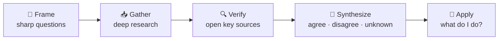

# 91 · AI for Research & Learning: Learn Anything Faster 🔬🎓

> ⏱️ 7 min read · 🎯 Everyone who's curious (students, professionals, lifelong learners) · 🧰 Needs: an assistant with web search or deep research, optionally Gemini Notebook and Anki

**AI is the best tutor and research assistant most of us have ever had access to.** It's patient, available 24/7, and it can
explain anything at any level. Used well, it makes you **learn faster and think better**. Used lazily, it just makes you
*feel* like you learned. This chapter is about the first one: the research tool lineup, a five-step research workflow,
checking sources, the AI tutor setup, learning techniques with AI superpowers, and guardrails that keep your brain strong. 🧠💪

<details class="eli5" open>
<summary>🧸 ELI5: This chapter in 30 seconds</summary>

Imagine a super-patient teacher who knows a little about everything, never gets tired of your questions, and can explain things
with dinosaurs, football or cooking, whatever you love. That's AI as a tutor. It can also be a research helper that reads
lots of articles and tells you what they say. The trick is to make it help you *think*, not think *for* you, like a coach
who spots you at the gym instead of lifting the weights. 🏋️

</details>

<!-- in-this-chapter -->

## 🔎 The research tool lineup

<details class="eli5">
<summary>🧸 ELI5</summary>

Different tools are good at different research jobs: quick answers, big reports, reading your own documents, or finding
science papers.

</details>

| Tool | Best for |
|---|---|
| **Deep research modes** (Claude Research, ChatGPT and Gemini Deep Research, Perplexity) | Multi-source reports with citations in minutes |
| **Perplexity** | Fast cited answers and follow-up exploration |
| **Gemini Notebook (NotebookLM)** | Deep understanding of *your* chosen sources ([Masterclass](../part-8-knowledge-and-memory/76-notebooklm-masterclass.md)) |
| **Elicit, Consensus, Semantic Scholar, scite** | Academic papers: finding, summarizing, checking claims |
| **Assistant + web search** | Quick, current answers inside your normal chat |
| **MCP search servers** (Exa, Brave, Tavily) + your assistant | Custom research agents ([MCP Recipe Book](../part-4-mcp-and-connectors/44-mcp-recipe-book.md)) |

**Pick by question size:** a quick fact → web search in chat. A decision or deep topic → deep research. A pile of documents
you already have → Gemini Notebook. Scientific evidence → academic tools.

## 🧭 The 5-step research workflow

<details class="eli5">
<summary>🧸 ELI5</summary>

Ask a sharp question, let AI gather information, check the important bits yourself, put it all together, and decide what it
means for you.

</details>



1. **Frame:** *"Help me turn my curiosity about [topic] into 5 sharp research questions."*
2. **Gather:** run deep research on the best question. Ask for **primary sources** and a range of viewpoints.
3. **Verify:** open the key citations yourself. AI sometimes misreads or overstates sources.
4. **Synthesize:** *"What do the sources agree on, where do they disagree, and what's still unknown?"*
5. **Apply:** *"Given all this, what should someone in my situation actually do?"*

## 🕵️ Checking sources like a pro

<details class="eli5">
<summary>🧸 ELI5</summary>

AI can sometimes get facts wrong or misread an article. For anything important, click the source and check it says what the
AI claims.

</details>

| Check | How |
|---|---|
| **Does the source exist?** | Click it. Occasionally links are broken or wrong |
| **Does it say that?** | Find the exact sentence. Ask: *"Quote the passage that supports this."* |
| **Who wrote it and why?** | Expert? Company selling something? Advocacy group? |
| **How recent?** | Fast-moving topics need recent sources |
| **One study or many?** | *"Is this a single study or a consensus? How big was the study?"* |
| **Lateral reading** | Search what *other* sources say about the source itself |

> [!WARNING]
> **⚠️ High stakes = primary sources**
> For health, legal, financial or safety decisions, treat AI research as a **starting map**, then confirm with primary sources
> and qualified professionals ([Health](97-health-fitness-and-wellbeing.md), [Money](96-money-and-personal-finance.md)).

## 💬 Research prompts that punch above their weight

<details class="eli5">
<summary>🧸 ELI5</summary>

A few clever questions get much better research: ask for both sides, the common mistakes, and what experts would argue about.

</details>

| Goal | Prompt |
|---|---|
| **Both sides** | *"Steelman both sides of [debate], then tell me which evidence is strongest and why."* |
| **Misconceptions** | *"What would an expert in [field] say is the most common misconception about this?"* |
| **Credibility** | *"Rate each source's credibility and explain your reasoning."* |
| **The famous study** | *"What's the single study everyone cites on this? Summarize its methods and limitations."* |
| **What's new** | *"What changed in this field in the last 2 years?"* (with web search on) |
| **Unknowns** | *"What don't we know yet? What would change the conclusion?"* |
| **Plain language** | *"Explain the findings to a smart 14-year-old, then to an expert."* |

## 🧑‍🏫 The AI tutor setup

<details class="eli5">
<summary>🧸 ELI5</summary>

Give your AI instructions to act like a great teacher: ask you questions, give hints instead of answers, and check that you
understood.

</details>

Give your AI a **tutor persona** (a Project, Gem or custom instructions):

```text
You are my patient tutor for [subject]. I'm a [level]. Teach with the Socratic method: ask me questions,
don't just give answers. Use analogies from [my interests]. Check my understanding with a quick question
after each concept. When I'm wrong, give a hint before the answer. Keep it encouraging!
```

Many assistants also ship **study or learning modes** that guide you step by step instead of handing over answers. Turn them on
when you actually want to *learn*.

## 🚀 Learning techniques, AI-supercharged

<details class="eli5">
<summary>🧸 ELI5</summary>

Scientists know which study tricks work best: testing yourself, spacing out practice, explaining things back. AI makes every
trick easier.

</details>

| Technique | AI version |
|---|---|
| **Active recall** | *"Quiz me on this chapter, one question at a time, and track my score."* |
| **Spaced repetition** | *"Turn these notes into Anki flashcards (front/back CSV)."* |
| **Feynman technique** | *"I'll explain [concept] to you. Find the gaps in my explanation."* |
| **Elaboration** | *"Give me 3 real-world examples of this, from different fields."* |
| **Interleaving** | *"Mix practice problems from topics A, B and C without telling me which is which."* |
| **Analogies** | *"Explain transformers using a cooking analogy."* |
| **Worked examples** | *"Solve one example step by step, then give me a similar one to try."* |
| **Learning roadmap** | *"Create a 30-day plan to learn [skill] with 30 minutes a day, including resources and milestones."* |

## 📚 Read, watch & listen smarter

<details class="eli5">
<summary>🧸 ELI5</summary>

AI can help you get more from books, videos, papers and podcasts: explaining the hard parts and turning them into notes and
quizzes.

</details>

| Medium | Workflow |
|---|---|
| **Books** | *"The core argument of [book], the 5 key ideas, and the strongest criticism."* Then decide if it's worth reading in full (often yes!) |
| **Papers** | Upload the PDF: *"Explain this paper to a smart non-expert, then list its limitations."* |
| **Videos & lectures** | Transcript → *"study notes with timestamps + 10 quiz questions"* (Gemini handles video links well) |
| **Podcasts** | Gemini Notebook or transcripts → key ideas → your notes ([Personal Knowledge Management](../part-8-knowledge-and-memory/77-personal-knowledge-management.md)) |
| **Languages** | Voice-mode conversation partners, plus *"correct my writing and explain each fix"* |

## 🗺️ Learning plans for real skills

<details class="eli5">
<summary>🧸 ELI5</summary>

AI can make you a step-by-step plan to learn anything, from guitar to coding to a new language, with little daily goals.

</details>

| Skill | A great first prompt |
|---|---|
| 🎸 **An instrument** | *"A 60-day guitar plan for 20 minutes a day. I want to play campfire songs. Include finger exercises and 5 songs in order of difficulty."* |
| 🗣️ **A language** | *"A 90-day Spanish plan for a trip to Mexico: phrases first, then conversation practice in voice mode."* |
| 💻 **Coding** | *"Teach me Python by building 5 small projects I care about: [interests]."* |
| 📈 **A work skill** | *"I'm a new manager. A 30-day plan with one small practice task per day."* |
| 🧶 **A hobby** | *"Crochet from zero: first 10 projects, the stitches each teaches, and common mistakes."* |

## 🧠 Don't let AI make you dumber

<details class="eli5">
<summary>🧸 ELI5</summary>

If AI does all the thinking, your brain doesn't grow. Try first, ask for hints, and explain things back in your own words.

</details>

The research is clear: **offloading thinking entirely reduces learning.** Guardrails for your brain:

1. **Try first, then ask.** Attempt the problem for 5 minutes before asking for help.
2. **Ask for hints, not answers.**
3. **Explain it back** in your own words (and have the AI grade your explanation).
4. **Verify important facts** at the source.
5. **Write your own conclusions** before reading the AI's.

> [!TIP]
> **💡 Gym spotter, not weightlifter**
> AI should be a **gym spotter**: there to help when you're stuck, not the one lifting the weights. 🏋️

## 🎯 Key takeaways

- Match the tool to the question: **web search, deep research, Gemini Notebook or academic tools**.
- Research in **five steps**: frame, gather, verify, synthesize, apply.
- **Verify** important claims yourself, and use primary sources for high-stakes decisions.
- Set up a **Socratic tutor** and use proven techniques: active recall, spaced repetition, Feynman.
- Keep your brain strong: **try first, ask for hints, explain it back**.

## 🧠 Check yourself

<details class="quiz">
<summary>❓ 1. You have 12 PDFs from your course and want to study them. Which tool fits best?</summary>

**Gemini Notebook (NotebookLM)**: it answers from your sources with citations and makes study aids.

</details>

<details class="quiz">
<summary>❓ 2. What's the Feynman technique with AI?</summary>

**You** explain the concept to the AI, and it **finds the gaps** in your explanation.

</details>

<details class="quiz">
<summary>❓ 3. Deep research says a supplement "cuts anxiety by 40%." What do you do before believing it?</summary>

Open the **cited study**: check it exists, says that, is well designed and isn't a single tiny study. For health decisions,
talk to a professional.

</details>

> [!TIP]
> **🎮 Try this**
> Pick something you've always wanted to understand (black holes, the stock market, music theory, how vaccines work). Set up the
> tutor persona above and do **20 minutes of Socratic learning** today. Then ask it to quiz you tomorrow. 🎓

---

**Next:** [92 · AI for Writing & Content Creators →](92-writing-and-content.md)
