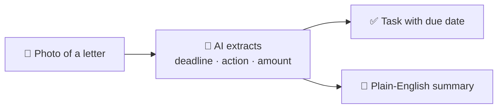

# 95 · Life Admin & Personal Productivity 🏡✅

> ⏱️ 7 min read · 🎯 Everyone with a to-do list (so, everyone) · 🧰 Needs: an assistant with calendar/email connectors (optional), a notes app or spreadsheet

**Forms, bills, appointments, school emails, renewals, "did I ever reply to that?": life admin eats hours every week.** AI
won't do your laundry (yet 🧺), but it can take a huge bite out of the thinking, planning and paperwork. This chapter gives you
the life-admin toolkit, five systems that run themselves, AI-enhanced productivity methods, an "overwhelm reset" for busy or
neurodivergent brains, and the privacy basics. Let's get your evenings back. 🌙

🧸 ELI5: This chapter in 30 seconds

Grown-ups have lots of little boring jobs: paying bills, filling forms, remembering birthdays, planning the week. AI is like a
helpful organizer friend who reads confusing letters and explains them, makes your to-do list less scary, and reminds you of
important things before you forget. You still decide everything, but your brain feels much lighter. 🎈

<!-- in-this-chapter -->

## 🧰 The life-admin AI toolkit

🧸 ELI5

Here's a list of boring grown-up jobs and exactly what to ask AI for each one.

| Task | How AI helps | 🎮 Prompt |
|---|---|---|
| 📬 **Email & inbox** | Triage, summaries, reply drafts | *"Summarize these 20 emails: action needed, FYI, junk."* ([Email & Calendar](../part-6-ai-in-your-apps/57-email-and-calendar.md)) |
| 📅 **Scheduling** | Plan weeks, find times, protect focus | *"Plan my week: here are my tasks, meetings and energy patterns."* |
| 📄 **Paperwork** | Explain letters, fill forms, draft complaints | *"Explain this insurance letter in plain English and tell me what I need to do by when."* |
| 🧾 **Complaints & disputes** | Firm, polite letters | *"Draft a complaint about this wrong bill: facts, what I want, a deadline."* |
| 🏠 **Home** | Repairs, manuals, maintenance ([Home, Cooking & DIY](100-home-cooking-and-diy.md)) | *"[photo] What is this part, and how do I fix the leak?"* |
| 💸 **Money** | Budgets, subscriptions ([Money & Personal Finance](96-money-and-personal-finance.md)) | *"Find every subscription in this bank export."* |
| ✈️ **Travel** | Itineraries and packing ([Travel & Adventures](99-travel-and-adventures.md)) | *"Packing list for 5 days in Iceland in October."* |
| 🎁 **Relationships** | Gift ideas, cards, remembering details | *"Birthday message for my aunt who loves gardening and puns."* |
| 🩺 **Health admin** | Appointment prep ([Health](97-health-fitness-and-wellbeing.md)) | *"5 questions to ask my doctor about [topic]."* |
| 🏫 **School & family** | Decode school emails, plan logistics ([Parents](98-parents-teachers-and-students.md)) | *"Pull every date and thing-to-bring from this newsletter."* |

## 🔁 System 1: The Sunday planning session (20 minutes)

🧸 ELI5

Once a week, show AI your calendar and to-do list, and it helps you make a realistic plan with breaks and fun built in.

With your calendar connected (or pasted in):

> *"Look at my calendar for next week. Here's my task list: [paste]. Build a realistic plan with focus blocks, buffer time and
> one fun thing each day. Flag anything overloaded. Be kind about my capacity."*

**Make it a ritual:** same time each week, a cup of tea, and a skill or saved prompt so it takes one click
([Claude Code Power-Ups](../part-7-building-with-ai/63-claude-code-power-ups.md#-skills-packaged-expertise)).

## 🏠 System 2: The household command center

🧸 ELI5

Keep all the important house stuff in one place, like bill dates and when to change the air filter, and let robots remind
you before things are due.

Create a Notion page or Google Sheet (AI can build it for you: *"Create a household command center with these tabs…"*):

| Tab | Contents | Automation |
|---|---|---|
| 💡 **Bills & renewals** | Provider, amount, due date, auto-pay? | Reminder a week before each due date |
| 🔧 **Maintenance** | Filters, car service, smoke alarms, gutters | Recurring tasks |
| 📄 **Important documents** | Where each one lives (not the documents themselves!) | Yearly review reminder |
| 📅 **Family calendar** | Shared events | Weekly AI digest to the family chat |
| 🔑 **Contacts** | Plumber, vet, school, landlord | Quick lookup |

## 📨 System 3: The paperwork processor

🧸 ELI5

Take a photo of any confusing letter, and AI tells you what it means, what you need to do, and by when, then adds a reminder.

Do it by hand in a chat, or automate it: phone shortcut → n8n → vision model → task app ([Phone & Desktop Automation](../part-5-automation/50-phone-and-desktop-automation.md)).

**Great prompts for official letters:**

- *"Explain this in plain English. What happens if I do nothing?"*
- *"What's the deadline, and what exactly do I need to send?"*
- *"Draft a reply asking for [X], firm but polite."*

## 💳 System 4: The subscription audit

🧸 ELI5

AI looks at your bank statement and finds all the things you pay for every month, including ones you forgot about.

Export 3 months of transactions → *"List every recurring charge, when it renews, and which ones I might not use."* Many
people find money here on the very first try. 💰 Then: *"Draft cancellation messages for these three."*

(Redact account numbers first. More in [Money & Personal Finance](96-money-and-personal-finance.md).)

## ❤️ System 5: A personal CRM for the people you love

🧸 ELI5

Keep a little notebook about your friends and family, like birthdays and what they love, and get a reminder with gift ideas
before each birthday.

A simple database: names, birthdays, partners' and kids' names, recent life events, gift ideas, "last caught up." An AI
reminder a week before each birthday with a draft message and three gift suggestions. 🎁

**Bonus:** *"Who haven't I talked to in 3 months? Suggest a thoughtful way to reconnect with each."*

## ⚡ Productivity methods, AI-enhanced

🧸 ELI5

Famous tricks for getting things done work even better with AI helping you plan, start and review.

| Method | AI twist |
|---|---|
| **Getting Things Done** | AI processes your inbox and brain dumps into next actions and projects |
| **Time blocking** | AI builds your blocks from tasks + calendar + energy |
| **Eat the frog** | *"Which task on this list will I most want to avoid? Break it into 10-minute steps."* |
| **Weekly review** | A skill or agent compiles your week ([example](../../examples/prompts-for-agents/skills/weekly-review/SKILL.md)) |
| **Body doubling** | Voice-mode AI as a friendly "working together" companion for focus sessions |
| **Pomodoro** | *"Check in with me every 25 minutes: what did I finish, what's next?"* |
| **Two-minute rule** | *"From this list, which tasks take under 2 minutes? Let's blitz them."* |

## 💛 The overwhelm reset

🧸 ELI5

When your head is too full, tell the AI everything that's worrying you. It sorts the mess into "now," "later" and "never," and
gives you just one small thing to do first.

> *"I'm overwhelmed. Here's everything on my mind: [brain dump]. Sort it into now, later and never. Give me ONE next step I can
> do in 10 minutes. Be gentle."*

This is a real gift for busy, anxious or neurodivergent brains. Other supportive prompts:

| Struggle | Prompt |
|---|---|
| **Can't start** | *"Break 'clean the kitchen' into steps so small they feel silly."* |
| **Time blindness** | *"How long will each of these actually take? Add realistic buffers."* |
| **Decision fatigue** | *"Pick for me between these two options using what I've told you I value."* |
| **Forgetting things** | *"Turn this conversation into a checklist I can pin to my phone."* |
| **Dreaded phone calls** | *"Write me a script for calling the insurance company, with answers to likely questions."* |

More in [Accessibility & AI](101-accessibility-and-ai.md).

## 🔒 Privacy & safety for personal life

🧸 ELI5

Be careful with very private things like ID cards, bank numbers and medical papers. Hide the secret numbers before sharing, and
ask a real expert for big decisions.

| Guideline | How |
|---|---|
| **Redact sensitive numbers** | Cover account numbers, ID numbers and passwords before uploading |
| **Consider local AI** for very private stuff | [Local & Open Models](../part-9-local-ai/78-local-and-open-models.md) |
| **Confirm big decisions** with professionals | Legal, tax and medical choices |
| **Keep a human check** on anything that sends money or signs you up | Approval before action |
| **Watch for scams** | *"Is this letter or text a scam? What are the red flags?"* AI is a great second opinion |

## 🎯 Key takeaways

- AI takes a huge bite out of **planning, paperwork and remembering**.
- Five systems: **Sunday planning, household command center, paperwork processor, subscription audit, personal CRM**.
- Classic methods (GTD, time blocking, weekly review) get **AI superpowers**.
- The **overwhelm reset** turns a scary brain dump into one gentle next step.
- **Redact, confirm with professionals, and approve anything involving money.**

## 🧠 Check yourself

❓ 1. A confusing tax letter arrives. What three things should you ask AI?

**What it means in plain English**, **what action is required and by when**, and **what happens if you do nothing** (then
confirm important decisions with a professional).

❓ 2. What should you do before uploading a bank statement?

**Redact** account numbers and other sensitive identifiers (or use a local model).

❓ 3. What's the "overwhelm reset"?

A brain-dump prompt: AI sorts everything into **now, later, never** and gives you **one small next step**.

> [!TIP]
> **🎮 Try this**
> Do the **overwhelm reset** prompt tonight with everything rattling around your head. Then try the **subscription audit** this
> weekend. One gives you peace of mind, and the other might pay for your AI subscription. 😄

---

**Next:** [96 · Money & Personal Finance with AI →](96-money-and-personal-finance.md)
