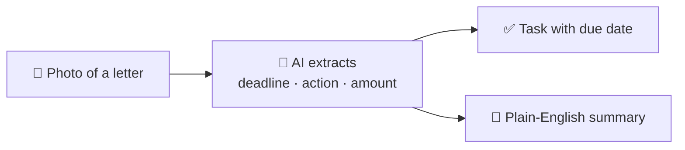

# 95 · Life Admin & Personal Productivity 🏡✅

> ⏱️ 7 min read · 🎯 Everyone with a to-do list (so, everyone) · 🧰 Needs: an assistant with calendar/email connectors (optional), a notes app or spreadsheet

**Forms, bills, appointments, school emails, renewals, "did I ever reply to that?": life admin eats hours every week.** AI
won't do your laundry (yet 🧺), but it can take a huge bite out of the thinking, planning and paperwork. This chapter gives you
the life-admin toolkit, five systems that run themselves, AI-enhanced productivity methods, an "overwhelm reset" for busy or
neurodivergent brains, and the privacy basics. Let's get your evenings back. 🌙

✅ Key Points & Steps

Everyday adult life involves a steady stream of small administrative tasks: bills, forms, appointments, renewals and planning. AI can explain confusing paperwork, organize your tasks and remind you before things are due, which frees up a lot of mental energy.

1. **Use the toolkit** of prompts for common life-admin tasks.
2. **Set up five systems:** weekly planning, a household command center, a paperwork processor, a subscription audit and a personal CRM.
3. **Use the overwhelm reset** when everything feels like too much.
4. **Protect sensitive documents** by redacting numbers before sharing.

<!-- in-this-chapter -->

## 🧰 The life-admin AI toolkit

✅ Key Points & Steps

The table pairs common life-admin tasks, from email and appointments to forms and travel, with how AI helps and a prompt to try.

| Task | How AI helps | 🎮 Prompt |
|---|---|---|
| 📬 **Email & inbox** | Triage, summaries, reply drafts | *"Summarize these 20 emails: action needed, FYI, junk."* ([Email & Calendar](../part-6-ai-in-your-apps/57-email-and-calendar.md)) |
| 📅 **Scheduling** | Plan weeks, find times, protect focus | *"Plan my week: here are my tasks, meetings and energy patterns."* |
| 📄 **Paperwork** | Explain letters, fill forms, draft complaints | *"Explain this insurance letter in plain English and tell me what I need to do by when."* |
| 🧾 **Complaints & disputes** | Firm, polite letters | *"Draft a complaint about this wrong bill: facts, what I want, a deadline."* |
| 🏠 **Home** | Repairs, manuals, maintenance ([Home, Cooking & DIY](100-home-cooking-and-diy.md)) | *"[photo] What is this part, and how do I fix the leak?"* |
| 💸 **Money** | Budgets, subscriptions ([Money & Personal Finance](96-money-and-personal-finance.md)) | *"Find every subscription in this bank export."* |
| ✈️ **Travel** | Itineraries and packing ([Travel & Adventures](99-travel-and-adventures.md)) | *"Packing list for 5 days in Iceland in October."* |
| 🎁 **Relationships** | Gift ideas, cards, remembering details | *"Birthday message for my aunt who loves gardening and puns."* |
| 🩺 **Health admin** | Appointment prep ([Health](97-health-fitness-and-wellbeing.md)) | *"5 questions to ask my doctor about [topic]."* |
| 🏫 **School & family** | Decode school emails, plan logistics ([Parents](98-parents-teachers-and-students.md)) | *"Pull every date and thing-to-bring from this newsletter."* |

## 🔁 System 1: The Sunday planning session (20 minutes)

✅ Key Points & Steps

A weekly planning session takes about twenty minutes.

1. Connect or paste your calendar and task list.
2. Ask AI to build a realistic plan for the week, including breaks and buffer time.
3. Adjust the plan, and schedule your most important tasks first.

With your calendar connected (or pasted in):

> *"Look at my calendar for next week. Here's my task list: [paste]. Build a realistic plan with focus blocks, buffer time and
> one fun thing each day. Flag anything overloaded. Be kind about my capacity."*

**Make it a ritual:** same time each week, a cup of tea, and a skill or saved prompt so it takes one click
([Claude Code Power-Ups](../part-7-building-with-ai/63-claude-code-power-ups.md#-skills-packaged-expertise)).

## 🏠 System 2: The household command center

✅ Key Points & Steps

A household command center keeps important information in one place: bill dates, maintenance schedules, warranties and contacts. AI can build the Notion page or spreadsheet for you, and automations can send reminders before things are due.

Create a Notion page or Google Sheet (AI can build it for you: *"Create a household command center with these tabs…"*):

| Tab | Contents | Automation |
|---|---|---|
| 💡 **Bills & renewals** | Provider, amount, due date, auto-pay? | Reminder a week before each due date |
| 🔧 **Maintenance** | Filters, car service, smoke alarms, gutters | Recurring tasks |
| 📄 **Important documents** | Where each one lives (not the documents themselves!) | Yearly review reminder |
| 📅 **Family calendar** | Shared events | Weekly AI digest to the family chat |
| 🔑 **Contacts** | Plumber, vet, school, landlord | Quick lookup |

## 📨 System 3: The paperwork processor

✅ Key Points & Steps

For any confusing letter or form:

1. Take a photo of it.
2. Ask AI to explain what it means, what you need to do and the deadline.
3. Add the action and deadline to your task list or calendar.

You can automate this with a phone shortcut that sends photos to a workflow.

```mermaid
flowchart LR
    P[📸 Photo of a letter] --> A[🤖 AI extracts<br/>deadline · action · amount]
    A --> T[✅ Task with due date]
    A --> S[📝 Plain-English summary]
```

Do it by hand in a chat, or automate it: phone shortcut → n8n → vision model → task app ([Phone & Desktop Automation](../part-5-automation/50-phone-and-desktop-automation.md)).

**Great prompts for official letters:**

- *"Explain this in plain English. What happens if I do nothing?"*
- *"What's the deadline, and what exactly do I need to send?"*
- *"Draft a reply asking for [X], firm but polite."*

## 💳 System 4: The subscription audit

✅ Key Points & Steps

Export three months of bank transactions and ask AI to list every recurring charge, when each renews, and which ones you might not use. Many people find forgotten subscriptions this way.

Export 3 months of transactions → *"List every recurring charge, when it renews, and which ones I might not use."* Many
people find money here on the very first try. 💰 Then: *"Draft cancellation messages for these three."*

(Redact account numbers first. More in [Money & Personal Finance](96-money-and-personal-finance.md).)

## ❤️ System 5: A personal CRM for the people you love

✅ Key Points & Steps

A personal CRM is a simple database of the people you care about: birthdays, family members, recent life events and gift ideas. An automated reminder before each birthday, with gift suggestions, helps you stay in touch.

A simple database: names, birthdays, partners' and kids' names, recent life events, gift ideas, "last caught up." An AI
reminder a week before each birthday with a draft message and three gift suggestions. 🎁

**Bonus:** *"Who haven't I talked to in 3 months? Suggest a thoughtful way to reconnect with each."*

## ⚡ Productivity methods, AI-enhanced

✅ Key Points & Steps

Popular productivity methods work even better with AI: it can process your inbox into next actions (Getting Things Done), help you prioritize (Eisenhower matrix) and break large tasks into small first steps. The table explains each.

| Method | AI twist |
|---|---|
| **Getting Things Done** | AI processes your inbox and brain dumps into next actions and projects |
| **Time blocking** | AI builds your blocks from tasks + calendar + energy |
| **Eat the frog** | *"Which task on this list will I most want to avoid? Break it into 10-minute steps."* |
| **Weekly review** | A skill or agent compiles your week ([example](../../examples/prompts-for-agents/skills/weekly-review/SKILL.md)) |
| **Body doubling** | Voice-mode AI as a friendly "working together" companion for focus sessions |
| **Pomodoro** | *"Check in with me every 25 minutes: what did I finish, what's next?"* |
| **Two-minute rule** | *"From this list, which tasks take under 2 minutes? Let's blitz them."* |

## 💛 The overwhelm reset

✅ Key Points & Steps

When you feel overwhelmed, write down everything on your mind and ask AI to sort it into "now," "later" and "never," then suggest one small next step. Reducing the list to a single action makes it much easier to start.

> *"I'm overwhelmed. Here's everything on my mind: [brain dump]. Sort it into now, later and never. Give me ONE next step I can
> do in 10 minutes. Be gentle."*

This is a real gift for busy, anxious or neurodivergent brains. Other supportive prompts:

| Struggle | Prompt |
|---|---|
| **Can't start** | *"Break 'clean the kitchen' into steps so small they feel silly."* |
| **Time blindness** | *"How long will each of these actually take? Add realistic buffers."* |
| **Decision fatigue** | *"Pick for me between these two options using what I've told you I value."* |
| **Forgetting things** | *"Turn this conversation into a checklist I can pin to my phone."* |
| **Dreaded phone calls** | *"Write me a script for calling the insurance company, with answers to likely questions."* |

More in [Accessibility & AI](101-accessibility-and-ai.md).

## 🔒 Privacy & safety for personal life

✅ Key Points & Steps

Redact account numbers, ID numbers and passwords before uploading documents, use temporary chats for sensitive topics, and consult a qualified professional for major legal or financial decisions. The table lists more guidelines.

| Guideline | How |
|---|---|
| **Redact sensitive numbers** | Cover account numbers, ID numbers and passwords before uploading |
| **Consider local AI** for very private stuff | [Local & Open Models](../part-9-local-ai/78-local-and-open-models.md) |
| **Confirm big decisions** with professionals | Legal, tax and medical choices |
| **Keep a human check** on anything that sends money or signs you up | Approval before action |
| **Watch for scams** | *"Is this letter or text a scam? What are the red flags?"* AI is a great second opinion |

## 🎯 Key takeaways

- AI takes a huge bite out of **planning, paperwork and remembering**.
- Five systems: **Sunday planning, household command center, paperwork processor, subscription audit, personal CRM**.
- Classic methods (GTD, time blocking, weekly review) get **AI superpowers**.
- The **overwhelm reset** turns a scary brain dump into one gentle next step.
- **Redact, confirm with professionals, and approve anything involving money.**

## 🧠 Check yourself

❓ 1. A confusing tax letter arrives. What three things should you ask AI?

**What it means in plain English**, **what action is required and by when**, and **what happens if you do nothing** (then
confirm important decisions with a professional).

❓ 2. What should you do before uploading a bank statement?

**Redact** account numbers and other sensitive identifiers (or use a local model).

❓ 3. What's the "overwhelm reset"?

A brain-dump prompt: AI sorts everything into **now, later, never** and gives you **one small next step**.

> [!TIP]
> **🎮 Try this**
> Do the **overwhelm reset** prompt tonight with everything rattling around your head. Then try the **subscription audit** this
> weekend. One gives you peace of mind, and the other might pay for your AI subscription. 😄

---

**Next:** [96 · Money & Personal Finance with AI →](96-money-and-personal-finance.md)
