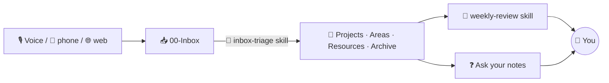

# 83 · Build-Along: The Second Brain 🧠🗃️

> ⏱️ ~2 hours to build · 🎯 Beginner-friendly · 🧰 Needs: Obsidian (free), Claude Code or Claude Desktop, optionally n8n or a phone shortcut for voice capture

**By the end of this build-along, you'll have a second brain that organizes itself.** Ideas land in an inbox from your phone,
AI triages them into the right folders with tags and links, a weekly review writes itself, and you can ask your notes
questions like *"what have I learned about sleep?"* Everything is plain Markdown files **you own**, so it works with any AI,
today and in ten years. Let's build a brain that remembers so you don't have to. 🌱

<details class="eli5" open>
<summary>🧸 ELI5: This build in 30 seconds</summary>

We're making a magic notebook. You drop notes into a "to sort" box by typing or talking. Your AI helper sorts them into the
right drawers, sticks labels on them, and connects related ideas with strings. Every Friday it writes you a little "what you did
this week" report. And whenever you forget something, you just ask the notebook. 📓✨

</details>

<!-- in-this-chapter -->

## 🗺️ What you'll build

<details class="eli5">
<summary>🧸 ELI5</summary>

Notes come in from everywhere, land in one inbox, get sorted by AI, and turn into weekly reviews and answers to your
questions.

</details>



**The kit:** [`examples/second-brain-vault`](../../examples/second-brain-vault/): PARA folders, templates, a `CLAUDE.md` with
house rules, two Claude Code skills (`inbox-triage`, `weekly-review`) and a `/capture` command. Background:
[Personal Knowledge Management](../part-6-knowledge-and-memory/46-personal-knowledge-management.md) and
[Obsidian & AI](../part-4-ai-in-your-apps/25-obsidian-and-ai.md).

## ✅ Before you start

<details class="eli5">
<summary>🧸 ELI5</summary>

You need the free Obsidian app and Claude Code or Claude Desktop. That's it!

</details>

- [ ] **Obsidian** installed (obsidian.md, free)
- [ ] **Claude Code** (recommended) or **Claude Desktop**
- [ ] Optional: **Git** for version history, and **n8n** or a phone shortcut for voice capture
- [ ] 10 real notes, ideas or links you've been meaning to save 😄

## 1️⃣ Step 1: Set up the vault (10 min)

<details class="eli5">
<summary>🧸 ELI5</summary>

Copy the starter notebook folder to your computer and open it in Obsidian.

</details>

```bash
cp -r examples/second-brain-vault ~/Documents/SecondBrain
```

1. In Obsidian: **Open folder as vault** → choose `~/Documents/SecondBrain`.
2. **Settings → Core plugins → Templates** → set the template folder to `Templates`.
3. **Settings → Core plugins → Daily notes** → new file location `Journal`, template `Templates/Daily Note`.
4. Explore the sample notes: a project, an area, two resources, a journal entry. Notice the **front matter** (the metadata at
   the top) and the `[[wiki-links]]`.

> ✅ **Checkpoint:** the vault opens in Obsidian, and clicking `[[Newsletter ideas]]` in the project note opens that note.

## 2️⃣ Step 2: Meet your vault's AI rules (5 min)

<details class="eli5">
<summary>🧸 ELI5</summary>

The CLAUDE.md file is the house rules for AI helpers: never throw notes away, ask before moving lots of things, and keep your
words as you wrote them.

</details>

Open `CLAUDE.md`. It tells any AI working in the vault:

- The **PARA structure** and what goes where.
- **Never delete** (archive instead), and **show a plan before moving more than 3 notes**.
- **Keep your words**: AI summaries go under an `## AI summary` heading.
- Use **wiki-links** and **front matter**.

This is procedural memory for your AI ([Memory for Agents](../part-6-knowledge-and-memory/44-memory-for-agents.md)). Edit it
to match how *you* like to work.

## 3️⃣ Step 3: Capture 10 real things (15 min)

<details class="eli5">
<summary>🧸 ELI5</summary>

Fill your inbox with real stuff from your life: ideas, links, to-dos. Don't sort anything yet!

</details>

Put **ten real things** into `00-Inbox/`, using any mix of:

- In Obsidian: a new note in `00-Inbox`.
- In Claude Code (inside the vault): `/capture Try the sourdough starter recipe Sam sent`
- Paste links with a line on why you saved them.

**Don't organize while capturing.** That's the whole point of an inbox. 📥

> ✅ **Checkpoint:** `00-Inbox/` has at least 10 new notes.

## 4️⃣ Step 4: AI triage (20 min)

<details class="eli5">
<summary>🧸 ELI5</summary>

Ask your AI helper to sort the inbox. It shows you a plan first, you say yes, and it moves everything to the right drawers.

</details>

```bash
cd ~/Documents/SecondBrain
claude
```

Then say: **"Triage my inbox."**

The `inbox-triage` skill kicks in and shows a plan like:

| Note | Destination | Tags | Links | Reason |
|---|---|---|---|---|
| Sourdough starter recipe | 03-Resources | #cooking | (none yet) | Reference for later |
| Book dentist | 02-Areas/Health (as a task) | #health | [[Health]] | Ongoing responsibility |
| Newsletter welcome issue draft | 01-Projects (task) | #writing | [[Launch a tiny newsletter]] | Belongs to an active project |

Review it, adjust anything (*"put the recipe under a new Cooking area instead"*), then say **"go."**

> ✅ **Checkpoint:** the inbox is empty (except Welcome), notes have tags and links, and nothing was deleted.

## 5️⃣ Step 5: Ask your notes questions (15 min)

<details class="eli5">
<summary>🧸 ELI5</summary>

Now ask your notebook anything, like "what should I work on this weekend?", and the AI reads your notes to answer.

</details>

Still in Claude Code (or Claude Desktop with the filesystem MCP server, from the [kit README](../../examples/second-brain-vault/README.md)):

- *"What are my active projects, and what's the next action for each?"*
- *"What have I saved about writing? Link the notes."*
- *"Which notes are related but not linked yet? Suggest links."*
- *"Based on my notes, what could I do this weekend that would make me proud?"* 🌟

> [!TIP]
> **💡 Bigger vault?**
> Claude Code searches files like a person (grep, open, read). For thousands of notes, add semantic search: Obsidian's Smart
> Connections plugin, or a local RAG index ([Build a RAG System](../part-6-knowledge-and-memory/43-build-a-rag-system.md)).

## 6️⃣ Step 6: One-tap voice capture (30 min)

<details class="eli5">
<summary>🧸 ELI5</summary>

Make a button on your phone: press it, say your idea, and it appears as a tidy note in your inbox.

</details>

Pick the route that fits your setup ([Phone & Desktop Automation](../part-3-automation/19-phone-and-desktop-automation.md)):

=== "🍎 iPhone (Shortcuts)"

    1. New Shortcut: **Dictate Text** → **Use Model** (or send to Claude/ChatGPT) with *"Clean this up into a short note
       with a title. Keep my words."* → **Save File** to your vault's `00-Inbox` folder (via iCloud Drive or Obsidian Sync).
    2. Add it to the Action Button or your Home Screen. 🎙️

=== "⚙️ n8n (any phone)"

    1. Webhook → AI cleanup (Claude) → write a Markdown file into the vault's `00-Inbox` (n8n on the same machine, or via a
       synced folder).
    2. Trigger it from a phone shortcut, Tasker, or Telegram ([Pocket AI Assistant](81-build-along-pocket-ai-assistant.md)).

=== "📝 Simplest"

    Use Obsidian's mobile app with a pinned "New note in Inbox" command, and your phone keyboard's dictation button.

> ✅ **Checkpoint:** you can go from "idea while walking" to "note in 00-Inbox" in under 10 seconds.

## 7️⃣ Step 7: The self-writing weekly review (10 min)

<details class="eli5">
<summary>🧸 ELI5</summary>

Every Friday, the AI reads your week and writes a friendly report: your wins, what you learned, and your top three things for
next week.

</details>

In Claude Code: **"Do my weekly review."** The `weekly-review` skill reads your journal and recent notes, checks for stalled
projects, and saves `Reviews/YYYY-MM-DD-weekly-review.md` with wins, lessons, stuck items and your top 3 for next week.

**Make it a ritual:** Friday afternoon, a cup of tea, 15 minutes. ☕ (Automate it with a scheduled headless run:
`claude -p "Do my weekly review"` from cron, see [Claude Code Power-Ups](../part-5-building-with-ai/32-claude-code-power-ups.md#-headless-mode--scripting).)

## 🔒 Step 8 (optional): Make it private and permanent

<details class="eli5">
<summary>🧸 ELI5</summary>

Keep your notebook safe: save a history of every change, and use an AI that lives only on your computer for private stuff.

</details>

| Upgrade | How |
|---|---|
| **Version history** | `git init` in the vault, commit weekly (keep the repo **private**!) ([Git & GitHub](../part-5-building-with-ai/30-git-and-github.md)) |
| **Backups** | Obsidian Sync, iCloud, or any backup tool: it's just files |
| **Fully local AI** | Obsidian plugins + Ollama, or Claude Code on local models ([Local AI for Coding & Agents](../part-7-local-ai/50-local-ai-for-coding-and-agents.md)) |
| **Private tag** | Tag sensitive notes `#private`; the vault rules already tell AI not to quote them elsewhere |

## 🩺 Troubleshooting

<details class="eli5">
<summary>🧸 ELI5</summary>

If the AI helpers don't behave, here's what to check.

</details>

| Problem | Fix |
|---|---|
| Skills don't trigger | Run Claude Code **inside the vault folder** so it finds `.claude/skills/`, or say *"use the inbox-triage skill"* |
| AI moved things without asking | Strengthen `CLAUDE.md`: *"Always show a plan and wait for 'go'."* Use Git to undo |
| Wiki-links break after moving | Obsidian updates links automatically when *it* moves files. Ask the AI to fix links after moves |
| Too many tags | Add a short **tag list** to `CLAUDE.md` and ask the AI to only use those |
| Templates show `{{date}}` | Insert them with Obsidian's Templates command, which fills in dates |

## 🎯 Key takeaways

- A second brain = **one inbox + a simple structure (PARA) + AI to sort, link and review**.
- **Plain Markdown you own** works with every AI tool, now and later.
- **Skills and CLAUDE.md** give your AI consistent, safe habits (plan first, never delete).
- **Voice capture** removes friction, and the **weekly review** turns notes into progress.
- Add **Git, backups and local AI** for privacy and peace of mind.

## 🧠 Check yourself

<details class="quiz">
<summary>❓ 1. Why capture into an inbox instead of filing notes immediately?</summary>

Because **capture should be instant**. Sorting later (with AI help) keeps friction near zero, so you actually save things.

</details>

<details class="quiz">
<summary>❓ 2. What stops the AI from deleting or scattering your notes?</summary>

The **rules in `CLAUDE.md`** (never delete, archive instead, plan before moving) and the triage skill's **show-a-plan-and-wait**
step, with **Git** as a safety net.

</details>

<details class="quiz">
<summary>❓ 3. Why are plain Markdown files a good choice for a second brain?</summary>

They're **yours**, readable by any app or AI, easy to back up and version, and they'll still open in ten years.

</details>

> [!TIP]
> **🎮 Try this**
> Use your second brain for one week: capture everything, triage twice, and do the Friday review. Then ask: *"Based on my notes
> this week, what's one thing I keep thinking about but haven't started?"* Your notes know you better than you think. 🧠💛

---

**Next:** [84 · A Web App with Logins & AI →](84-build-along-web-app-with-ai.md)
