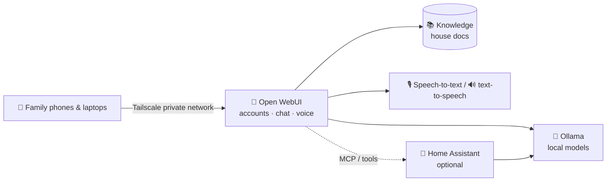

# 86 · Build-Along: The Private Home Assistant 🏡🔒

> ⏱️ ~3 hours to build · 🎯 Intermediate (copy-paste friendly) · 🧰 Needs: a computer that can stay on (16 GB+ RAM ideal), Docker, the [homelab kit](../../examples/homelab/), optionally Home Assistant

**In this build-along you'll create an AI assistant for your whole household that never sends a word to the cloud.** Family
members get their own accounts, it answers questions about your household documents (manuals, recipes, school info), it can
listen and talk, it's reachable from everyone's phone, and it can optionally control your smart home through Home Assistant.
It's the [Home Lab](../part-7-local-ai/49-home-lab.md), turned into something the whole family actually uses. 🏡✨

<details class="eli5" open>
<summary>🧸 ELI5: This build in 30 seconds</summary>

We're building a family robot helper that lives in your house, not on some company's faraway computer. Everyone gets their own
login, it knows about your house stuff (like how the dishwasher works), you can talk to it out loud, and it can even turn the
lights off. And because it lives at home, your family's secrets stay at home. 🤫🏠

</details>

<!-- in-this-chapter -->

## 🗺️ What you'll build

<details class="eli5">
<summary>🧸 ELI5</summary>

Phones connect privately to the home computer. There, the chat app talks to the local AI, reads your family documents, listens
and speaks, and can control smart devices.

</details>



| Layer | Tool | Private? |
|---|---|---|
| Brain | Ollama + a local model | ✅ On your machine |
| Chat app & accounts | Open WebUI | ✅ |
| Household knowledge | Open WebUI Knowledge (RAG) + local embeddings | ✅ |
| Voice | Local Whisper (speech-to-text) + local TTS | ✅ |
| Remote access | Tailscale | ✅ Encrypted, no open ports |
| Smart home | Home Assistant with a local LLM | ✅ |

## ✅ Before you start

<details class="eli5">
<summary>🧸 ELI5</summary>

You need a computer that can stay on (an old desktop, a mini PC or a Mac), Docker, and about an afternoon.

</details>

- [ ] An **always-on computer**: a mini PC, an old desktop, or a Mac mini (16 GB+ RAM, more is better) ([Hardware](../part-7-local-ai/48-hardware-for-local-ai.md))
- [ ] **Docker** installed
- [ ] A free **Tailscale** account
- [ ] Optional: **Home Assistant** already running (or a Raspberry Pi to run it)
- [ ] A few household documents: appliance manuals, the family recipe collection, school calendars

## 1️⃣ Step 1: Start the lab (20 min)

<details class="eli5">
<summary>🧸 ELI5</summary>

Start the home AI with one command and download a brain for it.

</details>

```bash
cd examples/homelab
docker compose up -d
docker compose exec ollama ollama pull gemma4            # everyday chat (fits most machines)
docker compose exec ollama ollama pull nomic-embed-text  # for searching your documents
```

On a Mac, run Ollama natively for GPU speed and point Open WebUI at it (see the [kit README](../../examples/homelab/README.md)).

Open **http://localhost:3000**, create the **admin** account (you!), and chat.

> ✅ **Checkpoint:** you can chat with `gemma4` in Open WebUI with Wi-Fi turned off. 📴

## 2️⃣ Step 2: Family accounts and a house personality (20 min)

<details class="eli5">
<summary>🧸 ELI5</summary>

Make a login for each family member, and give the helper a friendly name and personality that fits your family.

</details>

1. **Admin Panel → Users:** add an account per family member (or enable sign-ups with admin approval).
2. **Workspace → Models → Create:** a custom model called e.g. **"Hearth"** based on `gemma4`, with a system prompt:

    ```text
    You are Hearth, the friendly assistant for the Rivera household. Be warm, patient and brief.
    Use the household knowledge base for questions about our home, appliances, recipes and schedules, and say which document
    you used. If you don't know, say so. For medical, legal or money decisions, suggest asking a grown-up or a professional.
    Keep everything family-friendly.
    ```

3. For kids, create a separate model (e.g. **"Hearth Junior"**) with simpler language and stricter guardrails
   ([Parents, Teachers & Students](../part-9-ai-for-life-and-work/67-parents-teachers-and-students.md)).
4. Use **model permissions** so each account sees the right models.

> ✅ **Checkpoint:** each family member can sign in and chat with Hearth.

## 3️⃣ Step 3: The household knowledge base (30 min)

<details class="eli5">
<summary>🧸 ELI5</summary>

Give the helper your family's important papers, like the dishwasher manual and the recipe book, so it can answer questions
about them.

</details>

1. **Workspace → Knowledge → Create** a collection called **"House"**.
2. Upload: appliance manuals (PDF), the Wi-Fi and alarm instructions (**no passwords!**), family recipes, school calendars,
   emergency contacts, "how we do things" notes.
3. In **Settings → Documents**, set the embedding model to your **local** `nomic-embed-text` so nothing leaves the house.
4. Attach the **House** knowledge to the Hearth model (Workspace → Models → Hearth → Knowledge).

Now ask: *"The dishwasher shows E24, what do I do?"* · *"What's in grandma's lemon cake?"* · *"When is the school
concert?"* ([RAG, Memory & Knowledge](../part-6-knowledge-and-memory/41-rag-memory-and-knowledge.md))

> ✅ **Checkpoint:** Hearth answers from your documents and names the source file.

## 4️⃣ Step 4: Talk to it (30 min)

<details class="eli5">
<summary>🧸 ELI5</summary>

Switch on listening and speaking, so you can talk to the helper with your voice and hear it answer, all inside your house.

</details>

Open WebUI supports voice in and out:

1. **Settings → Audio → Speech-to-Text:** choose the **local Whisper** engine (runs on your machine).
2. **Text-to-Speech:** pick a local voice option (or add a local TTS container such as Piper or a Kokoro-style server if you
   want nicer voices).
3. Tap the **microphone** in chat, or use **call mode** for a hands-free conversation. 🎙️

Perfect for the kitchen: *"Hearth, how long do I boil an egg for a runny yolk?"* 🥚

> ✅ **Checkpoint:** you can ask a question out loud and hear the answer.

## 5️⃣ Step 5: Reach it from every phone, privately (20 min)

<details class="eli5">
<summary>🧸 ELI5</summary>

Make a secret tunnel so family phones can reach the home helper from anywhere, without opening your house to strangers.

</details>

1. Install **Tailscale** on the home computer and on each family phone (same Tailscale account or shared tailnet).
2. On phones, open `http://<home-computer-name>:3000` (Tailscale's MagicDNS name) in the browser.
3. **Add to Home Screen** so it feels like an app. 📱

> [!WARNING]
> **🔐 Never port-forward**
> Don't open ports on your router to reach the lab. Tailscale gives encrypted access with no open doors for strangers
> ([Home Lab security](../part-7-local-ai/49-home-lab.md#-security-basics)).

> ✅ **Checkpoint:** you can chat with Hearth from your phone while on mobile data (Wi-Fi off).

## 🏡 Step 6 (optional): Smart home with Home Assistant

<details class="eli5">
<summary>🧸 ELI5</summary>

If you have smart lights and gadgets, connect them so the helper can turn things on and off, or tell you if a door is open.

</details>

**Home Assistant** is a free, private smart-home hub that works with thousands of devices. Two ways to add local AI:

| Approach | How | Great for |
|---|---|---|
| **HA's own voice assistant** | Add the **Ollama** integration in Home Assistant as the conversation agent, and use local speech-to-text and text-to-speech in an Assist pipeline | "Turn off the living room lights," fully local |
| **MCP bridge** | Enable Home Assistant's **Model Context Protocol Server** integration, then connect MCP-capable clients to it | Asking any MCP app about your home ([MCP Server Catalog](../part-2-mcp-and-connectors/09-mcp-server-catalog.md)) |

**Start safe:** expose only a few entities (lights, a thermostat, sensors) to the AI. Keep **locks, alarms and garage doors**
out, or behind confirmation. 🔐

Fun routines: *"Good night"* (lights off, doors checked, tomorrow's weather), *"Movie time"* (dim lights), *"Is anything left
on?"*

## 🧰 Keeping it healthy

<details class="eli5">
<summary>🧸 ELI5</summary>

Like any pet, your home helper needs a little care: updates, backups, and checking it still works well.

</details>

| Task | How often | How |
|---|---|---|
| Update images | Monthly | `docker compose pull && docker compose up -d` |
| Back up volumes | Weekly | Especially `open-webui` (accounts, chats, knowledge) |
| Try newer models | Quarterly | Model tasting night ([Evaluating AI](../part-10-mastery/74-evaluating-ai.md)) |
| Refresh knowledge | When docs change | Re-upload new manuals and schedules |
| Review accounts | Occasionally | Remove unused accounts, check kids' settings |

## 🩺 Troubleshooting

<details class="eli5">
<summary>🧸 ELI5</summary>

If the home helper is slow or confused, here's what usually fixes it.

</details>

| Problem | Fix |
|---|---|
| Very slow answers | Use a smaller model, run Ollama natively on a Mac, or add a GPU ([Hardware](../part-7-local-ai/48-hardware-for-local-ai.md)) |
| Doesn't use the documents | Attach the Knowledge to the model, or reference it with `#` in chat |
| Wrong answers from documents | Better-quality PDFs, smaller focused documents, and ask it to quote the source |
| Voice doesn't work on phones | Browsers need HTTPS for the microphone: enable HTTPS via Tailscale's certificates or `tailscale serve` |
| Family can't reach it | Check each phone is signed in to Tailscale and the home computer is on |

## 🎯 Key takeaways

- A private family assistant = **Ollama + Open WebUI + local knowledge + local voice + Tailscale**.
- **Family accounts and custom models** give each person the right helper (with a gentler one for kids).
- **Local embeddings** keep household documents private.
- **Tailscale, never port-forwarding**, for remote access.
- **Home Assistant** adds smart-home control, starting with safe devices only.

## 🧠 Check yourself

<details class="quiz">
<summary>❓ 1. Why set the embedding model to a local one?</summary>

So your **household documents never leave the house** when they're indexed for search.

</details>

<details class="quiz">
<summary>❓ 2. What's the safe way to use the assistant from outside the home?</summary>

**Tailscale** (an encrypted private network), not opening router ports.

</details>

<details class="quiz">
<summary>❓ 3. Which smart-home devices should you be careful exposing to AI?</summary>

**Locks, alarms and garage doors** (anything security-critical): keep them out or behind confirmation.

</details>

> [!TIP]
> **🎮 Try this**
> Put the dishwasher, washing machine and oven manuals into the House knowledge base, then have each family member ask Hearth
> one real question this week. The first time someone fixes an appliance error in 30 seconds, you'll have a family convert. 🧺🎉

---

**Next:** [87 · The Automated Newsletter →](87-build-along-automated-newsletter.md)
