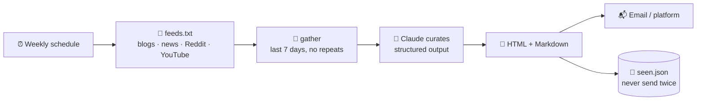

# 87 · Build-Along: The Automated Newsletter 📰💌

> ⏱️ ~2 hours to build · 🎯 Beginner → intermediate · 🧰 Needs: Python 3.10+ (or n8n), an Anthropic API key, an email account or newsletter platform

**By the end of this build-along, a beautiful newsletter will write itself every week.** It reads your favorite feeds, Claude
picks the best items and explains why each matters, and a lovely email lands in your inbox (or your subscribers'). You'll run
the [newsletter-pipeline kit](../../examples/newsletter-pipeline/), make it yours, put it on autopilot, and optionally rebuild it
with no code in n8n. Your own personal editor-in-chief, working while you sleep. ☕📬

<details class="eli5" open>
<summary>🧸 ELI5: This build in 30 seconds</summary>

Imagine a helper who reads all your favorite websites every week, picks the five most interesting things, writes a friendly
sentence about each, and puts them in a pretty email for you. That's this project! You choose the websites, and the helper
does the reading. 📰✨

</details>

<!-- in-this-chapter -->

## 🗺️ What you'll build

<details class="eli5">
<summary>🧸 ELI5</summary>

Feeds come in, old and repeated stories are thrown out, Claude picks the best, and a pretty email goes out.

</details>



## ✅ Before you start

<details class="eli5">
<summary>🧸 ELI5</summary>

Get Python ready and pick a few websites you love reading. That's most of it!

</details>

- [ ] Python 3.10+ and the kit: `cd examples/newsletter-pipeline && pip install -r requirements.txt`
- [ ] An **Anthropic API key** (with a spend limit)
- [ ] **5–10 favorite sources** with RSS or Atom feeds (most blogs, news sites, podcasts and YouTube channels have one)
- [ ] For sending: an email account with SMTP (an "app password"), or a newsletter platform account

## 1️⃣ Step 1: Test and dry run (10 min)

<details class="eli5">
<summary>🧸 ELI5</summary>

First check the machine works with pretend data, then try it with real websites but without the AI, just to see the email design.

</details>

```bash
python test_newsletter.py       # offline tests: parsing, filtering, de-duplication, safe HTML, structured output
python newsletter.py --dry-run  # real feeds, no AI, no key needed
```

Open `out/newsletter-YYYY-MM-DD.html` in your browser: that's your email design. 🎨

> ✅ **Checkpoint:** tests pass, and the dry-run email shows real items from the default feeds.

## 2️⃣ Step 2: Choose your feeds (20 min)

<details class="eli5">
<summary>🧸 ELI5</summary>

Pick the websites your newsletter reads. Most websites have a hidden "feed" address that lists their newest posts.

</details>

Edit `feeds.txt`, one feed URL per line:

| Source type | Feed URL pattern |
|---|---|
| Most blogs | `https://example.com/feed` or `/rss.xml` or `/atom.xml` (look for the RSS icon) |
| Substack | `https://name.substack.com/feed` |
| Reddit | `https://www.reddit.com/r/LocalLLaMA/top/.rss?t=week` |
| Hacker News (filtered) | `https://hnrss.org/newest?q=gardening&points=50` |
| YouTube channel | `https://www.youtube.com/feeds/videos.xml?channel_id=CHANNEL_ID` |
| Google News search | `https://news.google.com/rss/search?q=your+topic` |

**Can't find a feed?** Ask Claude: *"What's the RSS feed URL for [site]?"* (then test it), or use the site's newsletter instead.

> [!TIP]
> **💡 Theme it**
> The best newsletters have a clear theme: "AI for teachers," "cozy gaming," "urban gardening," "our town's news." A focused
> theme makes Claude's picks much better.

## 3️⃣ Step 3: Your first AI-curated issue (15 min)

<details class="eli5">
<summary>🧸 ELI5</summary>

Now let Claude read everything and pick the best stories for you, with a friendly note about each.

</details>

```bash
export ANTHROPIC_API_KEY=sk-ant-...
python newsletter.py --audience "busy parents who want practical AI tips" --count 5
```

Claude receives the candidate items and fills an **`Issue`** model (subject, intro, picks with "why it matters" and a tag,
and a "try this" tip). **Structured output** means no fragile JSON parsing ([Calling AI APIs](../part-5-building-with-ai/36-calling-ai-apis.md#-structured-output-data-instead-of-prose)).

Open the HTML in your browser and read it like a subscriber: is the subject inviting? Are the picks varied? Do the blurbs sound
warm and specific?

> ✅ **Checkpoint:** a curated issue in `out/`, and `seen.json` now remembers what was included.

## 4️⃣ Step 4: Make it yours (30 min)

<details class="eli5">
<summary>🧸 ELI5</summary>

Change the colors, the writing style and the sections so the newsletter feels like yours.

</details>

| Change | Where |
|---|---|
| 🗣️ **Voice & audience** | `--audience`, or the `system` text in `curate()`: add your style guide ([Writing & Content](../part-9-ai-for-life-and-work/61-writing-and-content.md#-teaching-ai-your-voice)) |
| 🎨 **Design** | Colors and fonts in `to_html()` (the header gradient, card borders) |
| ➕ **New section** | Add a field to `Issue` (e.g. `tool_of_the_week: str`) and render it: Claude fills it automatically |
| 🔢 **More or fewer picks** | `--count` |
| 🗓️ **Different window** | `--days 14` for a fortnightly issue |

Pair with Claude Code: *"Add a 'quote of the week' field to Issue, render it as a styled blockquote in the HTML, and extend
test_newsletter.py."*

> ✅ **Checkpoint:** your customized issue looks and sounds like *yours*, and the tests still pass.

## 5️⃣ Step 5: Send it (20 min)

<details class="eli5">
<summary>🧸 ELI5</summary>

Send the newsletter by email. For just you, your own email account works. For lots of readers, use a proper newsletter service.

</details>

=== "📬 Just me (SMTP)"

    ```bash
    export SMTP_HOST=smtp.gmail.com SMTP_PORT=587
    export SMTP_USER=you@example.com SMTP_PASSWORD=your-app-password NEWSLETTER_TO=you@example.com
    python newsletter.py --send
    ```

    Most email providers need an **app password** (not your normal password) for SMTP.

=== "👥 Real subscribers (platform)"

    For a list of readers, use a newsletter platform (Beehiiv, Buttondown, Kit, Substack). They handle **unsubscribes,
    deliverability and privacy laws**. Paste the generated HTML or Markdown into a draft, or use the platform's API to create
    drafts automatically, and **review before sending**.

> [!WARNING]
> **⚠️ Only email people who asked**
> Sending newsletters to people who didn't subscribe is spam (and illegal in many places). Use a platform with proper
> opt-in and unsubscribe links for anyone but yourself.

## 6️⃣ Step 6: Put it on autopilot (15 min)

<details class="eli5">
<summary>🧸 ELI5</summary>

Set a weekly alarm for the robot so the newsletter makes itself every Monday morning.

</details>

=== "⏰ cron"

    ```bash
    # Mondays at 7:00
    0 7 * * MON cd /path/to/newsletter-pipeline && . ./.env && python newsletter.py --send
    ```

=== "🐙 GitHub Actions"

    A `schedule` workflow that installs requirements and runs `python newsletter.py --send`, with the API key and SMTP password
    as **repository secrets**. Commit `seen.json` back so it remembers what it sent.

=== "⚙️ n8n (no code)"

    Rebuild the same flow visually: **Schedule Trigger → RSS Read (one per feed) → Merge → Code (filter & dedupe) → Claude
    (curate) → Gmail/Send Email**. Start from the [Morning AI Digest](../../examples/n8n-workflows/morning-ai-digest.json)
    workflow ([n8n Masterclass](../part-3-automation/16-n8n-masterclass.md)).

> ✅ **Checkpoint:** next Monday, a fresh issue arrives without you lifting a finger. ☕

## 🚀 Level-ups

<details class="eli5">
<summary>🧸 ELI5</summary>

Extra ideas to make your newsletter even better: add your own notes, research, pictures or an audio version.

</details>

| Level-up | How |
|---|---|
| ✍️ **Your own intro** | Add `--note "This week I…"` and have Claude weave it into the intro |
| 🔎 **Research section** | Run the [research agent](85-build-along-research-agent.md) on one topic and include a summary |
| 🖼️ **Header image** | Generate a themed image per issue ([Image Generation](../part-8-creative-ai/53-image-generation-deep-dive.md)) |
| 🎧 **Audio edition** | Turn the issue into a Gemini Notebook audio overview or a TTS reading |
| 📊 **Learn from readers** | Track clicks on your platform and tell Claude which topics performed best |
| 💰 **Make it a side hustle** | A niche newsletter people love can grow ([Turning AI Skills into Income](../part-10-mastery/78-turning-ai-skills-into-income.md)) |

## 🩺 Troubleshooting

<details class="eli5">
<summary>🧸 ELI5</summary>

If the newsletter is empty or doesn't send, here are the usual fixes.

</details>

| Problem | Fix |
|---|---|
| "Nothing new this time" | Widen `--days`, add feeds, or delete `seen.json` to start fresh |
| A feed is skipped with an error | The URL isn't a feed, or the site blocks bots. Try another feed URL |
| SMTP login fails | Use an **app password**, check `SMTP_HOST` and port 587 |
| Picks feel random | Sharpen `--audience`, and add a style guide and "what my readers love" to the prompt |
| Email looks broken in some apps | Keep inline styles (already done), and test in 2–3 email apps |

## 🎯 Key takeaways

- A newsletter pipeline = **feeds → filter & dedupe → AI curation → HTML → send → remember**.
- **Structured output** makes AI curation reliable, and **HTML escaping** keeps feed content from breaking your email.
- **`seen.json`** ensures nothing is sent twice.
- **cron, GitHub Actions or n8n** put it on autopilot.
- Use a **newsletter platform** for real subscribers, and only email people who opted in.

## 🧠 Check yourself

<details class="quiz">
<summary>❓ 1. Why does the pipeline keep a `seen.json` file?</summary>

To **remember what was already sent**, so the same item never appears in two issues.

</details>

<details class="quiz">
<summary>❓ 2. Why escape HTML from feed content?</summary>

Feed titles and summaries can contain HTML or code. Escaping stops them from **breaking your layout** (or injecting scripts).

</details>

<details class="quiz">
<summary>❓ 3. You want to send to 200 readers. SMTP from your Gmail, or a newsletter platform?</summary>

A **newsletter platform**: it handles opt-in, unsubscribes, deliverability and privacy rules.

</details>

> [!TIP]
> **🎮 Try this**
> Make a tiny newsletter for **one** person you love, on a topic *they* love (gardening, a sports team, a band, a hobby), and
> send them issue #1 this week. A thoughtful weekly email is a surprisingly lovely gift. 💌

---

**Next:** [88 · An AI Voice Receptionist →](88-build-along-voice-receptionist.md)
