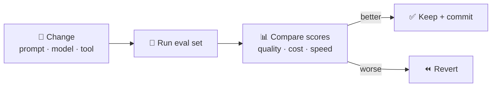

# 105 · Evaluating & Comparing AI: Evals for Normal People 🧪⚖️

> ⏱️ 6 min read · 🎯 Everyone choosing models, prompts or tools (and every builder) · 🧰 Needs: a spreadsheet and 10–20 real tasks

**"Which model is best?" The honest answer is "best at *what*, for *you*?"** Leaderboards are a starting point, but the only
benchmark that truly matters is **your tasks**. This chapter teaches the skill that separates AI power users from everyone
else: **testing things properly.** It's easier than it sounds, surprisingly fun, and it saves money, time and embarrassment.
We'll cover the 15-minute personal eval, scoring methods, LLM-as-judge, leaderboards, evaluating your own RAG bots and agents,
comparing tools, and the mindset that keeps you honest. 🧑‍🔬

<details class="eli5" open>
<summary>🧸 ELI5: This chapter in 30 seconds</summary>

Imagine you want to find the best pizza place in town. You wouldn't trust one ad. You'd try a few, order the same pizza at each,
and score them. **Evals** are the same for AI: give several AIs the same real jobs, score the answers fairly (without peeking at
which AI made which), and see which one does best for *your* needs. 🍕🏆

</details>

<!-- in-this-chapter -->

## 🤔 Why evaluate?

<details class="eli5">
<summary>🧸 ELI5</summary>

Testing tells you which AI is really best for your jobs, whether your changes helped, and whether something broke after an
update.

</details>

| Reason | Example |
|---|---|
| 🎯 **Pick the right model or tool** | A small, cheap model might do your job just as well |
| 🔧 **Know if a change helped** | Did the new prompt actually improve answers, or just *feel* better? |
| 🚨 **Catch regressions** | A model update quietly broke your invoice extraction |
| 🤝 **Build trust** | Before automating something important |
| 💸 **Save money** | Stop over-buying capability you don't need |

## 🏃 The 15-minute personal eval

<details class="eli5">
<summary>🧸 ELI5</summary>

Write down 10 real jobs, decide what a good answer looks like, try each job on a few AIs, and score them fairly. That's it!

</details>

1. **Collect 10–20 real tasks** you actually do: emails to draft, questions about your docs, data to extract, code to fix.
2. **Write down what "good" looks like** for each (a correct answer, or 3–5 criteria).
3. **Run each task** through the options you're comparing (models, prompts, tools).
4. **Score them blind** if you can: hide which output came from where. (Ask a friend to shuffle, or use a tool.)
5. **Tally the results**, and note cost and speed too.

| Task | Criteria | Model A | Model B | Model C |
|---|---|---|---|---|
| Reply to an angry customer email | Empathetic, concise, offers a fix, no over-promising | 4/5 | 5/5 | 3/5 |
| Extract invoice fields | All 6 fields correct | ✅ | ✅ | ❌ (missed due date) |
| Summarize a meeting | Captures all decisions + owners | 3/4 | 4/4 | 4/4 |
| Explain a concept to a 12-year-old | Accurate, simple, one good analogy | 5/5 | 4/5 | 4/5 |

Put it in a spreadsheet. Congratulations, you've built an **eval set**. 🎉

## 📏 Scoring methods

<details class="eli5">
<summary>🧸 ELI5</summary>

Some answers are simply right or wrong. Others need a checklist of what makes them good. Comparing two answers side by side is
often easiest.

</details>

| Method | Use for | Notes |
|---|---|---|
| **Exact match / checks** | Extraction, classification, math, code (tests!) | Objective and automatable: the gold standard |
| **Rubric scoring (you)** | Writing, advice, creativity | 3–5 specific criteria, not vibes |
| **Pairwise comparison** | "Which is better, A or B?" | Humans are better at comparing than rating |
| **LLM-as-judge** | Scaling rubric scoring | A strong model grades outputs against your rubric |
| **Real-world signals** | Deployed bots and tools | 👍/👎 buttons, edits users make, escalation rates |

**A good rubric is specific:**

| ❌ Vague | ✅ Specific |
|---|---|
| "Good tone" | "Acknowledges the problem in the first sentence" |
| "Accurate" | "All prices match the price list" |
| "Helpful" | "Ends with one clear next step" |
| "Concise" | "Under 120 words" |

## 🤖 LLM-as-judge (and how not to fool yourself)

<details class="eli5">
<summary>🧸 ELI5</summary>

You can ask a smart AI to grade other AIs' answers using your checklist. It's fast, but check its grading yourself sometimes,
because judges can be unfair too.

</details>

```text
You are grading a customer-support reply. Score each criterion 0 or 1, with a one-line reason:
1. Acknowledges the customer's problem in the first sentence.
2. Offers a concrete fix or next step.
3. Makes no promises about refunds (policy: humans decide refunds).
4. Under 120 words.
5. Warm, not robotic.
Return JSON: {"scores": [..], "reasons": [..], "total": n}.
```

| Pitfall | Fix |
|---|---|
| **Position bias** (prefers the first answer) | Randomize order, or judge each answer alone |
| **Length bias** (prefers longer answers) | Put length limits in the rubric |
| **Self-preference** (likes its own model's style) | Use a different model as judge, and spot-check |
| **Vague rubrics** | Binary, specific criteria |
| **Blind trust** | Compare the judge's scores with yours on 10–20 examples |

## 🏟️ Arenas & leaderboards

<details class="eli5">
<summary>🧸 ELI5</summary>

Leaderboards are like sports rankings for AI. They tell you who the top players are, but your own test tells you who's best for
your team.

</details>

| Resource | What it measures |
|---|---|
| **LMArena** | Human preference votes in blind head-to-heads (text, vision, coding, images and more) |
| **Artificial Analysis** | Quality indices, speed and price comparisons, including image and video arenas |
| **SWE-bench & coding leaderboards** | Real-world coding tasks |
| **Specialized leaderboards** | Embeddings (MTEB), agents, long context, reasoning |
| **Vendor model cards** | Benchmarks the labs report (read the fine print) |

Leaderboards tell you **who's in the top tier**. Your own eval tells you **who's best for you**. Benchmarks can also be
"saturated" (everyone scores near 100%) or leaked into training data, so treat them as hints.

## 🛠️ Evaluating your own AI systems

<details class="eli5">
<summary>🧸 ELI5</summary>

If you build an AI bot or robot, keep a quiz for it. Every time you change something, run the quiz again to make sure it got
better, not worse.

</details>

Building RAG bots, agents or automations? Treat quality like code:



- **Keep a test set** (inputs + expected outputs) in a file. The RAG kit's [`test_rag.py`](../../examples/rag-from-scratch/test_rag.py)
  is a tiny example.
- **Re-run after every change** (prompt, model, chunk size, tool description).
- **Track metrics over time:** accuracy, "I don't know" correctness, cost per task, latency.
- **Include edge cases:** empty input, trick questions, prompt-injection attempts, questions with no answer in the docs.
- **Evaluate agents on outcomes *and* trajectories:** did it finish, and did it take a sensible path (tool calls, turns, cost)?
- **Tools that help:** promptfoo, n8n evaluations, Braintrust, LangSmith, Langfuse, Arize Phoenix, and the providers' own eval
  tooling ([Agent Frameworks Tour](../part-7-building-with-ai/69-agent-frameworks-tour.md#-tracing--observability)).

## 🧰 Comparing tools (not just models)

<details class="eli5">
<summary>🧸 ELI5</summary>

When choosing between apps, try each one on the same real jobs and score them on quality, ease, price and privacy.

</details>

When choosing between, say, three meeting-note apps or two automation platforms:

1. Run each on the **same 3 real scenarios**.
2. Score: **output quality, setup time, integrations, privacy, cost**, and "did I enjoy using it?"
3. Pick one and **commit for 30 days** before re-evaluating.

| Criterion | Tool A | Tool B | Tool C |
|---|---|---|---|
| Quality (1–5) | | | |
| Setup time | | | |
| Integrations I need | | | |
| Privacy fit | | | |
| Monthly cost | | | |
| Joy factor 😄 | | | |

## 🧠 Mindset tips

<details class="eli5">
<summary>🧸 ELI5</summary>

One great or terrible answer doesn't prove anything. Test lots of times, and remember the cheapest option is sometimes just as
good.

</details>

- **Beware the first impression.** One amazing (or awful) answer isn't a trend. Test 10+.
- **Variance is real.** Run important tests 2–3 times.
- **Cheaper often wins.** A smaller model frequently scores the same on simple tasks at a fraction of the cost.
- **Re-test when models update.** The landscape shifts every few months.
- **Write it down.** Your eval spreadsheet becomes more valuable every time you reuse it.

## 🎯 Key takeaways

- The best model is **the best for your tasks**: build a 10–20 task **eval set**.
- Score with **checks, specific rubrics, pairwise comparisons** or a **validated LLM judge**.
- **Leaderboards** show the top tier; **your eval** picks the winner.
- For your own systems, **re-run evals after every change** and include edge cases.
- Test **enough times**, and don't forget **cost and speed**.

## 🧠 Check yourself

<details class="quiz">
<summary>❓ 1. Why score outputs "blind"?</summary>

So your **expectations about which model is better** don't bias your scores.

</details>

<details class="quiz">
<summary>❓ 2. What's one weakness of LLM-as-judge, and how do you handle it?</summary>

Biases like **position, length or self-preference**. Randomize order, use specific rubrics, and **spot-check** against your own
scores.

</details>

<details class="quiz">
<summary>❓ 3. You changed your RAG bot's chunk size. How do you know if it helped?</summary>

**Re-run your eval set** and compare scores (accuracy, citations, "I don't know" handling, cost) before and after.

</details>

> [!TIP]
> **🎮 Try this: model tasting night**
> Write 10 prompts that matter to you, run them through 3 assistants (free tiers are fine), and score them blind. Share your
> results with a friend. You'll learn more about AI in one evening than from a month of reading hot takes. 🍷

---

**Next:** [106 · Cost Optimization Deep Dive →](106-cost-optimization.md)
