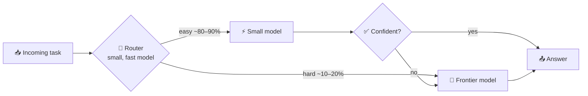

# 106 · Cost Optimization Deep Dive: Same Magic, Smaller Bill 💸📉

> ⏱️ 6 min read · 🎯 Anyone paying for AI subscriptions, APIs or automation platforms · 🧰 Needs: access to your usage dashboards, and ideally an eval set ([Evaluating AI](105-evaluating-ai.md))

**AI can be almost free or surprisingly expensive, depending on how you use it.** The good news: a few simple habits usually cut
costs dramatically with no loss in quality. This chapter is your money-saving playbook for subscriptions, API bills and
automation platforms: how the bill works, the levers in the order you should pull them, model routing, guardrails against
surprise bills, and worked examples. Let's make every token count. 🪙

<details class="eli5" open>
<summary>🧸 ELI5: This chapter in 30 seconds</summary>

Using AI is a bit like using electricity: every little bit costs a tiny amount, and it adds up if you leave the lights on. This
chapter teaches you to switch off lights you don't need, use cheaper bulbs for small rooms, and save the super-bright ones for
when you really need them. Same brightness where it matters, smaller bill. 💡💰

</details>

<!-- in-this-chapter -->

## 📦 Subscriptions: stop overpaying

<details class="eli5">
<summary>🧸 ELI5</summary>

Many people pay for several AI apps they barely use. Keep one main one, use free versions of others, and check every few
months.

</details>

| Tip | Why |
|---|---|
| **One main paid assistant**, free tiers for the rest | Most people don't need three paid plans |
| **Audit quarterly** | Cancel tools you haven't opened in 30 days |
| **Annual billing** for tools you're sure about | Usually cheaper |
| **Team/business plans** only when you need admin or privacy features | They cost more per seat |
| **Check what's bundled** | E.g. Claude paid plans include Claude Code, and Google/Microsoft bundles include Gemini/Copilot features |
| **Hitting limits often?** | Compare the higher tier's cost to your API usage. Sometimes upgrading is cheaper than pay-per-token (and vice versa) |

## 🧾 API costs: understanding the bill

<details class="eli5">
<summary>🧸 ELI5</summary>

You pay for the words going in and the words coming out. The words coming out cost more. Long conversations and robot loops
use lots of words.

</details>

```text
cost ≈ (input tokens × input price) + (output tokens × output price)
       − discounts (cached input, batch)
```

| Fact | What it means |
|---|---|
| **Output costs several times more** than input | Long answers are the expensive part |
| **Thinking/reasoning tokens** are billed as output | Deep thinking on easy tasks wastes money |
| **Agents multiply calls** | A 10-step agent resends the growing conversation ~10 times |
| **Tool results count as input** | Big web pages or file dumps add up fast |
| **Images and PDFs** use tokens too | Resize images, send only needed pages |

**Always log `usage`** from API responses (input, output and cached tokens). You can't optimize what you can't see
([Calling AI APIs](../part-7-building-with-ai/67-calling-ai-apis.md#-make-it-cheap--fast)).

## 🎚️ The levers, in order

<details class="eli5">
<summary>🧸 ELI5</summary>

Start with the free savings that don't change quality at all, then try the ones that need a bit of testing.

</details>

### 🆓 1. Free wins (no quality trade-off)

| Lever | Savings | How |
|---|---|---|
| **Prompt caching** | Big on repeated prefixes | Keep stable content (system prompt, docs, tool list) at the start, variable content at the end |
| **Trim the input** | Proportional | Send the relevant excerpt, not the whole file. Summarize old conversation turns |
| **Filter before AI** | Up to 100% per item | Plain workflow logic skips items that don't need AI |
| **Batch API** | Around half off | For non-urgent bulk jobs (overnight classification, bulk summaries) |
| **Deduplicate** | Varies | Don't reprocess the same email, doc or row. Store what's done |
| **Cache results** | Up to 100% on repeats | Same question twice? Return the saved answer |

### ⚖️ 2. Then the trade-offs (test with evals!)

| Lever | How |
|---|---|
| **Lower effort / thinking** | Simple tasks don't need deep reasoning. Tune per task |
| **Smaller model for simple steps** | Classify, extract and route with small, fast models |
| **Cap output length** | Concise formats (JSON, bullets), sensible `max_tokens` |
| **Fewer agent turns** | Better tool descriptions → fewer wasted calls, plus turn limits |
| **Local models for grunt work** | High-volume, low-stakes tasks for the cost of electricity ([Local & Open Models](../part-9-local-ai/78-local-and-open-models.md)) |

> [!TIP]
> **💡 Measure before downgrading**
> Run your eval set on the cheaper option and judge **cost per completed task**, not per request. A cheap model that needs
> retries isn't cheap ([Evaluating AI](105-evaluating-ai.md)).

## 🔀 Model routing: the biggest structural win

<details class="eli5">
<summary>🧸 ELI5</summary>

Send easy jobs to a small, cheap AI and only send hard jobs to the big, expensive one, like asking a junior helper first and
calling the expert only when needed.

</details>



**Patterns:** a cheap classifier routes by difficulty; a small model answers first and **escalates** when unsure; or a big
model **plans** while small models **execute** the steps ([Multi-Agent Systems](../part-7-building-with-ai/70-multi-agent-systems.md)).

## ⚙️ Automation-platform costs

<details class="eli5">
<summary>🧸 ELI5</summary>

Automation apps charge in different ways: per step, per action or per run. Knowing which helps you design cheaper robots.

</details>

| Platform | Billing unit | Optimization |
|---|---|---|
| **Zapier** | Tasks (each action step) | Filters early, Formatter instead of AI for simple text, fewer steps |
| **Make** | Operations/credits (each module run) | Aggregate before processing, avoid unnecessary iterations |
| **n8n Cloud** | Executions (whole runs) | Complex workflows cost the same per run. Self-hosting removes limits ([n8n Masterclass](../part-5-automation/47-n8n-masterclass.md)) |
| **All** | Plus AI API costs | Cache, batch and right-size models inside workflows |

## 🛡️ Guardrails against surprise bills

<details class="eli5">
<summary>🧸 ELI5</summary>

Set limits so a mistake can never cost a lot: spending caps, step limits on robots, and trying things on a few items first.

</details>

- [ ] **Spend limits** in every API console (hard caps + alerts at 50% and 80%)
- [ ] **Separate API keys per project** so you can see what's spending
- [ ] **Turn limits** on agents and **max items** on loops
- [ ] **Rate limits** on any public-facing app that calls AI (bots can drain your budget!)
- [ ] **Test on 5 items** before running on 5,000
- [ ] A **monthly review** of usage dashboards

## 🧮 Worked example: the email summarizer

<details class="eli5">
<summary>🧸 ELI5</summary>

Here's a real example: the same robot job done the expensive way and the smart way, with the same quality where it counts.

</details>

**The job:** summarize ~100 emails a day for a morning digest.

| Version | Setup | Relative cost |
|---|---|---|
| 😬 **Naive** | Frontier model, max thinking, full threads with quoted history, one call per email | 💰💰💰💰💰 |
| 🙂 **Trimmed** | Only the latest message in each thread, concise output format | 💰💰💰 |
| 😎 **Cached + routed** | Shared instructions cached, a small model triages, only the ~10% important emails get the frontier model | 💰 |
| 🤩 **Batched** | The same, via the Batch API overnight | Even less |

Same useful digest, a fraction of the cost. The pattern: **route easy work to cheap paths, and save expensive intelligence for
where it earns its keep.** (Real prices vary by model and change over time, so always measure your own.)

## 🎯 Key takeaways

- **One main subscription**, quarterly audits, and check what's bundled.
- On APIs, **output and thinking tokens** are the expensive part, and **agents multiply calls**.
- Pull **free levers first**: caching, trimming, filtering, batching, deduplication.
- **Model routing** is the biggest structural win: small models for most work, big models where it matters.
- **Spend limits, per-project keys, turn limits and small test runs** prevent surprise bills.

## 🧠 Check yourself

<details class="quiz">
<summary>❓ 1. Where should stable content go in a prompt to benefit from caching?</summary>

At the **start** (system prompt, documents, tool definitions), with **variable content at the end**.

</details>

<details class="quiz">
<summary>❓ 2. A cheaper model is 5× cheaper per call but fails 40% of the time, needing retries. Is it cheaper?</summary>

**Maybe not.** Compare **cost per completed task** (including retries and fixes), measured on your eval set.

</details>

<details class="quiz">
<summary>❓ 3. What's model routing?</summary>

Sending **easy tasks to small, cheap models** and only **hard tasks to frontier models** (often with a cheap router or escalation
step).

</details>

> [!TIP]
> **🎮 Try this**
> Pick one automation or script you run and **log its token usage for a day**. Then apply just two levers (trimming + caching, or a
> smaller model for one step) and compare. Watching the number drop is deeply satisfying. 📉😄

---

**Next:** [107 · AI Ethics for Builders →](107-ai-ethics-for-builders.md)
