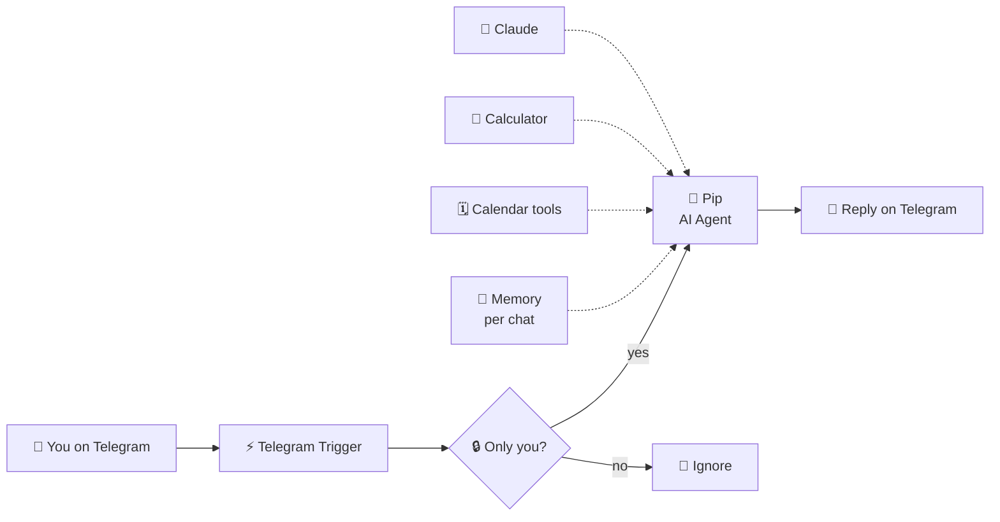

# 112 · Build-Along: Your Pocket AI Assistant on Telegram 📱🤖

> ⏱️ ~3 hours to build · 🎯 Beginner → intermediate (no code) · 🧰 Needs: n8n (cloud or self-hosted), a Telegram account, an Anthropic API key, a Google account

**By the end of this build-along, you'll have your own AI assistant living in Telegram.** It's called Pip (rename it!), it
remembers your conversation, checks your Google Calendar, adds events after you confirm, does math, and politely ignores
everyone except you. You'll use n8n's AI Agent, a memory node and tools, all visually, no code. Then you'll level it up with
voice notes, a morning briefing and more. Let's build your pocket sidekick! 🚀

🧸 ELI5: This build in 30 seconds

We're building a robot friend you can text from your phone. You send "what's on tomorrow?" and it looks at your calendar and
answers. You say "add dentist Friday at 3" and it asks "shall I add it?" and then does. It remembers what you talked about,
and it only listens to you, never strangers. It's built from blocks you connect together, like LEGO. 🧱📱

<!-- in-this-chapter -->

> [!NOTE]
> **🌍 Prefer ChatGPT's or Gemini's brain?**
> This build uses Claude, but n8n's **AI Agent** node works with many chat models. Swap the Anthropic chat model node
> for **OpenAI**, **Google Gemini**, **Mistral**, **DeepSeek**, **xAI Grok** or a local **Ollama** model, and use that
> provider's API key. Everything else (Telegram, memory, tools) stays exactly the same.

## 🗺️ What you'll build

🧸 ELI5

Here's the map: your message goes to Telegram, then to n8n, which checks it's you, asks the AI brain (with memory and tools),
and sends the answer back to your phone.

| Piece | Job |
|---|---|
| **Telegram Trigger** | Wakes the workflow when you message your bot |
| **Only me? 🔒** | Checks the sender is you (so strangers can't use your AI budget) |
| **AI Agent + Claude** | The brain that decides what to do |
| **Memory (per chat)** | Remembers the last 20 messages of your conversation |
| **Calendar & calculator tools** | Things Pip can *do* |
| **Reply on Telegram** | Sends the answer back |

The ready-made workflow is [`telegram-pocket-assistant.json`](../../examples/n8n-workflows/telegram-pocket-assistant.json).

## ✅ Before you start

🧸 ELI5

Gather your ingredients first: an n8n account, Telegram on your phone, an AI key, and your Google calendar.

- [ ] **n8n** running: n8n Cloud, or self-hosted with a public HTTPS URL ([n8n Masterclass](../part-5-automation/47-n8n-masterclass.md)).
      Telegram needs to reach n8n over HTTPS, so a laptop-only `localhost` setup won't receive messages (use n8n Cloud or a
      tunnel like Cloudflare Tunnel).
- [ ] **Telegram** installed on your phone.
- [ ] An **Anthropic API key** with a **spend limit** set ([Safety, Costs & Gotchas](../part-12-mastery/103-safety-costs-and-gotchas.md)).
- [ ] A **Google account** with a calendar.

## 1️⃣ Step 1: Create your Telegram bot (5 min)

🧸 ELI5

Telegram has a special robot called BotFather who makes new robots. You ask it for a new bot, give it a name, and it gives
you a secret key.

1. In Telegram, search for **@BotFather** (the official one has a blue check ✅) and start a chat.
2. Send `/newbot`.
3. Choose a display name (e.g. *Pip*) and a username ending in `bot` (e.g. `pip_alex_bot`).
4. BotFather replies with a **token** like `123456:ABC-DEF…`. **Copy it and keep it secret.** 🔑
5. Find **your own Telegram user ID**: message **@userinfobot** and copy the number it shows.

> ✅ **Checkpoint:** you have a bot token and your numeric user ID written down somewhere safe (a password manager is ideal).

## 2️⃣ Step 2: Import the workflow (5 min)

🧸 ELI5

Instead of building from scratch, load the ready-made blueprint into n8n. It's like opening a LEGO set that's already
sorted.

1. Download [`telegram-pocket-assistant.json`](../../examples/n8n-workflows/telegram-pocket-assistant.json).
2. In n8n, create a new workflow → **⋯ menu → Import from File**.
3. You'll see the blocks from the map above. Nodes with ⚠️ need credentials (next steps).

> ✅ **Checkpoint:** the canvas shows the Telegram Trigger, the "Only me? 🔒" check, the AI Agent with Claude, memory and
> three tools, and the reply node.

## 3️⃣ Step 3: Connect Telegram and lock it to you (10 min)

🧸 ELI5

Give n8n your bot's secret key so it can hear messages, and write your ID in the lock so only you get answers.

1. Open **Telegram Trigger** → **Credential** → *Create new* → paste your bot token → save.
2. Open **Reply on Telegram** and select the same credential.
3. Open **Only me? 🔒** and replace `PASTE_YOUR_TELEGRAM_USER_ID` with your numeric ID.

> [!WARNING]
> **🔐 Don't skip the lock**
> Anyone who finds your bot's username could message it. Without the lock, strangers could chat with your AI on your bill
> and see your calendar. The "Only me?" check makes Pip ignore everyone but you.

> ✅ **Checkpoint:** both Telegram nodes show your credential, and the lock has your ID.

## 4️⃣ Step 4: Connect Claude (5 min)

🧸 ELI5

Plug in the AI brain by giving n8n your Anthropic key.

1. Open the **Claude** node → **Credential** → *Create new* → paste your Anthropic API key.
2. The model is set to `claude-opus-5`. For a cheaper, faster assistant, pick a smaller model here ([Cost Optimization](../part-12-mastery/106-cost-optimization.md)).

> ✅ **Checkpoint:** the Claude node has no ⚠️ warning.

## 5️⃣ Step 5: Connect Google Calendar (10 min)

🧸 ELI5

Let Pip peek at your calendar and add events, by signing in to Google through n8n.

1. Open **Upcoming events** → **Credential** → *Create new* → **Sign in with Google** and allow calendar access.
2. Open **Create event** and select the same credential.
3. Both tools use your **primary** calendar. Pick another calendar from the dropdown if you like.

The tool parameters use `$fromAI(...)`, which lets the AI fill in values like the date range or event title itself
([n8n AI Agents](../part-5-automation/48-n8n-ai-agents.md)).

> ✅ **Checkpoint:** both calendar tools show your Google credential.

## 6️⃣ Step 6: First conversation! (10 min)

🧸 ELI5

Turn it on and say hi. If it answers, your robot is alive! 🎉

1. Click **Save**, then toggle the workflow **Active** (top right).
2. On your phone, open your bot and send: *"Hi Pip! What can you do?"*
3. Then try:
    - *"What's on my calendar tomorrow?"*
    - *"Add 'Call Mum' on Sunday at 5pm for 30 minutes."* → Pip should **confirm details first**. Reply *"yes"*.
    - *"If I save $45 a week, how much will I have by Christmas?"*
    - *"What did I just ask you to add?"* (tests memory 🧠)

> ✅ **Checkpoint:** Pip answers, reads your calendar, creates an event after you confirm, and remembers the conversation.
> Check **Executions** in n8n to watch each run step by step.

## 🎨 Step 7: Give Pip a personality

🧸 ELI5

Change how your robot talks: cheerful coach, wise owl, pirate… whatever makes you smile.

Open the **Pip (AI Agent)** node → **Options → System Message**. It already includes today's date, tool rules and safety
rules. Change the first line to give Pip a new personality:

| Personality | First line |
|---|---|
| 🏋️ Cheerful coach | *"You are Pip, an energetic, encouraging coach who celebrates every small win."* |
| 🦉 Wise owl | *"You are Pip, a calm, thoughtful owl who gives gentle, wise advice."* |
| 🏴‍☠️ Pirate | *"You are Pip, a friendly pirate first mate. Speak like a pirate, but keep facts accurate."* |
| 🧘 Minimalist | *"You are Pip. Answer in as few words as possible."* |

Keep the tool rules (confirm before creating events, never invent events). They're what make Pip trustworthy.

## 🚀 Level-ups

🧸 ELI5

Once Pip works, you can teach it new tricks: understanding voice messages, sending you a morning plan, and more.

| Level-up | How |
|---|---|
| 🎙️ **Voice messages** | Add a Switch on message type: voice → Telegram "Get File" → transcribe (OpenAI Whisper node or a local Whisper server) → the agent |
| 🌅 **Morning briefing** | A second workflow: Schedule Trigger (7am) → AI Agent with calendar tool → *"Summarize my day and suggest one priority"* → Telegram |
| ✅ **Tasks** | Add a Todoist, Google Tasks or Notion tool so Pip manages your to-dos |
| 🌦️ **Weather** | Add your [Weather Buddy MCP server](113-build-along-publish-an-mcp-server.md) via n8n's MCP Client Tool |
| 📚 **Your notes** | A vector store tool with your documents ([Build a RAG System](../part-8-knowledge-and-memory/74-build-a-rag-system.md)) |
| 🧠 **Long-term memory** | Swap Simple Memory for Postgres Chat Memory so memory survives restarts ([Memory for Agents](../part-8-knowledge-and-memory/75-memory-for-agents.md)) |
| 👨‍👩‍👧 **Family mode** | Allow a list of IDs in the lock, and give each person their own memory (the key is the chat ID) |

## 🩺 Troubleshooting

🧸 ELI5

If your robot doesn't answer, check these things one by one, like checking if a toy has batteries.

| Problem | Fix |
|---|---|
| No reply at all | Is the workflow **Active**? Is your n8n reachable over **HTTPS**? Check **Executions** for errors |
| Executions show "false" at the lock | Your user ID in **Only me? 🔒** doesn't match. Re-check @userinfobot |
| Calendar errors | Reconnect the Google credential, and check the calendar is selected in both tools |
| Wrong dates ("tomorrow" is off) | Set your **timezone** in n8n settings (and the workflow's settings) |
| Pip creates events without asking | Strengthen the system message: *"Always confirm title, date and time before calling Create event."* |
| Replies cut off | Raise max tokens in the Claude node, or ask Pip to be concise |
| Costs creeping up | A smaller model, shorter memory window (e.g. 10), and a spend limit |

Stuck? Paste the failing node's error from **Executions** into Claude: *"Here's my n8n error, what's wrong?"*

## 🎯 Key takeaways

- A **Telegram Trigger + AI Agent + memory + tools + reply** is a complete personal assistant, no code needed.
- **Lock it to your user ID** so strangers can't use it.
- `$fromAI()` lets the agent fill in tool parameters itself.
- **Confirm before acting** on anything that changes your calendar (or anything else).
- Level up with **voice, briefings, tasks, weather, notes and long-term memory**.

## 🧠 Check yourself

❓ 1. Why does the workflow check your Telegram user ID?

So **only you** can use the assistant: strangers can't spend your API budget or see your calendar.

❓ 2. What makes Pip remember the conversation?

The **Memory (per chat)** node, keyed by the Telegram **chat ID**, which keeps the last 20 messages.

❓ 3. Why should Pip confirm before creating an event?

Because AI can misunderstand dates or titles. **Confirming before acting** prevents mistakes on things that change your
real calendar.

> [!TIP]
> **🎮 Try this**
> Once Pip works, add the **morning briefing** level-up and live with it for a week. Then ask Pip: *"Based on our chats this
> week, what should I automate next?"* Your pocket assistant just became your automation coach. 🤖📱

---

**Next:** [113 · Publish Your Own MCP Server →](113-build-along-publish-an-mcp-server.md)
