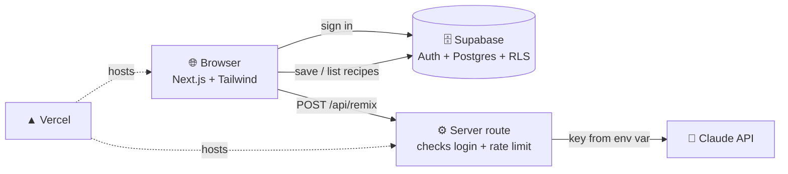

# 115 · Build-Along: A Web App with Logins & AI 🍲💻

> ⏱️ A weekend · 🎯 Intermediate (no prior coding needed if you use Claude Code) · 🧰 Needs: Claude Code (or Cursor), Node.js, free GitHub, Supabase and Vercel accounts, an Anthropic API key

**This weekend you'll ship a real web app to the internet: Recipe Box.** People sign in, save their own recipes (private to
them), and tap **✨ Remix** to have Claude invent a new dish from whatever's in their fridge. You'll build it with Claude Code
as your pair programmer, store data in Supabase with proper row-level security, keep your AI key safely on the server, and
deploy on Vercel with a link you can send to friends. This is the full-stack journey, one checkpoint at a time. 🚀

<details class="eli5" open>
<summary>🧸 ELI5: This build in 30 seconds</summary>

We're making a recipe website where each person has their own secret recipe box. You log in, save your recipes, and there's a
magic button: type "I have eggs, spinach and feta" and the AI invents a recipe for you. Then we put the website on the internet
so your friends can use it too. An AI coding helper writes most of the code while you steer. 👩‍🍳✨

</details>

<!-- in-this-chapter -->

> [!NOTE]
> **🌍 Mix and match providers**
> The builder and the brain can be anything: build with Claude Code, **Codex**, **Gemini CLI**, **Cursor** or
> **Lovable**, and have your app's AI feature call **OpenAI**, **Gemini** or Claude (the pattern is identical, see
> [Calling AI APIs Directly](../part-7-building-with-ai/67-calling-ai-apis.md#-the-same-first-call-with-openai-gemini--friends)).

## 🗺️ What you'll build

<details class="eli5">
<summary>🧸 ELI5</summary>

The website runs in your browser, remembers recipes in a database, knows who's logged in, and asks Claude for ideas through a
safe back door on the server.

</details>



| Feature | Built with |
|---|---|
| Sign up / sign in (magic link email) | Supabase Auth |
| Private recipes per user | Postgres table + **row-level security** |
| ✨ Remix: a new recipe from your ingredients | A server route calling the Claude API with **structured output** |
| Pretty, mobile-friendly UI | Tailwind + a component library |
| A public link | Vercel |

Background: [Vibe Coding](../part-7-building-with-ai/65-vibe-coding-your-first-app.md), [Deploying & Hosting](../part-7-building-with-ai/66-deploying-and-hosting.md),
[Calling AI APIs](../part-7-building-with-ai/67-calling-ai-apis.md).

## ✅ Before you start

<details class="eli5">
<summary>🧸 ELI5</summary>

Make free accounts on GitHub, Supabase and Vercel, and have Claude Code ready. Set a spending limit on your AI key.

</details>

- [ ] **Claude Code** installed ([Claude Code Masterclass](../part-7-building-with-ai/62-claude-code-masterclass.md)), Node.js 20+
- [ ] Free accounts: **GitHub**, **Supabase**, **Vercel**
- [ ] An **Anthropic API key** with a **spend limit**
- [ ] 30 minutes to write the spec (next step) 📝

## 1️⃣ Step 1: Write the spec (20 min)

<details class="eli5">
<summary>🧸 ELI5</summary>

Before building, write a short "what I want" note. Clear wishes make a better app.

</details>

Create a folder and a `SPEC.md`:

```markdown
# Recipe Box

## What it does
People keep their own private recipes, and can "Remix": type ingredients, get a new recipe idea from AI, and save it.

## Users
Sign in with an email magic link. Each user sees ONLY their own recipes.

## Screens
1. Landing: friendly hero, "Sign in with email".
2. My recipes: grid of cards (title, tags), search box, "New recipe" button.
3. Recipe page: ingredients list, steps, tags, edit, delete (with confirm).
4. ✨ Remix: textarea "What's in your fridge?", diet options, result card with "Save to my box".

## Look & feel
Warm and cozy: cream background, tomato-red accent, rounded cards, big friendly buttons, mobile-first.

## Rules
- The AI key lives on the server only. Remix requires login. Max 20 remixes per user per day.
- Not in v1: sharing, images, payments.
```

> [!TIP]
> **🪄 Let Claude interview you**
> *"Interview me with 8 questions to improve this spec, then rewrite it."* A sharper spec saves hours later.

## 2️⃣ Step 2: Scaffold with Claude Code (30 min)

<details class="eli5">
<summary>🧸 ELI5</summary>

Ask your AI coding helper to set up the empty app and a pretty first page, then check it works on your computer.

</details>

```bash
mkdir recipe-box && cd recipe-box && git init
# put SPEC.md here, then:
claude
```

Switch to **plan mode** (`Shift+Tab`) and say:

> *"Read SPEC.md. Propose a step-by-step build plan using Next.js (App Router, TypeScript), Tailwind and Supabase. Step 1 is
> only: scaffold the app, build the landing page and a layout matching the look & feel, and run it locally. Wait for my OK
> before each step."*

Approve the plan, let it build step 1, then open the local URL it gives you. Run `/init` to create a `CLAUDE.md`, and
**commit**. 💾

> ✅ **Checkpoint:** a cozy landing page runs at `http://localhost:3000`, and your first commit is saved.

## 3️⃣ Step 3: Supabase: auth and a secure table (30 min)

<details class="eli5">
<summary>🧸 ELI5</summary>

Make a database for recipes and switch on the rule that says "you can only see your own recipes." This is the most important
safety step!

</details>

1. Create a **Supabase project**. In **Authentication → URL Configuration**, add `http://localhost:3000` as a redirect URL.
2. In the **SQL Editor**, run:

    ```sql
    create table public.recipes (
      id uuid primary key default gen_random_uuid(),
      user_id uuid not null default auth.uid() references auth.users (id) on delete cascade,
      title text not null,
      ingredients text[] not null default '{}',
      steps text not null default '',
      tags text[] not null default '{}',
      created_at timestamptz not null default now()
    );

    alter table public.recipes enable row level security;

    create policy "Read own recipes"   on public.recipes for select using ((select auth.uid()) = user_id);
    create policy "Add own recipes"    on public.recipes for insert with check ((select auth.uid()) = user_id);
    create policy "Edit own recipes"   on public.recipes for update using ((select auth.uid()) = user_id)
                                                               with check ((select auth.uid()) = user_id);
    create policy "Delete own recipes" on public.recipes for delete using ((select auth.uid()) = user_id);
    ```

3. Copy the **project URL** and **anon (public) key** into `.env.local` (make sure `.env.local` is in `.gitignore`):

    ```bash
    NEXT_PUBLIC_SUPABASE_URL=https://your-project.supabase.co
    NEXT_PUBLIC_SUPABASE_ANON_KEY=your-anon-key
    ```

4. Tell Claude Code: *"Step 2: add Supabase magic-link sign-in and sign-out using the official SSR helpers, and protect the
   'My recipes' page so signed-out visitors go to the landing page."*

> [!WARNING]
> **🔐 Row-level security is the #1 safety step**
> Without RLS, anyone with your public anon key could read **everyone's** recipes. With the policies above, each person only
> ever sees their own rows, even if your front-end code has a bug.

> ✅ **Checkpoint:** you can sign in with a magic link and sign out, and the recipes page is protected.

## 4️⃣ Step 4: Recipes CRUD (60 min)

<details class="eli5">
<summary>🧸 ELI5</summary>

Build the buttons to add, show, change and delete recipes. "CRUD" just means those four things.

</details>

> *"Step 3: build 'My recipes' (grid, search), 'New recipe', the recipe page, edit and delete with a confirmation. Use the
> Supabase client with the signed-in user. Add loading and empty states that feel friendly. Test it in the browser with
> Playwright and fix anything broken."*

Then **test security yourself**: sign in as a **second user** (another email) and confirm you can't see the first user's
recipes, even by visiting a recipe URL directly.

> ✅ **Checkpoint:** create, read, update and delete all work, and user B can't see user A's recipes. Commit! 💾

## 5️⃣ Step 5: The ✨ Remix feature (60 min)

<details class="eli5">
<summary>🧸 ELI5</summary>

Now the magic button: the website sends your ingredients to a safe spot on the server, the server asks Claude for a recipe, and
sends it back to show you.

</details>

**The golden rule:** the Claude API key lives **only on the server**. Add it to `.env.local` **without** the `NEXT_PUBLIC_`
prefix:

```bash
ANTHROPIC_API_KEY=sk-ant-...
```

Then:

> *"Step 4: add the ✨ Remix page and a POST /api/remix server route. The route must: (1) reject signed-out users, (2) allow
> max 20 remixes per user per day (store counts in a Supabase table), (3) call the Claude API with model claude-opus-5 using
> structured output that returns {title, ingredients[], steps, tags[]}, (4) return JSON to the page. The page shows the result
> as a card with 'Save to my box'. Never expose the API key to the browser."*

The heart of the route will look something like this:

```typescript
import Anthropic from "@anthropic-ai/sdk";

const anthropic = new Anthropic(); // reads ANTHROPIC_API_KEY on the server

const response = await anthropic.messages.create({
  model: "claude-opus-5",
  max_tokens: 4000,
  system: "You are a warm, practical home cook. Invent one recipe using mostly the given ingredients. Be safe with allergens.",
  messages: [{ role: "user", content: `Ingredients: ${ingredients}. Diet: ${diet}.` }],
  // plus a JSON schema for {title, ingredients, steps, tags} via structured output
});
```

> ✅ **Checkpoint:** typing *"eggs, spinach, feta, old bread"* returns a real recipe card you can save. The API key never appears
> in the browser's dev tools (check the Network tab!).

## 6️⃣ Step 6: Make it beautiful (45 min)

<details class="eli5">
<summary>🧸 ELI5</summary>

Polish the look: friendly colors, nice spacing, little animations, and make sure it looks great on phones.

</details>

- *"Act as a senior product designer: screenshot every page at phone and desktop sizes with Playwright, critique against
  SPEC.md's look & feel, and fix the top 5 issues."* ([Design & UI](../part-10-creative-ai/90-design-and-ui.md))
- Add delight: an empty state with a friendly illustration, a little confetti when a remix is saved 🎉, and warm microcopy.
- Accessibility pass: contrast, labels, keyboard navigation ([Accessibility & AI](../part-11-ai-for-life-and-work/101-accessibility-and-ai.md)).

> ✅ **Checkpoint:** it looks lovely on your phone, and you'd happily show it to a friend.

## 7️⃣ Step 7: Deploy to Vercel (30 min)

<details class="eli5">
<summary>🧸 ELI5</summary>

Put your app on the internet: push the code to GitHub, connect it to Vercel, add your secret keys there, and get a link!

</details>

1. Create a **private GitHub repo** and push ([Git & GitHub](../part-7-building-with-ai/61-git-and-github.md)).
2. **Vercel → Add New → Project → import the repo.**
3. Add environment variables: `NEXT_PUBLIC_SUPABASE_URL`, `NEXT_PUBLIC_SUPABASE_ANON_KEY`, `ANTHROPIC_API_KEY`.
4. **Deploy.** You get a URL like `recipe-box-alex.vercel.app`.
5. In **Supabase → Authentication → URL Configuration**, add your Vercel URL as the **Site URL** and a redirect URL.

> ✅ **Checkpoint:** you can sign in and remix on the **live** URL from your phone. 🎉 Send it to one friend!

## 🔐 Step 8: The pre-launch safety check

<details class="eli5">
<summary>🧸 ELI5</summary>

Before inviting people, check all the locks: private data stays private, secret keys stay secret, and nobody can run up your
AI bill.

</details>

Ask Claude Code: *"Do a security review: RLS on every table, no secret keys in client code, auth checks on every server route,
rate limits on /api/remix, input validation. Fix anything serious and explain what you changed."* Then tick:

- [ ] **RLS enabled** on every table, tested with a second account
- [ ] **No `ANTHROPIC_API_KEY`** in any browser bundle or `NEXT_PUBLIC_` variable
- [ ] **Remix requires login** and has a daily limit
- [ ] **Spend limit** set in the Anthropic console
- [ ] `.env.local` is in `.gitignore`, and no secrets were ever committed

## 🚀 Level-ups

<details class="eli5">
<summary>🧸 ELI5</summary>

Once it works, you can add more fun features, like photos of dishes, sharing recipes, or scanning grandma's recipe cards.

</details>

| Level-up | Idea |
|---|---|
| 📸 **Fridge photo remix** | Upload a photo → vision model lists ingredients → remix |
| 🧾 **Recipe card scanner** | Photograph handwritten cards → structured recipes |
| 🔗 **Share a recipe** | Public read-only links (with a new, careful RLS policy) |
| 🛒 **Shopping list** | Combine selected recipes into a grouped grocery list |
| 🌍 **Translate** | One-click translation for sharing with family abroad |
| 📊 **Stats** | "Your most-cooked ingredient this month" |

## 🩺 Troubleshooting

<details class="eli5">
<summary>🧸 ELI5</summary>

If something breaks, here are the common reasons and quick fixes.

</details>

| Problem | Fix |
|---|---|
| Magic link goes to the wrong site | Update **Site URL** and redirect URLs in Supabase Auth settings |
| Recipes list is empty after sign-in | RLS is working but the insert didn't set `user_id`: check the default `auth.uid()` and that you're signed in |
| "new row violates row-level security" | The insert's `user_id` doesn't match the signed-in user, or the session isn't passed to Supabase |
| Remix works locally, fails on Vercel | Missing `ANTHROPIC_API_KEY` in Vercel's environment variables (then redeploy) |
| Stuck in a bug loop | *"Step back. List 3 hypotheses, add logging to test them."* Or `/clear` and describe the bug fresh |

## 🎯 Key takeaways

- A real app = **spec → scaffold → auth → secure data → AI feature → polish → deploy → safety check**.
- **Row-level security** keeps each user's data private, even when front-end code has bugs.
- The **AI key stays on the server**, behind login and rate limits.
- **Claude Code in plan mode**, one step at a time with commits, keeps big builds calm.
- Ship to **one real friend** as soon as it works.

## 🧠 Check yourself

<details class="quiz">
<summary>❓ 1. Why must the Claude API call happen in a server route?</summary>

So the **API key never reaches the browser**, and the server can check login and apply rate limits.

</details>

<details class="quiz">
<summary>❓ 2. How do you prove row-level security works?</summary>

Sign in as a **second user** and confirm you **can't see or open** the first user's recipes, even by direct URL.

</details>

<details class="quiz">
<summary>❓ 3. Your app works locally but Remix fails on Vercel. What's the most likely cause?</summary>

The **`ANTHROPIC_API_KEY` environment variable isn't set in Vercel** (or you didn't redeploy after adding it).

</details>

> [!TIP]
> **🎮 Try this**
> Ship v1 to one friend this weekend, then ask them to remix whatever's in *their* fridge tonight and send you a photo of the
> result. Real users + real dinners = the best feedback loop there is. 🍝📸

---

**Next:** [116 · A Research Agent That Writes Reports →](116-build-along-research-agent.md)
