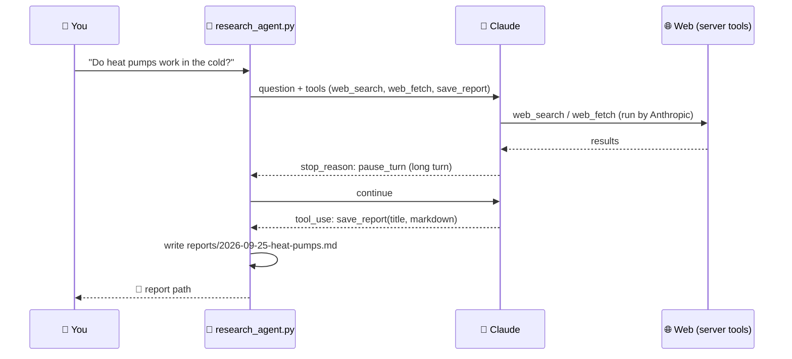

# 116 · Build-Along: A Research Agent That Writes Reports 🔎📄

> ⏱️ ~3 hours to build · 🎯 Intermediate (copy-paste friendly Python) · 🧰 Needs: Python 3.10+, an Anthropic API key with a spend limit, the [research-agent kit](../../examples/research-agent/)

**In this build-along you'll run, understand and customize your own research agent.** Give it a question; it plans, searches
the live web, reads primary sources, cross-checks claims and saves a cited Markdown report. You'll see exactly how server-side
tools (web search and fetch) mix with your own tool (`save_report`), handle long "paused" turns, tune the research process,
add features, test it offline, and schedule weekly reports. It's the agent loop from [Build Your Own Agent](../part-7-building-with-ai/68-build-your-own-agent.md),
doing real work. 🧑‍🔬

<details class="eli5" open>
<summary>🧸 ELI5: This build in 30 seconds</summary>

We're building a robot researcher. You ask a big question like "do heat pumps work in snowy places?" and it goes off to read
lots of web pages, checks that different sources agree, and writes you a neat report with a list of where every fact came
from. You can even have it send you a fresh report every Monday. 📚🤖

</details>

<!-- in-this-chapter -->

## 🗺️ What you'll build

<details class="eli5">
<summary>🧸 ELI5</summary>

Your question goes to Claude, which searches and reads the web on its own, then calls your little "save the report" helper.

</details>



| Piece | Where | Job |
|---|---|---|
| `SYSTEM` | the prompt | The research process: sub-questions, primary sources, cross-checks, honest uncertainty |
| `web_search`, `web_fetch` | Anthropic's servers | Find and read pages, with no search API key needed |
| `save_report` | your code | Write the Markdown report (sandboxed to `reports/`) |
| `research()` | your code | The agent loop, including `pause_turn` and a max-turns limit |

## ✅ Before you start

<details class="eli5">
<summary>🧸 ELI5</summary>

Get Python ready, install one package, and set a spending limit on your AI key.

</details>

- [ ] Python 3.10+ and the kit: `cd examples/research-agent && pip install -r requirements.txt`
- [ ] An **Anthropic API key** with a **spend limit** (research agents make many calls)
- [ ] 3 questions you genuinely want answered 🤔

## 1️⃣ Step 1: Run the offline tests (5 min)

<details class="eli5">
<summary>🧸 ELI5</summary>

First, check the robot's parts work using pretend answers, so it costs nothing and needs no internet.

</details>

```bash
python test_research_agent.py
```

The tests use a **fake client** that plays back scripted responses, so you can check the loop (including a paused turn), the
search cap and the report saving without spending a cent.

> ✅ **Checkpoint:** `🎉 All research-agent tests passed.`

## 2️⃣ Step 2: Your first real report (15 min)

<details class="eli5">
<summary>🧸 ELI5</summary>

Now ask a real question and watch the robot search and write.

</details>

```bash
export ANTHROPIC_API_KEY=sk-ant-...
python research_agent.py --depth quick "What are the pros and cons of induction cooktops for a small apartment?"
```

Watch the log: 💭 thoughts, 🔎 searches and fetches, then 💾 the saved report. Open it in `reports/`.

**Read it critically:**

- Does the **TL;DR** answer the question?
- Open **two citations**. Do they say what the report claims? ([Research & Learning](../part-11-ai-for-life-and-work/91-research-and-learning.md#-checking-sources-like-a-pro))
- Is there an honest **"What's uncertain"** section?

> ✅ **Checkpoint:** a cited report in `reports/`, and you've spot-checked two sources.

## 3️⃣ Step 3: Understand the loop (20 min)

<details class="eli5">
<summary>🧸 ELI5</summary>

Open the code and see the robot's heartbeat: ask Claude, do what it asks, send back the results, repeat until done.

</details>

Open `research_agent.py` and find these three ideas:

**1 · Server tools vs. client tools.** `web_search` and `web_fetch` run on Anthropic's side, so you just declare them. Your
`save_report` tool has a JSON schema, and **your** code runs it.

**2 · `pause_turn`.** Long server-side work (many searches) can pause a turn. The loop simply sends the conversation back and
Claude continues:

```python
if response.stop_reason == "pause_turn":
    continue  # send the conversation back so Claude can keep going
```

**3 · Safety valves.** `MAX_TURNS` stops runaway loops, `max_uses` caps searches per depth, and `save_report` refuses to
write outside `reports/`.

> [!TIP]
> **💡 Ask Claude Code to explain it**
> *"Walk me through research_agent.py like I'm new to agents. Then draw the loop as a Mermaid diagram."* Reading agent code with
> an AI tutor is one of the fastest ways to learn.

## 4️⃣ Step 4: Tune the research process (30 min)

<details class="eli5">
<summary>🧸 ELI5</summary>

Change the robot's instructions to make better reports: more trustworthy sources, a special format, or a certain reading level.

</details>

The `SYSTEM` prompt *is* the research method. Try one change at a time, re-run the same question, and compare
([Evaluating AI](../part-12-mastery/105-evaluating-ai.md)):

| Change | Add to SYSTEM |
|---|---|
| 🏛️ **Stricter sources** | *"Prefer government, academic and primary sources. Mark any claim supported by only one source."* |
| 🧒 **Plain language** | *"Write for a 14-year-old. Define every technical term the first time it appears."* |
| ⚖️ **Decision mode** | *"End with a recommendation table: option, pros, cons, best for."* |
| 🌍 **Local focus** | *"Focus on [country]: prices, regulations and availability there."* |
| 🔢 **Numbers** | *"Include a table of the key numbers with their source for each."* |

You can also restrict where it searches with `allowed_domains` on the web search tool (e.g. only `.gov` and `.edu` sites).

## 5️⃣ Step 5: Add a feature (45 min)

<details class="eli5">
<summary>🧸 ELI5</summary>

Teach the robot a new trick, like emailing you the report or checking your own notes first. An AI coding helper can do most of
the work.

</details>

Pick one and pair with Claude Code (remind it to extend the tests!):

| Feature | Prompt for Claude Code |
|---|---|
| 📧 **Email the report** | *"After saving, email the report as HTML using SMTP settings from env vars (reuse the newsletter kit's send_email)."* |
| 📚 **Check my notes first** | *"Add a `search_my_notes` tool backed by the rag-from-scratch kit's Index, so it combines my notes with the web."* |
| 🗂️ **Save to Notion** | *"Add an option to save the report to a Notion page via the Notion API."* |
| 🔁 **Follow-up mode** | *"Add --follow-up path/to/report.md to research what changed since that report."* |
| 🧪 **Fact-check pass** | *"After drafting, run a second model call that checks every claim against the fetched sources and flags weak ones."* |

> ✅ **Checkpoint:** your feature works on a real question, and `python test_research_agent.py` still passes.

## 6️⃣ Step 6: Schedule a weekly report (20 min)

<details class="eli5">
<summary>🧸 ELI5</summary>

Make the robot run by itself every Monday and send you what's new in a topic you care about.

</details>

A weekly *"what's new in my field?"* report is a superpower. Two ways:

=== "⏰ cron (your computer or server)"

    ```bash
    # every Monday at 7:30
    30 7 * * MON cd /path/to/research-agent && ANTHROPIC_API_KEY=... python research_agent.py --depth quick "What changed in home battery storage in the last 7 days?"
    ```

=== "🐙 GitHub Actions"

    A workflow on a `schedule` that runs the agent, with the API key stored as a repository secret, and commits the report
    or emails it ([Git & GitHub](../part-7-building-with-ai/61-git-and-github.md#-github-actions-robots-that-work-for-you)).

Pair it with the email feature and you have a personal research newsletter
([Build-Along: The Automated Newsletter](118-build-along-automated-newsletter.md)). ☕

## 💸 Costs & responsibility

<details class="eli5">
<summary>🧸 ELI5</summary>

Research robots read a lot, which costs money, so start with quick mode and set a spending limit. And always check important
facts yourself.

</details>

| Habit | Why |
|---|---|
| Start with `--depth quick` | Fewer searches and tokens |
| **Spend limit** in the console | Research loops can surprise you ([Cost Optimization](../part-12-mastery/106-cost-optimization.md)) |
| Spot-check citations | Agents can misread sources |
| Don't use it for medical, legal or financial *decisions* alone | Treat reports as a starting map, then consult professionals |
| Respect sites | Server tools fetch pages politely; don't repurpose them for heavy scraping |

## 🩺 Troubleshooting

<details class="eli5">
<summary>🧸 ELI5</summary>

If the robot gets stuck or makes mistakes, here's what to try.

</details>

| Problem | Fix |
|---|---|
| API rejects a tool type | Server tool names are versioned. Check the docs for the current `web_search`/`web_fetch` type names |
| Agent never saves a report | Strengthen the prompt (*"You MUST call save_report at the end"*) or raise `MAX_TURNS` a little |
| Reports are shallow | Use `--depth standard` or `deep`, and ask for primary sources |
| Too slow or expensive | `--depth quick`, fewer `max_uses`, a smaller model for simple topics |
| A citation doesn't match | Add the fact-check pass (Step 5), and always spot-check |

## 🎯 Key takeaways

- A research agent = **a research process (prompt) + server tools (search, fetch) + a client tool (save) + a loop**.
- Handle **`pause_turn`** by continuing the conversation, and cap turns and searches.
- **Test agent loops offline** with a scripted fake client.
- Tune the **SYSTEM prompt** one change at a time, and compare outputs.
- Schedule it for a **weekly personal research report**, and always **spot-check citations**.

## 🧠 Check yourself

<details class="quiz">
<summary>❓ 1. What's the difference between `web_search` and `save_report` in this agent?</summary>

`web_search` is a **server tool** run by Anthropic. `save_report` is a **client tool** defined and run by **your** code.

</details>

<details class="quiz">
<summary>❓ 2. What should your loop do when `stop_reason` is `pause_turn`?</summary>

**Send the conversation back** (continue) so Claude can finish its long server-side turn.

</details>

<details class="quiz">
<summary>❓ 3. Why does `save_report` check the file path?</summary>

So the agent can **only write inside `reports/`**: tools must enforce their own limits, because models can be persuaded.

</details>

> [!TIP]
> **🎮 Try this**
> Run the agent on a decision you're actually facing (a purchase, a trip, a new hobby), in `standard` depth. Then ask a friend
> to read the report and tell you what they'd trust and what they'd double-check. You'll learn to read AI research like a pro. 🔎✨

---

**Next:** [117 · The Private Home Assistant →](117-build-along-private-home-assistant.md)
