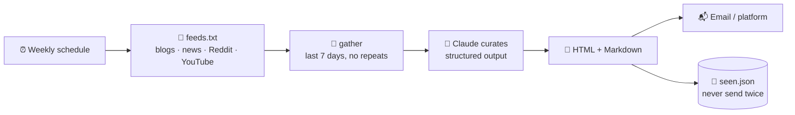

# 118 · Build-Along: The Automated Newsletter 📰💌

> ⏱️ ~2 hours to build · 🎯 Beginner → intermediate · 🧰 Needs: Python 3.10+ (or n8n), an Anthropic API key, an email account or newsletter platform

**By the end of this build-along, a beautiful newsletter will write itself every week.** It reads your favorite feeds, Claude
picks the best items and explains why each matters, and a lovely email lands in your inbox (or your subscribers'). You'll run
the [newsletter-pipeline kit](../../examples/newsletter-pipeline/), make it yours, put it on autopilot, and optionally rebuild it
with no code in n8n. Your own personal editor-in-chief, working while you sleep. ☕📬

<details class="keypoints" open>
<summary>✅ Key Points & Steps</summary>

In this project you'll build a Python pipeline that reads your favorite websites each week, has Claude choose the most interesting items and write a short note on each, and sends the result as a well-designed email newsletter.

1. **Test the pipeline** with sample data and a dry run.
2. **Choose your feeds** and generate your first AI-curated issue.
3. **Customize** the voice, design and sections.
4. **Send it automatically** every week.

</details>

<!-- in-this-chapter -->

> [!NOTE]
> **🌍 Porting to another provider**
> The kit uses Claude's structured output to get a clean newsletter object. **OpenAI** (`responses.parse` with a
> Pydantic model) and **Gemini** (`response_schema`) do the same thing, so swapping providers changes only the
> `curate()` function ([translation table](../part-7-building-with-ai/67-calling-ai-apis.md#-the-same-first-call-with-openai-gemini--friends)).

## 🗺️ What you'll build

<details class="keypoints" open>
<summary>✅ Key Points & Steps</summary>

Feed items are collected, previously seen and duplicate items are removed, Claude selects and describes the best ones, and the pipeline renders and sends an HTML email. The diagram shows each stage.

</details>



## ✅ Before you start

<details class="keypoints" open>
<summary>✅ Key Points & Steps</summary>

Before starting, install Python 3.10 or later and the kit's requirements, get an Anthropic API key with a spending limit, and pick a few websites you enjoy reading.

</details>

- [ ] Python 3.10+ and the kit: `cd examples/newsletter-pipeline && pip install -r requirements.txt`
- [ ] An **Anthropic API key** (with a spend limit)
- [ ] **5–10 favorite sources** with RSS or Atom feeds (most blogs, news sites, podcasts and YouTube channels have one)
- [ ] For sending: an email account with SMTP (an "app password"), or a newsletter platform account

## 1️⃣ Step 1: Test and dry run (10 min)

<details class="keypoints" open>
<summary>✅ Key Points & Steps</summary>

Run the tests, then do a dry run with real feeds but no AI step, to confirm everything works and preview the email design in your browser.

</details>

```bash
python test_newsletter.py       # offline tests: parsing, filtering, de-duplication, safe HTML, structured output
python newsletter.py --dry-run  # real feeds, no AI, no key needed
```

Open `out/newsletter-YYYY-MM-DD.html` in your browser: that's your email design. 🎨

> ✅ **Checkpoint:** tests pass, and the dry-run email shows real items from the default feeds.

## 2️⃣ Step 2: Choose your feeds (20 min)

<details class="keypoints" open>
<summary>✅ Key Points & Steps</summary>

List the feeds your newsletter will read in `feeds.txt`, one URL per line. Most blogs, news sites, YouTube channels and subreddits offer RSS feeds; the table shows the common URL patterns.

</details>

Edit `feeds.txt`, one feed URL per line:

| Source type | Feed URL pattern |
|---|---|
| Most blogs | `https://example.com/feed` or `/rss.xml` or `/atom.xml` (look for the RSS icon) |
| Substack | `https://name.substack.com/feed` |
| Reddit | `https://www.reddit.com/r/LocalLLaMA/top/.rss?t=week` |
| Hacker News (filtered) | `https://hnrss.org/newest?q=gardening&points=50` |
| YouTube channel | `https://www.youtube.com/feeds/videos.xml?channel_id=CHANNEL_ID` |
| Google News search | `https://news.google.com/rss/search?q=your+topic` |

**Can't find a feed?** Ask Claude: *"What's the RSS feed URL for [site]?"* (then test it), or use the site's newsletter instead.

> [!TIP]
> **💡 Theme it**
> The best newsletters have a clear theme: "AI for teachers," "cozy gaming," "urban gardening," "our town's news." A focused
> theme makes Claude's picks much better.

## 3️⃣ Step 3: Your first AI-curated issue (15 min)

<details class="keypoints" open>
<summary>✅ Key Points & Steps</summary>

Run the pipeline with AI curation enabled. Claude receives the candidate items and returns a structured issue with a subject line, an introduction and the selected items, each with a note on why it matters.

</details>

```bash
export ANTHROPIC_API_KEY=sk-ant-...
python newsletter.py --audience "busy parents who want practical AI tips" --count 5
```

Claude receives the candidate items and fills an **`Issue`** model (subject, intro, picks with "why it matters" and a tag,
and a "try this" tip). **Structured output** means no fragile JSON parsing ([Calling AI APIs](../part-7-building-with-ai/67-calling-ai-apis.md#-structured-output-data-instead-of-prose)).

Open the HTML in your browser and read it like a subscriber: is the subject inviting? Are the picks varied? Do the blurbs sound
warm and specific?

> ✅ **Checkpoint:** a curated issue in `out/`, and `seen.json` now remembers what was included.

## 4️⃣ Step 4: Make it yours (30 min)

<details class="keypoints" open>
<summary>✅ Key Points & Steps</summary>

Customize the newsletter's voice and audience, the number of items, the sections and the email's colors and layout. The table shows where to make each change.

</details>

| Change | Where |
|---|---|
| 🗣️ **Voice & audience** | `--audience`, or the `system` text in `curate()`: add your style guide ([Writing & Content](../part-11-ai-for-life-and-work/92-writing-and-content.md#-teaching-ai-your-voice)) |
| 🎨 **Design** | Colors and fonts in `to_html()` (the header gradient, card borders) |
| ➕ **New section** | Add a field to `Issue` (e.g. `tool_of_the_week: str`) and render it: Claude fills it automatically |
| 🔢 **More or fewer picks** | `--count` |
| 🗓️ **Different window** | `--days 14` for a fortnightly issue |

Pair with Claude Code: *"Add a 'quote of the week' field to Issue, render it as a styled blockquote in the HTML, and extend
test_newsletter.py."*

> ✅ **Checkpoint:** your customized issue looks and sounds like *yours*, and the tests still pass.

## 5️⃣ Step 5: Send it (20 min)

<details class="keypoints" open>
<summary>✅ Key Points & Steps</summary>

Choose how to send it: your own email account (via SMTP with an app password) for personal use, or a newsletter service like Buttondown for many subscribers. The tabs explain each option.

</details>

=== "📬 Just me (SMTP)"

    ```bash
    export SMTP_HOST=smtp.gmail.com SMTP_PORT=587
    export SMTP_USER=you@example.com SMTP_PASSWORD=your-app-password NEWSLETTER_TO=you@example.com
    python newsletter.py --send
    ```

    Most email providers need an **app password** (not your normal password) for SMTP.

=== "👥 Real subscribers (platform)"

    For a list of readers, use a newsletter platform (Beehiiv, Buttondown, Kit, Substack). They handle **unsubscribes,
    deliverability and privacy laws**. Paste the generated HTML or Markdown into a draft, or use the platform's API to create
    drafts automatically, and **review before sending**.

> [!WARNING]
> **⚠️ Only email people who asked**
> Sending newsletters to people who didn't subscribe is spam (and illegal in many places). Use a platform with proper
> opt-in and unsubscribe links for anyone but yourself.

## 6️⃣ Step 6: Put it on autopilot (15 min)

<details class="keypoints" open>
<summary>✅ Key Points & Steps</summary>

Schedule the pipeline to run weekly using cron on your computer or a GitHub Actions schedule, so each issue is created and sent automatically.

</details>

=== "⏰ cron"

    ```bash
    # Mondays at 7:00
    0 7 * * MON cd /path/to/newsletter-pipeline && . ./.env && python newsletter.py --send
    ```

=== "🐙 GitHub Actions"

    A `schedule` workflow that installs requirements and runs `python newsletter.py --send`, with the API key and SMTP password
    as **repository secrets**. Commit `seen.json` back so it remembers what it sent.

=== "⚙️ n8n (no code)"

    Rebuild the same flow visually: **Schedule Trigger → RSS Read (one per feed) → Merge → Code (filter & dedupe) → Claude
    (curate) → Gmail/Send Email**. Start from the [Morning AI Digest](../../examples/n8n-workflows/morning-ai-digest.json)
    workflow ([n8n Masterclass](../part-5-automation/47-n8n-masterclass.md)).

> ✅ **Checkpoint:** next Monday, a fresh issue arrives without you lifting a finger. ☕

## 🚀 Level-ups

<details class="keypoints" open>
<summary>✅ Key Points & Steps</summary>

Possible upgrades include adding your own introduction, including research summaries, generating images and producing an audio version. The table explains how to add each.

</details>

| Level-up | How |
|---|---|
| ✍️ **Your own intro** | Add `--note "This week I…"` and have Claude weave it into the intro |
| 🔎 **Research section** | Run the [research agent](116-build-along-research-agent.md) on one topic and include a summary |
| 🖼️ **Header image** | Generate a themed image per issue ([Image Generation](../part-10-creative-ai/84-image-generation-deep-dive.md)) |
| 🎧 **Audio edition** | Turn the issue into a Gemini Notebook audio overview or a TTS reading |
| 📊 **Learn from readers** | Track clicks on your platform and tell Claude which topics performed best |
| 💰 **Make it a side hustle** | A niche newsletter people love can grow ([Turning AI Skills into Income](../part-12-mastery/109-turning-ai-skills-into-income.md)) |

## 🩺 Troubleshooting

<details class="keypoints" open>
<summary>✅ Key Points & Steps</summary>

The table lists common problems, such as an empty issue or a failed send, with a fix for each.

</details>

| Problem | Fix |
|---|---|
| "Nothing new this time" | Widen `--days`, add feeds, or delete `seen.json` to start fresh |
| A feed is skipped with an error | The URL isn't a feed, or the site blocks bots. Try another feed URL |
| SMTP login fails | Use an **app password**, check `SMTP_HOST` and port 587 |
| Picks feel random | Sharpen `--audience`, and add a style guide and "what my readers love" to the prompt |
| Email looks broken in some apps | Keep inline styles (already done), and test in 2–3 email apps |

## 🎯 Key takeaways

- A newsletter pipeline = **feeds → filter & dedupe → AI curation → HTML → send → remember**.
- **Structured output** makes AI curation reliable, and **HTML escaping** keeps feed content from breaking your email.
- **`seen.json`** ensures nothing is sent twice.
- **cron, GitHub Actions or n8n** put it on autopilot.
- Use a **newsletter platform** for real subscribers, and only email people who opted in.

## 🧠 Check yourself

<details class="quiz">
<summary>❓ 1. Why does the pipeline keep a `seen.json` file?</summary>

To **remember what was already sent**, so the same item never appears in two issues.

</details>

<details class="quiz">
<summary>❓ 2. Why escape HTML from feed content?</summary>

Feed titles and summaries can contain HTML or code. Escaping stops them from **breaking your layout** (or injecting scripts).

</details>

<details class="quiz">
<summary>❓ 3. You want to send to 200 readers. SMTP from your Gmail, or a newsletter platform?</summary>

A **newsletter platform**: it handles opt-in, unsubscribes, deliverability and privacy rules.

</details>

> [!TIP]
> **🎮 Try this**
> Make a tiny newsletter for **one** person you love, on a topic *they* love (gardening, a sports team, a band, a hobby), and
> send them issue #1 this week. A thoughtful weekly email is a surprisingly lovely gift. 💌

---

**Next:** [119 · An AI Voice Receptionist →](119-build-along-voice-receptionist.md)
