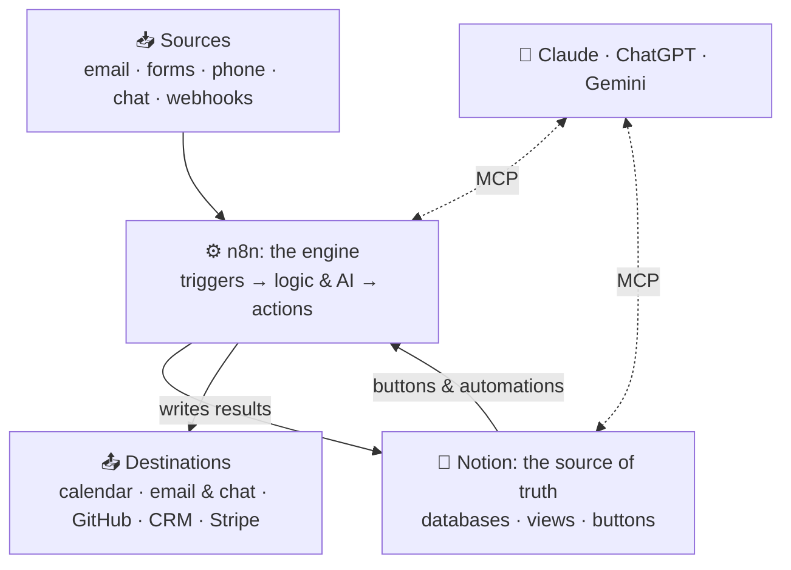

# 120 · The Power Stack: Why n8n + Notion Can Run Everything 🔗

> ⏱️ 9 min read · 🎯 Anyone automating their work or life · 🧰 Needs: nothing yet (a Notion account and n8n help later)

**Most people's digital life is scattered across a dozen apps that don't talk to each other.** Notion and n8n fix that from
two directions. Notion gives you one well-organized place to see and edit everything. n8n gives you an engine that moves
information between all your apps, calls AI models and makes decisions, around the clock. This chapter explains why the
pairing works so well, maps every way the two connect, and shows how they plug into the rest of your AI stack.

<details class="keypoints" open>
<summary>✅ Key Points & Steps</summary>

Notion and n8n play complementary roles: Notion is the **interface and source of truth** that people read and edit, and n8n is the **engine** that collects data, calls AI and takes action in other apps. Connected, they form a system you can extend to almost any tool.

- **Five connection methods:** the n8n Notion node, the Notion Trigger, Notion buttons and automations sending webhooks, Notion's integration webhooks, and MCP in both directions.
- **One hub, many spokes:** email, chat, phone, AI assistants, files, code and business tools all connect through n8n.
- **Choose the right layer:** use Notion's built-in automations for simple tasks inside Notion, and n8n when work crosses apps or needs custom logic.
- **Start small:** your first connected workflow takes about 30 minutes.

</details>

<!-- in-this-chapter -->

## 🧩 Two tools, two jobs

<details class="keypoints" open>
<summary>✅ Key Points & Steps</summary>

Notion is optimized for people: pages, databases and views that are easy to read, edit and share. n8n is optimized for machines: triggers, data transformation, AI calls and connections to hundreds of services. Each is strong where the other is weak, which is why they work so well together.

</details>

Think of a well-run restaurant. The **dining room** is where customers see menus, place orders and get their food. The
**kitchen** is where the work happens, out of sight, following precise steps. Notion is your dining room; n8n is your
kitchen.

| | 📒 Notion | ⚙️ n8n |
|---|---|---|
| **Built for** | People reading, writing and organizing | Machines moving and transforming data |
| **Great at** | Databases with views, dashboards, docs, collaboration, forms, comments | Triggers, schedules, branching logic, loops, AI calls, 1,000+ integrations, custom code |
| **AI built in** | Notion Agent, Custom Agents, AI properties, AI Meeting Notes | AI Agent node, chains, tools, memory, vector stores, MCP |
| **Weak at** | Complex logic, talking to most outside apps, high-volume processing | Being a pleasant place for people to read and edit information |
| **Typical role** | Source of truth and control panel | Backend, glue and worker |

**The combined pattern:** information flows *into* Notion from everywhere (captured, cleaned and enriched by n8n), people
work with it in Notion, and changes in Notion trigger n8n to act *outward* (send, schedule, publish, notify, update other
systems).

## 🗺️ The architecture at a glance

<details class="keypoints" open>
<summary>✅ Key Points & Steps</summary>

The diagram shows the full system: sources on the left send events to n8n, n8n uses AI to process them and writes structured results into Notion, and actions in Notion flow back through n8n to the outside world. AI assistants like Claude and ChatGPT can reach both tools through MCP.

</details>



Three ideas to take from the picture:

1. **n8n is the only component that touches everything.** It's the natural place for logic, retries and AI processing.
2. **Notion holds the state.** What's pending, what's done, who owns it, and what the AI decided all live in database
   properties people can see and correct.
3. **AI assistants can work with both directly** through MCP, so you can ask Claude *"what's overdue in my Notion
   tasks?"* or *"run my client onboarding workflow"* in plain language.

## 🔌 The five ways n8n and Notion connect

<details class="keypoints" open>
<summary>✅ Key Points & Steps</summary>

n8n and Notion can connect in five ways, each suited to different needs: the Notion node for reading and writing, the Notion Trigger for polling changes, Notion buttons and automations for instant webhooks, Notion's integration webhooks for event streams, and MCP for AI agents. Most real systems combine two or three.

</details>

| # | Method | Direction | Speed | Best for |
|---|---|---|---|---|
| 1 | **Notion node** in n8n (uses the Notion API) | n8n → Notion | Instant | Creating, reading, updating and searching pages and databases |
| 2 | **Notion Trigger** node | Notion → n8n | Polls about every minute | "When a page is added or updated in this database, do something" |
| 3 | **Notion buttons & database automations** with a *Send webhook* action | Notion → n8n | Instant | One-click actions and status-driven pipelines (paid Notion plans) |
| 4 | **Notion integration webhooks** (developer platform) | Notion → n8n | Near real time | Workspace-wide event streams: page created, properties updated, comments |
| 5 | **MCP** (Model Context Protocol) | Both ways | Instant | AI agents: n8n agents using Notion tools, or Claude and Notion's own agents calling n8n workflows |

You'll learn each in detail in [Connecting n8n to Notion](122-connecting-n8n-to-notion.md) and
[Notion as Your Command Center](123-notion-as-your-command-center.md). For now, a rule of thumb:

- **Writing into Notion?** Use the Notion node (method 1).
- **Reacting to something a person did in Notion?** Use a button or database automation webhook (method 3) when you can,
  and the Notion Trigger (method 2) when you can't.
- **Letting AI drive?** Use MCP (method 5).

## 🌐 How the stack plugs into everything else

<details class="keypoints" open>
<summary>✅ Key Points & Steps</summary>

Because n8n connects to hundreds of services and both tools support MCP, this stack links to almost every topic in the manual. The table maps each area to what flows between it and your n8n + Notion system, with a link to the chapter that covers it.

</details>

| Area | What flows | Learn more |
|---|---|---|
| 🤖 **AI assistants** (Claude, ChatGPT, Gemini) | Ask questions about your Notion data; trigger n8n workflows by name | [AI Agents Across n8n + Notion](124-ai-agents-across-n8n-and-notion.md) |
| 📧 **Email & calendar** | Emails become tasks; tasks become calendar blocks; meeting notes become action items | [Connecting Everything](125-connecting-everything.md#-email-and-calendar) |
| 💬 **Chat apps** | Capture from Telegram or Slack; daily briefings back to chat | [Chat Apps & Bots](../part-6-ai-in-your-apps/59-chat-apps-and-bots.md) |
| 📱 **Phone & desktop** | One-tap voice capture into Notion; shortcuts that run workflows | [Phone & Desktop Automation](../part-5-automation/50-phone-and-desktop-automation.md) |
| 📚 **Knowledge & RAG** | Your Notion pages become a searchable knowledge base for AI | [Build a RAG System](../part-8-knowledge-and-memory/74-build-a-rag-system.md) |
| 🏠 **Local AI** | Run the AI steps on Ollama for private data | [The AI Home Lab](../part-9-local-ai/80-home-lab.md) |
| 🛠️ **Code & GitHub** | Issues and pull requests sync with a Notion roadmap | [Git & GitHub](../part-7-building-with-ai/61-git-and-github.md) |
| 💼 **Business tools** | Stripe payments, CRM deals and form leads flow into Notion dashboards | [Small Business](../part-11-ai-for-life-and-work/93-small-business.md) |
| 🗣️ **Voice agents** | Phone bookings and call summaries land in Notion | [Voice Agents](../part-10-creative-ai/87-voice-agents.md) |
| 🟠 **Zapier & Make** | Use them for niche apps, handing off to n8n with a webhook | [Zapier & Make](../part-5-automation/49-zapier-and-make-walkthroughs.md) |

## 🧭 Which layer should do the work?

<details class="keypoints" open>
<summary>✅ Key Points & Steps</summary>

Use the simplest tool that can do the job. Notion's built-in automations handle simple changes inside Notion; Notion's Custom Agents handle AI reasoning over your workspace; n8n handles anything that crosses apps, needs custom logic, runs at high volume or must be fully under your control.

</details>

| You want to… | Simplest good choice | Why |
|---|---|---|
| Set a property or notify someone when a status changes | **Notion database automation** | No external tools, nothing to maintain |
| Summarize, tag or translate each new row | **Notion AI property** (autofill) | Built in, runs per row |
| Run a weekly AI review of your workspace | **Notion Custom Agent** | Reasons over Notion content natively |
| Move data between Notion and another app | **n8n** | Hundreds of integrations, branching, retries |
| Process hundreds of items, or call several AI models | **n8n** | Batching, rate-limit control, cheaper per run |
| Keep sensitive data on your own servers | **n8n (self-hosted)** with a local model | Full control of where data goes |
| Connect an app only Zapier supports | **Zapier → webhook → n8n** | Use Zapier just for the missing connector |

**A healthy split:** Notion handles anything a person might want to see or tweak; n8n handles anything that involves
other systems, heavy processing or reliability guarantees.

## 💸 What it costs

<details class="keypoints" open>
<summary>✅ Key Points & Steps</summary>

You can build a capable system cheaply. Self-hosted n8n is free; n8n Cloud charges per workflow execution. Notion's free plan supports the API and the n8n integration, while buttons and automations that send webhooks require a paid plan. AI calls are usually the largest variable cost, and you control them with model choice and filtering.

</details>

| Component | Free option | Paid when… |
|---|---|---|
| **n8n** | Self-host on your computer, a home server or a small cloud server | You want n8n Cloud (managed hosting, billed by executions) or enterprise features |
| **Notion** | Free plan works with the API and the n8n Notion node | You need *Send webhook* actions, more automations, Notion AI or Custom Agents (Custom Agents use Notion credits) |
| **AI model** | Local models through Ollama | You use cloud models (pay per token; set a spend limit) |
| **Hosting** | Your own computer while learning | You need 24/7 uptime (a small cloud server or n8n Cloud) |

Prices and plan details change often; check each provider's pricing page. Cost-saving techniques are in
[Cost Optimization](../part-12-mastery/106-cost-optimization.md).

## 🏁 Your first connected workflow (30 minutes)

<details class="keypoints" open>
<summary>✅ Key Points & Steps</summary>

This quick exercise proves the whole loop works: a URL you can call from anywhere creates a page in a Notion database.

1. Create a Notion database called **Inbox** with a **Name** title and a **Source** select property.
2. Create a Notion integration, copy its secret, and share the Inbox database with it.
3. In n8n, add a **Webhook** node and a **Notion** node (Database Page → Create) connected to Inbox.
4. Send a test request and watch the page appear.

</details>

### Step 1 · Create the database
In Notion, create a full-page database called **Inbox** with two properties: **Name** (the title) and **Source** (a
select with options `Phone`, `Web`, `Email`).

### Step 2 · Create an integration and share the database
1. Go to **notion.so/profile/integrations** → **New integration** → choose your workspace → **Save**.
2. Copy the **Internal integration secret**.
3. Open the Inbox database → **⋯** menu → **Connections** → add your integration.

### Step 3 · Build the workflow in n8n
1. Add a **Webhook** node: method `POST`, path `inbox`.
2. Add a **Notion** node: **Database Page → Create**. Create a credential with your integration secret, pick the Inbox
   database, set **Title** to `{{ $json.body.text }}` and **Source** to `{{ $json.body.source }}`.
3. Click **Test workflow**.

### Step 4 · Send a test
```bash
curl -X POST "http://localhost:5678/webhook-test/inbox" \
  -H "Content-Type: application/json" \
  -d '{"text": "Book the dentist", "source": "Web"}'
```

> ✅ **Checkpoint:** a page called *Book the dentist* appears in your Inbox with Source = Web. You've just connected the
> two tools, and every workflow in this part builds on this same loop.

## 🎯 Key takeaways

- **Notion is the interface and source of truth; n8n is the engine** that connects, transforms and acts.
- They connect in **five ways**: the Notion node, the Notion Trigger, button and automation webhooks, integration
  webhooks, and MCP.
- n8n acts as the **hub** linking Notion to email, chat, phone, AI assistants, code and business tools.
- Use **Notion's built-in automations** for simple in-Notion tasks and **n8n** for anything that crosses apps.

## 🧠 Check yourself

<details class="quiz">
<summary>❓ 1. A person clicks a button in Notion and you want n8n to respond instantly. Which connection method fits best?</summary>

A **Notion button with a Send webhook action** pointed at an n8n **Webhook** node. It fires immediately, unlike the
polling Notion Trigger.

</details>

<details class="quiz">
<summary>❓ 2. Why keep the "state" of a process (pending, done, error) in Notion properties rather than inside n8n?</summary>

Because people can **see and correct** it in Notion, and n8n can read it on the next run. n8n's execution history is
for debugging, not for day-to-day visibility.

</details>

<details class="quiz">
<summary>❓ 3. You only need to set a "Completed on" date when a task's status changes to Done. n8n or a Notion automation?</summary>

A **Notion database automation**. It's simple, stays inside Notion and has nothing extra to maintain.

</details>

> [!TIP]
> **🎮 Try this**
> Complete the 30-minute workflow above, then create an iPhone or Android shortcut that sends dictated text to the
> production webhook URL ([Phone & Desktop Automation](../part-5-automation/50-phone-and-desktop-automation.md)). You now
> have one-tap voice capture into Notion.

---

**Next:** [121 · Notion for Builders →](121-notion-for-builders.md)
