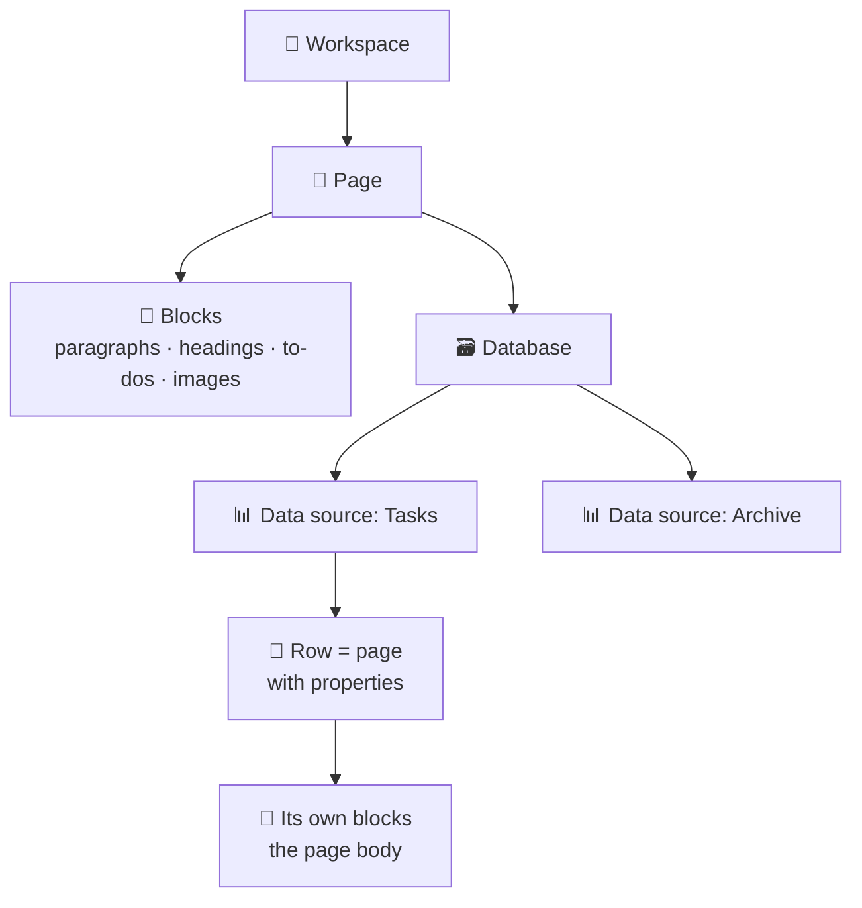

# 121 · Notion for Builders: Databases, Data Sources & the API 🧱

> ⏱️ 11 min read · 🎯 Notion users ready to automate · 🧰 Needs: a Notion account

**To automate Notion well, you need to see it the way software does.** On screen, Notion is pages, tables and boards. To
an automation, it's a tree of objects with IDs, typed properties and strict rules about what can be written where. This
chapter explains Notion's data model, every property type, how integrations get access, the essential API calls, and
Notion's own automation features, so the n8n chapters that follow make complete sense.

<details class="keypoints" open>
<summary>✅ Key Points & Steps</summary>

Notion organizes content as pages made of blocks; a database contains one or more data sources, and each row in a data source is a page with typed properties. Automations read and write those properties through the Notion API, using an integration that you explicitly share pages with.

- **Learn the model:** workspace → pages → blocks, and database → data sources → pages (rows) → properties.
- **Know the property types** and which ones automations can write.
- **Set up access:** create an integration and share specific pages or databases with it.
- **Design databases for automation:** status flows, external IDs and clear property names.
- **Use Notion's own tools** (buttons, automations, forms and webhooks) before reaching for external ones.

</details>

<!-- in-this-chapter -->

## 🧠 The Notion data model

<details class="keypoints" open>
<summary>✅ Key Points & Steps</summary>

Everything in Notion is either a page, a block or a database. Pages contain blocks (paragraphs, headings, lists, images). A database is a container for one or more data sources, and each data source is a table whose rows are pages with typed properties. Every object has a unique ID that automations use to find it.

</details>



| Object | What it is | Example |
|---|---|---|
| **Page** | A document with a title, optional properties and a body of blocks | A meeting note, a project brief, a row in a task database |
| **Block** | One piece of content inside a page | A paragraph, a to-do item, a heading, an image, a toggle |
| **Database** | A container that holds one or more data sources and their views | Your "Projects" database on a page |
| **Data source** | A table of rows that share the same property schema | The "Tasks" table inside a database |
| **Property** | A typed field on a row | Status, Due date, Owner, Priority |
| **View** | A saved way of looking at a data source (table, board, calendar…) | "My tasks this week" board |

> [!IMPORTANT]
> **📌 The data-source change (API version 2025-09-03)**
> Notion databases can now hold **multiple data sources**. In older tutorials, "database" and "table" meant the same thing;
> in the current API, you query and create rows in a **data source**, and a database is the container around one or more
> of them. Most databases still have exactly one data source, so day to day the difference is small, but code and
> workflows written for the old model may need updating. The [Running in Production](128-running-in-production.md) chapter
> covers migration.

### Finding IDs
Every page, database and data source has a 32-character ID (sometimes shown with hyphens). The quickest ways to find one:

- **Page or database:** copy its link (**⋯ → Copy link**). The ID is the long string at the end of the URL, before any `?`.
- **Data source:** open the database's **⋯ → Manage data sources** menu and copy the data source ID, or let n8n's Notion
  node look it up for you from the database URL.

## 🏷️ Property types, and how automations see them

<details class="keypoints" open>
<summary>✅ Key Points & Steps</summary>

Each property has a type that determines what values it accepts. Automations can write most types directly; some, like formulas, rollups and created time, are computed by Notion and are read-only. Choosing the right type makes automations far more reliable.

</details>

| Property | Holds | Writable by automations? | Automation tips |
|---|---|---|---|
| **Title** | The row's name (exactly one per data source) | ✅ | Required when creating a row |
| **Text** (rich text) | Formatted text | ✅ | Each text segment is limited to 2,000 characters; split longer content or put it in the page body |
| **Number** | A number | ✅ | Send a number, not a string |
| **Select** | One option from a list | ✅ | Use exact option names; unknown names may create new options or fail |
| **Multi-select** | Several options | ✅ | Send a list of option names |
| **Status** | A workflow stage (To do / In progress / Done groups) | ✅ | Ideal for driving pipelines |
| **Date** | A date or date range, optionally with time | ✅ | Use ISO format: `2026-10-01` or `2026-10-01T09:00:00Z` |
| **Person** | Workspace members | ✅ | Needs the user's Notion ID |
| **Files & media** | Uploaded files or links | ✅ (links and API uploads) | External URLs are simplest |
| **Checkbox** | True or false | ✅ | Great for "Processed by AI" flags |
| **URL / Email / Phone** | A single value | ✅ | Validate before writing |
| **Relation** | Links to rows in another data source | ✅ | Needs the related page IDs |
| **Rollup** | A value computed from related rows | ❌ read-only | Read it for reports |
| **Formula** | A computed value | ❌ read-only | Useful for filters like "Is overdue" |
| **Created / edited time & by** | Automatic timestamps and authors | ❌ read-only | Perfect for "changed since last run" queries |
| **Unique ID** | An auto-increment ID like `TASK-42` | ❌ read-only | A stable human-friendly reference |

## 🔑 Integrations and access

<details class="keypoints" open>
<summary>✅ Key Points & Steps</summary>

An integration is how external software (including n8n) gets permission to use your workspace. It can only see pages and databases that you explicitly share with it, which keeps access tightly scoped.

1. Create an integration at notion.so/profile/integrations and choose its capabilities.
2. Copy the integration secret and store it as an n8n credential.
3. Share each page or database with the integration through **⋯ → Connections**.

</details>

There are two kinds of integration:

| Type | Use when | How it authenticates |
|---|---|---|
| **Internal integration** | You're connecting your own workspace (the usual case with n8n) | A secret token you paste into n8n |
| **Public integration** | You're building something other people install in their workspaces | OAuth ("Sign in with Notion") |

**Capabilities** let you limit what an integration can do: read content, update content, insert content, read comments,
insert comments and read user information. Give each integration only what it needs: a reporting workflow needs read
access, not insert.

**Sharing is inherited.** Share a top-level page with the integration, and it can reach everything nested beneath it.
That's convenient, but it also means a broad share grants broad access. For important workspaces, share only the specific
databases a workflow needs.

> [!WARNING]
> **⚠️ "Object not found" usually means "not shared"**
> If n8n or the API reports that a page or database doesn't exist, the most common cause is that it hasn't been shared
> with the integration. Open it → **⋯ → Connections** and add the integration.

## 🧾 API essentials

<details class="keypoints" open>
<summary>✅ Key Points & Steps</summary>

The Notion API is a REST API at `https://api.notion.com/v1`. Every request needs your integration secret and a `Notion-Version` header. You'll mostly query data sources, create and update pages, and append blocks, while respecting rate limits, pagination and size limits.

</details>

You'll rarely call the API by hand, because n8n's Notion node does it for you. Knowing the shape of the calls, though,
makes debugging easy and lets you use the **HTTP Request** node for anything the Notion node doesn't cover.

| Task | Method & endpoint |
|---|---|
| Get a database (and its data source IDs) | `GET /v1/databases/{database_id}` |
| Query rows in a data source (with filters and sorts) | `POST /v1/data_sources/{data_source_id}/query` |
| Create a row or page | `POST /v1/pages` |
| Update a row's properties | `PATCH /v1/pages/{page_id}` |
| Read a page's body | `GET /v1/blocks/{page_id}/children` |
| Append content to a page | `PATCH /v1/blocks/{page_id}/children` |
| Search pages and data sources by title | `POST /v1/search` |
| Add a comment | `POST /v1/comments` |

A complete example: find tasks due today that aren't done.

```bash
curl -X POST "https://api.notion.com/v1/data_sources/$DATA_SOURCE_ID/query" \
  -H "Authorization: Bearer $NOTION_TOKEN" \
  -H "Notion-Version: 2025-09-03" \
  -H "Content-Type: application/json" \
  -d '{
    "filter": {
      "and": [
        { "property": "Due", "date": { "on_or_before": "2026-10-01" } },
        { "property": "Status", "status": { "does_not_equal": "Done" } }
      ]
    },
    "sorts": [{ "property": "Priority", "direction": "ascending" }]
  }'
```

**Limits to design around:**

| Limit | What it means for you |
|---|---|
| **Rate limit:** an average of about 3 requests per second per integration | Batch work and add short waits in loops; on a `429` response, wait for the `Retry-After` time |
| **Pagination:** up to 100 results per request | Follow `next_cursor` (n8n's **Return All** option does this for you) |
| **Text size:** 2,000 characters per rich-text segment | Split long AI outputs into several paragraphs |
| **Block appends:** up to 100 blocks per request | Append long content in chunks |

## 🧱 Designing databases for automation

<details class="keypoints" open>
<summary>✅ Key Points & Steps</summary>

A few design choices make databases dramatically easier and safer to automate: a Status property that drives the workflow, an External ID for matching records from other systems, a Source property, checkbox flags for processing state, and a clearly described schema.

1. Add a **Status** property with clear stages.
2. Add **External ID** and **Source** properties to anything synced from another app.
3. Add flags like **AI processed** and a **Last synced** date.
4. Describe the database's purpose and rules at the top of the page.

</details>

| Pattern | Property | Why it matters |
|---|---|---|
| **Status-driven workflow** | Status: `Inbox → Ready → Processing → Done / Error` | Automations react to stage changes and record their progress |
| **External ID** | Text: the ID from Gmail, GitHub, Stripe… | Lets n8n find an existing row and update it instead of creating duplicates |
| **Source** | Select: `Email`, `Phone`, `Form`, `Slack`… | You can see and filter where each item came from |
| **Processing flags** | Checkbox: `AI processed` | Prevents processing the same row twice |
| **Sync timestamps** | Date: `Last synced` | Enables "only changes since last run" queries and loop prevention |
| **Owner** | Person | Lets automations notify the right person |
| **AI output fields** | Text: `AI summary`, Select: `AI category` | Keeps AI results separate from human-entered data, so people can review and override |
| **Error details** | Text: `Automation note` | Workflows explain failures where people will see them |

> [!TIP]
> **💡 Write the rules on the page**
> Put a short description at the top of each database page: what it's for, what each status means and what automations
> touch it. It helps your teammates, your future self, and any AI agent (Notion's or Claude's) that reads the page.

## 🖱️ Notion's own automation tools

<details class="keypoints" open>
<summary>✅ Key Points & Steps</summary>

Notion includes several automation features that run without external tools: buttons, database automations, forms and recurring templates. On paid plans, buttons and automations can also send webhooks, which is the simplest way to trigger an n8n workflow from inside Notion.

</details>

| Feature | What it does | Example |
|---|---|---|
| **Buttons** | Run a set of actions when clicked: add pages, edit properties, open pages, send webhooks | A "Start my day" button that creates today's journal page |
| **Database buttons** | A button property on every row that acts on that row | "Process with AI" on each Inbox item |
| **Database automations** | Run actions when a row is added or a property changes, or on a schedule | When Status becomes Done, set "Completed on" to now and notify the owner |
| **Forms** | A shareable form that creates rows in a database | A client intake form feeding a Projects database |
| **Recurring templates** | Automatically create pages on a schedule | A weekly review page every Friday |
| **Send webhook action** | POSTs the row's properties to any URL (paid plans; up to five per automation) | Notify n8n when a deal moves to Won |

**What a webhook from Notion contains.** The *Send webhook* action posts JSON about the page that triggered it, including
its ID and the properties you choose. It sends **properties only, not the page body**, so if a workflow needs the page's
content, n8n fetches it with the page ID. You can add a custom header (for example, a shared secret) so n8n can verify
the request came from you.

## ⚡ Notion's integration webhooks

<details class="keypoints" open>
<summary>✅ Key Points & Steps</summary>

Integration webhooks send events from Notion to your server when things change anywhere the integration has access, such as pages created, properties updated or comments added. They require a one-time verification step and signed deliveries, and their payloads identify what changed rather than including the full content.

1. In your integration's settings, add a webhook subscription with your n8n Webhook URL.
2. Capture the `verification_token` Notion sends first and paste it back into the integration settings.
3. Verify the `X-Notion-Signature` header on later deliveries.
4. Fetch the changed page with the Notion node to get its current data.

</details>

| Event | Fires when |
|---|---|
| `page.created` | A new page or database row is created |
| `page.properties_updated` | A property on a page changes |
| `page.content_updated` | The page body (its blocks) changes |
| `page.moved` / `page.deleted` | A page is moved or trashed |
| `comment.created` | Someone adds a comment |
| `data_source.schema_updated` | A data source's properties are added, removed or changed |

**When to use them instead of buttons or the Notion Trigger:** integration webhooks cover everything the integration can
see, across many databases, without a paid button or automation per database. They suit larger systems such as syncing a
whole workspace into a search index. For a single database and a single action, a database automation is simpler.

> [!NOTE]
> **📌 Events can be grouped and slightly delayed**
> Notion may combine rapid edits into one event and deliver it shortly after the change. Design workflows to fetch the
> latest state of the page rather than relying on the exact contents of each event.

## 🎯 Key takeaways

- A **database** contains **data sources**; each row is a **page** with typed **properties**, and a body of **blocks**.
- Automations can write most property types; **formulas, rollups and timestamps are read-only**.
- Integrations see **only what you share** with them. "Object not found" usually means "not shared."
- Design for automation with **Status**, **External ID**, **Source** and **processing flags**.
- Notion's **buttons and automations** can send webhooks to n8n (paid plans); **integration webhooks** cover whole
  workspaces.

## 🧠 Check yourself

<details class="quiz">
<summary>❓ 1. Your workflow can create pages but gets "object not found" when reading a database. What do you check first?</summary>

Whether that database has been **shared with the integration** (**⋯ → Connections**).

</details>

<details class="quiz">
<summary>❓ 2. Why add an External ID property to a database synced from GitHub issues?</summary>

So the workflow can **find the existing row** for an issue and update it, instead of creating a duplicate each time.

</details>

<details class="quiz">
<summary>❓ 3. A database automation sends a webhook to n8n. Does the payload include the page's body text?</summary>

No. It sends **properties only**. n8n uses the page ID from the payload to fetch the body if it needs it.

</details>

> [!TIP]
> **🎮 Try this**
> Take one database you already use and add four properties: **Status**, **Source**, **AI processed** (checkbox) and
> **Automation note** (text). Then write a two-sentence description at the top explaining what each status means. You've
> just made it automation-ready.

---

**Next:** [122 · Connecting n8n to Notion →](122-connecting-n8n-to-notion.md)
