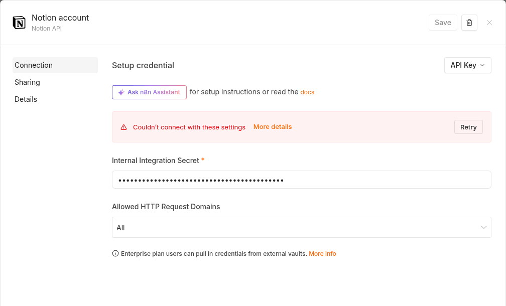
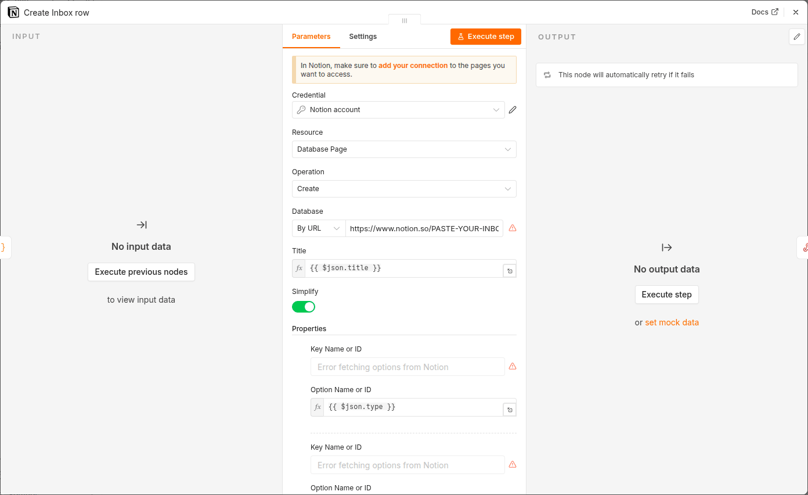
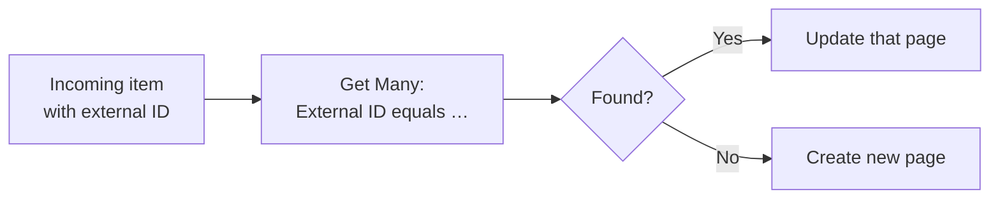

# 122 · Connecting n8n to Notion: The Complete Integration Guide 🔌

> ⏱️ 10 min read · 🎯 Intermediate · 🧰 Needs: n8n (self-hosted or Cloud) and a Notion workspace

**This is the reference chapter you'll keep open while building.** It covers connecting n8n to Notion securely, every
operation the Notion node offers, the four ways to trigger workflows from Notion, mapping each property type correctly,
filtering, falling back to raw API calls, and the patterns (upserts, batching, deduplication) that separate fragile
workflows from dependable ones.

<details class="keypoints" open>
<summary>✅ Key Points & Steps</summary>

n8n connects to Notion through a credential holding your integration secret. The Notion node then reads and writes pages, data sources and blocks, while triggers let changes in Notion start workflows.

1. **Create the credential** and share the right databases with your integration.
2. **Learn the node's operations,** from creating rows to reading page content as Markdown.
3. **Pick a trigger strategy:** polling, button or automation webhooks, integration webhooks, or a schedule.
4. **Map properties correctly,** filter queries, and use the HTTP Request node for anything else.
5. **Apply reliability patterns:** upserts, deduplication and rate-limit-aware batching.

</details>

<!-- in-this-chapter -->

## 🔐 Step 1: Set up the credential

1. **Create the integration.** Visit **notion.so/profile/integrations** → **New integration**. Give it a recognizable
   name like *n8n automations*, select your workspace and save. Under **Capabilities**, keep read, update and insert
   content; add comment capabilities only if you need them.
2. **Copy the secret.** On the integration's page, reveal and copy the **Internal integration secret**.
3. **Add it to n8n.** In n8n, go to **Credentials → Add credential**, search for **Notion API** and paste the secret.
   n8n tests the connection when you save.

    

    If the secret is wrong, n8n says so straight away:

    
4. **Share your databases.** In Notion, open each database the workflow needs → **⋯ → Connections** → add your
   integration.
5. **Confirm it works.** Add a **Notion** node to a workflow, choose **Database Page → Get Many**, and open the database
   dropdown. If your database appears, everything is connected.

> [!TIP]
> **💡 One integration per purpose**
> Create separate integrations for separate jobs, such as *n8n – personal*, *n8n – team CRM* and *n8n – read-only reports*.
> Each gets only the access it needs, and you can revoke one without breaking the others.

## 🧰 A tour of the Notion node

| Resource | Operation | Use it to |
|---|---|---|
| **Database Page** | Create | Add a row with properties (and optional body blocks) |
| | Get | Read one row by ID or URL |
| | Get Many | Query rows, with filters, sorting and "return all" pagination |
| | Update | Change a row's properties (status, AI results, timestamps) |
| **Page** | Create | Create a standalone page under another page |
| | Search | Find pages by title |
| | Get Markdown | Read a page's whole body as Markdown, ideal to send to an AI model |
| | Update Markdown | Replace or update a page's body using Markdown |
| | Archive | Move a page to the trash |
| **Block** | Append After | Add paragraphs, headings, to-dos and more to a page |
| | Get Many | Read a page's blocks |
| | Get Markdown | Read blocks as Markdown |
| **Data Source** | Get / Search | Find data sources and inspect their schema |
| **Database** | Get | Read a database and its data sources |
| **User** | Get / Get Many | Look up workspace members (for Person properties) |

**The Notion node is also an AI tool.** Attach it to an **AI Agent** node's tool slot and the agent can search, create and
update pages itself, with the agent filling in parameters you leave open. See
[AI Agents Across n8n + Notion](124-ai-agents-across-n8n-and-notion.md).

> [!NOTE]
> **📌 Operation names evolve**
> n8n adds Notion operations as Notion's API grows (the Markdown and data-source operations are recent additions). If your
> version shows slightly different names, update n8n or use the HTTP Request approach later in this chapter.

## ⏱️ Four ways to start a workflow from Notion

| Approach | How it works | Speed | Notion plan | Best for |
|---|---|---|---|---|
| **Notion Trigger** node | n8n checks a database every minute (or on your interval) for new or updated pages | ~1 minute | Any | Simple "new row → do something" flows |
| **Button / automation webhook** | Notion POSTs to an n8n **Webhook** node when clicked or when a property changes | Instant | Paid | One-click actions and status pipelines |
| **Integration webhooks** | Notion sends signed events for everything the integration can see | Near real time | Any (developer setup) | Workspace-wide syncing and indexing |
| **Schedule + Get Many** | A **Schedule Trigger** queries for rows matching a filter | Your schedule | Any | Daily digests, cleanups, reminders |

### Option A · The Notion Trigger
1. Add a **Notion Trigger** node and select your credential.
2. Choose the event: **Page Added to Database** or **Page Updated in Database**.
3. Pick the database and set the polling interval.
4. **Publish** the workflow. n8n remembers what it has already seen, so each page fires once per change.

### Option B · A webhook from a Notion button or automation
1. In n8n, add a **Webhook** node (POST, path such as `notion-process`) with **Header Auth** using a long random secret.
2. Copy the **Production URL**.
3. In Notion, add a button (or a database automation) → **Send webhook** → paste the URL → **Add custom header** with the
   same name and secret.
4. Choose the properties to include, click the button once, and inspect the payload in n8n's execution view.

The page ID arrives in the payload (look for `body.data.id` in n8n), so the next node can fetch or update that exact page.

### Option C · Integration webhooks
Use these when you need events from many databases or the whole workspace. The setup and its verification handshake are
in [Notion for Builders](121-notion-for-builders.md#-notions-integration-webhooks); in n8n, start with a **Webhook**
node, respond `200` quickly, and handle the event in a sub-workflow.

### Option D · Schedule and query
A **Schedule Trigger** followed by **Database Page → Get Many** with a filter (for example, *Status is Ready*) is the most
predictable pattern for batch work, and it never misses changes made while n8n was offline.

## 🗺️ Mapping properties correctly

Here's a real **Create** node from the starter kit. The database is pasted **By URL**, and each property is mapped to a
field from earlier in the workflow:



In the Notion node, add properties under **Properties → Add property**. Each property appears as `Name|type` (for
example `Priority|select`), and the value field adapts to the type.

| Type | Value to provide | Example expression |
|---|---|---|
| Title | Text | `{{ $json.title }}` |
| Text | Text (under 2,000 characters per segment) | `{{ $json.summary.slice(0, 1900) }}` |
| Number | A number | `{{ Number($json.amount) }}` |
| Select / Status | An existing option name, spelled exactly | `{{ $json.priority }}` → `High` |
| Multi-select | Several option names | `{{ $json.tags }}` (a list) or a comma-separated string, depending on the field |
| Date | ISO date or date-time | `{{ $now.toISODate() }}` or `{{ $json.due }}` |
| Checkbox | true or false | `{{ true }}` |
| URL / Email | A valid value | `{{ $json.link }}` |
| Relation | One or more page IDs from the related data source | `{{ $('Find project').item.json.id }}` |
| Person | A Notion user ID | Look it up once with **User → Get Many** |

> [!WARNING]
> **⚠️ Constrain AI output to your options**
> When an AI step chooses a select value, list the allowed options in the prompt and validate the result (an **IF** or
> **Code** node) before writing to Notion. A model inventing a category like *"Urgent-ish"* is the most common cause of
> failed Notion writes.

## 🔍 Filtering and querying

Simple conditions cover most needs: *Status equals Ready*, *Due on or before today*, *AI processed is unchecked*. For
"and/or" combinations, use a JSON filter:

```json
{
  "and": [
    { "property": "Status", "status": { "equals": "Ready" } },
    {
      "or": [
        { "property": "Priority", "select": { "equals": "High" } },
        { "property": "Due", "date": { "on_or_before": "{{ $now.plus({days: 2}).toISODate() }}" } }
      ]
    }
  ]
}
```

**Efficiency tip:** filter in Notion rather than fetching everything and filtering in n8n. It's faster, uses fewer API
calls and keeps you well under rate limits.

## 🌐 The HTTP Request fallback

Example: add a comment to the page that triggered the workflow, so people see what the automation did.

| Field | Value |
|---|---|
| Method | `POST` |
| URL | `https://api.notion.com/v1/comments` |
| Headers | `Notion-Version: 2025-09-03` |
| Body (JSON) | `{"parent": {"page_id": "{{ $json.pageId }}"}, "rich_text": [{"text": {"content": "✅ Processed by n8n: {{ $json.result }}"}}]}` |

Other good uses: querying with multiple sorts, reading database schemas to build dynamic forms, and trying new Notion
features before n8n's node supports them.

## 🧪 Patterns for dependable workflows

### Pattern 1 · Upsert (update or create)

Turn on **Always Output Data** on the *Get Many* node so the IF node still runs when nothing matches.

### Pattern 2 · Processing flags
Query for *AI processed is unchecked*, do the work, then update the row with *AI processed = checked* and the results. If
a run fails halfway, the unprocessed rows are simply picked up next time.

### Pattern 3 · Batching within rate limits
For large jobs, use **Loop Over Items** with a batch size of about 10, and a **Wait** node of one to two seconds between
batches. Enable **Retry On Fail** on Notion nodes (for example, 3 tries, 2 seconds apart) to absorb occasional `429`
responses.

### Pattern 4 · Respond fast, work later
For webhooks from Notion, set the Webhook node to respond immediately, then do slow AI work afterward. Notion doesn't need
to wait for your AI model to finish.

## 🩺 Troubleshooting

| Symptom | Likely cause | Fix |
|---|---|---|
| "Could not find database / object not found" | Not shared with the integration | **⋯ → Connections** → add the integration |
| "Validation error" on create or update | Wrong value format, or property name changed | Check the property's type and spelling; reselect it in the node |
| Select value not applied | Option name doesn't match exactly | Match capitalization and spacing, or validate AI output |
| `429` errors | Too many requests | Batch with waits; enable retries |
| Only 100 rows returned | Pagination | Turn on **Return All** |
| Text cut off or rejected | Over 2,000 characters | Split into several paragraphs or append to the page body |
| Notion Trigger fires twice | Two edits within one polling window, or two published copies of the workflow | Deduplicate with a processing flag; unpublish the duplicate |
| Button webhook does nothing | Using the test URL, workflow not published, or header mismatch | Use the **Production URL**, **Publish** the workflow, check the header |
| Old workflows break after a Notion update | API changes (such as the move to data sources) | Update n8n, then reselect databases in affected nodes |
| "Authorization failed – please check your credentials" | Wrong or regenerated secret | Paste the current **Internal Integration Secret** into the credential |
| "Not a valid Notion Database URL" | A placeholder or page link instead of a database link | Open the database → **••• → Copy link**, paste it into **Database** |
| Property dropdowns say "Error fetching options from Notion" | The credential works but can't see that database | Add your integration under **••• → Connections** on the database or its parent page |


## 🎯 Key takeaways

- Connect with an **integration secret** in an n8n **Notion API** credential, and **share** each database.
- Four operations do most of the work: **create, get many, update** database pages and **append** blocks.
- Start workflows with the **Notion Trigger** (simple), **button/automation webhooks** (instant), **integration
  webhooks** (workspace-wide) or a **schedule** (batch).
- Validate AI output against your **select options**, and use the **HTTP Request** node for anything else.
- Build in **upserts, processing flags, batching and retries** from the start.

## 🧠 Check yourself

<details class="quiz">
<summary>❓ 1. Your Get Many node returns exactly 100 rows, but the database has 340. What's wrong?</summary>

**Return All** is off, so n8n stopped at the first page of results. Turn it on to follow pagination.

</details>

<details class="quiz">
<summary>❓ 2. How do you stop a sync workflow from creating duplicate rows every time it runs?</summary>

Use an **upsert**: search for the item's **External ID** first, update the row if found, and create it only if not.

</details>

<details class="quiz">
<summary>❓ 3. You need to post a comment on a Notion page, but the Notion node has no comment operation. What do you do?</summary>

Use an **HTTP Request** node with the **Notion API** credential, the `Notion-Version` header and `POST /v1/comments`.

</details>

> [!TIP]
> **🎮 Try this**
> Extend the workflow from [The Power Stack](120-the-power-stack.md): before creating the Inbox page, search for an existing
> page with the same title created today, and skip it if found. You've just built your first deduplication step.

---

**Next:** [123 · Notion as Your Command Center →](123-notion-as-your-command-center.md)
