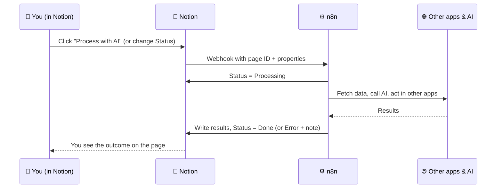
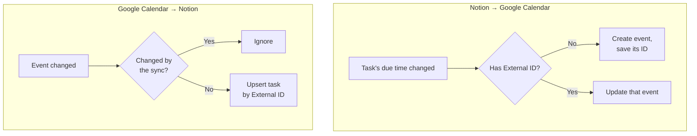

# 123 · Notion as Your Command Center: Buttons, Pipelines & Two-Way Workflows 🎛️

> ⏱️ 5 min read · 🎯 Intermediate · 🧰 Needs: n8n reachable over HTTPS, a paid Notion plan for webhook buttons (alternatives included)

**The most powerful way to combine these tools is to make Notion the control panel for everything n8n does.** Instead of
opening n8n to run a workflow, you click a button in Notion. Instead of checking logs, you look at a Status column.
Instead of editing workflow settings, you change a row in a Settings database. This chapter shows the six patterns that
turn Notion into a command center, with step-by-step setups for each.

✅ Key Points & Steps

In a command-center setup, people work entirely in Notion while n8n does the work behind the scenes and reports back by updating properties. Six patterns cover most needs.

- **Buttons** that run workflows and write the results back to the page.
- **Status-driven pipelines** where moving a card to a column starts the next stage.
- **Forms and intake** that n8n enriches automatically.
- **Dashboards** fed with metrics from other apps.
- **Two-way sync** with calendars, sheets or GitHub, without loops.
- **Settings and error logs** in Notion, so people can configure and monitor automations without opening n8n.

<!-- in-this-chapter -->

## 🎛️ The command-center idea

Three principles make it work:

1. **Every workflow writes its status back.** *Processing → Done* or *Error*, plus a short note.
2. **Results live in properties or the page body,** not hidden in n8n's execution history.
3. **People can always override.** AI results go into their own fields, so a person can correct them.

## 🔘 Pattern 1: Buttons that run workflows

**Example: a "Draft reply" button on a Support Requests database.**

| n8n node | What it does |
|---|---|
| **Webhook** (Header Auth) | Receives the page ID and the *Customer message* property |
| **Notion → Update** | Sets *Status* to `Drafting` |
| **AI Agent** or **Basic LLM Chain** | Drafts a reply using your tone guide and the FAQ page |
| **Notion → Update** | Writes *Draft reply* and sets *Status* to `Ready for review` |
| **Error branch** | Sets *Status* to `Error` and writes the error message to *Automation note* |

Other useful buttons: **Summarize this page**, **Generate subtasks**, **Research this company**, **Create calendar
event**, **Send to client**, **Publish to blog**.

> [!TIP]
> **💡 No paid plan? Use a checkbox instead**
> Add a *Run AI* checkbox. A **Notion Trigger** (Page Updated) or a scheduled **Get Many** query for *Run AI is checked
> and Status is not Done* picks it up within a minute. The workflow unchecks the box when it finishes.

## 🔄 Pattern 2: Status-driven pipelines

**Example: a content pipeline.**

| Status | Who acts | What happens |
|---|---|---|
| 💡 Idea | You | Add a topic and notes |
| ✍️ Drafting | n8n + AI | Researches the topic, writes an outline and first draft into the page body |
| 👀 Review | You | Edit the draft; move to Scheduled when happy |
| 📅 Scheduled | n8n | Creates social posts, schedules them, adds a calendar event |
| ✅ Published | n8n | Posts, records the live URLs, notifies Slack |

The pattern works for anything with stages: hiring, client onboarding, bug triage, sales deals, event planning.

> [!WARNING]
> **⚠️ Avoid trigger loops**
> If n8n updates the same property that triggers the automation, it can trigger itself again. Trigger on a *specific*
> value (Status is set to *Drafting*), and have n8n move the row to a *different* value when it's done.

## 📝 Pattern 3: Forms and intake

**Example: client intake.** A prospect fills in your form → n8n classifies the request type and budget fit, looks up the
company website, drafts a personalized first reply, sets *Owner* by request type, and posts a summary to Slack. You open
Notion to a fully prepared lead.

If you use another form tool (Typeform, Tally, Google Forms), point its webhook at n8n and have n8n create the Notion row.
The result is the same.

## 📊 Pattern 4: Dashboards fed by n8n

| Metric | Source | n8n node |
|---|---|---|
| Revenue and new customers | Stripe | Stripe node or HTTP Request |
| Newsletter subscribers | Buttondown, Beehiiv, ConvertKit | HTTP Request |
| YouTube views | YouTube Data API | YouTube node |
| Website visitors | Plausible, Google Analytics | HTTP Request / Google Analytics node |
| Open support tickets | Notion itself | Notion → Get Many (count) |
| Steps and sleep | Health exports | Webhook from a phone shortcut |

Add a weekly **AI commentary** row: n8n reads the last two weeks of metrics and asks a model for three observations and one
suggestion, then writes them to a *Weekly Insights* page.

## 🔁 Pattern 5: Two-way sync without loops

**Start one-way.** Most "two-way" needs are really one-way plus occasional edits. Syncing Notion tasks *to* your calendar
(Notion stays the source of truth) is far simpler and covers most people's needs.

## ⚙️ Pattern 6: Settings and error logs in Notion

| Settings key | Example value | Used by |
|---|---|---|
| `digest_recipients` | `you@example.com, partner@example.com` | Daily briefing |
| `news_keywords` | `MCP, n8n, local AI` | News monitor |
| `ai_model_default` | `claude-sonnet-5-5` | Every AI step |
| `quiet_hours` | `22:00-07:00` | Notification workflows |

Now a teammate can change who receives the digest by editing a Notion row, and anyone can see what failed today by
opening the Automation Log. The [build-along](127-build-along-ai-command-center.md) includes a ready-made error logger.

## 🔐 Securing the connection

| Risk | Protection |
|---|---|
| Someone discovers your webhook URL | Header Auth with a long random secret |
| Malicious or malformed payloads | Validate fields; fetch the page from Notion by ID rather than trusting payload values |
| Prompt injection inside page text | Treat page content as untrusted input to AI; require approval for sending or deleting ([MCP Security & Trust](../part-4-mcp-and-connectors/43-mcp-security-and-trust.md)) |
| An integration with too much access | Share only the databases each workflow needs |

## 🎯 Key takeaways

- Make **Notion the control panel**: people click buttons and move cards; n8n works behind the scenes.
- Every workflow should **write its status and results back** to Notion.
- **Buttons, status pipelines, forms, dashboards, two-way sync, settings and logs** cover most command-center needs.
- Prevent **trigger loops** by reacting to specific values and moving rows to a different status.
- Protect webhooks with **header secrets** and treat page content as **untrusted input** to AI.

## 🧠 Check yourself

❓ 1. Your automation fires when Status changes, and n8n also changes Status. How do you avoid an endless loop?

Trigger only on a **specific value** (for example, *Status is set to Drafting*) and have n8n set a **different** value
when it finishes (*Review* or *Error*).

❓ 2. You're on Notion's free plan and can't use Send webhook. How can a person still trigger a workflow from Notion?

Use a **checkbox** (such as *Run AI*) and have the **Notion Trigger** or a scheduled **Get Many** query pick up checked
rows, then uncheck the box when done.

❓ 3. Why store automation settings in a Notion database instead of inside the workflow?

So **anyone can change them without opening n8n**, and the settings are visible and documented alongside the work they
affect.

> [!TIP]
> **🎮 Try this**
> Add a *Summarize* button to any Notion database you use. Wire it to a workflow that reads the page as Markdown, asks a
> model for a three-bullet summary and writes it to an *AI summary* property. It takes about 20 minutes, and you'll use it
> every day.

---

**Next:** [124 · AI Agents Across n8n + Notion →](124-ai-agents-across-n8n-and-notion.md)
