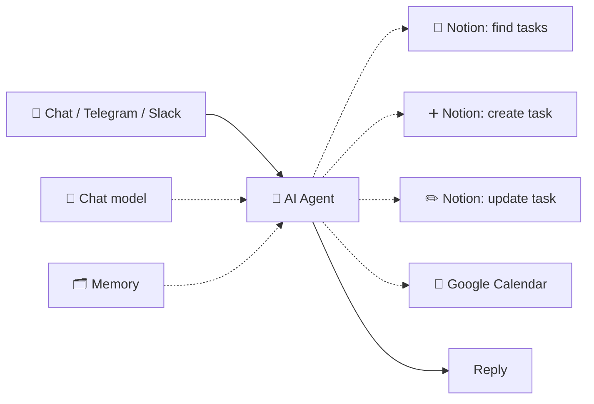
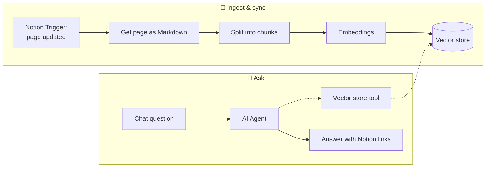

# 124 · AI Agents Across n8n + Notion 🤖

> ⏱️ 8 min read · 🎯 Intermediate → advanced · 🧰 Needs: n8n, Notion, and an AI model (cloud API key or Ollama)

**AI can live in three places in this stack: inside Notion, inside n8n, and in the assistants you chat with.** Each has
strengths, and the best systems combine them: Notion's agents reason over your workspace, n8n agents act across your
other apps, and Claude or ChatGPT reach both through MCP when you ask. This chapter shows how to build each kind, how to
connect them, and how to keep them safe.

<details class="keypoints" open>
<summary>✅ Key Points & Steps</summary>

AI agents can run in Notion (Notion Agent and Custom Agents), in n8n (the AI Agent node) or in external assistants (Claude, ChatGPT and others) connected through MCP. This chapter teaches you to build an n8n agent with Notion tools, expose your workflows to other assistants over MCP, search your Notion workspace with RAG, and divide work sensibly between Notion's agents and n8n.

1. **Build an n8n agent** that can search, create and update Notion pages.
2. **Connect assistants through MCP** in both directions.
3. **Add RAG** so AI can answer questions from your whole Notion workspace.
4. **Use AI enrichment pipelines** for reliable, structured processing.
5. **Apply guardrails:** least privilege, approvals and protection against prompt injection.

</details>

<!-- in-this-chapter -->

## 🧠 Three homes for AI

| Where | What it is | Best for | Limits |
|---|---|---|---|
| **Notion AI** (Notion Agent, Custom Agents, AI properties) | AI built into your workspace | Writing, summarizing and organizing Notion content; scheduled reviews | Mostly works inside Notion (plus its MCP connections); uses Notion credits |
| **n8n AI Agent node** | An agent inside a workflow, with any model and any tools | Cross-app actions, triggered automation, batch processing, private models | You design and maintain the workflow |
| **External assistants** (Claude, ChatGPT, Gemini, Cursor…) | Chat assistants connected through MCP or connectors | On-demand questions and tasks in conversation | Need connectors set up; act only when you ask |

**A sensible division:** Notion AI for anything that stays inside Notion; n8n for anything that touches other apps or runs
without you; your chat assistant as the friendly front door that can reach both.

## 🛠️ Build: an n8n agent with Notion tools



**Tool setup.** For each Notion tool node, fix the parts that should never change (the database, the operation) and let
the model fill in the rest. In n8n, a field can be left for the AI to decide (the ✨ "let the model define this" option),
and you describe what belongs there:

| Tool node | Fixed by you | Filled in by the agent |
|---|---|---|
| **Find tasks** (Database Page → Get Many) | Tasks database, Return All | Filter: status, due date or keyword |
| **Create task** (Database Page → Create) | Tasks database, Source = `Agent` | Title, Due, Priority |
| **Update task** (Database Page → Update) | The properties it may change | Page ID, new Status or Due date |

**A system message that works:**

```text
You are Sam's workspace assistant. Today is {{ $now.toFormat('cccc, d LLLL yyyy') }}.

Notion databases you can use:
- Tasks: Name, Status (To do / In progress / Done), Due (date), Priority (High / Medium / Low), Project (relation).

Rules:
- Always search before creating, to avoid duplicates.
- Only use Priority values High, Medium or Low.
- Before marking anything Done or changing a due date, confirm with Sam in one short sentence.
- Never delete or archive pages.
- Keep replies under 80 words unless asked for more.
```

See [n8n AI Agents Deep Dive](../part-5-automation/48-n8n-ai-agents.md) for memory, model choice and multi-agent patterns,
and the [Pocket AI Assistant build-along](../part-13-build-alongs/112-build-along-pocket-ai-assistant.md) for a complete
Telegram example.

## 🔌 MCP in both directions

| Direction | How | Example |
|---|---|---|
| **Claude / ChatGPT → Notion** | Connect Notion's official MCP server or built-in Notion connector | *"Which projects have no updates in two weeks?"* |
| **Claude / ChatGPT → n8n workflows** | An n8n workflow starting with an **MCP Server Trigger**, added as a custom connector | *"Run the client onboarding workflow for Acme."* |
| **Claude / ChatGPT → your whole n8n instance** | n8n's **instance-level MCP server** (enable it in n8n settings, then choose which workflows it exposes) | *"List my workflows and run the weekly report."* |
| **Notion Custom Agents → n8n** | Add your n8n MCP server URL as a custom MCP connection in Notion | A Notion agent that triages requests and calls n8n to send emails or update the CRM |
| **n8n agent → any MCP server** | The **MCP Client Tool** node in an AI Agent | An n8n agent using GitHub, Brave Search or a custom server's tools |

### Exposing your Notion workflows as MCP tools
This is one of the most useful patterns in the whole manual: wrap carefully designed Notion operations as MCP tools, then
use them from any assistant.

1. Create a workflow that starts with an **MCP Server Trigger** node and turn on authentication.
2. Attach tools to it: Notion tool nodes (*Find tasks*, *Create task*) or **Call n8n Workflow** tools for multi-step
   operations (*Onboard client*, *Weekly report*).
3. Write a clear name and description for each tool. The assistant reads them to decide when to use it.
4. **Publish** the workflow, copy the MCP URL, and add it to Claude, ChatGPT or Cursor as a custom connector (with your
   authentication header or token).

The kit includes a ready-made version:
[`5-notion-tools-mcp-server.json`](../../examples/n8n-notion/5-notion-tools-mcp-server.json).


For the **whole instance**, open **Settings → Instance-level MCP** in n8n and click **Enable MCP access**:


The [build-along](127-build-along-ai-command-center.md) walks through connecting it, step by step.

**Why route through n8n instead of connecting Notion directly?** Because you decide exactly which operations exist. A
*Create task* tool that always files into the right database with Source = `Claude` is safer and more predictable than
giving an assistant open access to your whole workspace.

## 📚 RAG over your Notion workspace



**Practical tips:**

- **Store metadata** with every chunk: page title, URL, database and last-edited time, so answers can link back.
- **Delete before re-adding:** when a page changes, remove its old chunks first (filter by page ID) to avoid stale
  answers.
- **Start with one database or teamspace,** such as your wiki or meeting notes, and expand once quality is good.
- **Compare with built-in options:** Notion's own AI search may already answer many questions. Build your own RAG when you
  need a different model, a private setup, a chat interface in another app or a combination with non-Notion sources.

Step-by-step RAG details are in [Build a RAG System](../part-8-knowledge-and-memory/74-build-a-rag-system.md).

## 🤝 Notion Custom Agents and n8n, working together

| Job | Notion Custom Agent | n8n |
|---|---|---|
| Weekly review of projects and notes | ✅ Reads and writes Notion natively | |
| Bring in emails, payments and calendar events | | ✅ Syncs them into Notion databases |
| Decide which requests need follow-up | ✅ Reasons over the request text | |
| Send the follow-up email and log it in the CRM | Calls n8n through MCP | ✅ Sends, logs and retries |
| Process 500 rows overnight with a cheap model | | ✅ Batching, model choice, cost control |

**Example: a support triage team.** n8n pulls new support emails into a *Requests* database every few minutes. A Notion
Custom Agent reviews new requests each hour, sets category and urgency, and drafts a reply into the page. When a person
moves a request to *Approved*, a database automation sends a webhook to n8n, which emails the reply and updates the
customer record.

## 🧪 AI enrichment pipelines

| Enrichment | Output fields | Good model choice |
|---|---|---|
| Classify an inbox item | Type, Priority, Project (from a fixed list) | Small, fast model |
| Summarize a meeting note | Summary, Decisions, Action items | Mid-size model |
| Extract invoice details | Vendor, Amount, Due date, Currency | Mid-size model with vision for PDFs |
| Score a lead | Fit score (1–5), Reason, Next step | Mid-size model |
| Translate a page | Translated text appended to the body | Mid-size model |
| Write a first draft | Draft in the page body | Flagship model |

**Agent or pipeline?** If you can write the steps down in advance, use a pipeline. If the AI must decide which steps to
take, use an agent.

## 🛡️ Guardrails for AI in your workspace

| Risk | Guardrail |
|---|---|
| **Prompt injection** from page content, emails or web pages | Don't give an agent that reads untrusted content the ability to send messages or delete data without approval |
| **Bulk mistakes** (an agent updating hundreds of rows) | Limit tool scope; cap iterations; test on a copy of the database |
| **Invented values** | Constrain selects to allowed options; validate before writing |
| **Runaway costs** | Spend limits on API keys; cheap models for routine steps; Notion credit monitoring for Custom Agents |
| **Unclear accountability** | Set *Source = Agent* and write an *Automation note* explaining each change |

More detail: [MCP Security & Trust](../part-4-mcp-and-connectors/43-mcp-security-and-trust.md) and
[Safety, Costs & Gotchas](../part-12-mastery/103-safety-costs-and-gotchas.md).

## 🎯 Key takeaways

- AI can live in **Notion**, in **n8n** or in **external assistants**; combine them by strength.
- An **n8n AI Agent with Notion tools** becomes a workspace assistant you can reach from any chat app.
- **MCP works in every direction:** assistants to Notion, assistants and Notion agents to n8n, and n8n agents to any MCP
  server.
- **RAG** over Notion needs ingestion, syncing and metadata for citations.
- Use **pipelines** for predictable work and **agents** when the steps can't be known in advance, always with
  **guardrails**.

## 🧠 Check yourself

<details class="quiz">
<summary>❓ 1. Why expose Notion operations through an n8n MCP server instead of giving Claude full Notion access?</summary>

Because you **control exactly which operations exist** and how they behave (the database, default values, validation),
which is safer and more predictable than open access.

</details>

<details class="quiz">
<summary>❓ 2. You need to classify 300 new inbox items every night into five fixed categories. Agent or pipeline?</summary>

A **pipeline**: the steps are known in advance, so a structured-output chain is cheaper, faster and more reliable than an
agent.

</details>

<details class="quiz">
<summary>❓ 3. A page in your RAG index was edited. What should the sync workflow do before adding the new chunks?</summary>

**Delete the page's old chunks** (filtered by page ID) so outdated text can't appear in answers.

</details>

> [!TIP]
> **🎮 Try this**
> Import [`5-notion-tools-mcp-server.json`](../../examples/n8n-notion/5-notion-tools-mcp-server.json), connect it to
> Claude as a custom connector, and ask: *"What's due this week in my Notion tasks? Add a task to call the plumber
> tomorrow."* Watch Claude use the tools you defined.

---

**Next:** [125 · Connecting Everything →](125-connecting-everything.md)
