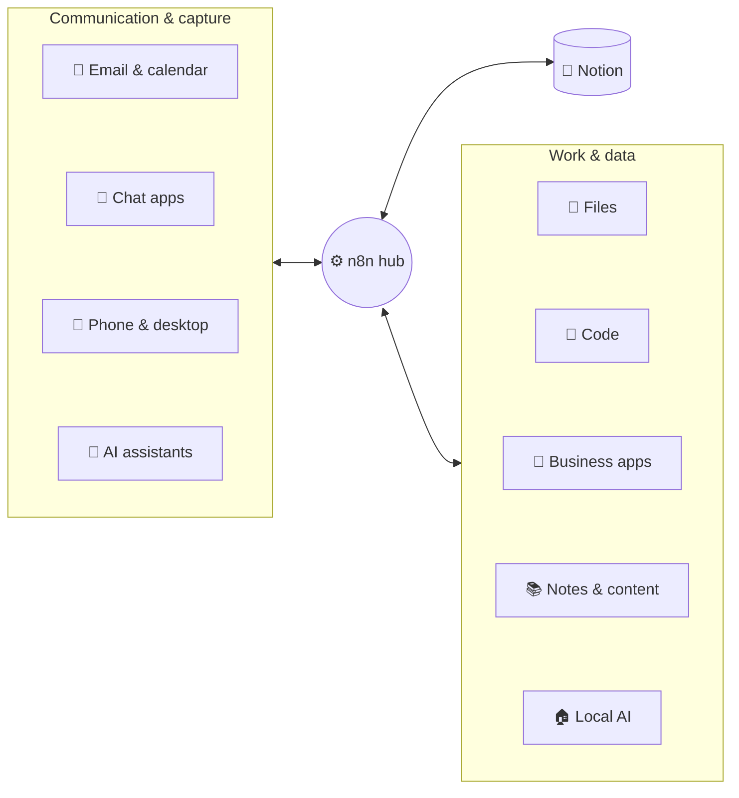

# 125 · Connecting Everything: n8n + Notion + Your Whole Stack 🌐

> ⏱️ 9 min read · 🎯 Intermediate · 🧰 Needs: n8n and Notion connected (see chapter 122), plus the apps you want to link

**This chapter is the map of how your n8n + Notion system connects to the rest of your digital life.** For each kind of
tool (email, calendar, chat, AI assistants, phone, files, code, business apps, notes, content and local AI) you'll find
what typically flows between it and Notion, which direction it should flow, which n8n nodes to use and a ready-made
workflow idea. Start with the design principles, then jump to the tools you use.

✅ Key Points & Steps

n8n acts as the hub that connects Notion to every other tool. For each connection, decide which system is the source of truth, which direction data flows and how records are matched, then build small, focused workflows rather than one giant one.

1. **Apply the design principles:** one source of truth per kind of data, clear direction, External IDs and small workflows.
2. **Pick the connections that matter most to you** from the sections below.
3. **Build one at a time,** test it, and add it to your Automation Log so failures are visible.

<!-- in-this-chapter -->

## 🧭 Design principles for a connected system

| Principle | What it means | Example |
|---|---|---|
| **One source of truth** | Decide where each kind of data is "really" kept | Tasks live in Notion; meetings live in Google Calendar |
| **Clear direction** | Prefer one-way flows; add the reverse direction only when needed | Tasks → calendar blocks, but not calendar → tasks |
| **Match with IDs** | Store the other system's ID in Notion (External ID) | The Gmail message ID on each email-task |
| **Small workflows** | One trigger, one job; chain them with sub-workflows | *Capture email*, *Enrich with AI* and *Notify* as three workflows |
| **Visible failures** | Every workflow uses the shared error logger | Failures appear in the Notion Automation Log |
| **Document as you go** | Keep an *Automations* database in Notion describing each workflow | Name, trigger, purpose, owner, link to n8n |

## 📧 Email and calendar

| Flow | Direction | n8n nodes | How it works |
|---|---|---|---|
| **Email → task** | Gmail/Outlook → Notion | Gmail Trigger (or Outlook Trigger), AI chain, Notion | Emails with a label like *To Notion*, or ones the AI flags as action items, become tasks with the email link and a summary |
| **Tasks → time blocks** | Notion → Google Calendar | Schedule, Notion Get Many, Google Calendar | Tasks with a *Scheduled for* time become calendar events; the event ID is saved as External ID |
| **Meeting prep pages** | Calendar → Notion | Schedule, Google Calendar, AI chain, Notion | Each morning, every meeting gets a Notion page with attendees, related notes and suggested talking points |
| **Meeting notes → actions** | Notion → Notion + email | Notion Trigger, AI extractor, Notion, Gmail | When a meeting note is marked *Final*, action items become tasks and a follow-up email is drafted |
| **Weekly email digest** | Notion → email | Schedule, Notion Get Many, AI chain, Gmail | A friendly summary of the week's progress sent every Friday |

**Tip:** label-driven capture (only emails you label *To Notion*) is more reliable than letting AI decide which emails
matter. Add AI selection later, once you trust it.

See also: [Email & Calendar Superpowers](../part-6-ai-in-your-apps/57-email-and-calendar.md).

## 💬 Chat apps: Slack, Telegram, Discord and WhatsApp

| Flow | Direction | How |
|---|---|---|
| **Save a message to Notion** | Slack/Telegram → Notion | React with an emoji (Slack) or forward to your bot (Telegram); n8n creates an Inbox row with the message link |
| **Daily briefing** | Notion → chat | A morning workflow posts today's priorities and overdue items |
| **Status alerts** | Notion → Slack | A database automation webhook tells n8n when a deal is won or a task is blocked; n8n posts to the right channel |
| **Workspace assistant** | Chat ↔ Notion | An n8n AI Agent with Notion tools, answering in Telegram or Slack ([chapter 124](124-ai-agents-across-n8n-and-notion.md)) |
| **Team requests** | Slack → Notion | A slash command or form message creates a request row and replies with its Notion link |

See also: [Chat Apps & Bots](../part-6-ai-in-your-apps/59-chat-apps-and-bots.md).

## 🤖 AI assistants: Claude, ChatGPT, Gemini and more

| Assistant | Connect Notion | Connect n8n workflows |
|---|---|---|
| **Claude** (web, desktop, Claude Code) | Built-in Notion connector or Notion MCP | Custom connector with your n8n MCP URL |
| **ChatGPT** | Notion connector | Developer mode or a custom connector with your n8n MCP URL |
| **Gemini** | Via Gemini CLI or other MCP-capable tools | Same MCP URL in MCP-capable clients |
| **Cursor / VS Code / coding agents** | Notion MCP server | n8n MCP server, so coding agents can update project tasks |
| **Notion Custom Agents** | Native | Custom MCP connection to your n8n server |

**Prompts to try once connected:**

- *"Look at my Notion tasks due this week and propose a realistic schedule."*
- *"Create Notion tasks from this meeting transcript, assigned to the right people."*
- *"Run the weekly report workflow and summarize the result."*
- (In Claude Code) *"When you finish this feature, mark the Notion task done and add a comment with the PR link."*

## 📱 Phone and desktop

| Capture | Device tool | What n8n does |
|---|---|---|
| **Voice idea** | iPhone Shortcut (Dictate → Get Contents of URL), Android Tasker | AI cleans it up and files it in the Inbox |
| **Receipt photo** | Shortcut that sends an image | Vision model extracts vendor, amount and date into an Expenses database |
| **Current web page** | Raycast, Alfred, a browser bookmarklet | Fetches the page, summarizes it and saves it to Resources |
| **Selected text** | Desktop hotkey | Saves the quote with its source to a Quotes or Research database |
| **Location check-in** | Phone automation on arrival | Logs visits or triggers location-based reminders |

See also: [Phone & Desktop Automation](../part-5-automation/50-phone-and-desktop-automation.md).

## 📁 Files and documents

| Flow | How |
|---|---|
| **Invoices and receipts** | Google Drive or Dropbox trigger → extract fields with AI → Notion Expenses row with the file link |
| **Contracts** | New PDF in a folder → AI summary, key dates and risks → Notion Contracts row; key dates added to the calendar |
| **Meeting recordings** | New recording → transcription → summary and action items → Notion meeting page |
| **Notion → documents** | A Notion button generates a formatted Google Doc or PDF from a page (for proposals and reports) |
| **Backups** | A weekly workflow exports key databases to CSV in cloud storage |

## 🐙 Code and project tools: GitHub, Linear and Jira

| Flow | Direction | How |
|---|---|---|
| **Issues → roadmap** | GitHub → Notion | GitHub Trigger on issues → upsert a Notion row by issue number (External ID) |
| **Roadmap → issues** | Notion → GitHub | A *Create issue* button on a Notion feature row → GitHub node → save the issue URL back |
| **Release notes** | GitHub → Notion | On a new release, AI summarizes merged pull requests into a Notion changelog page |
| **Coding agent updates** | Claude Code → Notion | Claude Code with Notion MCP marks tasks done and links the pull request |
| **Bug intake** | Form → Notion → GitHub | User bug reports land in Notion; triaged ones become GitHub issues |

See also: [Git & GitHub](../part-7-building-with-ai/61-git-and-github.md).

## 💼 Business apps: payments, CRM, scheduling and forms

| Source | Flow into Notion | Useful follow-up |
|---|---|---|
| **Stripe** | New payment or subscription → Customers and Payments databases | Thank-you email; monthly revenue on the dashboard |
| **Calendly / Cal.com** | New booking → Client and Meetings rows | Prep page with AI research on the client |
| **Typeform / Tally / Google Forms** | New submission → Leads database | AI fit score and drafted reply |
| **Shopify / WooCommerce** | New order → Orders database | Low-stock alerts; weekly sales summary |
| **HubSpot / Pipedrive** | Deal changes → Notion project pages | Kick off onboarding when a deal is won |
| **QuickBooks / Xero** | Overdue invoices → Notion tasks | Polite payment reminder drafts |

See also: [Small Business & Side Hustles](../part-11-ai-for-life-and-work/93-small-business.md).

## 📚 Notes, reading and content

| Flow | How |
|---|---|
| **RSS and newsletters → Notion** | RSS Trigger → AI filters and summarizes → Resources database ([Web Scraping & Monitoring](../part-5-automation/51-web-scraping-and-monitoring.md)) |
| **YouTube → notes** | New video in a playlist → transcript → summary and key ideas → Notion page |
| **Highlights → Notion** | Readwise or Kindle highlights → a Notion page per book |
| **Obsidian ↔ Notion** | Notion stays the team hub while Obsidian stays personal; n8n copies selected Notion pages to Markdown files (or the reverse) |
| **Notion → blog or newsletter** | Status *Ready to publish* → n8n converts the page to Markdown/HTML → posts to your blog platform or newsletter tool |
| **Notion → social** | Approved posts in a Social database are scheduled through Buffer or posted directly |

## 🏠 Local AI and smart home

- **Private AI processing:** swap the cloud model node for an **Ollama Chat Model** node pointing at your home lab
  ([The AI Home Lab](../part-9-local-ai/80-home-lab.md)). Journals, health notes and financial documents never leave your
  network (apart from what you choose to store in Notion).
- **Home routines from Notion:** a *Home* database with buttons like *Movie night* or *Leaving for vacation* triggers n8n,
  which calls Home Assistant.
- **Home status in Notion:** a daily workflow records energy use or device alerts in a Notion dashboard.

## 🟠 Bridging to Zapier and Make

This "thin bridge" approach keeps costs low (one simple step in Zapier or Make) and avoids splitting your logic across
platforms. See [Zapier & Make Walkthroughs](../part-5-automation/49-zapier-and-make-walkthroughs.md).

## 🗺️ Putting it together: three example systems

| System | Notion databases | Key n8n workflows |
|---|---|---|
| **🧑 Personal life OS** | Inbox, Tasks, Projects, Resources, Journal, Expenses | Phone and email capture; daily briefing to Telegram; receipt extraction; weekly review; calendar time blocks |
| **💼 Freelancer hub** | Leads, Clients, Projects, Invoices, Content | Form → lead scoring; Stripe → payments; Calendly → prep pages; overdue invoice reminders; content pipeline to LinkedIn |
| **👥 Small team ops** | Requests, Roadmap, Meetings, Wiki, Automation Log | Slack → requests; GitHub ↔ roadmap sync; meeting notes → tasks; RAG chat over the wiki; error logging and weekly metrics |

Start with three or four workflows from the system closest to yours, and add more as real needs appear. The
[Recipe Book](126-n8n-notion-recipe-book.md) has 40 more.

## 🎯 Key takeaways

- n8n is the **hub**; Notion is the **source of truth** for the data you choose to keep there.
- Decide the **direction** and the **ID matching** for every connection before you build it.
- **Email, calendar and chat** are the highest-value connections for most people; **business apps** turn Notion into a
  CRM.
- **AI assistants** connect through **MCP**: Notion directly, and your designed actions through n8n.
- Use **Zapier or Make as thin bridges** for niche apps, and **local models** for private data.

## 🧠 Check yourself

❓ 1. You want tasks to appear in your calendar. Which system should be the source of truth, and which way should data flow?

Usually **Notion is the source of truth for tasks**, and data flows **one way** from Notion to the calendar, with the
event ID stored in Notion as an External ID.

❓ 2. An app you need only integrates with Zapier. How do you include it without moving your logic to Zapier?

Use Zapier as a **thin bridge**: the app triggers a Zap whose only action **sends a webhook to n8n**, and n8n does the
rest.

❓ 3. Why is label-driven email capture a good starting point compared with letting AI pick important emails?

It's **predictable and fully in your control**, so you can trust it immediately. AI selection can be added later once
you've seen how well it performs.

> [!TIP]
> **🎮 Try this**
> Pick the example system closest to your life and list the three workflows that would save you the most time. Build the
> first one this week, using the [Recipe Book](126-n8n-notion-recipe-book.md) for the details.

---

**Next:** [126 · The n8n + Notion Recipe Book →](126-n8n-notion-recipe-book.md)
