# 127 · Build-Along: Your AI Command Center in Notion + n8n 🏗️

> ⏱️ ~3 hours to build · 🎯 Intermediate (no coding required) · 🧰 Needs: n8n reachable over HTTPS, a Notion workspace (paid plan for the button step, or use the free alternative), an Anthropic API key, Telegram (optional)

**You'll build a working AI command center, one click at a time.** Anything you capture (spoken on your phone, sent
from any app) lands in a Notion Inbox, already titled, typed and prioritized by AI. A Notion button turns an item into a
plan with subtasks. A briefing of what's due arrives every morning. Failures are logged where you'll see them. And Claude
can manage your tasks in plain language.

<details class="keypoints" open>
<summary>✅ Key Points & Steps</summary>

You'll import five ready-made workflows from this manual's starter kit and connect them to four Notion databases,
testing each one before moving on.

1. **Create four Notion databases** and a Notion integration for n8n.
2. **Import the error logger first** and publish it, so every later problem is visible.
3. **Build capture:** a secure webhook that triages anything you send into the Inbox.
4. **Add the Process with AI button** and the **daily briefing.**
5. **Serve your task tools over MCP** so Claude can read and update your tasks.

</details>

<!-- in-this-chapter -->

## 🗺️ What you'll build

Four Notion databases and five n8n workflows:

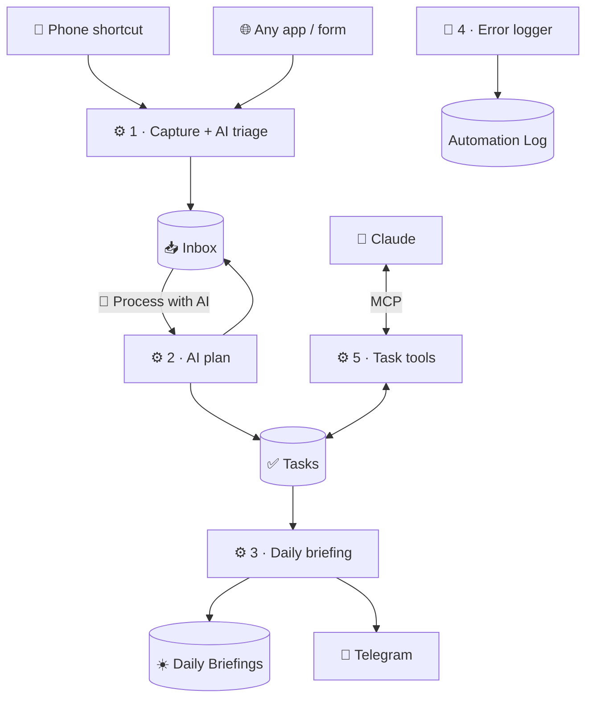
```mermaid
flowchart TB
    PH[📱 Phone shortcut] --> W1
    APP[🌐 Any app / form] --> W1
    W1[⚙️ 1 · Capture + AI triage] --> IN[(📥 Inbox)]
    IN -->|🔘 Process with AI| W2[⚙️ 2 · AI plan]
    W2 --> IN
    W2 --> TK[(✅ Tasks)]
    TK --> W3[⚙️ 3 · Daily briefing]
    W3 --> DB[(☀️ Daily Briefings)]
    W3 --> TG[💬 Telegram]
    CL[🤖 Claude] <-->|MCP| W5[⚙️ 5 · Task tools]
    W5 <--> TK
    W4[🚨 4 · Error logger] --> LOG[(Automation Log)]
```

Each workflow is a file in the starter kit, [`examples/n8n-notion`](../../examples/n8n-notion/README.md). Here's the
capture workflow after import, so you know what you're aiming for:

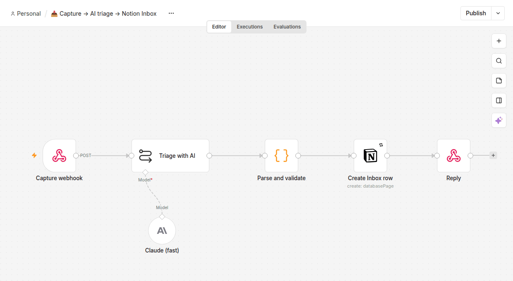

> [!NOTE]
> **📸 About the screenshots**
> The n8n screenshots were captured by importing this kit into n8n 2.41.6 (October 2026). Notion's screens aren't shown,
> so its steps spell out exactly what to click. New to n8n? Do
> [The n8n Masterclass](../part-5-automation/47-n8n-masterclass.md) first; it takes 30 minutes and covers the basics
> used here.

## ✅ Before you start

- [ ] **n8n** on n8n Cloud, or self-hosted with a public HTTPS address (needed for Notion buttons and your phone)
- [ ] A **Notion** workspace. The *Process with AI* button needs a paid plan; a free alternative is included.
- [ ] An **Anthropic API key** with a monthly **spend limit** set (console.anthropic.com)
- [ ] Optional: a **Telegram bot** token and your chat ID
  ([Pocket AI Assistant](../part-13-build-alongs/112-build-along-pocket-ai-assistant.md) shows how to get both)

## 1️⃣ Step 1: Create the four Notion databases (20 min)

**Fast way (2 minutes).** If you have Notion AI, or Claude connected to Notion, open a new page and paste this prompt:

```text
Create a page called "🎛️ Command Center" with four full-page databases inside it, using exactly these
property names, types and options:

📥 Inbox: Name (title); Status (status: New, Processing, Processed, Error); Type (select: Task, Idea, Note, Link);
Priority (select: High, Medium, Low); Source (select: Phone, Email, Web, Telegram, Slack, Other);
Summary (text); Next step (text); AI processed (checkbox)

✅ Tasks: Name (title); Status (status: To do, In progress, Done); Priority (select: High, Medium, Low);
Due (date); Source (select: Me, AI, Email, Phone)

☀️ Daily Briefings: Name (title); Date (date)

🚨 Automation Log: Name (title); Status (select: Error, Info); Error (text); Execution link (URL); Time (date)
```

**By hand (20 minutes):**

1. In Notion's sidebar, click **+ New page** and name it **🎛️ Command Center**.
2. In the page, type `/database` and pick the **full-page** database option. Name it **📥 Inbox**.
3. To add a property, click **+** at the right end of the column headers, pick the type, and type the name. To set a
   select's options, click a cell in that column and type each option, pressing Enter after each one.
4. For the **Status** property, click its header → **Edit property**, then rename or add options until they match the
   table below exactly (spelling and capitals matter: the workflows write these exact words).
5. Go back to **🎛️ Command Center** and repeat for the other three databases.

| Database | Property → type (options) |
|---|---|
| 📥 **Inbox** | Name → Title · Status → Status (`New`, `Processing`, `Processed`, `Error`) · Type → Select (`Task`, `Idea`, `Note`, `Link`) · Priority → Select (`High`, `Medium`, `Low`) · Source → Select (`Phone`, `Email`, `Web`, `Telegram`, `Slack`, `Other`) · Summary → Text · Next step → Text · AI processed → Checkbox |
| ✅ **Tasks** | Name → Title · Status → Status (`To do`, `In progress`, `Done`) · Priority → Select (`High`, `Medium`, `Low`) · Due → Date · Source → Select (`Me`, `AI`, `Email`, `Phone`) |
| ☀️ **Daily Briefings** | Name → Title · Date → Date |
| 🚨 **Automation Log** | Name → Title · Status → Select (`Error`, `Info`) · Error → Text · Execution link → URL · Time → Date |

> ✅ **Checkpoint:** the Command Center page holds four databases, and every option matches the table, capitals included.

## 2️⃣ Step 2: Create a Notion integration for n8n (5 min)

An **integration** is a key that lets n8n into the pages you choose, and nothing else.

1. Go to **notion.so/profile/integrations** and click **New integration**.
2. Name it *n8n automations*, choose your workspace, keep the type **Internal**, and click **Save**.
3. On the integration's page, find **Internal Integration Secret**, click **Show**, then **Copy**. Keep it handy for
   Step 3.
4. **Give it access to your databases.** Open the **🎛️ Command Center** page, click **•••** (top right) →
   **Connections**, search for *n8n automations* and confirm. The four databases inside inherit the access.

> ✅ **Checkpoint:** on the Command Center page, **••• → Connections** lists *n8n automations*.

## 3️⃣ Step 3: Import the error logger first (10 min)

You set this up first so that any problem in a later step leaves a clear note in Notion instead of failing silently.

1. In n8n, click **+** (top left) to create a workflow, then **⋯ → Import → From URL**, and paste:

    ```text
    https://raw.githubusercontent.com/Axmann8/The_Massive_AI_Manual/main/examples/n8n-notion/4-error-logger.json
    ```

    (Or download the file from the kit and use **Import → From file**.)

    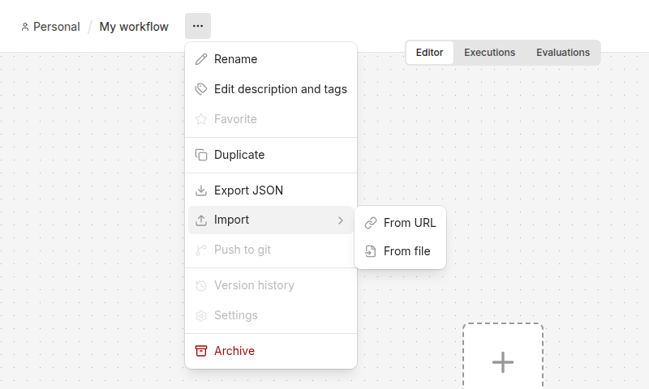

2. Press **Ctrl+S** (**⌘S** on a Mac) to save. You'll see two nodes:

    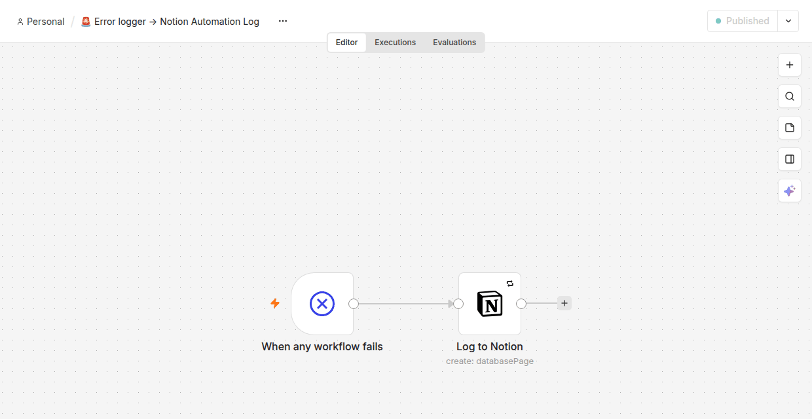

3. Double-click **Log to Notion**. It isn't connected yet. Notice the **Connect to Notion** button, the placeholder
   database link, and properties that say *Set up credential to see options*:

    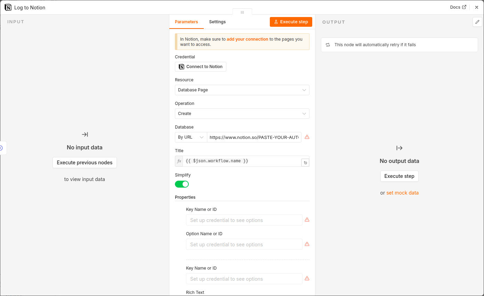

4. Click **Connect to Notion**, paste the **Internal Integration Secret** from Step 2, and click **Save**.

    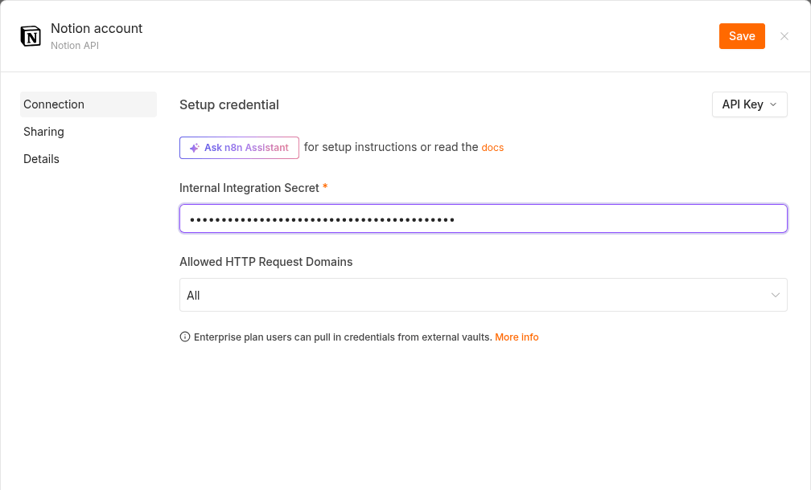

5. **Paste your database link.** In Notion, open **🚨 Automation Log**, click **•••** (top right) → **Copy link**. In
   n8n, select the placeholder in the **Database** box (it's set to **By URL**) and paste your link over it. The
   property dropdowns below now load your real columns.
6. Close the panel and click **Publish** (top right), then **Publish** again in the dialog.

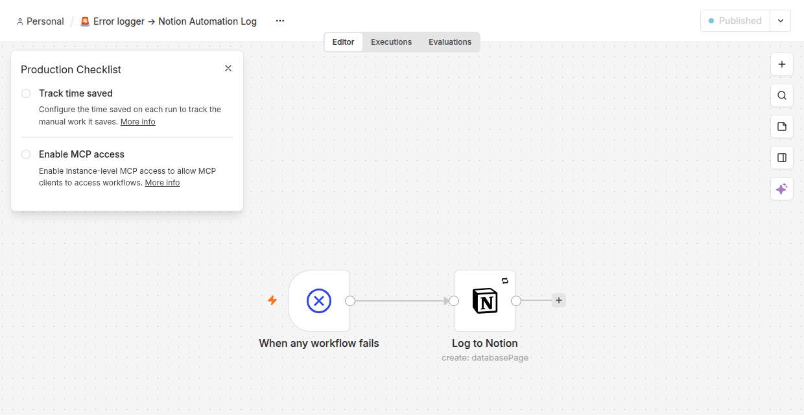

> ✅ **Checkpoint:** the error logger shows **Published**.

## 4️⃣ Step 4: Capture anything, with AI triage (30 min)

This workflow receives text from anywhere, asks Claude to give it a title, type, priority and next step, and saves it to
your Inbox.

**Import and connect it:**

1. Create a new workflow and **⋯ → Import → From URL**:

    ```text
    https://raw.githubusercontent.com/Axmann8/The_Massive_AI_Manual/main/examples/n8n-notion/1-capture-to-inbox.json
    ```

2. **Protect the webhook.** Double-click **Capture webhook**. Under **Credential for Header Auth**, click **Connect to
   Header Auth** (or **Create new credential**). Set **Name** to `X-Webhook-Secret` and **Value** to a long random
   password (let a password manager generate it). Save it, and keep the value handy.

    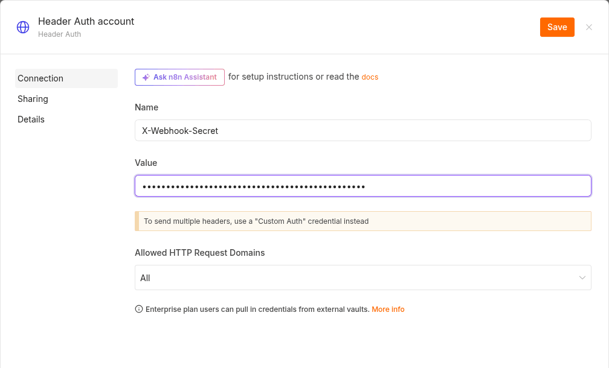

     works while you build; the Production URL works once published.")

3. **Connect Claude.** Double-click **Claude (fast)** and pick your **Anthropic account** credential (or click
   **Connect to Anthropic** and paste your API key). It's set to the fast, low-cost Haiku model.

    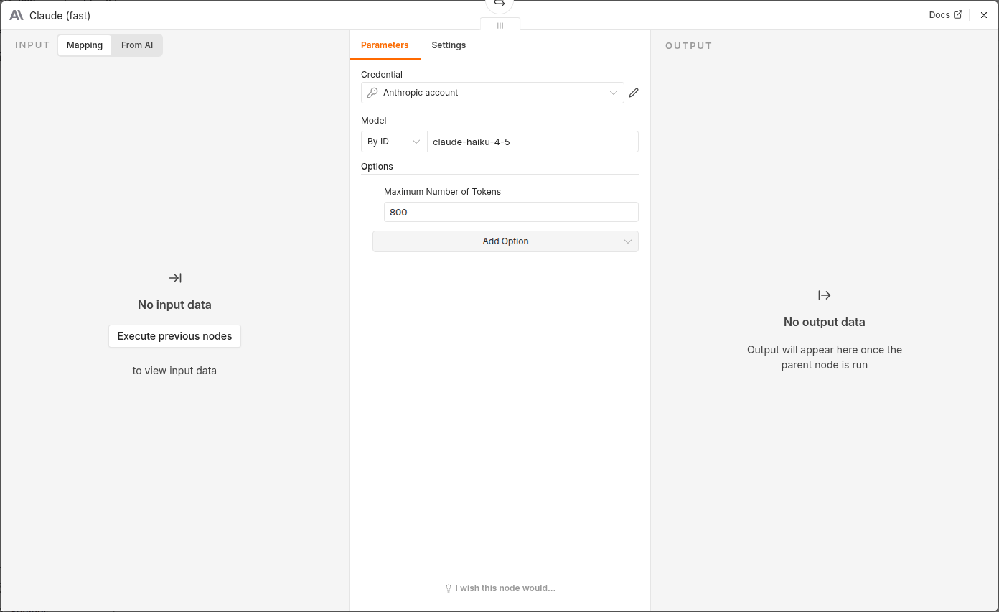

4. **Connect Notion.** Double-click **Create Inbox row**. Pick **Notion account** as the credential, then paste your
   **📥 Inbox** link into **Database** (in Notion: open Inbox → **••• → Copy link**).

    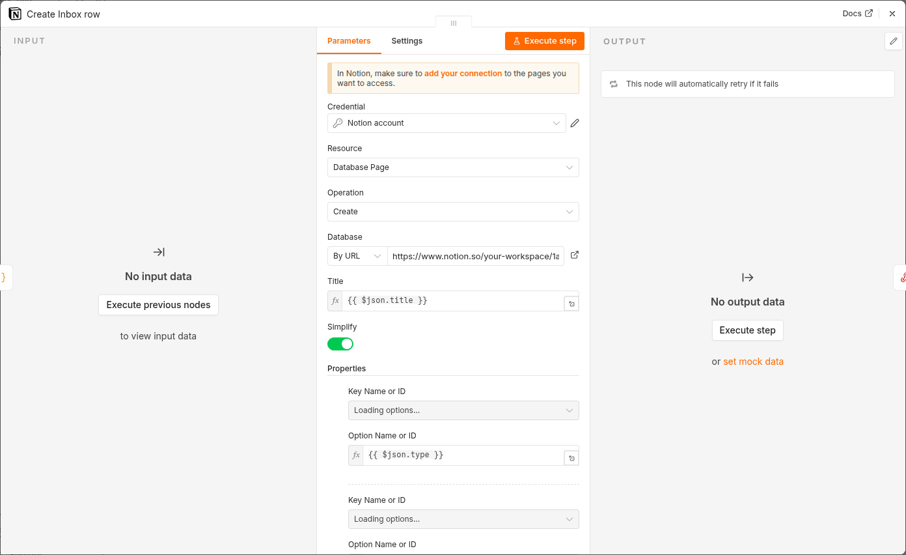

5. **Turn on error logging.** Click **⋯ → Settings** (top bar). In **Error Workflow**, choose **🚨 Error logger → Notion
   Automation Log** and click **Save**.

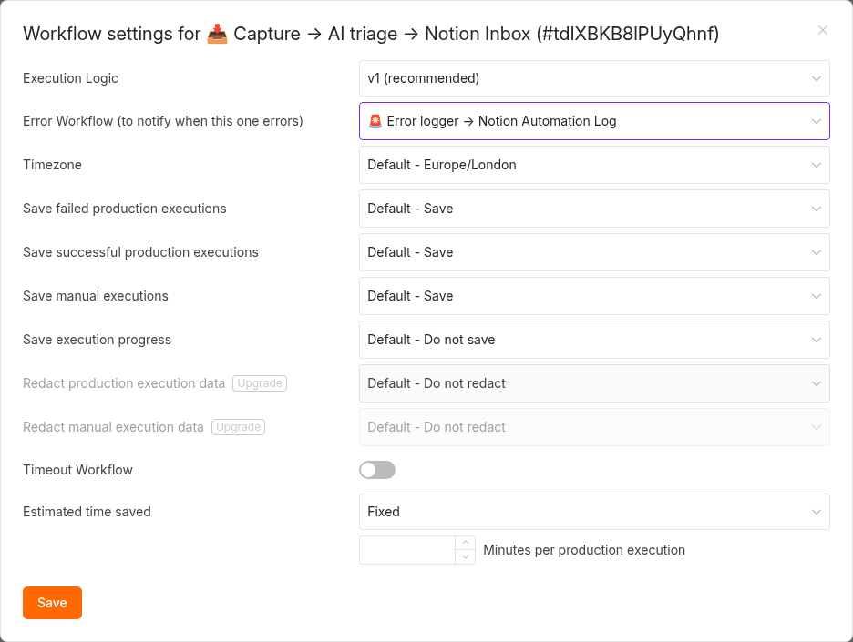

> [!TIP]
> **💡 A ⚠️ next to the error logger?**
> Hover over it and n8n explains: *"Not published. Can be used for manual testing, but must be published…"*. Go back to
> Step 3, make sure its credential and database link are set, and **Publish** it.
>
> 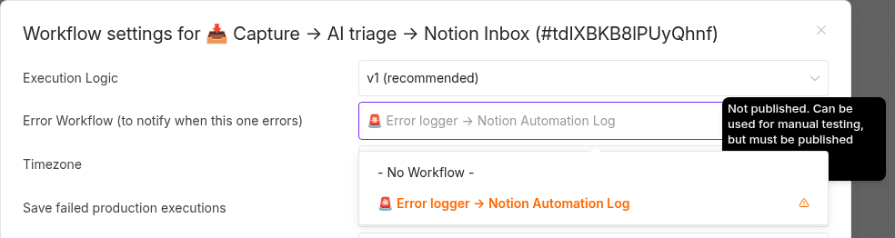

**Test it:**

6. Click **Execute workflow**. The webhook node shows *Waiting for you to call the Test URL*.

    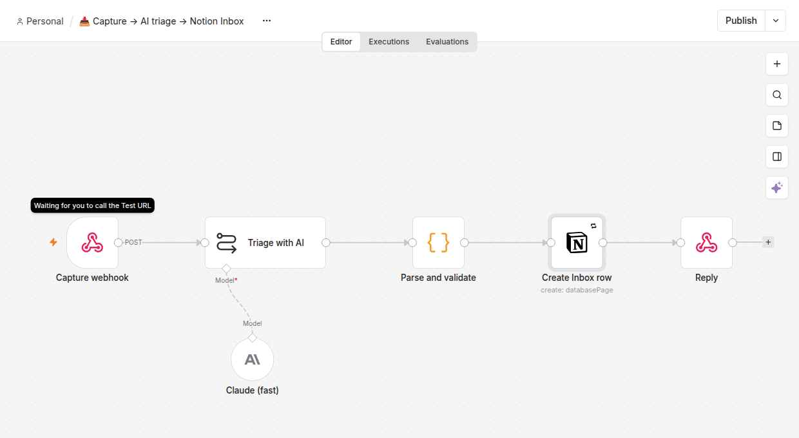

7. In a terminal, send a test note. Use your **Test URL** (double-click the webhook to copy it) and your secret:

    ```bash
    curl -X POST "https://YOUR-N8N/webhook-test/capture" \
      -H "Content-Type: application/json" \
      -H "X-Webhook-Secret: YOUR-SECRET" \
      -d '{"text": "remember to renew the car insurance before the 20th, check if bundling with home is cheaper", "source": "Phone"}'
    ```

8. Double-click **Parse and validate** to see what the AI produced. The **OUTPUT** shows clean columns ready for Notion:

    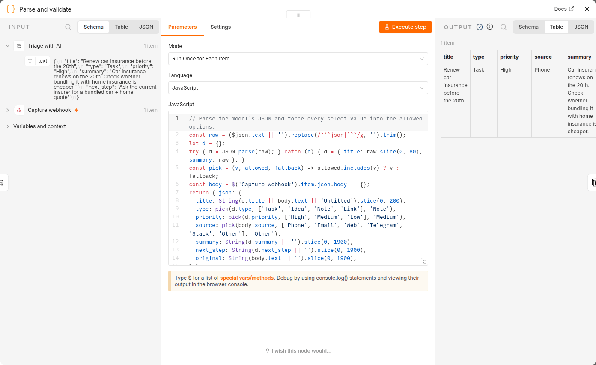

9. Open your **📥 Inbox** in Notion: the new row is there, with Title, Type, Priority, Summary and Next step filled in.
10. **Publish** the workflow. From now on, use the **Production URL** (it says `/webhook/` instead of `/webhook-test/`).

**Add one-tap capture on your phone (iPhone):**

1. Open **Shortcuts** → **+** → **Add Action** → **Dictate Text**.
2. Add **Get Contents of URL**. Paste your Production URL, then tap **›** to show more: set **Method** to **POST**, add a
   **Header** `X-Webhook-Secret` with your secret, set **Request Body** to **JSON**, and add two fields: `text` =
   *Dictated Text* and `source` = `Phone`.
3. Add **Show Notification** so you see it worked. Name the shortcut *Capture* and add it to your home screen or Action
   button.

On Android, the free **HTTP Shortcuts** app does the same job
([Phone & Desktop Automation](../part-5-automation/50-phone-and-desktop-automation.md)).

> ✅ **Checkpoint:** you speak an idea into your phone and, within seconds, it appears in your Inbox with a sensible
> title, type, priority, summary and next step.

## 5️⃣ Step 5: The Process with AI button (30 min)

One click on an Inbox item makes Claude write a summary, a next step and up to five subtasks into **Tasks**.

1. Import from:

    ```text
    https://raw.githubusercontent.com/Axmann8/The_Massive_AI_Manual/main/examples/n8n-notion/2-process-with-ai-button.json
    ```

    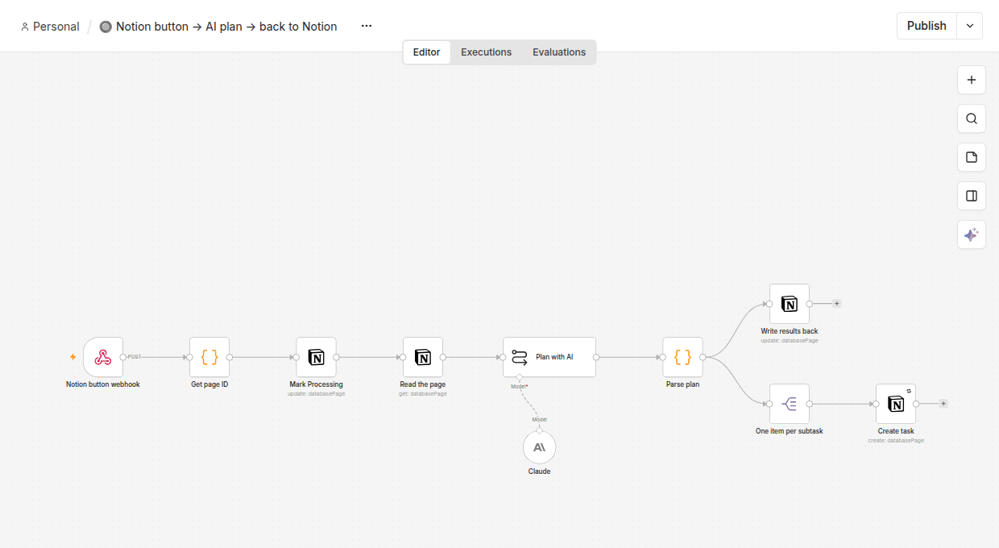

2. Connect the credentials, the same way as Step 4:
    - **Notion button webhook** → your **Header Auth account**
    - **Claude** → your **Anthropic account**
    - **Mark Processing**, **Read the page**, **Write results back** and **Create task** → **Notion account**
3. In **Create task**, paste your **✅ Tasks** database link. (The other three Notion nodes work on the clicked page, so
   they don't need a database link.)
4. **⋯ → Settings → Error Workflow** → the error logger → **Save**. Then **Publish**.
5. Double-click **Notion button webhook**, click **Production URL** and copy it.

    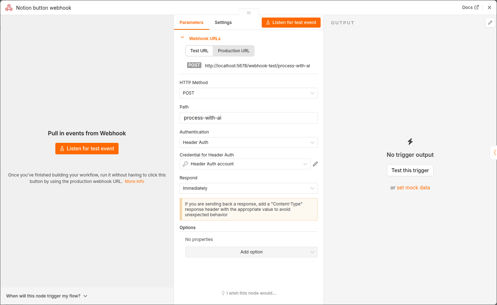

6. **Add the button in Notion.** Open **📥 Inbox**, click **+** at the end of the column headers, choose **Button** and
   name it **Process with AI**. In the button's setup panel, click **+ Add action → Send webhook**, paste the Production
   URL, then **Add custom header**: `X-Webhook-Secret` with your secret. Click **Save**.
7. Click **Process with AI** on the insurance item from Step 4.

Watch the row: **Status** changes to *Processing*, then *Processed*; Summary and Next step update; and new rows appear in
**✅ Tasks** with priorities and due dates.

> [!TIP]
> **💡 Free Notion plan?**
> Buttons that send webhooks need a paid plan. Instead, add a checkbox called **Run AI** to the Inbox. In n8n, replace
> the webhook node with a **Notion Trigger** (*Page Updated in Database*, checking every minute) followed by an
> **If** node: *Run AI is true AND AI processed is false*. Ticking the box now does the same job within a minute.

> ✅ **Checkpoint:** one click turns an Inbox item into a processed item plus a handful of well-formed tasks.

## 6️⃣ Step 6: The daily briefing (20 min)

Every morning at 7, n8n gathers what's due, asks Claude for a short, encouraging briefing, and saves it to Notion and
Telegram.

1. Import from:

    ```text
    https://raw.githubusercontent.com/Axmann8/The_Massive_AI_Manual/main/examples/n8n-notion/3-daily-briefing.json
    ```

    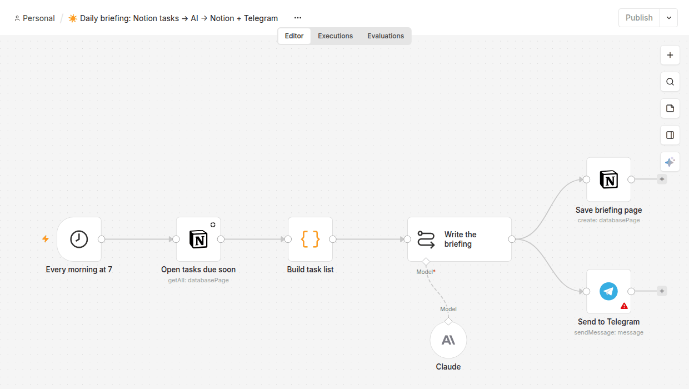

2. **Set the time.** Double-click **Every morning at 7** and change the hour if you like. It uses the time zone in
   **⋯ → Settings → Timezone**.

    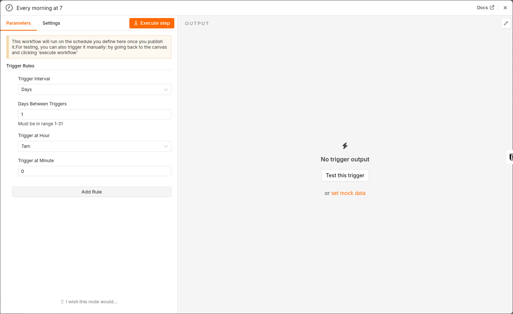

3. **Connect Notion and paste links.** In **Open tasks due soon**, pick **Notion account** and paste your **✅ Tasks**
   link. It already filters for tasks that aren't Done and are due by tomorrow, and **Always Output Data** is on, so
   quiet days still get a cheerful "nothing due" briefing.

    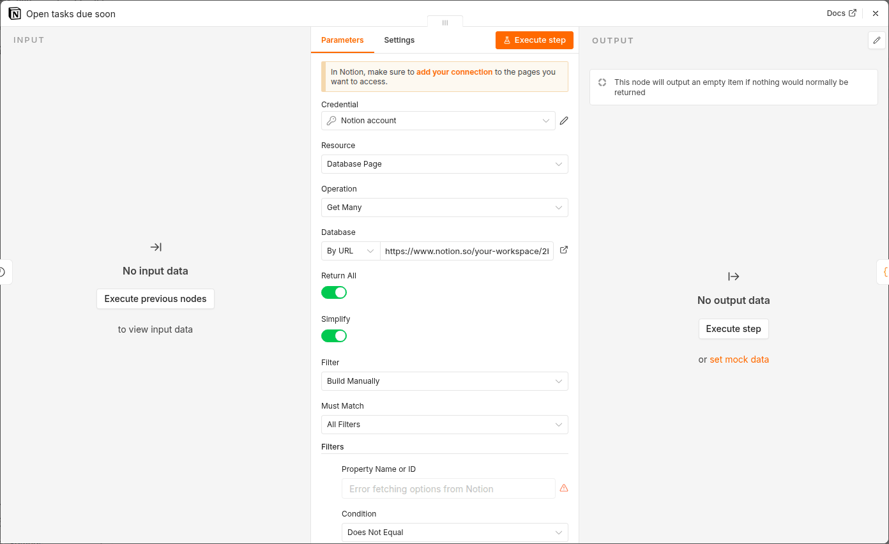

4. In **Save briefing page**, pick **Notion account** and paste your **☀️ Daily Briefings** link. Connect **Claude**.
5. **Telegram:** connect your bot credential and replace `PASTE-YOUR-TELEGRAM-CHAT-ID` with your chat ID, or delete
   the node if you only want the Notion page.
6. Click **Execute workflow** to get today's briefing right now. Then set the error workflow and **Publish**.

> ✅ **Checkpoint:** today's briefing page appears in Notion (and on your phone, if you kept Telegram).

## 7️⃣ Step 7: Let Claude manage your tasks over MCP (30 min)

This workflow turns three Notion actions into tools that AI assistants can call: `find_tasks`, `create_task` and
`complete_task`.

1. Import from:

    ```text
    https://raw.githubusercontent.com/Axmann8/The_Massive_AI_Manual/main/examples/n8n-notion/5-notion-tools-mcp-server.json
    ```

    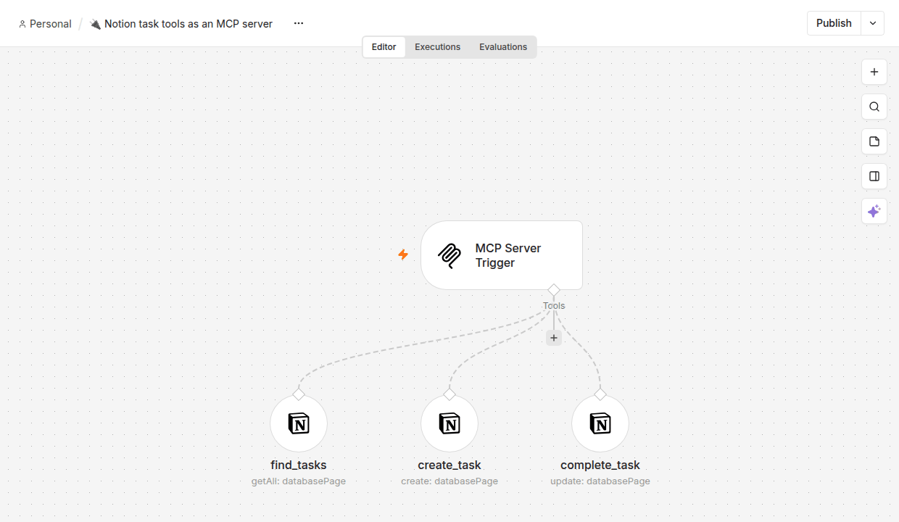

2. Double-click each tool node, pick **Notion account**, and paste your **✅ Tasks** link. Read each **Description**:
   that's what the AI reads to decide when to use the tool, so keep it precise.

    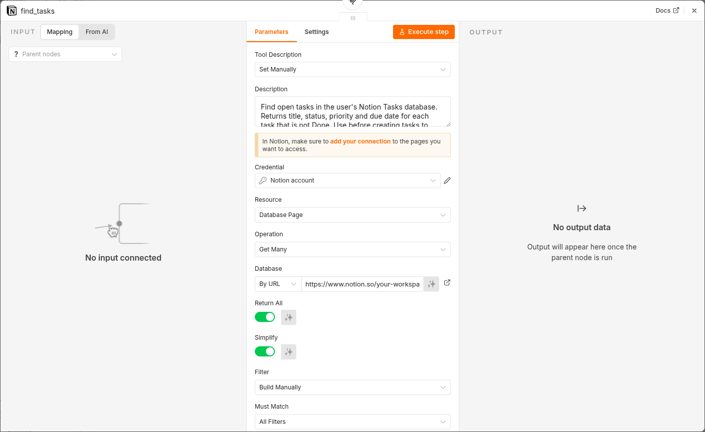

3. Double-click **MCP Server Trigger**. Click **Connect to Bearer Auth**, enter a long random token, and save. Then
   **Publish** the workflow and copy the **Production URL**.

    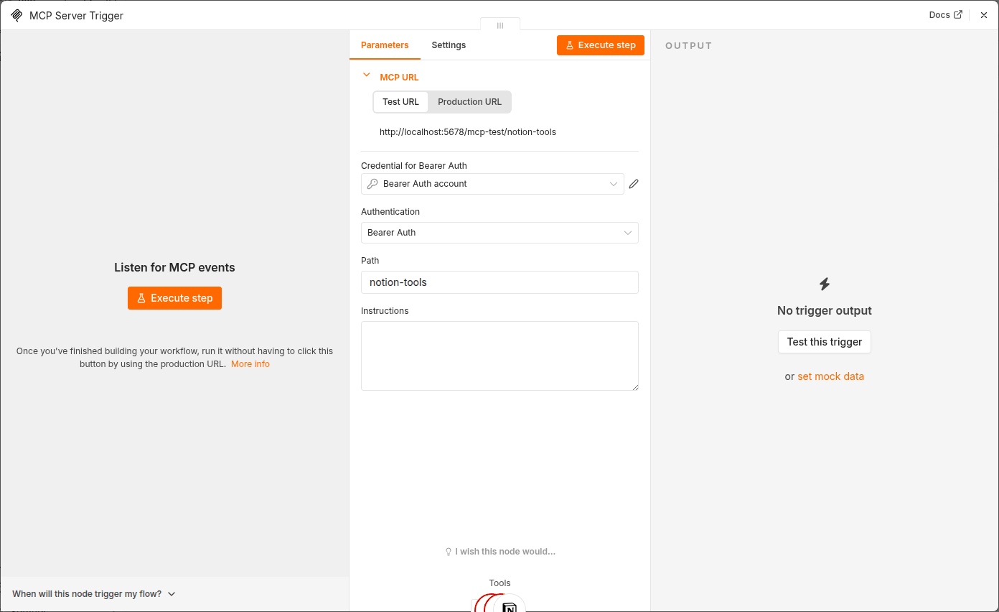

4. **Connect Claude Code** (one command, in a terminal):

    ```bash
    claude mcp add --transport http notion-tasks https://YOUR-N8N/mcp/notion-tools \
      --header "Authorization: Bearer YOUR-TOKEN"
    ```

    For **Claude Desktop** and other clients, see
    [Connecting Everything](125-connecting-everything.md) and [AI Agents Across n8n + Notion](124-ai-agents-across-n8n-and-notion.md#-mcp-in-both-directions).

5. Try these prompts:
    - *"What's on my Notion task list this week? Group it by priority."*
    - *"Add a task to book the car service, high priority, due Friday."*
    - *"I've finished calling the insurance company. Mark that task done."*

> [!TIP]
> **💡 Or expose your whole n8n**
> n8n can also act as one big MCP server: **Settings → Instance-level MCP → Enable MCP access** lets clients like Claude
> and Cursor see and run the workflows you allow.
>
> 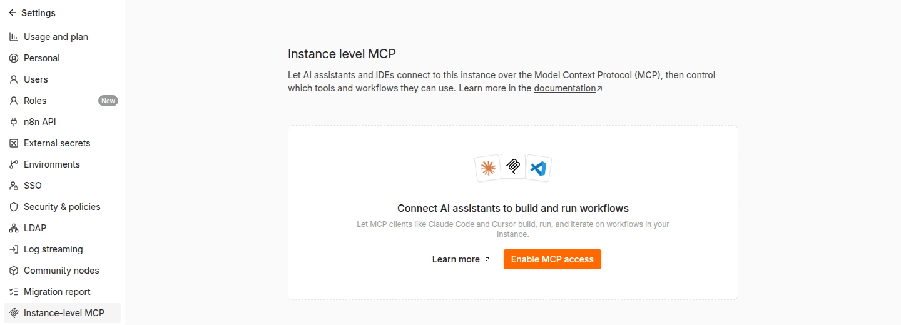

> ✅ **Checkpoint:** Claude lists your real tasks, creates one that appears in Notion with Source = AI, and asks before
> completing a task.

## 🩺 Troubleshooting

| What you see | Why | Fix |
|---|---|---|
| **Couldn't connect with these settings** when saving the Notion credential | The secret is wrong or was regenerated | Copy the **Internal Integration Secret** again (Step 2) and paste it |
| **Authorization failed – please check your credentials** on a Notion node | Same as above, or the integration was removed | Re-paste the secret; check **••• → Connections** on the Command Center page |
| **The 'Create Inbox row' node has issues: Not a valid Notion Database URL** | The placeholder link is still there | Paste your database link (Notion: **••• → Copy link**) |
| Property dropdowns say **Error fetching options from Notion** | n8n can't see that database | Connect the integration to the page (Step 2, point 4) |
| *Validation error* when creating a row | A property name or option doesn't match | Compare with the table in Step 1, capitals included |
| A ⚠️ next to the error logger in Settings | It isn't published yet | Finish Step 3 and **Publish** it |
| Phone shortcut gets `401` or `403` | The `X-Webhook-Secret` header is missing or different | Copy the exact secret into the shortcut's header |
| The button does nothing | Workflow 2 isn't published, the button uses the Test URL, or the header is missing | Publish, use the Production URL, add the header |
| Briefing is empty every day | Tasks have no Due dates, or Status names don't match | Add due dates; make sure `Done` is spelled exactly |

Here's what an authorization failure looks like, so you recognise it. The AI steps before it worked (green); only the
Notion step failed (red):

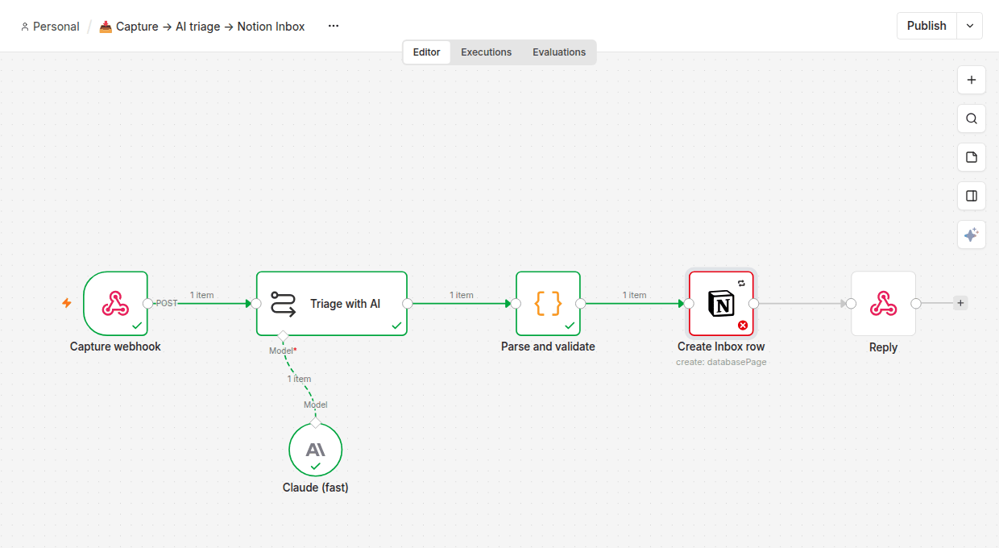

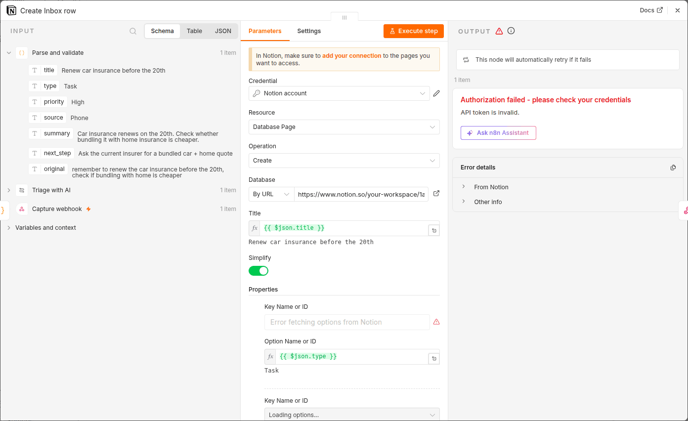

## 🚀 Level-ups

| Level-up | How |
|---|---|
| 📧 **Email capture** | A **Gmail Trigger** on a *To Notion* label → the same triage → Inbox (copy workflow 1's middle nodes) |
| 📅 **Calendar time blocks** | Tasks with a time → Google Calendar events ([Connecting Everything](125-connecting-everything.md#-email-and-calendar)) |
| 🗂️ **Projects** | Add a Projects database and a relation from Tasks; let the AI suggest the project in workflow 2 |
| 🔁 **Weekly review** | A Friday workflow: completed tasks + Inbox stats → AI review page ([Recipe Book](126-n8n-notion-recipe-book.md)) |
| 🔒 **Fully local AI** | Swap the Claude nodes for **Ollama Chat Model** nodes pointing at your home lab |
| 🧠 **Chat with your notes** | Index your Inbox and pages and add a chat assistant ([chapter 124](124-ai-agents-across-n8n-and-notion.md#-rag-over-your-notion-workspace)) |

---

**Next:** [128 · Running n8n + Notion in Production →](128-running-in-production.md)
