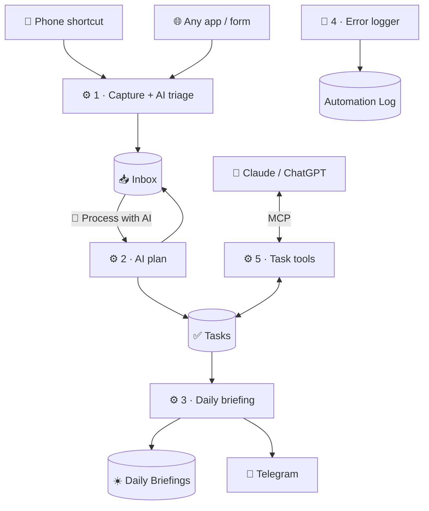

# 127 · Build-Along: Your AI Command Center in Notion + n8n 🏗️

> ⏱️ ~3 hours to build · 🎯 Intermediate (no coding required) · 🧰 Needs: n8n reachable over HTTPS, a Notion workspace (paid plan for the button step, or use the free alternative), an Anthropic API key, Telegram (optional)

**In this build-along you'll create a complete, working AI command center.** Anything you capture (by voice, from your
phone, from any app) lands in a Notion Inbox, already titled, typed and prioritized by AI. One click on a Notion button
turns an item into a plan with subtasks. Every morning, a briefing of what's due arrives in Notion and on your phone.
Failures are logged where you'll see them. And Claude or ChatGPT can manage your tasks in plain language through MCP.

<details class="keypoints" open>
<summary>✅ Key Points & Steps</summary>

You'll build a five-workflow system from this manual's starter kit, testing each piece with a checkpoint before moving on.

1. **Create four Notion databases** and connect n8n to them.
2. **Set up error logging first,** so every later problem is visible.
3. **Build capture:** a secure webhook that triages anything you send into the Inbox.
4. **Add the Process with AI button** that turns an item into a plan and tasks.
5. **Schedule the daily briefing,** then connect Claude through MCP.

</details>

<!-- in-this-chapter -->

## 🗺️ What you'll build

<details class="keypoints" open>
<summary>✅ Key Points & Steps</summary>

The system has four Notion databases and five n8n workflows. Captures flow into the Inbox, a button turns Inbox items into Tasks, a schedule produces daily briefings, an error logger watches everything, and an MCP server lets AI assistants manage your tasks.

</details>



| Piece | File in the kit |
|---|---|
| Setup guide and database layouts | [`examples/n8n-notion/README.md`](../../examples/n8n-notion/README.md) |
| Workflow 1 · Capture | [`1-capture-to-inbox.json`](../../examples/n8n-notion/1-capture-to-inbox.json) |
| Workflow 2 · Process with AI | [`2-process-with-ai-button.json`](../../examples/n8n-notion/2-process-with-ai-button.json) |
| Workflow 3 · Daily briefing | [`3-daily-briefing.json`](../../examples/n8n-notion/3-daily-briefing.json) |
| Workflow 4 · Error logger | [`4-error-logger.json`](../../examples/n8n-notion/4-error-logger.json) |
| Workflow 5 · MCP task tools | [`5-notion-tools-mcp-server.json`](../../examples/n8n-notion/5-notion-tools-mcp-server.json) |

## ✅ Before you start

<details class="keypoints" open>
<summary>✅ Key Points & Steps</summary>

Check that you have everything ready: n8n reachable over HTTPS, a Notion workspace, an Anthropic API key with a spending limit and, optionally, a Telegram bot for the briefing.

</details>

- [ ] **n8n** on n8n Cloud, or self-hosted with a public HTTPS URL (needed for Notion buttons and phone shortcuts)
  ([n8n Masterclass](../part-5-automation/47-n8n-masterclass.md))
- [ ] A **Notion** workspace. The *Process with AI* button needs a paid plan; a free alternative is included.
- [ ] An **Anthropic API key** with a **spend limit** set, or another model provider n8n supports
- [ ] Optional: a **Telegram bot** token and your chat ID
  ([Pocket AI Assistant](../part-13-build-alongs/112-build-along-pocket-ai-assistant.md) shows how to create one)
- [ ] About three hours, with breaks at each checkpoint

## 1️⃣ Step 1: Create the Notion databases (25 min)

<details class="keypoints" open>
<summary>✅ Key Points & Steps</summary>

Create the Inbox, Tasks, Daily Briefings and Automation Log databases with the exact property names and options from the kit README, because the workflows depend on them.

1. Create a page called **Command Center**.
2. Inside it, create the four databases from the kit README.
3. Double-check property names, types and select options.

</details>

1. Create a page called **🎛️ Command Center**.
2. Inside it, create four full-page databases: **📥 Inbox**, **✅ Tasks**, **☀️ Daily Briefings** and **🚨 Automation Log**.
3. Add the properties exactly as listed in the [kit README](../../examples/n8n-notion/README.md#1--create-the-notion-databases).
   The fastest way: paste the tables into Notion AI or Claude (with the Notion connector) and ask it to create the
   databases for you.
4. On the Command Center page, add linked views: *Inbox (New)*, *Tasks due this week* and *Latest briefing*.

> ✅ **Checkpoint:** four databases exist, and every select and status option matches the README exactly (including
> capitalization).

## 2️⃣ Step 2: Connect n8n to Notion (10 min)

<details class="keypoints" open>
<summary>✅ Key Points & Steps</summary>

Create a Notion integration, share the Command Center page with it, and add the secret to n8n as a credential.

1. Create an integration at notion.so/profile/integrations and copy the secret.
2. Share the **Command Center** page with the integration (its databases inherit access).
3. Add a **Notion API** credential in n8n.

</details>

Sharing the parent Command Center page shares all four databases at once. Full details are in
[Connecting n8n to Notion](122-connecting-n8n-to-notion.md#-step-1-set-up-the-credential).

> ✅ **Checkpoint:** in a test Notion node, the database dropdown lists all four databases.

## 3️⃣ Step 3: Error logging first (10 min)

<details class="keypoints" open>
<summary>✅ Key Points & Steps</summary>

Set up the error logger before anything else, so every problem in later steps appears in your Automation Log instead of failing silently.

1. Import `4-error-logger.json`.
2. Select your Notion credential and the Automation Log database.
3. Activate it.

</details>

The workflow uses an **Error Trigger**, which runs whenever another workflow that names it as its *error workflow*
fails. You'll point each workflow at it as you import them.

To test it: create a tiny workflow with a **Code** node containing `throw new Error('Test error')`, set its error workflow
(**⋯ → Settings → Error workflow**) to the logger, activate it with any trigger, and make it run.

> ✅ **Checkpoint:** a row appears in the Automation Log with your workflow's name, the message *Test error* and a working
> execution link.

## 4️⃣ Step 4: Capture with AI triage (30 min)

<details class="keypoints" open>
<summary>✅ Key Points & Steps</summary>

The capture workflow receives text at a secure webhook, asks a fast model for a title, type, priority, summary and next step, validates the values, and creates an Inbox row.

1. Import `1-capture-to-inbox.json` and select credentials (Header Auth, Anthropic, Notion).
2. Choose the Inbox database in the *Create Inbox row* node.
3. Set the error workflow, activate, and send a test request.
4. Create a phone shortcut that POSTs to the same URL.

</details>

**The security header.** Create a **Header Auth** credential with the name `X-Webhook-Secret` and a long random value
(a password manager can generate one). Every request must include this header, so strangers who find your URL can't add
items.

**Why the *Parse and validate* node matters:** it forces the model's answers into your exact select options (*Task*,
*Idea*, *Note*, *Link*; *High*, *Medium*, *Low*), so a creative model response can never break the Notion write.

Test from your terminal (use the **Production URL** once active):

```bash
curl -X POST "https://YOUR-N8N/webhook/capture" \
  -H "Content-Type: application/json" \
  -H "X-Webhook-Secret: YOUR-SECRET" \
  -d '{"text": "remember to renew the car insurance before the 20th, check if bundling with home is cheaper", "source": "Phone"}'
```

**Add one-tap capture on your phone.** On iPhone, create a Shortcut: **Dictate Text** → **Get Contents of URL** (method
POST, header `X-Webhook-Secret`, JSON body with `text` = Dictated Text and `source` = `Phone`) → **Show Result**. Add it
to your home screen or Action button. Android users can do the same with Tasker or HTTP Shortcuts
([Phone & Desktop Automation](../part-5-automation/50-phone-and-desktop-automation.md)).

> ✅ **Checkpoint:** a spoken idea appears in your Inbox within seconds, with a sensible title, Type, Priority, Summary
> and Next step, and the original text in the page body.

## 5️⃣ Step 5: The Process with AI button (40 min)

<details class="keypoints" open>
<summary>✅ Key Points & Steps</summary>

The button sends an Inbox row to n8n, which marks it Processing, asks the model for a summary, next step and up to five subtasks, writes the results back and creates the subtasks in Tasks.

1. Import `2-process-with-ai-button.json`, select credentials and choose the Inbox and Tasks databases.
2. Activate it and copy the Production URL.
3. In Notion, add a **Button** property to the Inbox with a **Send webhook** action, your URL and the secret header.
4. Click the button on a test item.

</details>

1. Import the workflow and configure the Notion nodes: *Mark Processing*, *Read the page* and *Write results back* use
   the Inbox; *Create task* uses Tasks.
2. Set its error workflow to the logger and **activate** it.
3. In the Inbox database, add a property: **Process with AI** (type **Button**) → **Add action → Send webhook** → paste
   the Production URL → **Add custom header** `X-Webhook-Secret` with your secret.
4. Click **Process with AI** on the insurance item from Step 4.

Watch the row: Status changes to *Processing*, then *Processed*; Summary and Next step update; and new rows appear in
Tasks with priorities and due dates.

> [!TIP]
> **💡 Free Notion plan?**
> Add a **Run AI** checkbox to the Inbox instead of the button. Replace the workflow's Webhook node with a **Notion
> Trigger** (*Page Updated in Database*, polling every minute) followed by an **IF** node: *Run AI is true AND AI processed
> is false*. Clicking the checkbox now does the same job within a minute.

> ✅ **Checkpoint:** one click turns an Inbox item into a processed item plus up to five well-formed tasks, and a
> deliberately broken run (for example, temporarily removing the Tasks database share) shows up in the Automation Log.

## 6️⃣ Step 6: The daily briefing (25 min)

<details class="keypoints" open>
<summary>✅ Key Points & Steps</summary>

Every morning, the briefing workflow finds tasks that aren't done and are due by tomorrow, asks the model for a short prioritized briefing, saves it as a Notion page and sends it to Telegram.

1. Import `3-daily-briefing.json` and select credentials.
2. Choose the Tasks and Daily Briefings databases.
3. Add your Telegram chat ID, or swap the Telegram node for Gmail or Slack.
4. Run it once manually, then activate it.

</details>

Notice the **Always Output Data** setting on *Open tasks due soon*: on a day with no due tasks, the workflow still runs
and sends a cheerful "nothing due" briefing instead of silently stopping.

Adjust the time in the **Schedule Trigger** (it runs at 7:00 in your n8n instance's time zone; set the time zone in the
workflow's settings if needed).

> ✅ **Checkpoint:** clicking **Test workflow** creates today's briefing page in Notion and sends the same text to your
> phone.

## 7️⃣ Step 7: Let Claude manage your tasks (30 min)

<details class="keypoints" open>
<summary>✅ Key Points & Steps</summary>

The MCP workflow exposes three carefully scoped tools (find, create and complete tasks) so Claude, ChatGPT or Cursor can manage your Notion tasks in conversation.

1. Import `5-notion-tools-mcp-server.json`, create a **Bearer Auth** credential and choose the Tasks database in all three tools.
2. Activate it and copy the MCP Server Trigger's Production URL.
3. In Claude, add a custom connector with that URL and your bearer token.
4. Ask Claude about your tasks, and ask it to add one.

</details>

Each tool has a precise description and fixed defaults: tasks created by AI always get Source = `AI` and Status = `To do`,
and only `complete_task` can change status, after confirming with you. That's the advantage of exposing your own tools
rather than giving an assistant open access to your workspace
([AI Agents Across n8n + Notion](124-ai-agents-across-n8n-and-notion.md#-mcp-in-both-directions)).

Try these prompts in Claude:

- *"What's on my Notion task list this week? Group it by priority."*
- *"Add a task to book the car service, high priority, due Friday."*
- *"I've finished calling the insurance company. Mark that task done."*

> ✅ **Checkpoint:** Claude lists your real tasks, creates a new one that appears in Notion with Source = AI, and asks
> before completing a task.

## 🚀 Level-ups

<details class="keypoints" open>
<summary>✅ Key Points & Steps</summary>

Once the core system works, extend it with more capture sources, smarter processing and richer outputs. Each idea below builds on the same databases and patterns.

</details>

| Level-up | How |
|---|---|
| 📧 **Email capture** | Gmail Trigger on a *To Notion* label → same triage → Inbox (copy workflow 1's middle nodes) |
| 📅 **Calendar time blocks** | Tasks with a *Scheduled for* time → Google Calendar events, saving the event ID ([Connecting Everything](125-connecting-everything.md#-email-and-calendar)) |
| 🗂️ **Projects** | Add a Projects database and a relation from Tasks; have the AI suggest the project in workflow 2 |
| 🔁 **Weekly review** | Friday workflow: completed tasks + Inbox stats → AI review page ([Recipe Book](126-n8n-notion-recipe-book.md), recipe 17) |
| 🔒 **Fully local AI** | Swap the Claude nodes for Ollama Chat Model nodes pointing at your home lab |
| 📊 **Dashboard** | Add chart views to the Command Center: tasks by priority, captures per day by source |
| 🧠 **RAG over your notes** | Index the Inbox and Resources pages and add a chat assistant ([chapter 124](124-ai-agents-across-n8n-and-notion.md#-rag-over-your-notion-workspace)) |

## 🩺 Troubleshooting

<details class="keypoints" open>
<summary>✅ Key Points & Steps</summary>

Most problems in this build come from sharing, option names, webhook URLs or credentials. Check the Automation Log first, then use the table.

</details>

| Problem | Fix |
|---|---|
| Notion node can't find a database | Share the Command Center page with the integration; reselect the database |
| "Validation error" when creating a row | A property name or option doesn't match the README exactly |
| Phone shortcut gets `401` or `403` | The `X-Webhook-Secret` header is missing or doesn't match the credential |
| Button click does nothing | Workflow 2 isn't active, the button uses the test URL, or the header is missing |
| *Get page ID* error | The button isn't sending the page; check the webhook action targets the clicked row |
| Briefing is empty every day | Tasks lack Due dates, or Status names don't match (`Done` must match exactly) |
| Claude doesn't see the tools | Workflow 5 isn't active, or the connector URL or bearer token is wrong |
| Errors don't reach the Automation Log | The failing workflow's **Settings → Error workflow** isn't set to the logger |

## 🎯 Key takeaways

- A complete command center needs just **four databases and five workflows**.
- Set up **error logging first**, and validate AI output against your **exact options**.
- **Header secrets** protect your capture and button webhooks.
- A **checkbox plus the Notion Trigger** replaces paid button webhooks when needed.
- Exposing **scoped MCP tools** lets any assistant manage your tasks safely.

## 🧠 Check yourself

<details class="quiz">
<summary>❓ 1. Why does the capture workflow include a "Parse and validate" step after the AI?</summary>

To **force the model's answers into the exact select options** Notion expects, so an unexpected value can't break the
write, and to fall back gracefully if the model's JSON is malformed.

</details>

<details class="quiz">
<summary>❓ 2. Why build the error logger before the other workflows?</summary>

So that **every problem in the later steps is visible** in the Automation Log immediately, instead of failing silently.

</details>

<details class="quiz">
<summary>❓ 3. Claude can create tasks through workflow 5. What stops it from editing anything else in your workspace?</summary>

It only has the **three tools you defined**, each with a fixed database and fixed defaults. It has no general access to
your Notion workspace through this connection.

</details>

> [!TIP]
> **🎮 Try this**
> Use your command center for one full week: capture everything by voice, process items with the button each evening, and
> read the briefing each morning. On Friday, check the Automation Log and pick one level-up to add.

---

**Next:** [128 · Running n8n + Notion in Production →](128-running-in-production.md)
