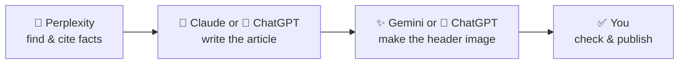

# 31 · Using Several Assistants Together 🔀

> ⏱️ 6 min read · 🎯 Anyone with more than one favorite · 🧰 Needs: two or more assistants (free tiers are fine)

**You don't have to pick just one.** Plenty of savvy users keep a main assistant plus one or two specialists, pass work
between them, and use them to double-check each other. This chapter shows you how to build your personal "AI squad,"
the best hand-off workflows, how to carry your preferences and memory between apps, and how to do it all without
spreading your data everywhere or paying for five subscriptions.

<details class="eli5" open>
<summary>🧸 ELI5: This chapter in 30 seconds</summary>

Using a few AIs is like having a team of friends with different talents: one is great at finding facts, one at writing,
one at drawing. You can ask the fact-finder first, then give the facts to the writer. And if two friends agree on
something, you can feel more confident it's right.

</details>

<!-- in-this-chapter -->

## 🤝 Why use more than one?

<details class="eli5">
<summary>🧸 ELI5</summary>

Different AIs are good at different things, and asking two of them helps you catch mistakes.

</details>

- 🎯 **Strengths differ:** sources (Perplexity), Google life (Gemini), Microsoft work (Copilot), writing and documents
  (Claude), images and all-round features (ChatGPT), chats you're already in (Meta AI).
- 🔍 **Second opinions catch errors:** when two independent assistants agree, you can be more confident; when they
  disagree, you know to dig deeper ([When AI Gets It Wrong](../part-1-ai-from-zero/10-when-ai-gets-it-wrong.md)).
- ⏳ **Limits:** hit the free limit on one? Carry on in another.
- 🧪 **Staying current:** new models land every month; trying them keeps your skills fresh.

## 🧑‍🤝‍🧑 Build your AI squad

<details class="eli5">
<summary>🧸 ELI5</summary>

Pick one main AI for most things, and a couple of helpers for special jobs. Here are example teams for different kinds of
people.

</details>

Most people need **one main assistant + one or two specialists**. Some sample squads:

| You are… | 🥇 Main | 🥈 Specialist(s) |
|---|---|---|
| 🎓 **Student** | ChatGPT (Study mode) or Gemini (Guided Learning, Notebook) | Perplexity for sourced research |
| 👨‍👩‍👧 **Busy parent** | Gemini (Gmail, Calendar, Android, Home) | Meta AI in the family WhatsApp group |
| 💼 **Office worker** | Copilot (Microsoft 365) or Gemini (Google Workspace) at work | Claude or ChatGPT for writing and thinking |
| 🛍️ **Small business owner** | ChatGPT or Claude | Canva for design, Perplexity for market research |
| 🎨 **Creator** | ChatGPT or Gemini (images, video) | Claude for scripts; Suno and ElevenLabs for audio |
| 🔐 **Privacy-minded** | Le Chat or Proton Lumo | Local AI for anything sensitive |
| 🧑‍💻 **Budding builder** | Claude (Artifacts, Claude Code) or ChatGPT (Codex) | Gemini (AI Studio) and Perplexity |

## 🔀 Hand-off workflows

<details class="eli5">
<summary>🧸 ELI5</summary>

You can pass work from one AI to another, like a relay race: one finds the facts, the next writes them up, and the last
one makes a picture.

</details>

The magic of a squad is **relay work**, where each assistant does what it's best at:



Ready-made relays:

| Goal | Relay |
|---|---|
| **Blog post or newsletter** | Perplexity (research with sources) → Claude/ChatGPT (draft) → image assistant (header) → you (fact-check) |
| **Big purchase** | Perplexity (sourced comparison) → your main assistant (*"Given my situation, which should I pick?"*) |
| **Trip** | Gemini (bookings from Gmail + Maps) → ChatGPT/Claude (day-by-day plan) → Meta AI (share in the group chat) |
| **Presentation** | Claude (outline and speaker notes) → Copilot in PowerPoint or Gemini in Slides (build the deck) |
| **Learning** | Gemini Notebook (podcast from your sources) → any assistant in voice mode (quiz you on a walk) |

**Tip:** when handing off, paste the previous result and say what you want next: *"Here's research from another AI.
Check it for gaps, then write a 600-word article from it."*

## ⚖️ The "second opinion" and "judge" patterns

<details class="eli5">
<summary>🧸 ELI5</summary>

Ask two AIs the same question and compare, or ask one AI to check another AI's answer for mistakes.

</details>

- **Second opinion:** ask two assistants the same important question independently. Compare. Agreement builds
  confidence; disagreement tells you where to check.
- **Judge:** paste one assistant's answer into another: *"Here's an answer from another AI. What's wrong, missing or
  overconfident? Be specific."* This catches a surprising amount.
- **Debate:** *"Assistant A recommends a Roth IRA and assistant B recommends paying off debt first. Lay out the strongest
  case for each and what would decide it."*

(Remember: two AIs agreeing isn't proof, since they learned from similar data. For 🔴 topics, still check official
sources.)

## 🧳 Take your "about me" everywhere

<details class="eli5">
<summary>🧸 ELI5</summary>

Write one note about yourself and how you like answers, and paste it into every AI you use, so they all know you.

</details>

Keep a **portable profile**, a note you can paste into any assistant's custom instructions:

```text
ABOUT ME
- Name: Alex. Lives: Leeds, UK. Family: partner + 2 kids (8, 11), dog Biscuit.
- Work: school administrator. Not very technical.
- Food: mostly vegetarian; no mushrooms.

HOW I LIKE ANSWERS
- Warm, brief, bullet points. British spelling, metric units.
- Flag anything I should double-check (money, health, legal).
- Ask me a question if my request is unclear.
```

**Moving memory between assistants:**

1. In your old assistant: *"Summarize everything you know about me and my preferences, as a list I can paste into
   another assistant. Leave out anything sensitive."*
2. Review it (delete anything too personal).
3. Paste it into the new assistant's custom instructions or memory.
4. Some apps offer direct imports (for example, **Le Chat** can import ChatGPT memories in one click).

Keep your **favorite prompts** in the same note so your "prompt library" goes wherever you go.

## 📦 Exporting your chats and data

<details class="eli5">
<summary>🧸 ELI5</summary>

You can download a copy of your chats from most AI apps, so you don't lose them if you switch.

</details>

Most assistants let you **download your data** (usually from Settings → Data controls / Privacy / Account):

| Assistant | Where to export |
|---|---|
| ChatGPT | Settings → Data controls → Export data |
| Gemini | Google Takeout (Gemini Apps data) |
| Claude | Settings → Privacy → Export data |
| Copilot | Microsoft account privacy dashboard |
| Perplexity, Grok, Le Chat | Settings → account or data controls |

Useful when switching, and a good habit for important projects.

## 💸 Smart subscription strategy

<details class="eli5">
<summary>🧸 ELI5</summary>

You don't need to pay for every AI. Pay for your favorite one if you need to, and use the free versions of the rest.

</details>

- **Pay for one, at most two.** Your main assistant is where extra limits pay off.
- **Use free tiers** for specialists and second opinions.
- **Rotate:** some people switch their one paid plan every few months to try the newest features.
- **Check bundles:** Google AI plans (storage), Microsoft 365 (Office apps), Prime (Alexa+) and phone deals may already
  cover you.
- **Hubs** like Poe or Perplexity Pro give access to several models for one price ([chapter 29](29-hubs-and-specialty-chatbots.md)).

## ⚠️ Pitfalls to avoid

<details class="eli5">
<summary>🧸 ELI5</summary>

More AIs means more places your information lives, so share carefully and keep things simple.

</details>

- 🗂️ **Data sprawl:** every assistant you use holds some of your data. Keep sensitive topics to one trusted assistant
  (or local AI), and delete what you don't need.
- 😵 **Too many tools:** if juggling apps costs more time than it saves, simplify back to one main assistant.
- 🔁 **Echo chambers:** assistants trained on similar data can share the same blind spots. Real sources still matter.
- 💳 **Forgotten subscriptions:** review them monthly.

## 🎯 Key takeaways

- A **main assistant plus one or two specialists** covers almost everyone.
- **Relay** work between assistants to use each one's strengths, and use **second opinions and judges** to catch
  errors.
- Keep a **portable "about me" note and prompt library** to move between assistants easily.
- **Export your data**, pay for **one** plan at most two, and avoid **data sprawl**.

## 🧠 Check yourself

<details class="quiz">
<summary>❓ 1. What's the "judge" pattern?</summary>

Paste one assistant's answer into another and ask it to find what's **wrong, missing or overconfident**.

</details>

<details class="quiz">
<summary>❓ 2. How do you move your preferences from ChatGPT to a new assistant?</summary>

Ask ChatGPT to **summarize what it knows about you**, review it, and paste it into the new assistant's **custom
instructions or memory** (or use a direct import where offered, like Le Chat's).

</details>

<details class="quiz">
<summary>❓ 3. Should you pay for three assistants?</summary>

Usually not. **Pay for one (maybe two)** and use free tiers for the rest.

</details>

> [!TIP]
> **🎮 Try this**
> Write your **portable "about me" note** today and paste it into two assistants. Then try one **relay**: research
> something in Perplexity, write it up in your main assistant, and have a third create an image for it. You've just
> directed an AI team. 🎬

---

**Next:** [32 · The Mental Model →](../part-3-foundations/32-the-mental-model.md)
