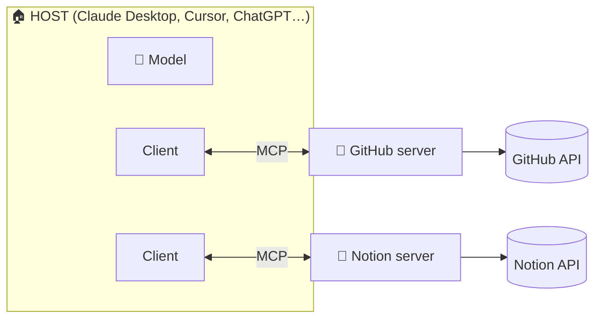

# 04 · MCP Explained: The USB-C Port for AI 🔌

**Model Context Protocol (MCP)** is the open standard that lets *any* AI app connect to *any*
tool or data source. Anthropic introduced it in late 2024, and it quickly became *the* standard:
Claude, ChatGPT, Gemini, Copilot, Cursor, VS Code, n8n, Zapier, Notion, and hundreds of others speak it.
It's now governed as an open project, with a public spec, official SDKs in several languages, and an
official server registry.

> **The analogy everyone uses:** Before USB-C, every device had its own charger. Before MCP, every
> AI app needed a custom integration for every service. Now a service builds **one MCP server**, and
> it works in **every MCP-capable app**.

---

## The three roles



- **Host**: the AI app you use.
- **Client**: the connector inside the host. There's one per server connection, and it's handled for you.
- **Server**: a small program that wraps a service (GitHub, Notion, your files) and exposes it in MCP's format.

## What a server can offer

| Primitive | Controlled by | What it is | Example |
|---|---|---|---|
| 🔧 **Tools** | The model | Actions the AI can choose to take | `create_issue`, `send_message`, `query_database` |
| 📄 **Resources** | The app/you | Data you can attach as context | A file, a DB schema, `notes://all` |
| 💬 **Prompts** | You | Reusable templates, often shown as slash commands | `/daily_standup`, `/review-pr` |

Tools are 90% of what people use. Resources and prompts are the underrated ones, so try them!

There are also some newer, fun extras:
- **Elicitation / user input**: a server can pause mid-task and ask *you* a question ("Which
  calendar should I put this on?"). The mid-2026 spec reworked this into "multi round-trip requests."
- **MCP Apps**: servers can ship **interactive UI** (charts, forms, mini-apps) that render right inside
  the chat. This is also the foundation of ChatGPT's apps/plugins.
- **Tasks**: long-running jobs you can start now and check on later.

## Local vs. remote servers

| | 🏠 **Local (stdio)** | ☁️ **Remote (HTTP)** |
|---|---|---|
| Runs | On your computer, launched by the app | On someone's server, reached by URL |
| Setup | `command` + `args` in a config file | Paste a URL, then log in with OAuth |
| Great for | Your files, local apps, dev tools, private experiments | SaaS apps (Notion, Linear, GitHub, Stripe…) |
| Needs | Usually Node.js (`npx`) or Python (`uvx`) | Nothing but a browser |
| Examples | Filesystem, Playwright, your own scripts | `https://mcp.notion.com/mcp`, `https://mcp.linear.app/mcp` |

**2026 trend:** most big SaaS companies now run **official remote servers** with OAuth login. Local
servers are still king for anything on *your* machine. (The older "HTTP+SSE" remote transport is
deprecated in favor of **Streamable HTTP**, and the July 2026 spec made the protocol stateless so remote servers
scale like normal web APIs.)

---

## Installing servers: app by app

### Claude (web, desktop, mobile)
- **Easiest:** Settings → **Connectors** → browse the directory → click, then log in. Done.
- **Custom remote server:** Connectors → *Add custom connector* → paste the URL.
- **Local servers (Desktop only):** Settings → Developer → Edit Config, then add to
  `claude_desktop_config.json` ([example](../../examples/mcp-configs/claude_desktop_config.json)).
  Restart the app fully.
- **Desktop Extensions (`.mcpb` files):** one-click installable local servers. Double-click and go.

### Claude Code (terminal)
```bash
claude mcp add --transport http linear https://mcp.linear.app/mcp
claude mcp add playwright -- npx -y @playwright/mcp@latest
claude mcp list
```
Scopes: `--scope local` (just you, this project, the default), `--scope project` (writes `.mcp.json` to share
with the team), `--scope user` (you, everywhere). Inside a session, `/mcp` shows status and handles
OAuth logins. **Plugins** bundle MCP servers with skills and commands for one-shot installs.

### Cursor
Settings → **MCP** → *Add new MCP server*, or edit `.cursor/mcp.json`
([example](../../examples/mcp-configs/cursor.mcp.json)). Many vendor docs have an "Add to Cursor" button.

### VS Code (GitHub Copilot agent mode)
Command Palette → **MCP: Add Server**, or `.vscode/mcp.json` ([example](../../examples/mcp-configs/vscode.mcp.json)).
VS Code also has a built-in MCP gallery backed by the GitHub MCP Registry.

### ChatGPT
Supports remote MCP servers through its apps (renamed **plugins** in mid-2026) and **Developer
Mode** for custom servers with full read and write tools. Availability depends on your plan and workspace
settings.

### Gemini CLI, Codex CLI, Windsurf, Zed, LM Studio, Goose, and more
All speak MCP, with nearly identical `command`/`args`/`url` config shapes. Learn it once and use it everywhere.

---

## Your first 15 minutes with MCP (do this now!)

1. **Install Claude Desktop** (or use Claude Code).
2. Add the **Filesystem** server pointed at a *new, empty* folder like `~/ai-playground`.
3. Add the **Fetch** server (reads web pages) and the **Memory** server (a knowledge graph).
4. Restart, then try:
   > *"Fetch the MCP Wikipedia page, write a 1-page cheat sheet about it to cheatsheet.md in my
   > playground folder, and remember that I'm learning MCP."*
5. Open the folder. There's a file your AI wrote. 🎉

## Debugging tips
- **Server not showing up?** Fully quit the app (not just close the window). Check JSON commas. Use
  absolute paths.
- **"command not found"?** GUI apps often don't see your shell's PATH. Use the full path to
  `npx`/`uvx`/`python` (`which npx`).
- **Logs:** Claude Desktop → Settings → Developer → *Open Logs Folder*. Claude Code: `claude --debug`.
- **Test any server in isolation:** `npx @modelcontextprotocol/inspector <command> <args>` opens a web UI
  where you can call each tool by hand.

## Security hygiene (quick version, full version in [Ch. 37](../part-10-mastery/37-safety-costs-and-gotchas.md))
- Install servers from **official vendors or the official registry** when possible. A local server
  runs code on your machine.
- Grant the **smallest scope** (one folder, read-only tokens, specific repos).
- Beware **prompt injection**. A web page or email the AI reads could contain instructions. Keep
  "approve each action" on for tools that send, delete, or pay.
- Don't enable 40 servers at once. Too many tools confuse the model and eat context. Enable what
  you need for the task.

---

### 🚀 Try this next
Build your own server! The [Pocket Toolkit example](../../examples/my-first-mcp-server) is about 100 lines of
Python and works in 5 minutes. Once you've built one, every MCP server out there stops being magic.

**Next:** [05 · The Big MCP Server Catalog →](05-mcp-server-catalog.md)
