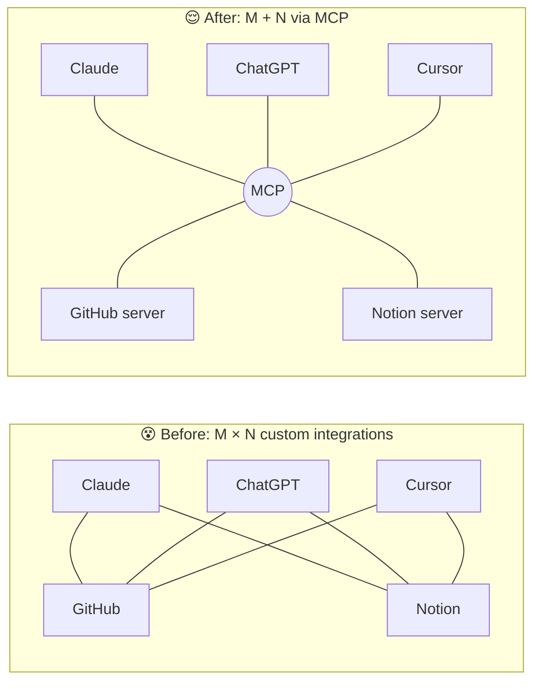
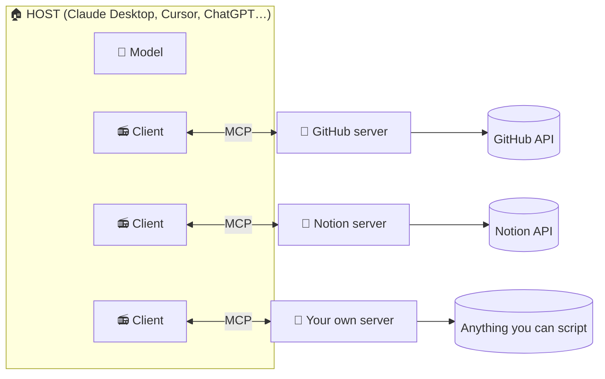
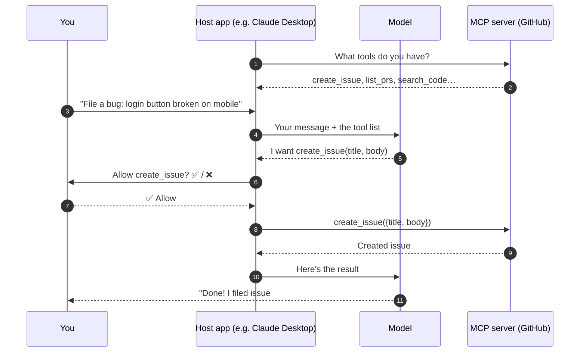

# 07 · MCP Explained: The USB-C Port for AI 🔌

> ⏱️ 12 min read · 🎯 Beginner-friendly · 🧰 Needs: Claude Desktop, Claude Code, Cursor or VS Code (free tiers work)

**Model Context Protocol (MCP)** is the open standard that lets *any* AI app plug into *any* tool or data source. It's
the single most important idea in this whole manual, because once it clicks, you'll see how AI grows "hands" and "eyes",
and you'll be able to give your own AI new superpowers in minutes.

<details class="eli5" open>
<summary>🧸 ELI5: This chapter in 30 seconds</summary>

Imagine your AI is a super-smart robot friend who lives inside a box. It can talk, but it can't touch anything
outside the box. **MCP is a set of little doors in the box.** Each door leads to one thing: your calendar, your
notes, GitHub, a web browser. When you install an "MCP server," you're adding a new door. Now your robot friend
can reach through it and actually *do* stuff for you. And because every door is the same shape, any robot
(Claude, ChatGPT, Cursor…) can use any door.

</details>

<!-- in-this-chapter -->

## 🧩 The problem MCP solves

<details class="eli5">
<summary>🧸 ELI5</summary>

Before MCP, every AI app needed its own special cable for every service, like a drawer full of tangled chargers.
MCP is one shape of plug that works everywhere, so services build **one** plug and every AI can use it.

</details>

Before late 2024, connecting an AI app to a tool meant writing a **custom integration** for that exact pair. Claude
needed its own GitHub integration, ChatGPT needed its own, Cursor needed its own… If there are **M** AI apps and **N**
tools, that's **M × N** integrations. Nobody could keep up.

MCP flips that to **M + N**: each AI app implements MCP *once* (as a "client"), each tool implements MCP *once* (as a
"server"), and everything works with everything.



Anthropic introduced MCP as an open standard in **November 2024**, and it spread astonishingly fast. By 2026 it's
supported by Claude, ChatGPT, Gemini, Microsoft Copilot, Cursor, VS Code, Windsurf, Zed, n8n, Zapier, Notion and
hundreds of others. It's now governed as an open project with a public specification, official SDKs in many languages,
and an [official server registry](https://registry.modelcontextprotocol.io).

> [!NOTE]
> **📌 Why the "USB-C" analogy works so well**
> Before USB-C, every gadget had its own charger. Now one cable charges your phone, laptop and headphones. MCP does the
> same for AI: one standard "port," endless things to plug in. The analogy even covers the downside, because a cheap
> USB-C cable from a sketchy shop can fry your laptop. Same with random MCP servers (see [Security](#security-hygiene-the-quick-version)).

## 🏠 The three roles: host, client, server

<details class="eli5">
<summary>🧸 ELI5</summary>

The **host** is the house (the AI app you use). The **server** is a helper who knows how to do one job, like fetching
the mail. The **client** is the walkie-talkie inside the house that talks to that helper. One walkie-talkie per helper.

</details>



| Role | What it is | Examples | Who builds it |
|---|---|---|---|
| **Host** | The AI application you actually use | Claude Desktop, Claude Code, ChatGPT, Cursor, VS Code, n8n | The app makers |
| **Client** | The connection manager inside the host (one per server) | Built into the host, invisible to you | The app makers |
| **Server** | A small program that exposes a service in MCP's format | GitHub server, Notion server, Filesystem server, *your* server | Service vendors, the community, **you** |

**Key insight:** the model never talks to GitHub directly. The model says *"I'd like to call `create_issue` with these
arguments,"* the host's client passes that to the GitHub server, the server calls GitHub's API, and the result flows back.
The server is the translator, and the host is the security guard that decides what's allowed.

## 🧰 What a server can offer

<details class="eli5">
<summary>🧸 ELI5</summary>

A server can hand your AI three kinds of things: **tools** (buttons the AI can press), **resources** (books the AI can
read), and **prompts** (recipe cards you can pick). Tools are the big one: they let AI *do* things.

</details>

| Primitive | Controlled by | What it is | Example |
|---|---|---|---|
| 🔧 **Tools** | The **model** decides when to use them | Actions with inputs and outputs | `create_issue`, `send_message`, `search_files`, `roll_dice` |
| 📄 **Resources** | The **app or you** choose to attach them | Read-only data the AI can use as context | A file, a database schema, `notes://all` |
| 💬 **Prompts** | **You** pick them (often as slash commands) | Reusable templates with arguments | `/daily_standup`, `/review-pr`, `/summarize-meeting` |

Tools are about 90% of what people use day to day. But resources and prompts are delightfully underrated. A good
prompt template turns a 200-word instruction into a one-click slash command, and a resource lets you attach "the
current state of my project" to any conversation.

### The newer extras (2025–2026)

The spec keeps growing. You don't need these on day one, but it's fun to know they exist:

| Feature | What it does | Why it's cool |
|---|---|---|
| **Asking you questions mid-task** (elicitation, now "multi round-trip requests") | A server can pause and ask *you* something: "Which calendar should I add this to?" | Tools can confirm before acting, without you writing prompts |
| **MCP Apps** | A server returns an **interactive UI** (a form, chart or picker) that renders right in the chat | Chat stops being text-only. ChatGPT's plugin UIs are built on this |
| **Tasks** | Start a long job now and check on it later | Great for slow jobs like big exports, video renders or crawls |
| **Structured output** | Tools return typed JSON alongside text | Results can feed straight into other tools or automations |
| **Tool annotations** | Servers mark tools as read-only, destructive, and so on | Apps can decide when to ask you before running something |

<details class="deepdive">
<summary>🤿 Deep dive: what changed in the July 2026 spec?</summary>

The **2026-07-28** specification made MCP **stateless**: there's no more "initialize handshake + session ID." Every
request carries what it needs, so remote servers can scale like normal web APIs behind a load balancer. Server-initiated
requests (sampling, elicitation, roots) were replaced by **multi round-trip requests**, list results became **cacheable**,
**Tasks** and **MCP Apps** became formal extensions, and authorization got stricter (Client ID Metadata Documents replace
dynamic client registration). The legacy HTTP+SSE transport is officially deprecated. For you as a *user*, it mostly
means remote servers get faster and more reliable. For builders, see [MCP Under the Hood](08-mcp-under-the-hood.md).

</details>

## 🌍 Local vs. remote servers

<details class="eli5">
<summary>🧸 ELI5</summary>

A **local** server is a helper who lives *in your house* (runs on your computer), which makes it great for your files. A
**remote** server lives *somewhere else on the internet*, and you just call it on the phone (a URL). Remote ones are
easier to set up, and local ones can touch your own stuff.

</details>

| | 🏠 **Local (stdio)** | ☁️ **Remote (Streamable HTTP)** |
|---|---|---|
| Runs | On your computer, launched by the app | On a server somewhere, reached by URL |
| Setup | A `command` + `args` in a config file | Paste a URL, then log in with OAuth |
| Great for | Your files, local apps, dev tools, private experiments | SaaS apps: Notion, Linear, GitHub, Stripe, Atlassian… |
| Needs | Usually Node.js (`npx`) or Python (`uvx`) | Nothing but a browser to log in |
| Examples | Filesystem, Playwright, Memory, your own scripts | `https://mcp.notion.com/mcp`, `https://mcp.linear.app/mcp` |
| Trust model | Runs code *on your machine*, so install carefully | You trust the vendor's server and the scopes you approve |

**2026 trend:** most big SaaS companies now run **official remote servers** with one-click OAuth login. Local servers
remain king for anything on *your* machine (files, browsers, local databases, home automation).

## 🔗 How a tool call actually flows

<details class="eli5">
<summary>🧸 ELI5</summary>

You ask a question. The AI looks at its list of buttons, picks one, and asks the app to press it. The app presses the
button (after checking with you if needed), gets the answer, and hands it back to the AI, who then explains it to you.

</details>



Notice step 6: **the approval gate lives in the host**, not the model. That's why good apps let you set each tool to
*always allow*, *ask every time*, or *never*.

## 📲 Installing servers, app by app

<details class="eli5">
<summary>🧸 ELI5</summary>

Every AI app has a "plug in a new door" screen. Some let you click a button in a store. Others want you to write a tiny
note (a config file) saying where the helper lives. Either way it takes a minute or two.

</details>

### Claude (web, desktop, mobile)

- **Easiest:** Settings → **Connectors** → browse the directory → click → log in. Done.
- **Custom remote server:** Connectors → *Add custom connector* → paste the URL.
- **Local servers (Desktop):** Settings → Developer → *Edit Config* → add to `claude_desktop_config.json`
  ([ready-made example](../../examples/mcp-configs/claude_desktop_config.json)) → fully restart the app.
- **Desktop Extensions (`.mcpb` files):** one-click installable local servers. Double-click and go.

```json
{
  "mcpServers": {
    "filesystem": {
      "command": "npx",
      "args": ["-y", "@modelcontextprotocol/server-filesystem", "/Users/you/ai-playground"]
    }
  }
}
```

### Claude Code (terminal)

```bash
claude mcp add --transport http linear https://mcp.linear.app/mcp   # remote
claude mcp add playwright -- npx -y @playwright/mcp@latest           # local
claude mcp list                                                      # what's connected
```

Scopes: `--scope local` (just you, this project, the default), `--scope project` (writes a shareable `.mcp.json`),
`--scope user` (you, everywhere). Inside a session, `/mcp` shows status and handles OAuth logins. **Plugins** bundle MCP
servers with skills and commands for one-step installs ([Claude Code Power-Ups](../part-5-building-with-ai/32-claude-code-power-ups.md)).

### Cursor

Settings → **MCP** → *Add new MCP server*, or edit `.cursor/mcp.json` ([example](../../examples/mcp-configs/cursor.mcp.json)).
Many vendor docs have an **"Add to Cursor"** button that does it for you.

### VS Code (GitHub Copilot agent mode)

Command Palette → **MCP: Add Server**, or `.vscode/mcp.json` ([example](../../examples/mcp-configs/vscode.mcp.json)).
VS Code has a built-in MCP gallery backed by the GitHub MCP Registry. Note that VS Code uses a `"servers"` key, not `"mcpServers"`.

### ChatGPT

ChatGPT connects to remote MCP servers through its integrations (renamed from "apps" to **plugins** in mid-2026) and
**Developer Mode**, which lets you add *any* remote MCP server with full read and write tools. Availability depends on
your plan and workspace settings.

### Everyone else

Gemini CLI, Codex CLI, Windsurf, Zed, LM Studio, Goose, n8n, Raycast… all speak MCP with nearly identical
`command`/`args`/`url` shapes. **Learn it once and use it everywhere.** 🎉

## ⚡ Your first 15 minutes with MCP

<details class="eli5">
<summary>🧸 ELI5</summary>

We'll give your AI three new doors: one to a play folder, one to the web, and one to a memory notebook. Then we'll ask
it to use all three at once and watch the magic happen.

</details>

1. **Install Claude Desktop** (or use Claude Code, Cursor or VS Code: same idea).
2. Create an empty folder called `ai-playground` in your home directory.
3. Add three servers to your config:
    - **Filesystem**, pointed at `ai-playground` (and nothing else!)
    - **Fetch** (reads web pages as clean text)
    - **Memory** (a little knowledge graph that remembers facts)
4. Fully quit and reopen the app. Look for the tools icon, where you should see the new tools listed.
5. Ask:
   > *"Fetch the Wikipedia page for Model Context Protocol, write a one-page cheat sheet to `mcp-cheatsheet.md` in my
   > playground folder, and remember that I'm learning MCP this week."*
6. Open the folder. **There's a file your AI wrote.** 🎉 Start a new chat and ask *"What am I learning this week?"*
   The memory server remembers.

## 🩺 Debugging MCP like a pro

<details class="eli5">
<summary>🧸 ELI5</summary>

When a door won't open, it's almost always one of four things: the app wasn't fully restarted, there's a typo in the
note, the computer can't find the helper program, or the helper needs a password (API key) it didn't get.

</details>

| Symptom | Likely cause | Fix |
|---|---|---|
| Server doesn't appear at all | App not fully restarted, or a JSON typo | Quit completely (not just close the window). Validate the JSON (a trailing comma breaks everything) |
| `spawn npx ENOENT` / "command not found" | GUI apps don't see your terminal's PATH | Use the **full path**: run `which npx` and paste the result into `"command"` |
| Connects, then disconnects instantly | The server crashes on startup | Missing API key or env var? Run the command in a terminal to see the error |
| No tools listed | The server printed junk to stdout | Stdio servers must log to **stderr**, never stdout |
| OAuth loop for remote servers | Pop-ups blocked or workspace policy | Allow pop-ups. In Claude Code use `/mcp`. Ask your admin if it's a work account |
| The AI ignores the tools | Too many tools, or a vague request | Mention the tool by name, and disable servers you're not using |

**Your debugging superpowers:**

- **MCP Inspector**, a web UI to call any server's tools by hand:
  ```bash
  npx @modelcontextprotocol/inspector npx -y @modelcontextprotocol/server-memory
  ```
- **Logs:** Claude Desktop → Settings → Developer → *Open Logs Folder*. Claude Code: `claude --debug`.
- **Ask the AI itself:** paste the error and your config, then *"what's wrong with this MCP setup?"*

## 🔐 Security hygiene: the quick version

<details class="eli5">
<summary>🧸 ELI5</summary>

Only let helpers into your house if you trust them, give each one the smallest key that works, and make the app ask you
before anyone sends, deletes or buys something.

</details>

1. **Install from trusted sources:** official vendor servers, the [official registry](https://registry.modelcontextprotocol.io),
   and well-maintained projects. A local server runs code on *your* machine.
2. **Smallest scope wins:** one folder (not your whole drive), read-only tokens, specific repos.
3. **Keep "ask before running"** on for tools that send, delete, post publicly, or spend money.
4. **Beware prompt injection:** a web page or email the AI reads can contain sneaky instructions. Be extra careful when
   one setup can *read untrusted content* **and** *send data out*.
5. **Don't enable 40 servers at once.** Fewer tools means a smarter, cheaper, safer AI.

The full story, including tool poisoning and how to audit a server in 5 minutes, is in [MCP Security & Trust](12-mcp-security-and-trust.md).

## 🦄 Myths & quick answers

<details class="eli5">
<summary>🧸 ELI5</summary>

Lots of people think MCP is only for programmers, or only for Claude, or that it gives AI access to everything. None of
those are true, and here's why.

</details>

<details class="quiz">
<summary>❓ "MCP is only for developers."</summary>

Nope! Built-in connectors in Claude and ChatGPT *are* MCP under the hood, and adding one is a couple of clicks. Config
files are the "advanced" path, and even those are copy-paste ([ready-made configs](../../examples/mcp-configs/)).

</details>

<details class="quiz">
<summary>❓ "MCP only works with Claude."</summary>

It started at Anthropic but it's an open standard used by ChatGPT, Gemini, Copilot, Cursor, VS Code, n8n, Zapier and
hundreds more. A server you build works across all of them.

</details>

<details class="quiz">
<summary>❓ "Installing a server gives the AI access to my whole computer."</summary>

Only to what that server exposes, with the permissions you give it. A Filesystem server pointed at one folder only sees
that folder. That's why scoping matters so much.

</details>

<details class="quiz">
<summary>❓ "More servers = smarter AI."</summary>

Usually the opposite. Every tool description eats context and gives the model more options to confuse. Enable what the
task needs.

</details>

## 🎯 Key takeaways

- MCP is an **open standard** that turns M×N custom integrations into M+N plug-and-play connections.
- **Hosts** (apps) contain **clients** that talk to **servers** (tools and data). The host enforces permissions.
- Servers offer **tools** (actions), **resources** (data) and **prompts** (templates), plus newer extras like MCP Apps and Tasks.
- **Remote** servers mean paste a URL and log in. **Local** servers mean running a command, and they're great for your own files and apps.
- Scope tightly, keep approvals on for risky tools, and install from trusted sources.

## 🧠 Check yourself

<details class="quiz">
<summary>❓ 1. Who actually calls GitHub's API when Claude "creates an issue"?</summary>

The **MCP server**. The model only *requests* the tool call, the host approves it and passes it along, and the server
does the real API call.

</details>

<details class="quiz">
<summary>❓ 2. You want AI to read files on your laptop. Local or remote server?</summary>

**Local** (stdio). It runs on your machine, so it can reach your files, ideally scoped to one folder.

</details>

<details class="quiz">
<summary>❓ 3. What's the difference between a tool and a prompt?</summary>

A **tool** is an action the *model* decides to call. A **prompt** is a template *you* choose (often shown as a slash
command).

</details>

<details class="quiz">
<summary>❓ 4. Your server shows in the config but not in the app. First two things to check?</summary>

Did you **fully restart** the app, and is the **JSON valid** (no trailing commas)?

</details>

> [!TIP]
> **🎮 Try this**
> Do the **15-minute setup** above, then build your own server: the [Pocket Toolkit](../../examples/my-first-mcp-server/)
> is about 100 lines of Python and works in 5 minutes. Once you've built one, every MCP server out there stops being magic.

---

**Next:** [08 · MCP Under the Hood →](08-mcp-under-the-hood.md)
