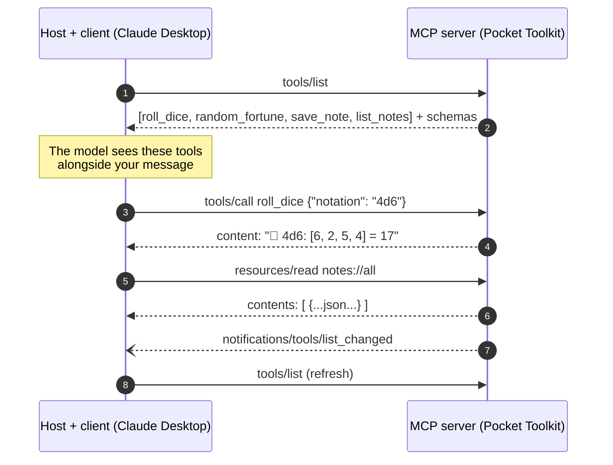
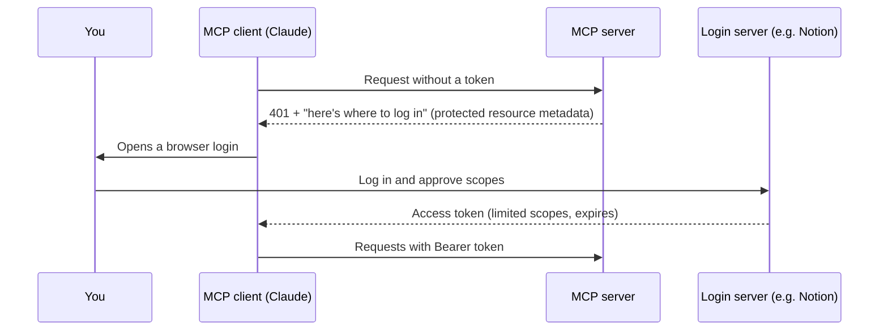

# 08 · MCP Under the Hood: The Protocol, Demystified 🔬🔌

> ⏱️ 8 min read · 🎯 Intermediate (no coding required to follow) · 🧰 Needs: optional, Node.js for the MCP Inspector

**What actually travels between Claude and an MCP server?** This chapter opens the hood: the messages, the conversation
flow, how tools/resources/prompts are described, how data moves locally and over the internet, how login works, and what
changed in the big 2026 spec. You'll finish able to *read* MCP traffic and debug servers like a pro.

<details class="eli5" open>
<summary>🧸 ELI5: This chapter in 30 seconds</summary>

MCP is like two walkie-talkies following a strict script. The app says "What can you do?" and the server answers with a
list of buttons. Later the app says "Press the dice button with 2d6," and the server answers "You rolled 8." Every message
is a tiny labeled note written in the same format (JSON), so any app and any server can understand each other.

</details>

<!-- in-this-chapter -->

## 🧱 Two layers: the letters and the mail truck

<details class="eli5">
<summary>🧸 ELI5</summary>

MCP has two parts: **what the notes say** (the letters) and **how the notes get delivered** (the mail truck). The letters are
always the same, and the truck can be local (inside your computer) or long-distance (over the internet).

</details>

| Layer | What it defines | Options |
|---|---|---|
| ✉️ **Data layer** | The messages: what you can ask, what comes back | JSON-RPC 2.0 messages: `tools/list`, `tools/call`, `resources/read`… |
| 🚚 **Transport layer** | How messages physically travel | **stdio** (local process) or **Streamable HTTP** (network) |

Because these are separate, the same server logic can run locally *or* remotely just by switching transports, which is
exactly what the Pocket Toolkit examples do ([Building MCP Servers](11-building-mcp-servers.md)).

## ✉️ JSON-RPC in 60 seconds

<details class="eli5">
<summary>🧸 ELI5</summary>

JSON-RPC is a super simple note format: "Here's note #7, please do *this* with *these details*." The reply says "Answer
for note #7: here you go." The number keeps questions and answers matched up.

</details>

MCP messages use **JSON-RPC 2.0**, a tiny, decades-old convention with three message types:

**1. Request** (expects an answer):

```json
{
  "jsonrpc": "2.0",
  "id": 7,
  "method": "tools/call",
  "params": { "name": "roll_dice", "arguments": { "notation": "2d6" } }
}
```

**2. Response** (answers request #7):

```json
{
  "jsonrpc": "2.0",
  "id": 7,
  "result": {
    "content": [{ "type": "text", "text": "🎲 2d6: [3, 5] = **8**" }],
    "isError": false
  }
}
```

**3. Notification** (no answer expected, just FYI):

```json
{ "jsonrpc": "2.0", "method": "notifications/tools/list_changed" }
```

That's it. Every MCP feature is built from these three shapes. 🎉

## 🔄 The conversation, step by step

<details class="eli5">
<summary>🧸 ELI5</summary>

First the app asks "what can you do?", then the AI decides which button to press, then the app asks the server to press it
and gets the answer. Repeat as needed.

</details>



**The core methods you'll see most:**

| Method | Direction | Purpose |
|---|---|---|
| `tools/list` | app → server | "What tools do you have?" |
| `tools/call` | app → server | "Run this tool with these arguments." |
| `resources/list`, `resources/read` | app → server | Browse and read data the server exposes |
| `resources/templates/list` | app → server | Discover parameterized resources like `recipes://{id}` |
| `prompts/list`, `prompts/get` | app → server | Discover and fill in prompt templates |
| `notifications/…/list_changed` | server → app | "My list of tools, resources or prompts changed" |

Older protocol versions started every connection with an `initialize` handshake to agree on a version and capabilities.
The **2026-07-28** spec removed that in favor of **stateless, self-describing requests**. The SDKs handle version details for
you, so you rarely think about it.

## 🔧 Tools up close

<details class="eli5">
<summary>🧸 ELI5</summary>

Each tool comes with an instruction label: its name, what it's for, what information it needs (and in what shape), and
stickers like "safe to use" or "careful, this deletes stuff."

</details>

A tool definition from `tools/list` looks like this:

```json
{
  "name": "save_note",
  "title": "Save note",
  "description": "Save a short note to the local notes file, with an optional tag.",
  "inputSchema": {
    "type": "object",
    "properties": {
      "text": { "type": "string" },
      "tag": { "type": "string", "default": "general" }
    },
    "required": ["text"]
  },
  "annotations": { "readOnlyHint": false, "destructiveHint": false }
}
```

| Field | Why it matters |
|---|---|
| `name` | What the model calls. Keep it clear: `search_orders`, not `do_stuff` |
| `description` | **The model's only manual.** It explains when to use the tool and what it returns |
| `inputSchema` | JSON Schema for the arguments: types, required fields, enums, defaults |
| `outputSchema` (optional) | Lets tools return **structured content** that machines can rely on |
| `annotations` | Hints like read-only, destructive, idempotent, open-world, so apps can decide when to ask you |

**Errors are results too.** A tool that fails returns `"isError": true` with a helpful message, so the model can adapt
("file not found → let me list the folder first") instead of the whole conversation crashing.

## 📄 Resources & prompts up close

<details class="eli5">
<summary>🧸 ELI5</summary>

Resources are like labeled folders the AI can open ("notes://all"). Prompts are fill-in-the-blank recipe cards you can
choose from a menu.

</details>

**Resources** are identified by **URIs** (like web addresses):

| Example URI | Means |
|---|---|
| `file:///Users/you/notes/todo.md` | A file |
| `notes://all` | Everything in the Pocket Toolkit's notes |
| `recipes://{id}` | A **template**: `recipes://42` gets recipe 42 |
| `postgres://db/schema` | A database's schema |

Apps usually let **you** attach resources to a conversation (for example with an `@` menu), and clients can **subscribe**
to changes on a resource.

**Prompts** are named templates with arguments (`daily_standup(focus)`), and many apps show them as **slash commands**.
`prompts/get` returns ready-to-send messages with your arguments filled in.

## 🚚 Transports: local and remote

<details class="eli5">
<summary>🧸 ELI5</summary>

Local servers talk through a private tube inside your computer (stdio). Remote servers talk over the internet using normal
web requests (HTTP). Same notes, different delivery.

</details>

| | 🏠 **stdio** | ☁️ **Streamable HTTP** |
|---|---|---|
| How | The app launches the server as a child process and writes JSON lines to its stdin, reading replies from stdout | The app sends HTTP POST requests to one endpoint (e.g. `https://…/mcp`), and the server can stream results |
| Best for | Local tools, files, dev machines | SaaS integrations, shared team servers |
| Auth | Inherits your local permissions (plus env vars for API keys) | **OAuth 2.1** or tokens in headers |
| Gotcha | **Never print to stdout**, because it corrupts the protocol! Log to stderr | Needs HTTPS, auth, and rate limiting |

**What the 2026 spec changed for HTTP (you'll see these in logs):**

- **Stateless:** no session IDs, and every request carries what it needs, so servers scale behind ordinary load balancers.
- **Routing headers:** the method and tool name travel in `Mcp-Method` and `Mcp-Name` HTTP headers, so gateways can route
  and authorize without parsing JSON bodies.
- **Cacheable lists:** `tools/list` and friends can include cache hints (`ttlMs`, `cacheScope`).
- **Multi round-trip requests** replace server-initiated calls: when a tool needs your input mid-call, the server returns a
  request for more information, and the client calls back with the answer.
- **Legacy HTTP+SSE transport** (from the early days) is officially deprecated.

## 🔐 Authorization in one page

<details class="eli5">
<summary>🧸 ELI5</summary>

When you connect a remote server, you log in with the real service (like "Sign in with Notion") and get a special pass that
only opens certain doors. The AI app never sees your password.

</details>

Remote MCP servers use **OAuth 2.1**, the same family of standards behind every "Sign in with Google" button:



Key ideas:

- **Scopes** limit what the token can do (read-only vs. write, specific workspaces).
- Tokens **expire** and can be **revoked** from the service's settings.
- The spec now prefers **Client ID Metadata Documents** over dynamic client registration, and requires stricter issuer
  validation. For users this all happens behind one "Connect" button.
- **Local** servers usually use **API keys in environment variables** instead. Keep them out of shared files!

## 🧩 Extensions & advanced features

<details class="eli5">
<summary>🧸 ELI5</summary>

On top of the basics, MCP has optional power-ups: long-running jobs you can check on later, mini apps that show up inside
the chat, and servers that can ask you questions.

</details>

| Feature | What it enables | Status (2026) |
|---|---|---|
| **Tasks** | Start a long job, poll `tasks/get`, update with `tasks/update` | Official extension |
| **MCP Apps** | Tools return interactive UI (forms, charts, pickers) rendered in the chat | Official extension, powers app/plugin UIs in major clients |
| **Asking the user** (elicitation → multi round-trip requests) | "Which calendar?" or "Confirm delete?" mid-call | Core feature, redesigned for stateless |
| **Enterprise Managed Authorization** | Companies control which servers and scopes employees may use | Official extension |
| **Sampling, Roots, Logging** | Older server-initiated features | **Deprecated** (still working during a transition window) |

## 🕰️ A tiny spec timeline

<details class="eli5">
<summary>🧸 ELI5</summary>

MCP keeps getting new versions, like phone updates. Each version is named by its date.

</details>

| Version | Highlights |
|---|---|
| **2024-11-05** | The original public release: tools, resources, prompts, stdio and HTTP+SSE |
| **2025-03-26** | **Streamable HTTP** transport, OAuth-based authorization, tool annotations |
| **2025-06-18** | **Elicitation** (asking the user), **structured tool output**, auth hardening |
| **2025-11-25** | Experimental **Tasks**, Client ID Metadata Documents, more auth improvements (first-anniversary release) |
| **2026-07-28** | **Stateless core**, routing headers, cacheable lists, multi round-trip requests, formal extensions (Tasks, MCP Apps) |

Specs are published at [modelcontextprotocol.io](https://modelcontextprotocol.io). Clients and servers negotiate versions,
and SDKs usually support several at once.

## 🔍 Watch the wire yourself (hands-on)

<details class="eli5">
<summary>🧸 ELI5</summary>

There's a free tool that lets you peek at the walkie-talkie messages and press the server's buttons yourself. It's the
best way to really "get" MCP.

</details>

The **MCP Inspector** is a web UI for any server:

```bash
# Inspect the official Memory server
npx @modelcontextprotocol/inspector npx -y @modelcontextprotocol/server-memory

# Inspect this manual's Pocket Toolkit (from its folder, with its venv active)
npx @modelcontextprotocol/inspector python server.py
```

In the Inspector:

1. Click **List Tools**. You'll see the exact JSON the model sees.
2. Pick a tool, fill in arguments, click **Run**, and read the raw result.
3. Open the **history** panel to see every request and response.
4. Try breaking things (wrong argument types) and see how errors come back.

Ten minutes of this and MCP will never feel like magic again, in the best way.

## 🎯 Key takeaways

- MCP = **JSON-RPC messages** (data layer) over **stdio or Streamable HTTP** (transport layer).
- The core loop is **`tools/list` → `tools/call`**, plus resources and prompts.
- Tool **descriptions and schemas** are what the model actually reads, and **errors are results** too.
- Remote servers use **OAuth 2.1** with scopes, and local servers use env-var API keys.
- The **2026-07-28 spec** made MCP stateless, cache-friendly and gateway-friendly, and formalized Tasks and MCP Apps.
- The **MCP Inspector** lets you see and poke everything.

## 🧠 Check yourself

<details class="quiz">
<summary>❓ 1. What are the three JSON-RPC message types?</summary>

**Request** (has an `id`, expects a response), **response** (same `id`, has `result` or `error`), and **notification**
(no `id`, no response).

</details>

<details class="quiz">
<summary>❓ 2. Why must a stdio server never print debug text to stdout?</summary>

Because **stdout is the protocol channel**. Extra text corrupts the JSON stream and the client disconnects. Log to stderr.

</details>

<details class="quiz">
<summary>❓ 3. A tool fails because a file is missing. Should the server crash or return something?</summary>

Return a **tool result with `isError: true`** and a helpful message, so the model can recover.

</details>

<details class="quiz">
<summary>❓ 4. What's the big architectural change in the 2026-07-28 spec?</summary>

A **stateless core**: no handshake or session IDs, and self-describing requests, so remote servers scale like normal web APIs.

</details>

> [!TIP]
> **🎮 Try this**
> Run the MCP Inspector against the [Pocket Toolkit](../../examples/my-first-mcp-server/) and call `roll_dice` with
> `"banana"` as the notation. Look at how the error comes back as a friendly result instead of a crash. Then peek at the
> raw `tools/list` JSON and find the description the model reads. 🔍

---

**Next:** [09 · The Big MCP Server Catalog →](09-mcp-server-catalog.md)
