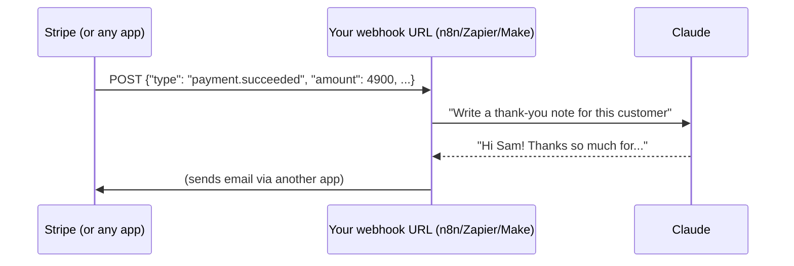

# 12 · Webhooks, APIs & JSON for Non-Programmers 🌐

Three concepts unlock **everything** in automation and AI integrations: **JSON** (how data looks),
**APIs** (how apps talk), and **webhooks** (how apps poke each other). Learn them once and every tool in
this manual gets easier. No coding degree required!

---

## 1. JSON: the universal data format 📦

JSON is just **labeled data** in a strict, readable format:

```json
{
  "name": "Pixel",
  "species": "cat",
  "age": 4,
  "indoor": true,
  "favorite_toys": ["laser", "crinkle ball"],
  "vet": { "name": "Dr. Lee", "phone": "555-0199" }
}
```

| Piece | Looks like | Example |
|---|---|---|
| **Object** | `{ "key": value }` | the whole thing above |
| **String** | `"text in quotes"` | `"Pixel"` |
| **Number** | `4`, `3.14` | `"age": 4` |
| **Boolean** | `true` / `false` | `"indoor": true` |
| **Array** (list) | `[ ... ]` | `["laser", "crinkle ball"]` |
| **Nested object** | an object inside an object | `"vet": {...}` |
| **Nothing** | `null` | `"middle_name": null` |

**Paths** point into JSON: `vet.name` → `"Dr. Lee"`, and `favorite_toys[0]` → `"laser"`. In n8n that's
`{{ $json.vet.name }}`. In Zapier and Make you click the field in a picker.

### Common JSON mistakes (and what the error means)
- Trailing comma: `{"a": 1,}` ❌
- Single quotes: `{'a': 1}` ❌ (must be double quotes)
- Unquoted keys: `{a: 1}` ❌
- Comments `// like this` ❌ (not allowed in strict JSON)

💡 Paste broken JSON into Claude with *"fix this JSON and explain what was wrong."*

### Getting JSON out of AI reliably 🤖→📦
When an automation needs AI output as data:
1. **Ask explicitly:** *"Reply with ONLY a JSON object matching: {"title": string, "priority": "High"|"Low"}"*.
2. **Use structured output features** where available (structured output parsers in n8n, JSON modes and schemas in APIs).
3. **Parse defensively:** strip ```` ``` ```` fences and have a fallback. (Our [idea-inbox workflow](../../examples/n8n-workflows/idea-inbox-to-notion.json) does exactly this.)

## 2. APIs: apps' front doors 🚪

An **API** lets programs ask another app to do something. Most web APIs are **REST over HTTP**:

```
METHOD   URL                                          → what it does
GET      https://api.example.com/v1/cats/42           → read cat #42
POST     https://api.example.com/v1/cats              → create a cat (data in the body)
PATCH    https://api.example.com/v1/cats/42           → update some fields
DELETE   https://api.example.com/v1/cats/42           → remove it
```

Every request has:
| Part | What | Example |
|---|---|---|
| **Method** | The verb | `GET`, `POST` |
| **URL** | The address (plus **query params** after `?`) | `...?limit=10&sort=new` |
| **Headers** | Metadata, especially **auth** | `Authorization: Bearer sk-...` |
| **Body** | Data you send (usually JSON) | `{"name": "Pixel"}` |

And every response has a **status code**:

| Code | Meaning | Your move |
|---|---|---|
| **200/201** | ✅ Success | Party |
| **400** | Bad request: your data's wrong | Check the body, required fields, and JSON syntax |
| **401/403** | Not authorized | Check the API key, token, and scopes |
| **404** | Not found | Check the URL and IDs |
| **429** | Too many requests | Slow down, and add waits or retries |
| **500+** | The server broke | Retry later. Not your fault! |

### Try an API right now (no key needed!)
```bash
curl "https://api.open-meteo.com/v1/forecast?latitude=51.5&longitude=-0.12&current=temperature_2m"
```
You'll get JSON with the current temperature in London. 🌤️ That's it, you just used an API.

### Authentication types
- **API key:** a secret string in a header or param. Simple. **Keep it secret.**
- **Bearer token:** similar, sent as `Authorization: Bearer <token>`.
- **OAuth:** the "Log in with Google" flow. Automation platforms handle it for you (that's a big part of their value!).

### Reading API docs (the skill nobody teaches)
Look for: the **base URL**, **authentication** section, the **endpoint** you need, **required parameters**,
an **example request/response**, and **rate limits**. Or paste the docs page into Claude and ask:
*"Show me the exact HTTP request to do X with this API, as an n8n HTTP Request node config."*

### The HTTP Request node: the universal adapter 🔌
Every automation platform has one (n8n **HTTP Request**, Zapier **Webhooks by Zapier / API Request**, Make **HTTP**).
If a service has an API, you can use it even with no official integration. Tip: many API docs show
**curl** examples, and n8n can **import a curl command** directly into an HTTP Request node.

## 3. Webhooks: "call me when something happens" 📞

Polling = *you* checking every 5 minutes for something new. 😴
**Webhook** = the app *calls your URL* the instant something happens. ⚡



**Making your own webhook:**
1. Add a **Webhook** trigger (n8n), **Catch Hook** (Zapier), or **Custom webhook** (Make). You get a URL.
2. Send it data from anywhere: an app's webhook settings, a form, an iOS Shortcut, or curl:
   ```bash
   curl -X POST "https://your-n8n/webhook/idea-inbox" \
     -H "Content-Type: application/json" \
     -d '{"text": "Build a plant-watering reminder bot"}'
   ```
3. Your workflow runs with that JSON as input. ✨

### 📱 Phone superpower: Shortcuts → webhook
On iPhone: **Shortcuts app** → new shortcut → *Dictate Text* → *Get Contents of URL* (method POST, JSON
body `{"text": Dictated Text}`, URL = your webhook). Add it to your home screen or Action Button. Now you
can **speak ideas straight into your AI workflows.** (Android: Tasker or HTTP Shortcuts.)

### Webhook security basics
- Webhook URLs are like passwords. **Don't share them publicly.**
- Add a **secret header** check (`X-Secret: …`) or use the platform's auth options.
- For services like Stripe and GitHub, **verify signatures** (the platforms document how).
- Your local n8n isn't reachable from the internet. Use n8n Cloud, a VPS, or a tunnel (Cloudflare Tunnel, ngrok) for testing.

## 4. Putting it together: the anatomy of any integration

```
Something happens ─(webhook/trigger)─▶ JSON arrives ─▶ transform ─▶ AI step ─▶ JSON ─▶ API call to act
```

Once you see this pattern, you'll notice it everywhere: in MCP (tool calls are JSON, and servers call APIs), in
agents, and in every automation. **You now speak the language of the internet's plumbing.** 🔧

---

### 🎮 Try this
1. Create a webhook in your automation tool of choice.
2. Hit it with the `curl` command above (or the iOS Shortcut).
3. Add an AI step that turns the text into a structured JSON task, and send it to your task app.

Congratulations: you've built an **AI-powered API** in 15 minutes. 🎉

---

**Next:** [13 · AI Inside the Apps You Already Use →](../part-4-ai-in-your-apps/13-ai-in-your-apps.md)
