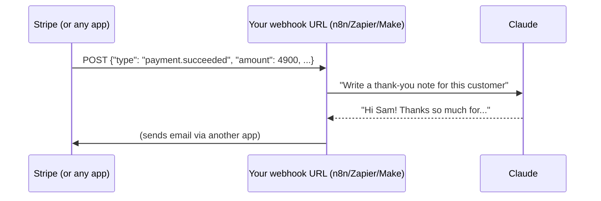

# 15 · Webhooks, APIs & JSON for Non-Programmers 🌐📦

> ⏱️ 8 min read · 🎯 Beginner-friendly, no coding required · 🧰 Needs: a terminal (optional) and curiosity

**Three concepts unlock *everything* in automation and AI integrations: JSON (how data looks), APIs (how apps talk), and
webhooks (how apps poke each other).** Learn them once and every tool in this manual gets easier, from n8n to MCP to
building your own apps. No coding degree required! 🎓

<details class="eli5" open>
<summary>🧸 ELI5: This chapter in 30 seconds</summary>

**JSON** is a neat way of writing information with labels, like a form: `name: Pixel, species: cat`. An **API** is an app's
front desk, where you ask it for something in a polite, exact way and it answers with JSON. A **webhook** is a doorbell: when
something happens in one app, it rings your doorbell (a special web address) so your robot can spring into action.

</details>

<!-- in-this-chapter -->

## 📦 JSON: the universal data format

<details class="eli5">
<summary>🧸 ELI5</summary>

JSON is like a label maker for information. Every piece of info gets a name tag, and you can put boxes inside boxes.

</details>

JSON is just **labeled data** in a strict, readable format:

```json
{
  "name": "Pixel",
  "species": "cat",
  "age": 4,
  "indoor": true,
  "favorite_toys": ["laser", "crinkle ball"],
  "vet": { "name": "Dr. Lee", "phone": "555-0199" },
  "middle_name": null
}
```

| Piece | Looks like | Example |
|---|---|---|
| **Object** | `{ "key": value }` | the whole thing above |
| **String** | `"text in quotes"` | `"Pixel"` |
| **Number** | `4`, `3.14` | `"age": 4` |
| **Boolean** | `true` / `false` | `"indoor": true` |
| **Array** (list) | `[ ... ]` | `["laser", "crinkle ball"]` |
| **Nested object** | an object inside an object | `"vet": {...}` |
| **Nothing** | `null` | `"middle_name": null` |

**Paths** point into JSON: `vet.name` → `"Dr. Lee"`, and `favorite_toys[0]` → `"laser"`. In n8n that's
`{{ $json.vet.name }}`, while in Zapier and Make you click the field in a picker.

## 🐛 Common JSON mistakes (and what the error means)

<details class="eli5">
<summary>🧸 ELI5</summary>

JSON is very picky, like a strict teacher. One extra comma or the wrong kind of quote mark and it refuses to read the whole thing.

</details>

| Mistake | Broken | Fixed |
|---|---|---|
| Trailing comma | `{"a": 1,}` | `{"a": 1}` |
| Single quotes | `{'a': 1}` | `{"a": 1}` |
| Unquoted keys | `{a: 1}` | `{"a": 1}` |
| Comments | `{"a": 1 // note}` | Remove comments (strict JSON has none) |
| Smart quotes from a word processor | `{“a”: 1}` | Use plain `"` quotes |

💡 Paste broken JSON into your AI assistant with *"fix this JSON and explain what was wrong."* It's instant and educational.

## 🤖→📦 Getting JSON out of AI reliably

<details class="eli5">
<summary>🧸 ELI5</summary>

When a robot needs to read the AI's answer, ask the AI to fill in a strict form (JSON) instead of chatting. Show it the form,
and double-check it filled it in right.

</details>

When an automation needs AI output as data:

1. **Ask explicitly and show the shape:** *"Reply with ONLY a JSON object like {"title": string, "priority": "High" | "Low"}."*
2. **Use structured-output features** where available: structured output parsers in n8n, JSON schemas in APIs
   ([Calling AI APIs](../part-5-building-with-ai/36-calling-ai-apis.md)).
3. **Parse defensively:** strip ```` ``` ```` fences and have a fallback. Our
   [idea-inbox workflow](../../examples/n8n-workflows/idea-inbox-to-notion.json) does exactly this.

## 🚪 APIs: apps' front doors

<details class="eli5">
<summary>🧸 ELI5</summary>

An API is like a restaurant's order window. You say exactly what you want in the way they understand ("one pizza, extra
cheese"), and they hand back your order. Apps order things from each other this way.

</details>

An **API** lets programs ask another app to do something. Most web APIs are **REST over HTTP**:

```text
METHOD   URL                                     → what it does
GET      https://api.example.com/v1/cats/42      → read cat #42
POST     https://api.example.com/v1/cats         → create a cat (data in the body)
PATCH    https://api.example.com/v1/cats/42      → update some fields
DELETE   https://api.example.com/v1/cats/42      → remove it
```

Every request has:

| Part | What | Example |
|---|---|---|
| **Method** | The verb | `GET`, `POST` |
| **URL** | The address, plus **query params** after `?` | `...?limit=10&sort=new` |
| **Headers** | Metadata, especially **auth** | `Authorization: Bearer sk-...` |
| **Body** | Data you send (usually JSON) | `{"name": "Pixel"}` |

## 🚦 Status codes: what the server is telling you

<details class="eli5">
<summary>🧸 ELI5</summary>

Every answer comes with a number that says how it went: 200 means "yay," 400s mean "you asked wrong," and 500s mean "oops,
our fault."

</details>

| Code | Meaning | Your move |
|---|---|---|
| **200 / 201** | ✅ Success | Party 🎉 |
| **400** | Bad request: your data's wrong | Check the body, required fields and JSON syntax |
| **401 / 403** | Not authorized | Check the API key, token and scopes |
| **404** | Not found | Check the URL and IDs |
| **429** | Too many requests | Slow down, and add waits or retries |
| **500+** | The server broke | Retry later. Not your fault! |

## 🧪 Try an API right now (no key needed!)

<details class="eli5">
<summary>🧸 ELI5</summary>

Let's order something from a real API: the weather in London. One command, and you'll see the JSON answer.

</details>

```bash
curl "https://api.open-meteo.com/v1/forecast?latitude=51.5&longitude=-0.12&current=temperature_2m"
```

You'll get JSON with the current temperature in London. 🌤️ That's it, you just used an API.

**Free, no-key APIs to play with:**

| API | Fun use |
|---|---|
| **Open-Meteo** | Weather forecasts anywhere |
| **PokéAPI** | Every Pokémon's stats 🐉 |
| **REST Countries** | Flags, capitals, populations |
| **Open Library** | Book info by ISBN |
| **The Cat API / Dog CEO** | Random cat and dog pictures (essential research 🐶) |
| **Hacker News (Firebase)** | Top tech stories |
| **NASA APOD** (free demo key) | Astronomy picture of the day |

## 🔑 Authentication types

<details class="eli5">
<summary>🧸 ELI5</summary>

Some front desks need a password (API key), some need a special pass (token), and some let you log in with another account
(OAuth). Automation tools handle the hard parts for you.

</details>

- **API key:** a secret string in a header or parameter. Simple, so **keep it secret**.
- **Bearer token:** similar, sent as `Authorization: Bearer <token>`.
- **OAuth:** the "Log in with Google" flow. Automation platforms handle it for you, and that's a big part of their value!
- **Webhook signatures:** a secret used to prove a webhook really came from the service (see below).

## 📖 Reading API docs (the skill nobody teaches)

<details class="eli5">
<summary>🧸 ELI5</summary>

API docs are the restaurant's menu. Find the address, the password rules, the dish you want, and an example order. Or ask
your AI to read the menu for you!

</details>

Look for:

1. The **base URL**.
2. The **authentication** section.
3. The **endpoint** you need (e.g. "Create a task").
4. **Required parameters** and body fields.
5. An **example request and response**.
6. **Rate limits** and **pagination** (how to get page 2 of results).

Or paste the docs page into your AI: *"Show me the exact HTTP request to do X with this API, as an n8n HTTP Request node
config."* Many docs also publish an **OpenAPI** spec, a machine-readable menu that tools (and AI) can use directly.

## 🔌 The HTTP Request node: the universal adapter

<details class="eli5">
<summary>🧸 ELI5</summary>

Every automation kitchen has a "call any API" block. If an app has an API, you can use it, even if there's no ready-made block.

</details>

Every platform has one: n8n **HTTP Request**, Zapier **Webhooks by Zapier / API Request**, Make **HTTP**. If a service has an
API, you can use it even with no official integration.

**Pro tip:** API docs often show **curl** examples, and n8n can **import a curl command** directly into an HTTP Request node.
Desktop tools like **Bruno**, **Postman** or **HTTPie** let you experiment with requests in a friendly UI.

## 📞 Webhooks: "call me when something happens"

<details class="eli5">
<summary>🧸 ELI5</summary>

Instead of checking your mailbox every five minutes (polling), you get a doorbell. When a letter arrives, the mail carrier
rings it instantly. A webhook is that doorbell for apps.

</details>

**Polling** = *you* checking every 5 minutes for something new. 😴
**Webhook** = the app *calls your URL* the instant something happens. ⚡



**Making your own webhook:**

1. Add a **Webhook** trigger (n8n), **Catch Hook** (Zapier) or **Custom webhook** (Make). You get a URL.
2. Send it data from anywhere: an app's webhook settings, a form, an iOS Shortcut, or curl:
   ```bash
   curl -X POST "https://your-n8n/webhook/idea-inbox" \
     -H "Content-Type: application/json" \
     -d '{"text": "Build a plant-watering reminder bot"}'
   ```
3. Your workflow runs with that JSON as input. ✨

**Testing tip:** services like **webhook.site** give you a temporary URL that shows every request it receives, which is perfect
for seeing what an app actually sends before building your workflow.

## 📱 Phone superpower: Shortcuts → webhook

<details class="eli5">
<summary>🧸 ELI5</summary>

You can make a button on your phone that rings your robot's doorbell, so you can say an idea out loud and it lands in your
notes automatically.

</details>

On iPhone: **Shortcuts app** → new shortcut → **Dictate Text** → **Get Contents of URL** (method POST, JSON body
`{"text": Dictated Text}`, URL = your webhook). Add it to your home screen or Action Button. Now you can **speak ideas straight
into your AI workflows.** On Android, use Tasker or HTTP Shortcuts. More in [Phone & Desktop Automation](19-phone-and-desktop-automation.md).

## 🔒 Webhook security basics

<details class="eli5">
<summary>🧸 ELI5</summary>

Your doorbell's address is a secret. If strangers find it, they can ring it. Add a secret knock (a password header) and
check that visitors are who they say they are.

</details>

- Webhook URLs are like passwords, so **don't share them publicly**.
- Add a **secret header** check (`X-Secret: …`) or use the platform's auth options.
- For services like Stripe and GitHub, **verify signatures** (they document how).
- Local n8n isn't reachable from the internet, so use n8n Cloud, a VPS, or a tunnel (Cloudflare Tunnel, ngrok) for testing.

## 📏 Rate limits, pagination & retries

<details class="eli5">
<summary>🧸 ELI5</summary>

APIs don't like being asked a thousand things at once, and they hand out long lists one page at a time. Ask politely,
wait between requests, and flip through the pages.

</details>

- **Rate limits:** too many requests → `429`. Add **Wait** nodes, batch items, and respect `Retry-After` headers.
- **Pagination:** big lists come in pages (`?page=2`, cursors, or "next" links). Loop until there are no more.
- **Retries:** enable *retry on fail* with increasing waits for flaky APIs, but don't blindly retry `400` errors, because the
  request itself is wrong.
- **Idempotency:** for "create" actions, some APIs accept an idempotency key so a retry doesn't create duplicates.

## 🧩 Putting it all together

<details class="eli5">
<summary>🧸 ELI5</summary>

Every integration is the same little story: something happens, a JSON note arrives, the robot tidies it up, the AI thinks,
and the robot calls another app's front desk to do something.

</details>

```text
Something happens ─(webhook/trigger)─▶ JSON arrives ─▶ transform ─▶ AI step ─▶ JSON ─▶ API call to act
```

You'll see this pattern everywhere: in MCP (tool calls are JSON, and servers call APIs), in agents, and in every automation.
**You now speak the language of the internet's plumbing.** 🔧

## 🎯 Key takeaways

- **JSON** = labeled data with strict syntax. **APIs** = method + URL + headers + body. **Webhooks** = apps calling *you*.
- Status codes tell you **whose fault** an error is (4xx: yours, 5xx: theirs).
- Ask AI for **JSON with a shown shape** when machines read its output.
- The **HTTP Request node** lets you use any API, even without an official integration.
- Protect webhooks with **secrets and signature checks**, and handle **rate limits and pagination**.

## 🧠 Check yourself

<details class="quiz">
<summary>❓ 1. What's wrong with <code>{'name': 'Pixel',}</code>?</summary>

Two things: **single quotes** (JSON needs double quotes) and a **trailing comma**.

</details>

<details class="quiz">
<summary>❓ 2. Your request returns 401. What do you check?</summary>

Your **API key or token**: is it present, correct, and does it have the right scopes?

</details>

<details class="quiz">
<summary>❓ 3. Why is a webhook better than polling for "new payment" events?</summary>

It's **instant** and **efficient**: the app notifies you the moment it happens instead of you asking repeatedly.

</details>

> [!TIP]
> **🎮 Try this**
> 1. Create a webhook in your automation tool of choice. 2. Hit it with the `curl` command above (or the iOS Shortcut).
> 3. Add an AI step that turns the text into a structured JSON task and sends it to your task app.
> Congratulations: you've built an **AI-powered API** in 15 minutes. 🎉

---

**Next:** [16 · The n8n Masterclass →](16-n8n-masterclass.md)
