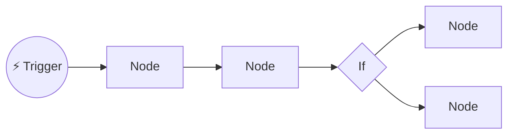
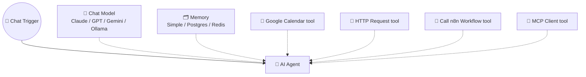

# 10 · The n8n Masterclass 🟣

n8n is the playground where automation meets AI agents, and because you can **self-host it for free**, you
can experiment without watching a meter. This chapter takes you from install to production-grade
AI workflows.

---

## Part A: Get n8n running (pick one)

| Option | Command / how | Best for |
|---|---|---|
| **Quick try** | `npx n8n` | Kicking the tires in 1 minute (needs Node.js) |
| **Docker** (recommended) | See below | Keeping it running reliably on your machine or a server |
| **Home lab bundle** | [`examples/homelab`](../../examples/homelab/) | n8n + Ollama + Open WebUI together ([Ch. 27](../part-7-local-ai/49-home-lab.md)) |
| **n8n Cloud** | Sign up at n8n.io | No maintenance, always-on webhooks |
| **VPS** | Docker on a small cloud server (Hetzner, DigitalOcean…) | Always-on and cheap, and it can receive webhooks from the internet |

```bash
docker volume create n8n_data
docker run -it --rm --name n8n -p 5678:5678 \
  -v n8n_data:/home/node/.n8n \
  docker.n8n.io/n8nio/n8n
```

Open **http://localhost:5678** and create your owner account. 🎉

> [!TIP]
> **Your data lives in the volume**
> Everything (workflows, credentials, execution history) is stored in `n8n_data`. Back it up, and
> you can move your whole setup anywhere.

## Part B: The n8n mental model



- **Workflow** = a canvas of **nodes** connected left to right.
- **Trigger nodes** start it: Schedule, Webhook, Gmail "on new email," Chat Trigger, Form, and hundreds of app triggers.
- **Items:** data flows as a list of JSON **items**. Most nodes run **once per item**, which is a key concept!
- **Expressions:** `{{ $json.subject }}` pulls a field from the incoming item. `{{ $('Node Name').item.json.x }}`
  reaches back to an earlier node.
- **Credentials** are stored once, encrypted, and reused across workflows.
- **Executions:** every run is logged, so you can click in and see exactly what each node received and output. This is your debugger.

## Part C: Your first AI workflow (15 minutes)

**Goal:** an email summarizer. When a new email arrives, Claude summarizes it and flags urgency, and urgent ones ping you.

1. **Trigger:** add **Gmail Trigger** → "Message Received". Connect your Google account.
2. **AI step:** add **Basic LLM Chain**. Attach an **Anthropic Chat Model** sub-node (add your API key).
   Prompt:
   ```
   Summarize this email in 2 sentences, then on a new line write URGENT or NORMAL.
   From: {{ $json.from }}
   Subject: {{ $json.subject }}
   Body: {{ $json.snippet }}
   ```
3. **Route:** add an **If** node: `{{ $json.text }}` *contains* `URGENT`.
4. **Act:** on the true branch, add **Slack** (or Telegram/Discord) → send message with the summary.
5. Click **Test workflow**, send yourself an email, and watch it flow. Then toggle **Active**. ✅

Want it pre-built? Import the [example workflows](../../examples/n8n-workflows/).

## Part D: The AI Agent node, n8n's crown jewel 👑

The **AI Agent** node is a full tool-using agent (Ch. 1's loop) living inside a workflow.



**Sub-nodes you plug in:**
| Slot | Options | Tips |
|---|---|---|
| **Chat Model** | Anthropic, OpenAI, Google, Mistral, Groq, **Ollama** (local!), OpenRouter | Use a strong model for the agent, and cheap models for simple chain steps |
| **Memory** | Simple Memory (in-process), Postgres, Redis, and others | Keyed by session ID, so each chat user gets their own memory |
| **Tools** | Any app node as a tool, HTTP Request Tool, Code Tool, **Call n8n Workflow Tool**, **MCP Client Tool**, vector store retrieval | Name and describe tools clearly, because the agent reads them |
| **Output Parser** | Structured Output Parser | Forces JSON output matching a schema |

**Build a personal assistant bot (30 minutes):**
1. **Chat Trigger** (gives you a hosted chat page, or connect Telegram/Slack triggers instead).
2. **AI Agent** with a system message: *"You are Alex's upbeat assistant. Use tools to check the calendar and
   add tasks. Confirm before creating anything."*
3. Model: Anthropic. Memory: Simple Memory.
4. Tools: **Google Calendar** (get events, create event), **Todoist** (create task), **HTTP Request** to a weather API.
5. Chat: *"What's on tomorrow, and add 'buy birthday card' before my 3pm meeting."*

### Power move: workflows as tools
Use **Call n8n Workflow Tool** to give your agent *entire workflows* as single tools, like
`enrich_lead` or `generate_invoice`. The agent stays simple, and the complex logic stays deterministic and testable.

## Part E: n8n ❤️ MCP

| Feature | What it does | Use it for |
|---|---|---|
| **MCP Client Tool** (sub-node) | Your n8n agent calls tools from *any* MCP server | Give n8n agents GitHub, Notion, Brave Search… |
| **MCP Server Trigger** | Turns a workflow into an MCP server with a URL | Claude, Cursor, or ChatGPT can call your n8n workflows as tools |
| **Instance-level MCP** | AI clients can search, build, and run workflows in your n8n | *"Claude, build me a workflow that…"* |

**Recipe:** expose a "log expense" workflow via MCP Server Trigger → add the URL to Claude as a custom
connector → from your phone: *"Log $14 lunch with Sam, category Meals."* 📱➡️📊

## Part F: RAG in n8n (no code)

1. **Ingest workflow:** Google Drive Trigger (new file) → **Default Data Loader** + **Text Splitter** → **Embeddings**
   (OpenAI, Cohere, Ollama…) → **Vector Store** (Supabase/pgvector, Qdrant, Pinecone, or in-memory for testing).
2. **Chat workflow:** Chat Trigger → AI Agent with a **Vector Store Tool** attached → ask questions about your files.

That's a "chat with my documents" bot, auto-updating as files land in the folder. (Concepts in [Ch. 23](../part-6-knowledge-and-memory/41-rag-memory-and-knowledge.md).)

## Part G: Making it production-grade 🛡️

| Technique | How |
|---|---|
| **Error workflow** | Create a workflow starting with **Error Trigger** → Slack/email alert. Set it as the error workflow in each workflow's settings |
| **Retries** | Node settings → *Retry On Fail* (with wait between tries) for flaky APIs |
| **Human-in-the-loop** | Slack/Gmail/Telegram "Send and Wait for Response" nodes pause until you approve |
| **Pin data** | Pin a node's output to reuse sample data while building, with no re-triggering |
| **Sub-workflows** | Split big flows with **Execute Workflow** to keep them readable and reusable |
| **Rate limits** | **Loop Over Items** (batches) + **Wait** nodes |
| **Structured output** | Structured Output Parser, or ask for JSON and parse it in a Code node |
| **Guardrails** | Validate AI output (If/Code nodes, or n8n's guardrail nodes) before acting |
| **Evaluations** | n8n's evaluation features let you test AI workflows against a dataset of examples |
| **Secrets** | Use credentials, never hard-coded keys in Code nodes |
| **Version control** | Export workflows as JSON into Git (like this repo!) |

## Part H: Code nodes for superpowers 🧑‍💻

Code nodes run **JavaScript or Python**. Handy snippets:

```js
// Run Once for All Items: merge everything into one summary input
const text = $input.all().map(i => `- ${i.json.title}`).join('\n');
return [{ json: { text } }];
```

```js
// Run Once for Each Item: clean up and add a field
return { json: { ...$json, email: $json.email.toLowerCase().trim(), processedAt: new Date().toISOString() } };
```

Can't write the code? Ask Claude: *"Write an n8n Code node (run once for all items) that groups items by
`category` and counts them."* It's great at this.

## Part I: 10 n8n + AI builds to try

1. 📰 Morning digest ([importable](../../examples/n8n-workflows/morning-ai-digest.json))
2. 💡 Idea inbox → Notion ([importable](../../examples/n8n-workflows/idea-inbox-to-notion.json))
3. 🧾 Receipt photos (Telegram) → vision model extracts → Google Sheets
4. 📧 Email triage agent with approval before sending replies
5. 🎙️ Voice memo (Telegram) → Whisper transcription → tasks + journal entry
6. 🔍 Lead enrichment: form → web research agent → CRM
7. 📚 Drive RAG bot in Slack
8. 🎥 YouTube channel monitor → transcript summary → Notion
9. 🏷️ Support ticket classifier + suggested answers
10. 🗓️ Friday weekly review compiled from calendar, tasks, and GitHub

---

### 🎮 Try this
Build the **personal assistant bot** from Part D, then connect it to **Telegram** (Telegram Trigger +
Telegram send node). Now you have your own AI assistant in your pocket, running on your own server, that *you* built. 🤯

---

**Next:** [11 · Zapier & Make Walkthroughs →](18-zapier-and-make-walkthroughs.md)
