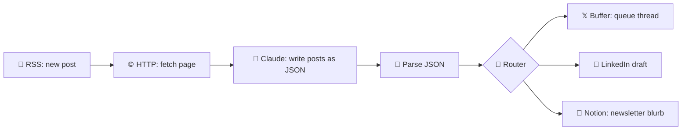

# 11 · Zapier & Make Walkthroughs 🟠🟦

n8n is the tinkerer's tool. **Zapier** and **Make** are the fastest paths from idea to working automation,
with no servers and no code, and giant app catalogs. This chapter walks through real builds in both.

---

## 🟠 Zapier: from zero to AI teammate

### Key concepts
| Term | Meaning |
|---|---|
| **Zap** | An automation: one trigger + one or more actions |
| **Task** | Each successful action step. It's how Zapier bills you |
| **Paths / Filters** | Branching logic and "only continue if…" |
| **Formatter** | Built-in text, date, and number transformations (free steps!) |
| **Tables** | Zapier's built-in database |
| **Interfaces** | Simple forms, chatbots, and portals |
| **Agents** | AI teammates that act across your apps |
| **Copilot** | Describe what you want in English, and it builds the Zap |
| **Zapier MCP** | Exposes Zapier actions to Claude, ChatGPT, Cursor… |

### Walkthrough 1: AI lead responder (15 min)
1. **Trigger:** *Typeform/Google Forms/Tally → New Response*.
2. **Action:** *AI by Zapier* (or the *Anthropic (Claude)* app) → prompt:
   ```
   A lead just filled our form. Write a warm, 3-sentence reply that references their answer to
   "What are you hoping to achieve?": {{answer}}. Sign as Alex. No subject line.
   ```
3. **Action:** *Gmail → Create Draft* (a draft, not send, so you review first!) to `{{email}}` with the AI output.
4. **Action:** *Google Sheets → Add Row* to log the lead.
5. Test each step → Publish. ✅

> 💡 **Using Copilot:** type *"When someone fills my Tally form, have AI draft a personalized reply in Gmail
> and log them in Sheets,"* and it builds the steps above for you to review.

### Walkthrough 2: Zapier MCP, one URL and thousands of apps
1. Go to **Zapier MCP** (zapier.com/mcp) and create a server.
2. **Add actions** you want the AI to be able to do, e.g. *Gmail: Send Email*, *Google Calendar: Create Event*,
   *Slack: Send Channel Message*, *Trello: Create Card*.
3. Copy the server URL or connect via the Claude/ChatGPT integration instructions shown.
4. In Claude: *"Create a Trello card in 'Ideas' called 'Podcast about AI gardening' and post it to #random."*

**Why it's great:** you choose exactly which actions are exposed, and Zapier handles every app's authentication.

### Walkthrough 3: A Zapier Agent
1. Open **Zapier Agents** → New agent.
2. Instructions: *"Every weekday at 8am, check my Google Calendar for today's external meetings. For each one,
   research the company website and recent news, and email me a 5-bullet prep brief."*
3. Give it tools: Calendar, web browsing, Gmail.
4. Test on today, adjust the instructions, then turn on the schedule.

### Zapier tips
- **Filters early** save tasks (and money): stop irrelevant items before AI steps.
- Use **Formatter** for simple text cleanup instead of paying for AI.
- Turn on **auto-replay** for failed runs, and get error notifications by email.
- **Human-in-the-loop** steps let you approve before an agent or Zap does something important.

---

## 🟦 Make: visual power for complex flows

### Key concepts
| Term | Meaning |
|---|---|
| **Scenario** | An automation (a visual flow of modules) |
| **Module** | One step (app action, tool, router…) |
| **Operation / credit** | Each module run, which is how Make bills |
| **Router** | Split into multiple branches |
| **Iterator / Aggregator** | Loop over arrays and combine results back together |
| **Data store** | Make's built-in storage |
| **Make AI Agents** | Goal-driven agents that use your scenarios as tools |

### Walkthrough 4: Social media repurposer (30 min)
**Goal:** When a new blog post appears, generate platform-specific posts, and route each to the right place.



1. **RSS → Watch RSS feed items** (your blog).
2. **HTTP → Get a file/Make a request** to fetch the full article, then **Text parser → HTML to text**.
3. **Anthropic Claude → Create a Prompt** (or the OpenAI/Gemini module):
   ```
   From this article, return JSON only:
   {"x_thread": ["tweet1", "..."], "linkedin": "...", "newsletter_blurb": "..."}
   Tone: friendly expert. Article: {{text}}
   ```
4. **JSON → Parse JSON** (Make can generate the data structure from a sample).
5. **Router** → three branches to Buffer, LinkedIn (or a Google Doc for review), and Notion.
6. **Run once** to test. Inspect the bubbles on each module to see the data, then schedule it.

### Walkthrough 5: Invoice extractor
1. **Gmail → Watch emails** (filter: has attachment, subject contains "invoice").
2. **Iterator** over attachments → **Claude/Gemini with PDF/image input**: extract vendor, amount, due date, and invoice number as JSON.
3. **Google Sheets → Add a row**, plus **Google Calendar → Create event** on the due date.
4. **Error handler** route → email yourself if extraction fails.

### Make tips
- Right-click any module → **Add error handler** (Resume, Ignore, Break, Rollback).
- Use **Data stores** to remember what you've processed (dedupe!).
- **Scenario inputs** plus **Make MCP** let AI assistants trigger scenarios on demand.

---

## Zapier vs. Make vs. n8n: when to use which

| Situation | Winner |
|---|---|
| "I need it working in 10 minutes and I don't code" | 🟠 Zapier |
| An obscure app only Zapier supports | 🟠 Zapier |
| Complex branching, loops, and data transformation, visually | 🟦 Make |
| High volume on a budget | 🟣 n8n (self-hosted) or 🟦 Make |
| Privacy and self-hosting | 🟣 n8n |
| Custom code and AI agents with any model, including local | 🟣 n8n |
| Your team already lives in Microsoft 365 | Power Automate |

**Plenty of pros use two:** Zapier for quick glue and rare apps, and n8n or Make for heavy, custom work.

---

### 🎮 Try this
Build **Walkthrough 1** in Zapier (the free tier works), then rebuild it in n8n or Make. Comparing the two
teaches you more about automation than either one alone.

---

**Next:** [13 · AI Inside the Apps You Already Use →](../part-4-ai-in-your-apps/22-ai-in-your-apps.md)
