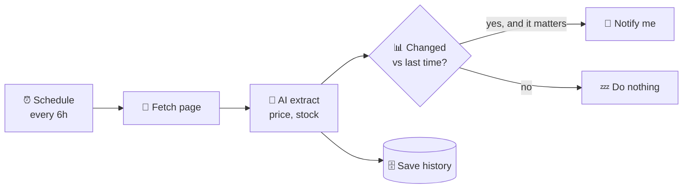

# 20 · Web Scraping & Monitoring with AI 🕸️👀

> ⏱️ 7 min read · 🎯 Beginner → intermediate · 🧰 Needs: an automation platform or Python (both optional)

**A huge amount of useful information lives on web pages with no API:** prices, job posts, event listings, government
notices, product restocks, competitor updates. With AI, turning messy pages into clean, structured data (and getting alerted
when something changes) has become astonishingly easy. This chapter shows you how to do it *politely*, *legally* and
*reliably*.

<details class="eli5" open>
<summary>🧸 ELI5: This chapter in 30 seconds</summary>

Scraping means having a robot visit web pages and copy the important bits for you, like a friend who checks the toy store
website every morning and texts you when your favorite toy goes on sale. AI makes this easy because it can *read* a messy
page like a person and pull out exactly what you asked for.

</details>

<!-- in-this-chapter -->

## 🧭 First: is there an API?

<details class="eli5">
<summary>🧸 ELI5</summary>

Before sneaking a peek at the store window, check whether the store has a front desk that happily answers questions. That's
the API, and it's always the better choice.

</details>

Always check for an easier, officially supported path first:

| Option | Why it's better |
|---|---|
| **Official API** | Stable, allowed, structured data ([Webhooks, APIs & JSON](15-webhooks-apis-json.md)) |
| **RSS / Atom feed** | Many blogs, news sites and job boards publish feeds, with no scraping needed |
| **Built-in alerts** | Google Alerts, price trackers, store "notify me" buttons |
| **An MCP server or connector** | Someone may have already built the integration ([The Big MCP Server Catalog](../part-2-mcp-and-connectors/09-mcp-server-catalog.md)) |
| **Data exports** | Many services let you download your own data |

Scrape when none of these exist, and do it kindly.

## ⚖️ The polite (and legal) scraping rules

<details class="eli5">
<summary>🧸 ELI5</summary>

Be a good guest on other people's websites: read their rules, don't knock on the door a thousand times a minute, don't take
people's private information, and don't copy their stuff to sell it.

</details>

1. **Read the Terms of Service.** Some sites forbid automated access. Respect that.
2. **Check `robots.txt`** (e.g. `example.com/robots.txt`) for areas the site asks bots to avoid.
3. **Go slow.** A request every few seconds (or minutes) is plenty for personal monitoring. Never hammer a site.
4. **Don't collect personal data** about people without a lawful reason. Privacy laws (like GDPR) apply to scraped data too.
5. **Respect copyright.** Extracting facts (prices, dates) is different from republishing someone's articles or images.
6. **Don't bypass logins, paywalls or CAPTCHAs** you're not entitled to get past.
7. **Identify yourself** when appropriate (a descriptive User-Agent with contact info for bigger projects).

This isn't legal advice. For anything commercial or large-scale, check the rules in your country.

## 🧰 The toolbox

<details class="eli5">
<summary>🧸 ELI5</summary>

Some tools let you point and click to pick what to copy. Some turn any web page into clean text for AI. Some are for coders.
And some just watch a page and tell you when it changes.

</details>

| Category | Tools | Great for |
|---|---|---|
| 🖱️ **No-code scrapers** | Browse AI, Apify (ready-made "Actors"), Octoparse | Point-and-click extraction and scheduled runs |
| 📄 **AI page readers** | Jina Reader (put `r.jina.ai/` in front of a URL), Firecrawl, the Fetch MCP server | Turning any page into clean Markdown an AI can read |
| 🕷️ **Crawlers** | Firecrawl, Apify, Crawl4AI (open source) | Whole sites, docs, many pages |
| 🎭 **Browser automation** | Playwright, Browserbase, Browser Use | JavaScript-heavy sites, logins you own, clicking through flows |
| 🔔 **Change monitors** | changedetection.io (open source), Visualping, Distill | "Tell me when this page changes" |
| 🔌 **MCP servers** | Fetch, Firecrawl, Apify, Playwright, Bright Data | Let your AI chat do the scraping for you |

## 🤖 AI extraction: from messy page to clean JSON

<details class="eli5">
<summary>🧸 ELI5</summary>

Instead of writing fiddly rules like "the price is in the third box on the left," you just tell the AI "find the price, the
name and whether it's in stock," and it reads the page like a person would.

</details>

The classic way to scrape was writing **CSS selectors** ("the price is in `div.price > span`") that broke whenever the site
changed. The AI way:

1. **Fetch** the page as clean text or Markdown (Jina Reader, Firecrawl or the Fetch server).
2. **Ask the AI to extract** fields into a schema:
   ```text
   From this product page, return ONLY JSON:
   {"name": string, "price": number, "currency": string, "in_stock": boolean, "sale_ends": string | null}
   If a field isn't on the page, use null. Page:
   <page>…</page>
   ```
3. **Validate** (is `price` a number? is it wildly different from yesterday?) before acting.

**Why it's great:** it survives layout changes, works across different sites with one prompt, and handles messy real-world
pages. **Cost tip:** use a small, fast model for extraction ([Cost Optimization](../part-10-mastery/75-cost-optimization.md)).

## 👀 Monitoring & alerts

<details class="eli5">
<summary>🧸 ELI5</summary>

A monitor is a robot that checks a page on a schedule, remembers what it saw last time, and pings you only when something
important changed.

</details>



**Things worth monitoring:**

| Monitor | Why it's delightful |
|---|---|
| 💸 Price drops on things you want | Buy at the right time |
| 📦 Restocks ("sold out" → "in stock") | Beat the rush |
| 💼 New job postings matching your skills | Apply first ([Careers & Job Hunting](../part-9-ai-for-life-and-work/63-careers-and-job-hunting.md)) |
| 🏛️ Government or school pages | New forms, deadlines, announcements |
| 🎟️ Event and ticket pages | Know the moment tickets drop |
| 🏠 Rental listings | New apartments matching your filters |
| 📰 Mentions of your name, company or hobby | Stay in the loop |

**The AI twist:** instead of alerting on *any* change (ads and timestamps change constantly!), ask the AI *"Did anything
meaningful change? Reply YES or NO, and explain in one sentence."* That kills false alarms.

## 🛠️ Build: a price-drop watcher in n8n (30 min)

<details class="eli5">
<summary>🧸 ELI5</summary>

We'll build a robot that checks a product page twice a day, remembers the price, and messages you when it drops below
your target.

</details>

1. **Schedule Trigger:** every 12 hours.
2. **Edit Fields:** a list of products: `{url, name, target_price}`.
3. **HTTP Request:** `https://r.jina.ai/{{ $json.url }}` (returns the page as Markdown), or use a Firecrawl node or HTTP call.
4. **Basic LLM Chain + Structured Output Parser:** extract `{price, currency, in_stock}` (a small, cheap model is fine).
5. **Data Table / Google Sheet:** look up the previous price, then save the new one.
6. **If:** `price < target_price` **or** `price < previous_price * 0.9` **and** `in_stock`.
7. **Telegram / email:** *"🎉 {{name}} dropped to {{price}} (target {{target_price}}). {{url}}"*

Swap step 3 for **Apify** or **Browse AI** if the site needs a real browser.

## 📰 Build: a news & mentions monitor (20 min)

<details class="eli5">
<summary>🧸 ELI5</summary>

A robot that reads the news for you, keeps only stories about things you care about, and sends you a tidy summary.

</details>

1. **RSS triggers** for your favorite sources (plus Google News RSS searches for your keywords).
2. **Filter** out items you've seen (store IDs) and items without your keywords.
3. **AI:** *"Is this genuinely about [topic]? If yes, summarize in 2 sentences and rate importance 1–5."*
4. **Aggregate** the day's items → one **digest** message, sorted by importance.

It's the same idea as the [Morning AI Digest](../../examples/n8n-workflows/morning-ai-digest.json), tuned to *your* topics.

## 🐍 A tiny Python version

<details class="eli5">
<summary>🧸 ELI5</summary>

If you like code, here's the same idea in a few lines: read a page, ask AI for the price, print it. Your AI coding helper
can extend it for you.

</details>

A minimal sketch (ask Claude Code to turn it into a full monitor with storage and alerts):

```python
import httpx, anthropic, json

url = "https://example.com/product/123"
page = httpx.get(f"https://r.jina.ai/{url}", timeout=60).text   # page as clean Markdown

client = anthropic.Anthropic()
msg = client.messages.create(
    model="claude-opus-5",
    max_tokens=1000,
    messages=[{"role": "user", "content":
        'Return ONLY JSON {"name": str, "price": number, "in_stock": bool} for this page:\n' + page[:50000]}],
)
print(json.loads(msg.content[0].text))
```

For robust versions, use **structured outputs** so the JSON is guaranteed valid ([Calling AI APIs Directly](../part-5-building-with-ai/36-calling-ai-apis.md)).

## 🚧 Common problems & fixes

<details class="eli5">
<summary>🧸 ELI5</summary>

Some websites build themselves with code after they load, some block robots, some change their look, and some spread info
over many pages. Here's what to do about each.

</details>

| Problem | Fix |
|---|---|
| Page content loads with JavaScript (you get an empty shell) | Use a real browser: Playwright, Browserbase, Apify, Firecrawl |
| Blocked or rate-limited | Slow down, cache results, use an official API, and don't evade blocks you're not entitled to bypass |
| Layout changes break extraction | Use AI extraction instead of CSS selectors, and validate outputs |
| Data spread over many pages | Follow pagination or "next" links, or use a crawler |
| Too many false alerts | Ask AI whether the change is *meaningful*, and compare only extracted fields |
| Costs creeping up | Small models for extraction, fewer checks per day, cache unchanged pages |

## 🎯 Key takeaways

- **API, RSS or alerts first**, and scrape only when needed, **politely and legally**.
- Modern stack: **clean page reader** (Jina Reader, Firecrawl, Fetch) + **AI extraction to JSON** + **validation**.
- Monitors = **schedule → fetch → extract → compare → notify**, with AI filtering out meaningless changes.
- Use real-browser tools for JavaScript-heavy sites.

## 🧠 Check yourself

<details class="quiz">
<summary>❓ 1. Why is AI extraction more robust than CSS selectors?</summary>

It **reads the page like a person** and doesn't depend on exact HTML structure, so layout changes don't break it (validate
outputs anyway).

</details>

<details class="quiz">
<summary>❓ 2. Your monitor alerts every hour because a timestamp changes. Fix?</summary>

Compare only **extracted fields** (price, stock) or ask the AI whether the change is **meaningful**.

</details>

<details class="quiz">
<summary>❓ 3. What should you check before scraping a site?</summary>

For an **official API or RSS feed**, then the **Terms of Service** and **robots.txt**, and plan a **gentle request rate**.

</details>

> [!TIP]
> **🎮 Try this**
> Pick one thing you actually want: a price drop, a restock, or a new job post. Try `https://r.jina.ai/` in front of its URL
> in your browser to see the clean text, then paste that into your AI with the extraction prompt above. That's the heart of
> every AI scraper, done in 2 minutes. 🕸️

---

**Next:** [21 · The Automation Recipe Book →](21-automation-recipe-book.md)
