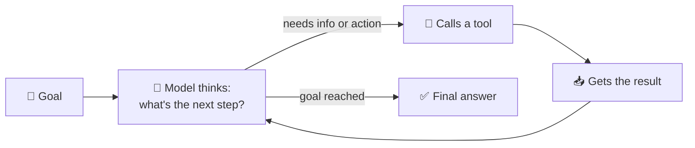
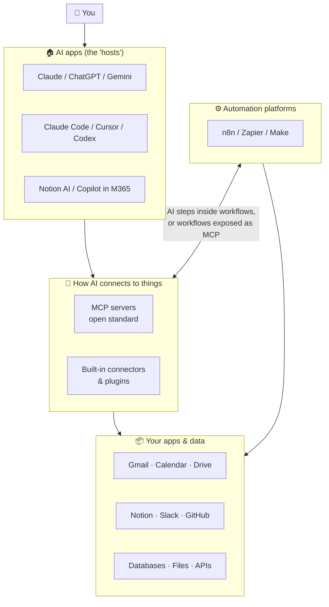

# 32 · The Mental Model: From Chatbot to Teammate 🧠➡️🤖

> ⏱️ 10 min read · 🎯 Beginner-friendly · 🧰 Needs: nothing but curiosity

**You already know how to *talk* to an AI. This chapter is about the leap that makes everything else click: AI that can
*act*, not just answer.** Once you see the four superpowers and the agent loop, every tool in this manual (MCP,
connectors, automations, coding agents) turns out to be a variation on the same simple idea.

<details class="eli5" open>
<summary>🧸 ELI5: This chapter in 30 seconds</summary>

A regular chatbot is like a very smart friend on the phone: it can talk, but it can't *do* anything for you. Now imagine
giving that friend **hands** (it can press buttons in your apps), **eyes** (it can see your files and calendar), a
**memory** (it remembers you), and **patience** (it keeps working step by step until the job is done). That's an **agent**.
Everything in this manual is about giving your AI those four gifts.

</details>

<!-- in-this-chapter -->

## 🫙 From brain-in-a-jar to teammate

<details class="eli5">
<summary>🧸 ELI5</summary>

A chatbot is a genius locked in a jar: brilliant, but it only knows what you tell it and can only talk back. We're going
to open the jar.

</details>

A plain chatbot is a **brain in a jar**. It's astonishingly knowledgeable, but it can only work with what you paste in,
and it can only hand text back to you. You're the one who has to copy, paste, click, file, send and remember.

Everything "advanced" in AI right now is about giving that brain four superpowers:

| Superpower | What it means | Tech names you'll hear | Chapter |
|---|---|---|---|
| 🖐️ **Hands** (tools) | The AI can *do* things: send email, create a Notion page, run code, click buttons | Tool use, function calling, MCP tools, actions | [MCP Explained](../part-4-mcp-and-connectors/38-mcp-explained.md) |
| 👀 **Eyes** (context) | The AI can *see* your stuff: files, docs, calendar, codebase, the live web | Connectors, MCP resources, RAG, web search | [RAG, Memory & Knowledge](../part-8-knowledge-and-memory/72-rag-memory-and-knowledge.md) |
| 🧠 **Memory** | The AI remembers across conversations | Projects, memory, `CLAUDE.md`, vector databases | [Memory for Agents](../part-8-knowledge-and-memory/75-memory-for-agents.md) |
| 🔁 **Loops** (agency) | The AI works through multi-step tasks, checks its own work, and keeps going | Agents, agent loops, agentic workflows | [Build Your Own Agent](../part-7-building-with-ai/68-build-your-own-agent.md) |

Put all four together and you have an **agent**: a system that takes a goal, figures out the steps, uses tools, looks at
the results, and repeats until it's done.

> [!NOTE]
> **🤯 Fun fact: the jar was opened surprisingly recently**
> Mainstream chatbots only started using tools reliably around 2023–2024. The open standard for connecting them to
> everything (MCP) arrived in late 2024. Coding agents that work for an hour on their own became normal in 2025. You're
> learning this at a genuinely historic moment. 🎉

## 🔁 The agent loop, demystified

<details class="eli5">
<summary>🧸 ELI5</summary>

An agent is like a kid doing a treasure hunt: read the clue, go look, see what you found, read the next clue, repeat until
you find the treasure. The AI does exactly that with tools.

</details>

Every agent you'll ever meet, whether it's Claude Code, ChatGPT agent, Zapier Agents, an n8n AI Agent node, or one you
build yourself, runs roughly this loop:



The magic is that **the model decides which tool to call and when.** You describe the tools ("here's a tool that searches my
email; it takes a query"), and the model figures out the rest.

### Watch an agent think (a real-feeling trace)

Goal: *"Find out when my next dentist appointment is and add a reminder the day before."*

| Step | The model thinks… | Tool call | Result |
|---|---|---|---|
| 1 | "Appointments are usually in the calendar. Let me search." | `calendar.search("dentist")` | Found: *Dr. Lee, Oct 14, 9:00* |
| 2 | "The day before is Oct 13. I'll create a reminder." | `tasks.create("Dentist tomorrow 9am 🦷", due="Oct 13 18:00")` | Created ✅ |
| 3 | "Done. I'll tell the human." | *(none)* | *"Your dentist appointment is Oct 14 at 9:00. I added a reminder for the evening of Oct 13."* |

Three steps, two tools, zero clicks from you. Now imagine the same loop with 30 steps: that's how a coding agent builds a
feature, or a research agent writes a 10-page report.

> [!NOTE]
> **💡 The aha moment**
> When an agent "does something," the model itself never touches your calendar. It writes a structured request like
> `calendar.search("dentist")`, **your software runs it**, and the result gets fed back in. The model is the *planner*,
> and the tools do the *doing*. This is why the app you use (the "host") is responsible for permissions and safety.

## 🔧 What "tools" really are

<details class="eli5">
<summary>🧸 ELI5</summary>

A tool is a button with a label. The label says what the button does and what information it needs. The AI reads the
labels, picks a button, and asks your app to press it.

</details>

A tool is just three things:

1. **A name:** `create_calendar_event`
2. **A plain-English description:** "Creates an event on the user's Google Calendar. Use when the user asks to schedule something."
3. **The inputs it needs** (as a schema): `title` (text), `start` (date-time), `duration_minutes` (number)

When the model wants to use it, it outputs something like:

```json
{ "tool": "create_calendar_event", "input": { "title": "Dentist 🦷", "start": "2026-10-14T09:00", "duration_minutes": 45 } }
```

Your app checks it (and maybe asks *you*), runs it, and sends back the result. That's the entire trick, used by every
agent on Earth.

**Why this matters to you:** because tools are described in plain English, **the quality of the description shapes how
well the AI uses the tool**. Vague descriptions make confused agents. You'll use this insight when you build your own
tools in [Building MCP Servers](../part-4-mcp-and-connectors/42-building-mcp-servers.md).

## 🗺️ Where all the buzzwords fit

<details class="eli5">
<summary>🧸 ELI5</summary>

All the fancy words are just pieces of one picture: the app you talk to, the brain inside it, the plugs that connect it to
your stuff, and robots that run on their own.

</details>



There are **two ways AI and automation meet**, and they're worth keeping separate in your head:

| | 🧑‍✈️ AI in the driver's seat | 🚂 Automation in the driver's seat |
|---|---|---|
| How it starts | You ask ("summarize my week") | A trigger fires (new email, 7am, webhook) |
| Who decides the steps | The model, on the fly | You, in advance (a fixed recipe) |
| Strengths | Flexible, handles surprises, conversational | Reliable, cheap, runs while you sleep |
| Weaknesses | Needs you there; less predictable | Rigid; breaks on surprises |
| Examples | Claude + MCP, ChatGPT agent, Claude Code | n8n, Zapier, Make, iOS Shortcuts |

The fun really starts when you **combine them**: your AI chat can *trigger* workflows (Zapier MCP, n8n's MCP Server
Trigger), and your workflows can run *full agents* inside them (n8n's AI Agent node, Zapier Agents).

## 🚗 Autonomy levels: from autocomplete to autopilot

<details class="eli5">
<summary>🧸 ELI5</summary>

Like learning to drive: first a grown-up does everything, then you steer with help, then you drive with someone watching,
and one day you drive alone on familiar roads. AI helpers grow up the same way.

</details>

Self-driving cars have "levels of autonomy." AI assistants have them too, and naming the level helps you decide how much to
trust a setup:

| Level | What the AI does | Example | Your role |
|---|---|---|---|
| **0 · Suggest** | Offers ideas or completions | Autocomplete, "help me write" | Decide everything |
| **1 · Draft** | Produces a draft for you to use | Email drafts, code suggestions | Edit and send |
| **2 · Act with approval** | Takes actions, asking first | Claude asking "Allow `send_email`?" | Approve each step |
| **3 · Act and report** | Acts within limits, tells you after | An agent that files receipts and posts a summary | Review the log |
| **4 · Autonomous within guardrails** | Runs on its own for long stretches | Nightly triage bots, coding agents on a branch | Set rules, spot-check |

**Rule of thumb:** start new setups at **Level 1–2**. Move up only after it's been reliable for a while, and only for
actions that are **cheap to undo**. Sending an email to your boss? Level 2 forever is fine. Tagging receipts? Level 4 all day.

## ⚖️ What AI is great at (and where it still trips)

<details class="eli5">
<summary>🧸 ELI5</summary>

AI is like a super-talented friend who has read every book but sometimes misremembers details and gets distracted during
very long tasks. Give it the right jobs and double-check the important stuff.

</details>

Researchers call AI's abilities a **"jagged frontier"**: brilliant at some surprisingly hard things, oddly weak at some
easy-looking ones.

| 🌟 Superb at | 😬 Still trips on |
|---|---|
| Summarizing, rewriting, translating, explaining | Exact facts without a source (it may confidently guess) |
| Writing and fixing code, especially with tests | Very long tasks with no checkpoints (it drifts) |
| Classifying, extracting, organizing messy info | Counting letters, precise arithmetic (unless it uses a code tool) |
| Brainstorming, planning, playing devil's advocate | Knowing what happened after its training cutoff (unless it can search) |
| Reading images, charts, screenshots, PDFs | Your private context (unless you connect it) |
| Using tools step by step toward a goal | Knowing when it's wrong (it needs a way to check) |

Almost every item in the right column has a fix, and the fix is usually **"give it a tool."** Web search fixes stale
knowledge. Code execution fixes arithmetic. Connectors fix missing context. Tests fix unverified code. That's why this
manual is mostly about tools!

## 🧪 A day in the life with an AI teammate

<details class="eli5">
<summary>🧸 ELI5</summary>

Here's a story of one normal day where an AI helper quietly does lots of little jobs, so you can picture what's possible.

</details>

Meet **Alex**, who read this manual. Here's their Tuesday:

- **7:00** ☕ A **morning briefing** arrives (automation: calendar + news + weather → AI summary → phone).
- **8:30** 📧 Alex asks Claude to *"triage my inbox"*. It drafts replies to five emails and flags two that need real
  thought (connector + approvals).
- **10:00** 🔬 Alex needs a competitor overview. A **research agent** reads 15 sources and writes a cited brief in Notion.
- **12:30** 🥗 A photo of the fridge becomes three lunch ideas (vision).
- **14:00** 🛠️ Alex describes a tiny tool for the team ("a page that shows who's on vacation"), and **Claude Code** builds
  and deploys it before the coffee gets cold.
- **16:00** 🧾 Receipts from the week are **auto-filed** into a spreadsheet by an n8n workflow Alex built last month.
- **21:00** 🎵 Just for fun, Alex makes a birthday song for a friend with an AI music tool.

None of this is science fiction. Every single piece is covered in this manual with step-by-step instructions. 💪

## 🧭 Three principles that'll save you hours

<details class="eli5">
<summary>🧸 ELI5</summary>

One: AI can only help with what it can see. Two: explain tools and tasks clearly, like to a new friend. Three: use plain
robots for boring, predictable steps and save the AI for the thinking steps.

</details>

1. **Context is king.** Most "the AI is dumb" moments are really "the AI couldn't see what I was looking at" moments.
   Connectors, MCP, attached files and memory all fix this. (Deep dive: [Context Engineering](36-context-engineering.md).)
2. **Tools are described in plain English.** A tool's name and description *are* its interface for the model. Good
   descriptions make good agents.
3. **Deterministic where you can, AI where you must.** If a step is "move a row from A to B," use plain automation. Save
   the AI for fuzzy steps: summarize, classify, extract, decide, write. This keeps things cheap, fast and reliable.

## 🎯 Key takeaways

- An **agent** = a model + **tools** (hands) + **context** (eyes) + **memory** + a **loop** that runs until the goal is met.
- The model **plans**, and your software **does**. That's why the host app handles permissions.
- **AI-driven** (flexible) and **automation-driven** (reliable) workflows are different, and combining them is the sweet spot.
- Match the **autonomy level** to how easy the action is to undo.
- Most AI weaknesses are fixed by **giving it the right tool or context**.

## 🧠 Check yourself

<details class="quiz">
<summary>❓ 1. When Claude "adds an event to your calendar," who actually talks to the calendar?</summary>

Your **software** (the host app plus a connector or MCP server). The model only *requests* the action in a structured
format, and the software executes it.

</details>

<details class="quiz">
<summary>❓ 2. Name the four superpowers that turn a chatbot into an agent.</summary>

**Hands** (tools), **eyes** (context), **memory**, and **loops** (agency).

</details>

<details class="quiz">
<summary>❓ 3. A workflow runs every morning at 7 and emails you a summary. AI-driven or automation-driven?</summary>

**Automation-driven**: a trigger (the schedule) starts a fixed recipe. AI is just one step inside it.

</details>

<details class="quiz">
<summary>❓ 4. The AI keeps getting arithmetic wrong in your spreadsheet task. What's the fix?</summary>

Give it a **code execution** or calculator tool (or do the math with a formula), so it computes instead of guessing.

</details>

<details class="quiz">
<summary>❓ 5. What autonomy level should a brand-new "send emails for me" bot start at?</summary>

**Level 1 or 2**: drafts only, or act with approval. Sending email is hard to undo!

</details>

> [!TIP]
> **🎮 Try this**
> Open Claude (or ChatGPT) and turn on **one** connector you actually use: Google Drive, Gmail, Calendar or Notion. Then ask:
> *"What are the 3 things I've been working on most this month, based on my recent files? Anything I seem to have forgotten?"*
> The first time AI answers from **your** data, the whole mental model clicks. 💡

---

**Next:** [33 · How Models Really Work (for Power Users) →](33-how-models-really-work.md)
